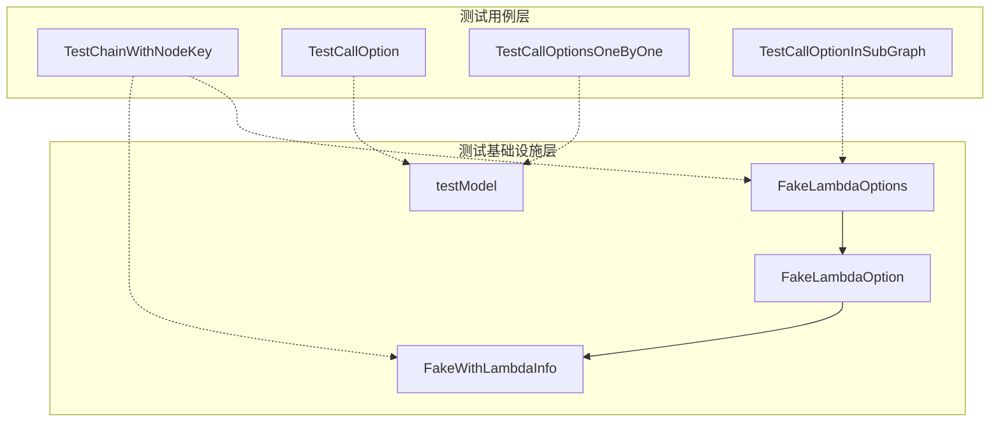

# graph_invocation_and_chain_option_test_fixtures 模块技术详解

## 模块概述

想象一下，你正在构建一个复杂的图执行引擎，其中需要测试各种节点调用选项、链式组合和子图嵌套场景。如果每次编写测试时都要重复创建模拟组件和配置，那将是一场噩梦。这个模块就像是一个"测试基础设施的基础设施"，它为图执行引擎提供了一套完整的测试工具集，让开发者能够轻松验证图的编译、节点调用、选项传递和错误处理等核心功能。

这个模块的核心价值在于：
- 提供可复用的测试模型和 lambda 选项结构
- 演示如何正确测试图和链式调用
- 验证节点键标识和选项传递机制
- 确保子图嵌套时的选项正确传播

## 架构设计



这个模块由两个主要部分组成：
1. **测试基础设施组件**：`FakeLambdaOptions` 结构用于测试 lambda 选项机制，`testModel` 用于测试模型调用选项
2. **测试用例集合**：一系列测试函数，覆盖了图调用选项的各个方面

## 核心组件解析

本模块包含两个主要的测试基础设施组件，它们分别服务于不同的测试需求。每个组件都有自己详细的技术文档：

### Lambda 选项测试基础设施

[lambda_options_test_infrastructure](compose_graph_engine-graph_and_workflow_test_harnesses-graph_invocation_and_chain_option_test_fixtures-lambda_options_test_infrastructure.md) 提供了一套完整的模拟 lambda 选项系统，包括：

- **FakeLambdaOptions**：核心选项配置结构
- **FakeLambdaOption**：选项函数类型定义
- **FakeWithLambdaInfo**：选项构建函数

这套基础设施专门用于测试带选项的 lambda 函数调用机制，特别是 `InvokableLambdaWithOption` 的工作方式。它模拟了真实应用场景中的选项模式，同时提供了足够的灵活性来测试各种边缘情况。

### 模型测试基础设施

[model_test_infrastructure](compose_graph_engine-graph_and_workflow_test_harnesses-graph_invocation_and_chain_option_test_fixtures-model_test_infrastructure.md) 提供了 `testModel` 结构，这是一个完整的 `model.ChatModel` 接口实现，专门用于：

- 验证图执行过程中模型选项的正确传递
- 测试多种调用模式（Invoke、Stream、Collect、Transform）下的选项处理
- 确保子图嵌套时模型选项的正确传播

该组件通过内部状态跟踪和精细的选项检查，为测试模型相关功能提供了可靠的基础设施。

## 关键设计决策

### 1. 节点键（Node Key）的设计与应用

**决策**：引入 `WithNodeKey` 选项，允许为每个图节点赋予唯一标识。

```go
chain.AppendLambda(..., WithNodeKey("lambda_01"))
```

**为什么这样设计**：
- **可调试性**：当图中存在大量节点时，通过节点键可以精确定位问题节点
- **选项定向传递**：允许将特定选项只应用到指定节点，而不是所有节点
- **错误信息精确性**：编译和运行时错误会包含节点键，帮助快速定位问题

**权衡**：增加了 API 复杂度，但大大提升了可维护性和调试效率。

### 2. 选项传递的层级机制

**决策**：设计了全局选项、指定节点选项和子图路径选项三层选项传递机制。

```go
WithLambdaOption(FakeWithLambdaInfo("normal")), // 全局选项
WithLambdaOption(FakeWithLambdaInfo("info_lambda_02")).DesignateNode("lambda_02"), // 指定节点
WithLambdaOption(child1Option("child1-1")).DesignateNodeWithPath(NewNodePath("2", "2", "1")) // 子图路径
```

**设计理念**：
- **全局选项**：适用于所有匹配类型的节点
- **指定节点**：只应用于特定节点键的节点
- **子图路径**：通过路径精确定位子图中的节点

这种设计使得选项传递既灵活又精确，可以处理复杂的嵌套图结构。

### 3. 测试用例的分层组织

**决策**：将测试用例按功能分类，从简单到复杂，逐步验证各个功能点。

**为什么这样组织**：
- **TestCallOption：基础的图调用选项测试
- **TestCallOptionsOneByOne：逐个验证各组件类型的选项
- **TestCallOptionInSubGraph：复杂的嵌套子图选项测试

这种分层测试策略确保了功能的全面覆盖，同时也让测试失败时更容易定位问题。

## 使用指南

### 基本使用模式

1. **创建带选项的 Lambda 测试**：

```go
chain.AppendLambda(InvokableLambdaWithOption(func(ctx context.Context, kvs map[string]any, opts ...FakeLambdaOption) (map[string]any, error) {
    opt := &FakeLambdaOptions{}
    for _, optFn := range opts {
        optFn(opt)
    }
    kvs["lambda_02"] = opt.Info
    return kvs, nil
}), WithNodeKey("lambda_02"))
```

2. **指定节点传递选项**：

```go
res, err := r.Invoke(ctx, map[string]any{},
    WithLambdaOption(FakeWithLambdaInfo("info_lambda_02")).DesignateNode("lambda_02"),
)
```

3. **子图路径选项传递**：

```go
WithLambdaOption(child1Option("child1-1")).DesignateNodeWithPath(NewNodePath("2", "2", "1"))
```

### 常见陷阱与注意事项

1. **节点键唯一性**：确保每个节点键在图中唯一，否则选项可能会应用到错误的节点上。
2. **选项类型匹配**：`WithLambdaOption` 必须与 `InvokableLambdaWithOption` 配合使用，普通 `InvokableLambda` 不会接收选项。
3. **子图路径构建**：使用 `DesignateNodeWithPath` 时，路径必须从当前图的视角构建，而不是子图内部视角。
4. **错误信息解读**：当出现错误时，仔细检查错误信息中包含的节点键，这会大大加速问题定位。

## 模块依赖关系

这个模块主要依赖于：
- [compose_graph_engine-composition_api_and_workflow_primitives](compose_graph_engine-composition_api_and_workflow_primitives.md)：提供图和链的基础结构
- [components_core-model_and_prompting](components_core-model_and_prompting.md)：提供模型和提示模板接口
- [schema_models_and_streams](schema_models_and_streams.md)：提供消息和流处理基础类型

## 总结

`graph_invocation_and_chain_option_test_fixtures` 模块是图执行引擎测试体系的基石。它不仅提供了必要的测试基础设施，还通过详尽的测试用例展示了如何正确使用和测试图执行引擎的各种功能。这个模块的设计体现了对可测试性、可维护性和可扩展性的平衡，为整个系统的稳定性提供了坚实保障。
