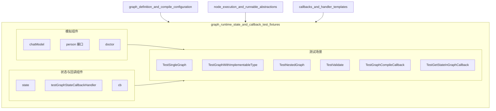

# graph_runtime_state_and_callback_test_fixtures 模块深度解析

## 1. 模块概述

`graph_runtime_state_and_callback_test_fixtures` 模块是 compose_graph_engine 中专门用于测试图运行时状态和回调机制的基础设施套件。它提供了一组模拟组件和测试工具，用于验证图执行过程中的状态管理、回调触发、类型检查等核心功能。

### 解决的核心问题

在构建复杂的图执行引擎时，开发者面临两个主要挑战：
1. **如何可靠地测试图的执行流程**，包括类型检查、边连接验证、分支逻辑等
2. **如何验证状态管理和回调机制**在图执行过程中的正确性

这个模块通过提供可复用的测试工具、模拟组件和示例场景，解决了这些问题，使得图引擎的核心功能可以被充分测试。

## 2. 架构与组件关系

### 2.1 模块架构图



### 2.2 架构说明

该模块的架构可以分为三个主要部分：
1. **模拟组件**：提供可预测的模拟实现，如 `chatModel`、`person` 接口和 `doctor` 结构体
2. **状态与回调组件**：用于测试状态管理和回调机制的组件，如 `state`、`testGraphStateCallbackHandler` 和 `cb`
3. **测试场景**：一系列测试函数，使用上述组件验证图引擎的各种功能

### 2.3 数据流概览

测试场景的典型数据流如下：
1. 使用模拟组件构建图
2. 注册状态或回调组件
3. 编译并执行图
4. 验证执行结果、状态变化或回调触发

## 3. 核心组件分析

### 3.1 模拟组件

#### `chatModel` 结构体
```go
type chatModel struct {
    msgs []*schema.Message
}
```

**设计意图**：提供一个可预测的聊天模型模拟，用于测试图执行中的模型节点。它不依赖实际的 LLM，而是返回预定义的消息序列。

**核心方法**：
- `Generate`: 同步返回预定义的第一条消息
- `Stream`: 异步流式返回所有预定义消息
- `BindTools`: 空实现，满足接口要求

**使用场景**：在 `TestSingleGraph` 和 `TestNestedGraph` 中，用于验证图中模型节点的正确集成和执行。

#### `person` 接口与 `doctor` 结构体
```go
type person interface {
    Say() string
}

type doctor struct {
    say string
}
```

**设计意图**：测试图执行引擎对接口类型的处理能力，特别是节点之间通过接口进行数据传递的场景。

**使用场景**：在 `TestGraphWithImplementableType` 中，验证图引擎能否正确处理接口类型的输入输出，以及运行时类型检查。

### 3.2 状态与回调测试组件

#### `state` 结构体
```go
type state struct {
    A string
}
```

**设计意图**：一个简单的状态结构体，用于测试图执行过程中的状态管理机制。

#### `testGraphStateCallbackHandler` 结构体
```go
type testGraphStateCallbackHandler struct {
    t *testing.T
}
```

**设计意图**：一个测试用的回调处理器，用于验证在图执行回调中能否正确访问和修改图的本地状态。

**核心方法**：
- `OnStart`: 在回调中尝试访问和修改状态
- 其他回调方法：空实现，满足接口要求

**使用场景**：在 `TestGetStateInGraphCallback` 中，验证 `ProcessState` 函数能否在回调中正确工作。

#### `cb` 结构体
```go
type cb struct {
    gInfo *GraphInfo
}
```

**设计意图**：用于捕获图编译时的回调信息，验证图编译回调机制的正确性。

**核心方法**：
- `OnFinish`: 保存图编译完成后的 `GraphInfo`

**使用场景**：在 `TestGraphCompileCallback` 中，验证图编译回调能否正确捕获图的结构信息。

## 4. 测试场景与数据流

### 4.1 基础图执行测试

**测试函数**：`TestSingleGraph`

**数据流**：
1. 创建一个包含提示模板节点和模型节点的简单图
2. 连接边：START → prompt → model → END
3. 编译图并执行 `Invoke`、`Stream` 和 `Transform` 操作
4. 验证输入输出的正确性，以及错误处理

**设计意图**：验证图的基本构建、编译和执行流程，包括同步调用、流式调用和转换调用。

### 4.2 接口类型处理测试

**测试函数**：`TestGraphWithImplementableType`

**数据流**：
1. 创建两个 lambda 节点，第一个返回 `*doctor` 类型，第二个接收 `person` 接口
2. 连接边并执行图
3. 验证类型兼容性和运行时类型检查

**设计意图**：测试图引擎对接口类型的处理能力，确保实现了接口的类型可以在节点间正确传递。

### 4.3 嵌套图测试

**测试函数**：`TestNestedGraph`

**数据流**：
1. 创建一个子图，包含提示模板和模型节点
2. 创建主图，包含 lambda 节点、子图节点和另一个 lambda 节点
3. 连接边并执行，同时测试回调机制

**设计意图**：验证图的嵌套能力，以及回调在嵌套图执行过程中的传播。

### 4.4 类型验证测试

**测试函数**：`TestValidate`

**数据流**：
1. 测试各种类型不匹配的场景，包括节点间类型不匹配、图输入输出类型不匹配等
2. 测试 `any` 类型的处理，包括编译时和运行时的类型检查
3. 测试分支逻辑中的类型处理

**设计意图**：全面验证图引擎的类型检查机制，确保在编译时和运行时都能正确处理类型问题。

### 4.5 图编译回调测试

**测试函数**：`TestGraphCompileCallback`

**数据流**：
1. 创建一个复杂的图，包含各种节点类型和嵌套图
2. 注册编译回调，捕获 `GraphInfo`
3. 验证捕获到的图信息是否符合预期

**设计意图**：测试图编译回调机制，确保回调能正确捕获图的完整结构信息。

### 4.6 状态回调测试

**测试函数**：`TestGetStateInGraphCallback`

**数据流**：
1. 创建一个带本地状态的图
2. 注册回调处理器，在回调中访问和修改状态
3. 执行图并验证状态操作的正确性

**设计意图**：测试在图执行回调中访问和修改本地状态的能力。

## 5. 设计决策与权衡

### 5.1 测试组件的设计

**决策**：将测试组件（如 `chatModel`、`doctor` 等）直接放在测试文件中，而不是单独的测试包中。

**权衡**：
- **优点**：测试组件与测试用例紧密耦合，便于理解和维护
- **缺点**：这些组件不能被其他包的测试直接复用

**设计理由**：这些测试组件是专门为测试图引擎的特定功能而设计的，与测试用例的关系非常紧密，放在一起更符合测试的内聚性原则。

### 5.2 类型检查的策略

**决策**：采用编译时类型检查与运行时类型检查相结合的策略。

**权衡**：
- **优点**：编译时检查可以提前发现大部分类型错误，运行时检查可以处理 `any` 类型等编译时无法确定的情况
- **缺点**：增加了代码复杂度，运行时检查会有一定的性能开销

**设计理由**：图引擎需要处理各种类型的节点和边，单纯的编译时检查无法覆盖所有场景（特别是 `any` 类型和接口类型），因此需要结合运行时检查。

### 5.3 回调机制的设计

**决策**：回调机制采用上下文传递的方式，而不是直接暴露图的内部状态。

**权衡**：
- **优点**：封装性好，内部状态的修改不会直接影响回调的使用
- **缺点**：需要通过 `ProcessState` 等辅助函数来访问状态，增加了使用的复杂度

**设计理由**：通过上下文传递回调信息，可以更好地控制状态的访问和修改，避免直接暴露内部实现细节。

## 6. 关键使用模式与示例

### 6.1 测试图的基本执行

```go
// 创建图
g := NewGraph[map[string]any, *schema.Message]()

// 添加节点
pt := prompt.FromMessages(schema.FString, schema.UserMessage("what's the weather in {location}?"))
err := g.AddChatTemplateNode("prompt", pt)

cm := &chatModel{msgs: []*schema.Message{{Role: schema.Assistant, Content: "the weather is good"}}}
err = g.AddChatModelNode("model", cm)

// 连接边
err = g.AddEdge(START, "prompt")
err = g.AddEdge("prompt", "model")
err = g.AddEdge("model", END)

// 编译并执行
r, err := g.Compile(context.Background())
in := map[string]any{"location": "beijing"}
out, err := r.Invoke(ctx, in)
```

### 6.2 测试回调中的状态访问

```go
// 创建带状态的图
g := NewGraph[string, string](WithGenLocalState(func(ctx context.Context) *state {
    return &state{}
}))

// 添加节点和边
g.AddLambdaNode("1", InvokableLambda(func(ctx context.Context, input string) (string, error) {
    return input, nil
}))
g.AddEdge(START, "1")
g.AddEdge("1", END)

// 编译并执行，传入回调
r, _ := g.Compile(ctx)
_, err := r.Invoke(ctx, "input", WithCallbacks(&testGraphStateCallbackHandler{t: t}))
```

## 7. 边缘情况与注意事项

### 7.1 类型检查的边缘情况

1. **`any` 类型的处理**：当节点使用 `any` 类型时，编译时类型检查会通过，但运行时仍会进行类型检查，可能导致运行时错误。
2. **接口类型的处理**：当节点使用接口类型时，只有实现了该接口的类型才能被正确传递，否则会导致运行时错误。
3. **分支中的类型检查**：分支节点的条件函数输入类型需要与前序节点的输出类型匹配，否则会导致编译或运行时错误。

### 7.2 回调机制的注意事项

1. **状态访问的时机**：状态只能在图执行过程中的回调中访问，在图编译时或执行前后访问状态可能会导致不可预期的行为。
2. **回调的传播**：在嵌套图中，回调会从父图传播到子图，需要注意回调在嵌套图中的执行顺序。
3. **回调中的错误处理**：回调中的错误不会直接影响图的执行，需要在回调内部妥善处理错误。

## 8. 与其他模块的关系

### 8.1 依赖关系

- **[graph_definition_and_compile_configuration](compose_graph_engine-graph_execution_runtime-graph_definition_and_compile_configuration.md)**：依赖该模块定义的图结构和编译配置
- **[node_execution_and_runnable_abstractions](compose_graph_engine-graph_execution_runtime-node_execution_and_runnable_abstractions.md)**：依赖该模块定义的节点和可运行抽象
- **[callbacks_and_handler_templates](callbacks_and_handler_templates.md)**：依赖该模块定义的回调机制

### 8.2 被依赖关系

该模块是一个测试基础设施模块，主要被图引擎的其他测试模块依赖，用于提供测试工具和模拟组件。

## 9. 总结

`graph_runtime_state_and_callback_test_fixtures` 模块是 compose_graph_engine 中重要的测试基础设施，它通过提供模拟组件、测试工具和示例场景，全面测试了图引擎的核心功能，包括图的构建、编译、执行、类型检查、状态管理和回调机制。

该模块的设计充分考虑了测试的内聚性和可维护性，将测试组件与测试用例紧密结合，同时采用了编译时与运行时相结合的类型检查策略，以及基于上下文的回调机制，确保了图引擎的核心功能可以被充分、可靠地测试。
