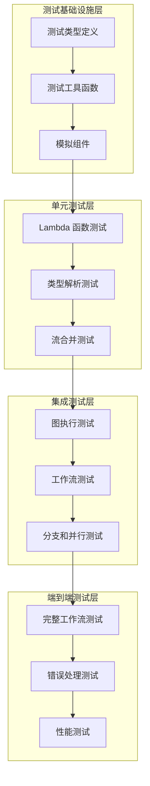
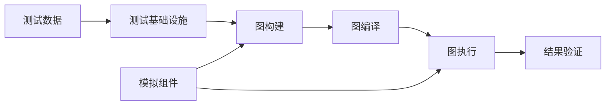

# Graph and Workflow Test Harnesses 模块深度解析

## 1. 概述

`graph_and_workflow_test_harnesses` 模块是 compose_graph_engine 中的一个核心测试基础设施，它提供了一套完整的测试工具和测试用例，用于验证图执行引擎和工作流系统的正确性、可靠性和性能。这个模块不仅仅是简单的测试集合，它本身就是一个设计精良的测试框架，为整个 compose_graph_engine 的质量保证提供了坚实的基础。

想象一下，如果我们把 compose_graph_engine 看作是一个复杂的管道系统，那么 `graph_and_workflow_test_harnesses` 就是这个管道系统的"测试实验室"——它不仅包含了各种压力测试、流量测试和故障模拟工具，还提供了标准化的测试环境和测试用例，确保每一条管道、每一个阀门都能按预期工作。

## 2. 架构设计

### 2.1 整体架构

这个测试模块采用了分层测试架构，从底层的 Lambda 函数测试到顶层的完整工作流测试，形成了一个完整的测试金字塔。



### 2.2 核心组件

这个模块包含以下几个关键的测试子模块：

1. **[graph_runtime_state_and_callback_test_fixtures](compose_graph_engine-graph_and_workflow_test_harnesses-graph_runtime_state_and_callback_test_fixtures.md)** - 提供图运行时状态和回调的测试基础设施
2. **[graph_invocation_and_chain_option_test_fixtures](compose_graph_engine-graph_and_workflow_test_harnesses-graph_invocation_and_chain_option_test_fixtures.md)** - 处理图调用和链选项的测试工具
3. **[stream_concat_test_payload_and_error_types](compose_graph_engine-graph_and_workflow_test_harnesses-stream_concat_test_payload_and_error_types.md)** - 流合并测试的负载和错误类型定义
4. **[lambda_option_parsing_test_fixture](compose_graph_engine-graph_and_workflow_test_harnesses-lambda_option_parsing_test_fixture.md)** - Lambda 选项解析的测试设施
5. **[workflow_type_contract_test_fixtures](compose_graph_engine-graph_and_workflow_test_harnesses-workflow_type_contract_test_fixtures.md)** - 工作流类型契约的测试工具

## 3. 核心概念与设计意图

### 3.1 测试基础设施设计理念

这个测试模块的设计遵循了几个关键原则：

1. **可组合性** - 测试组件可以像积木一样组合在一起，构建复杂的测试场景
2. **可重复性** - 提供确定性的测试环境，确保测试结果的一致性
3. **可扩展性** - 易于添加新的测试用例和测试类型
4. **诊断友好** - 提供详细的错误信息和测试反馈，便于问题定位

### 3.2 测试类型系统

模块定义了一系列测试专用的数据结构，用于验证类型系统的正确性：

```go
// 测试结构体用于解析
type TestStructForParse struct {
    ID int `json:"id"`
}

// 流合并测试项
type tStreamConcatItemForTest struct {
    s string
}

// 工作流测试接口
type goodInterface interface {
    GOOD()
}
```

这些类型不仅仅是测试数据，它们还展示了系统如何处理各种复杂的类型场景，包括接口实现、结构体嵌套、JSON 解析等。

### 3.3 模拟组件设计

模块提供了多种模拟组件，用于隔离测试环境：

```go
// 模拟聊天模型
type chatModel struct {
    msgs []*schema.Message
}

// 测试模型
type testModel struct{}

// 测试回调处理器
type testGraphStateCallbackHandler struct {
    t *testing.T
}
```

这些模拟组件让测试可以在不依赖外部服务的情况下运行，同时还能精确控制测试场景。

## 4. 关键测试场景解析

### 4.1 图执行测试

`graph_test.go` 包含了全面的图执行测试，涵盖了以下场景：

1. **基本图执行** - 验证简单图的执行流程
2. **嵌套图测试** - 测试子图的正确执行
3. **类型验证** - 确保类型系统的正确性
4. **分支和循环** - 测试复杂的控制流
5. **状态管理** - 验证图执行过程中的状态处理

这些测试不仅仅验证功能正确性，还通过精心设计的测试用例，揭示了系统在边界条件下的行为。

### 4.2 工作流测试

`workflow_test.go` 展示了工作流系统的全面测试：

1. **字段映射测试** - 验证复杂的数据转换
2. **分支逻辑** - 测试条件分支的正确性
3. **静态值处理** - 确保静态配置的正确应用
4. **流处理** - 验证流式数据的处理
5. **错误处理** - 测试各种错误场景的处理

工作流测试特别关注数据在不同节点之间的流动和转换，这是工作流系统最容易出错的地方。

### 4.3 Lambda 函数测试

`types_lambda_test.go` 专注于 Lambda 函数的测试：

1. **可调用 Lambda** - 测试同步 Lambda 执行
2. **流式 Lambda** - 验证流式数据处理
3. **可收集 Lambda** - 测试数据收集功能
4. **可转换 Lambda** - 验证数据转换能力
5. **消息解析** - 测试从消息中提取结构化数据

这些测试确保 Lambda 函数能够正确处理各种输入输出场景。

### 4.4 流合并测试

`stream_concat_test.go` 专门测试流合并功能：

1. **基本流合并** - 测试简单的流合并
2. **字符串合并** - 验证字符串类型的流合并
3. **消息合并** - 测试消息类型的合并
4. **映射合并** - 验证复杂映射类型的合并
5. **错误处理** - 测试合并过程中的错误处理

流合并测试展示了系统如何处理实时数据流的合并，这是实时应用中的关键功能。

## 5. 设计决策与权衡

### 5.1 测试覆盖策略

这个模块采用了"全面覆盖 + 重点突出"的测试策略：

**选择原因**：
- 全面覆盖确保没有功能被遗漏
- 重点突出确保关键功能得到充分测试
- 平衡了测试的完整性和效率

**权衡**：
- 优点：测试全面，问题发现率高
- 缺点：测试维护成本较高，执行时间较长

### 5.2 模拟 vs 真实组件

在测试中大量使用模拟组件而非真实组件：

**选择原因**：
- 模拟组件提供确定性的行为
- 测试执行速度快
- 不依赖外部服务
- 可以精确控制测试场景

**权衡**：
- 优点：测试稳定、快速、可控
- 缺点：可能无法发现与真实组件集成的问题

### 5.3 测试数据设计

测试数据的设计经过精心考虑：

**选择原因**：
- 使用真实场景的数据结构
- 包含边界条件和异常情况
- 数据结构复杂度递增

**权衡**：
- 优点：测试更贴近实际使用，问题发现更全面
- 缺点：测试数据维护成本较高

## 6. 数据流分析

### 6.1 图执行数据流

在典型的图执行测试中，数据流程如下：

1. **输入准备** - 测试创建输入数据
2. **图编译** - 图被编译成可执行形式
3. **节点执行** - 数据在节点间流动，每个节点处理数据
4. **输出验证** - 验证最终输出是否符合预期

这个流程不仅验证功能正确性，还测试了类型安全、错误处理和状态管理。

### 6.2 工作流数据流

工作流测试中的数据流更加复杂：

1. **输入映射** - 输入数据被映射到工作流的起始节点
2. **字段转换** - 数据在节点间经过多次字段映射和转换
3. **分支决策** - 根据数据内容选择不同的执行路径
4. **结果聚合** - 多个分支的结果被聚合到最终输出

这个复杂的数据流测试了工作流系统处理复杂数据转换的能力。

## 7. 使用指南与最佳实践

### 7.1 如何添加新测试

添加新测试时，请遵循以下步骤：

1. **确定测试类型** - 决定是单元测试、集成测试还是端到端测试
2. **选择合适的子模块** - 根据测试内容选择合适的测试文件
3. **使用现有的测试基础设施** - 尽可能重用现有的模拟组件和测试工具
4. **保持测试独立性** - 确保测试不依赖其他测试的状态
5. **提供清晰的测试说明** - 在测试代码中添加注释说明测试目的

### 7.2 常见陷阱与注意事项

1. **测试状态泄漏** - 确保每个测试都有独立的测试环境
2. **过度依赖模拟** - 定期与真实组件进行集成测试
3. **测试过于复杂** - 保持测试简单、清晰、 focused
4. **忽略边界条件** - 确保测试覆盖各种边界情况
5. **测试数据硬编码** - 使用灵活的测试数据生成策略

## 8. 模块间依赖关系

`graph_and_workflow_test_harnesses` 模块与其他模块的关系主要体现在以下几个方面：

### 8.1 被测试模块

这个测试模块主要测试以下核心模块：

1. **[composition_api_and_workflow_primitives](../compose_graph_engine-composition_api_and_workflow_primitives.md)** - 测试图构建 API 和工作流原语
2. **[graph_execution_runtime](../compose_graph_engine-graph_execution_runtime.md)** - 验证图执行运行时的正确性
3. **[tool_node_execution_and_interrupt_control](../compose_graph_engine-tool_node_execution_and_interrupt_control.md)** - 测试工具节点执行和中断控制

### 8.2 依赖的测试基础设施

测试模块依赖以下基础设施：

1. **internal_runtime_and_mocks** - 提供内部运行时和模拟组件
2. **schema_models_and_streams** - 提供数据模型和流处理基础设施
3. **components_core** - 提供核心组件接口定义

### 8.3 测试数据流向



## 9. 总结

`graph_and_workflow_test_harnesses` 模块是 compose_graph_engine 的质量保障基石。它不仅仅是一个测试集合，更是一个设计精良的测试框架，通过全面的测试覆盖、精心设计的测试数据和灵活的测试基础设施，确保了整个图执行引擎和工作流系统的可靠性和正确性。

这个模块的设计体现了"测试即产品"的理念，它的架构设计、组件组织和测试策略都值得学习和借鉴。通过深入理解这个测试模块，我们不仅能更好地使用 compose_graph_engine，还能学习到如何构建高质量的测试系统。

无论是作为测试框架的使用者，还是作为测试系统的设计者，这个模块都提供了宝贵的参考和启示。
