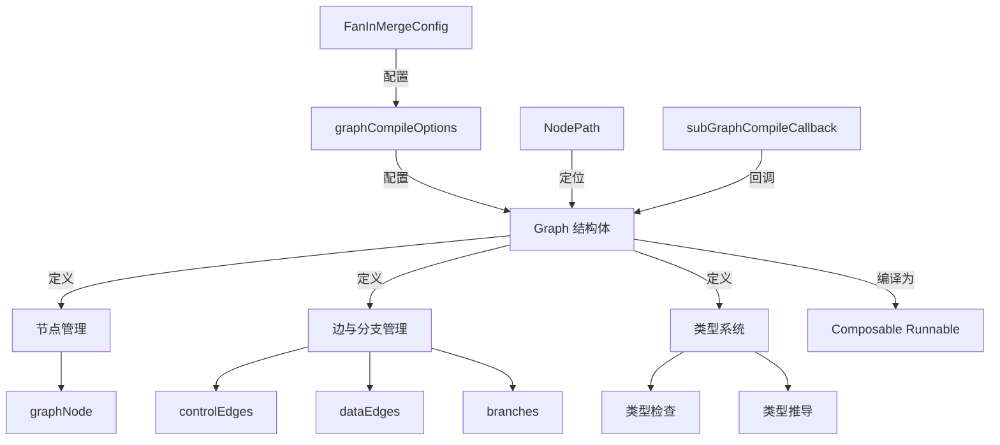

# 图定义与编译配置 (graph_definition_and_compile_configuration)

## 概述

如果你把一个 AI 应用程序想象成一条由多个"工作节点"组成的流水线，那么这个模块就是设计这条流水线的蓝图和施工图库。它不仅让你能画出哪些节点要做什么、节点之间如何连接，还负责把这张蓝图变成实际可运行的"工厂"。

更专业地说，这个模块是整个图执行引擎的**结构定义层和编译配置层**。它负责：
- 定义图的基本结构（节点、边、分支）
- 管理图的类型安全和类型推导
- 处理图的编译过程，将声明式结构转换为可执行的运行时
- 提供丰富的编译配置选项，控制运行时行为

这个模块的核心思想是：**用声明式的方式定义复杂的 AI 工作流，让开发者关注"做什么"而不是"怎么做"**。

## 架构概览



### 核心组件说明

1. **graph 结构体**：这是整个模块的核心，它像一个容器，保存了图的所有信息——节点、边、分支、类型信息等。它不是直接对外暴露的，而是通过 `NewGraph` 等函数创建。

2. **graphCompileOptions 结构体**：这是编译图时的配置中心，就像编译器的命令行参数，控制着图如何被编译和运行。

3. **FanInMergeConfig 结构体**：专门处理多个输入流合并的场景，比如当一个节点需要从多个前驱节点接收数据时。

4. **NodePath 结构体**：用于在嵌套图结构中定位特定节点，就像文件系统的路径一样。

5. **subGraphCompileCallback 结构体**：提供了在子图编译完成时执行自定义逻辑的钩子。

## 设计理念与核心抽象

### 1. 图作为"声明式程序"

这个模块的核心理念是将复杂的工作流建模为一张图，而不是一系列命令式的函数调用。这就像使用电子表格而不是写程序——你定义单元格之间的关系，而不是手动计算每个值。

**为什么选择这种设计？**
- AI 工作流通常有复杂的依赖关系，命令式代码难以表达
- 图结构天然支持并行和异步执行
- 更容易实现中断、恢复、检查点等高级功能

### 2. 控制边与数据边的分离

在这个模块中，边被分为两种类型：
- **控制边**：定义节点之间的执行顺序依赖
- **数据边**：定义节点之间的数据流动

这种分离带来了很大的灵活性：你可以让节点 A 在节点 B 之后执行，但不需要把 A 的输出传给 B。

### 3. 类型安全的图

Go 是静态类型语言，这个模块充分利用了这一点。图在定义时就会进行类型检查，确保：
- 节点的输入类型与前驱节点的输出类型兼容
- 字段映射是有效的
- 整个图的输入输出类型与预期一致

**类型推导机制**：对于 passthrough 节点，系统会自动推断其输入输出类型，这使得图的定义更加简洁。

### 4. 两种运行模式

模块支持两种基本的运行模式：

**Pregel 模式**
- 基于超步（super step）的批量执行
- 支持图中的循环
- 节点在任何一个前驱完成后即可触发（AnyPredecessor）
- 适合需要迭代处理的场景

**DAG 模式**
- 有向无环图执行
- 不允许循环
- 节点需要等待所有前驱完成后才触发（AllPredecessor）
- 适合明确的流水线场景

这种双模式设计是一个重要的权衡：Pregel 模式更灵活但复杂度更高，DAG 模式更简单但限制更多。

## 核心组件详解

### graph 结构体

`graph` 结构体是这个模块的核心，它管理着图的整个生命周期。

```go
type graph struct {
    nodes        map[string]*graphNode        // 图中的所有节点
    controlEdges map[string][]string           // 控制依赖边
    dataEdges    map[string][]string           // 数据流边
    branches     map[string][]*GraphBranch     // 分支结构
    // ... 其他字段
}
```

**设计亮点**：
1. **构建时验证**：每次添加节点或边时都会进行验证，并将错误累积在 `buildError` 中
2. **编译后锁定**：一旦图被编译，就不能再修改，防止了并发安全问题
3. **类型跟踪**：详细跟踪每个节点的输入输出类型，以及整个图的期望类型

### graphCompileOptions 结构体

这个结构体控制着图的编译和运行行为：

```go
type graphCompileOptions struct {
    maxRunSteps     int                 // 最大运行步数
    nodeTriggerMode NodeTriggerMode     // 节点触发模式
    callbacks       []GraphCompileCallback // 编译回调
    checkPointStore CheckPointStore     // 检查点存储
    interruptBeforeNodes []string        // 在这些节点前中断
    interruptAfterNodes  []string        // 在这些节点后中断
    eagerDisabled   bool                // 是否禁用急切执行
    mergeConfigs    map[string]FanInMergeConfig // 扇入合并配置
}
```

**设计权衡**：
- `maxRunSteps`：防止循环图无限执行，但需要合理设置
- `eagerDisabled`：默认启用急切执行可以提高性能，但在某些场景下可能需要禁用以确保行为可预测
- `mergeConfigs`：为不同节点提供不同的合并策略，增加了灵活性但也增加了配置复杂度

### NodePath 结构体

这个看似简单的结构体在嵌套图场景中非常重要：

```go
type NodePath struct {
    path []string
}
```

它的作用就像文件系统路径，让你可以准确定位到嵌套图中的任意节点。例如：
- `NewNodePath("agent_graph", "tool_node")` 可以定位到 `agent_graph` 子图中的 `tool_node`

## 数据流程：从定义到执行

让我们通过一个典型场景来看看数据如何在这个模块中流动：

1. **图的定义阶段**
   ```
   用户代码 → NewGraph() → AddXxxNode() → AddEdge() → AddBranch()
   ```
   在这个阶段，`graph` 结构体收集所有的结构信息，并进行初步验证。

2. **类型推导与验证**
   ```
   updateToValidateMap() → 类型检查 → 类型推导 → 生成转换处理器
   ```
   系统会分析节点之间的类型关系，为不匹配的类型自动生成转换器。

3. **编译阶段**
   ```
   Compile() → 选择运行模式 → 构建 runner → 验证 DAG（如果需要）
   ```
   这是最关键的一步，`graph` 结构体被转换成一个可执行的 `runner`。

4. **回调执行**
   ```
   onCompileFinish() → 执行 GraphCompileCallback
   ```
   编译完成后，会执行所有注册的回调，让用户有机会 inspect 或修改编译结果。

## 关键设计决策

### 1. 为什么将图的定义和执行分离？

**决策**：将 `graph`（定义）和 `runner`（执行）分为两个不同的结构体。

**原因**：
- 关注点分离：定义阶段关注结构和类型，执行阶段关注并发和调度
- 不可变性：编译后的图是不可变的，更容易保证并发安全
- 可测试性：可以独立测试图的定义和执行逻辑

**权衡**：
- 增加了一定的复杂度
- 但使得系统更健壮，更易于维护

### 2. 为什么支持两种运行模式？

**决策**：同时支持 Pregel 和 DAG 两种运行模式。

**原因**：
- 不同的应用场景需要不同的执行模型
- Pregel 适合有循环、需要迭代的场景（如多轮对话）
- DAG 适合明确的流水线场景（如数据处理管道）

**权衡**：
- 增加了系统的复杂度
- 但提供了更大的灵活性，满足不同需求

### 3. 为什么在定义时进行类型检查？

**决策**：在添加节点和边时就进行类型检查，而不是等到编译时。

**原因**：
- 尽早发现错误，提高开发体验
- 类型错误通常与定义位置相关，早检查可以提供更准确的错误信息
- 防止累积多个错误，使得调试更困难

**权衡**：
- 定义阶段会稍慢一些
- 但整体开发效率更高

### 4. 为什么需要 FanInMergeConfig？

**决策**：提供专门的配置来处理多个输入的合并。

**原因**：
- 当一个节点有多个前驱时，如何合并输入是一个非平凡的问题
- 不同的场景可能需要不同的合并策略
- 对于流处理，特别需要关注每个流的结束事件

**权衡**：
- 增加了配置的复杂度
- 但提供了必要的灵活性，处理各种边缘情况

## 使用指南与注意事项

### 常见使用模式

1. **基本图定义**
   ```go
   g := compose.NewGraph[string, string](ctx)
   g.AddLambdaNode("process", compose.InvokableLambda(func(ctx context.Context, in string) (string, error) {
       return "processed: " + in, nil
   }))
   g.AddEdge(compose.START, "process")
   g.AddEdge("process", compose.END)
   ```

2. **带状态的图**
   ```go
   type MyState struct {
       Count int
   }
   
   g := compose.NewGraphWithState[string, string, *MyState](
       ctx,
       func(ctx context.Context) *MyState { return &MyState{} },
   )
   ```

3. **编译配置**
   ```go
   runnable, err := g.Compile(ctx,
       compose.WithMaxRunSteps(100),
       compose.WithNodeTriggerMode(compose.AllPredecessor),
       compose.WithGraphName("my-workflow"),
   )
   ```

### 注意事项与常见陷阱

1. **编译后的图不可修改**
   - 一旦调用了 `Compile()`，就不能再添加节点或边
   - 如果需要修改，必须创建一个新的图

2. **类型必须匹配**
   - 节点之间的输入输出类型必须兼容
   - 如果不兼容，需要显式提供字段映射

3. **DAG 模式不能有环**
   - 如果使用 `AllPredecessor` 触发模式，图不能有环
   - 系统会在编译时检测并报错

4. **合理设置 maxRunSteps**
   - 对于有循环的图，一定要设置合理的 `maxRunSteps`
   - 默认值是节点数 + 10，可能不够复杂场景

5. **Passthrough 节点的类型推导**
   - Passthrough 节点的类型会自动推导
   - 但如果推导失败，需要显式连接类型明确的节点

## 模块关系与依赖

这个模块在整个系统中处于核心位置，它依赖于：
- [node_execution_and_runnable_abstractions](compose_graph_engine-graph_execution_runtime-node_execution_and_runnable_abstractions.md)：提供节点执行的抽象
- [runtime_scheduling_channels_and_handlers](compose_graph_engine-graph_execution_runtime-runtime_scheduling_channels_and_handlers.md)：提供运行时调度机制
- [graph_introspection_and_compile_callbacks](compose_graph_engine-graph_execution_runtime-graph_introspection_and_compile_callbacks.md)：提供图的内省和回调机制

同时，它被以下模块依赖：
- [composition_api_and_workflow_primitives](compose_graph_engine-composition_api_and_workflow_primitives.md)：提供更高级的图构建 API
- [graph_run_and_interrupt_execution_flow](compose_graph_engine-graph_execution_runtime-graph_run_and_interrupt_execution_flow.md)：负责图的实际执行和中断控制

## 子模块概要

本模块进一步细分为以下子模块，每个子模块负责特定的功能领域：

### 1. 核心图结构 (core_graph_structure)

这个子模块包含了图的基本结构定义，包括 `graph` 结构体、`newGraphConfig` 和 `NodePath`。它是整个模块的基础，负责图的构建、节点管理和基本结构操作。

详细内容请参考：[核心图结构](compose_graph_engine-graph_execution_runtime-graph_definition_and_compile_configuration-core_graph_structure.md)

### 2. 图编译配置 (graph_compile_configuration)

这个子模块专注于图的编译配置，包括 `graphCompileOptions` 和 `FanInMergeConfig`。它提供了丰富的选项来控制图的编译和运行行为，如最大运行步数、节点触发模式、检查点等。

详细内容请参考：[图编译配置](compose_graph_engine-graph_execution_runtime-graph_definition_and_compile_configuration-graph_compile_configuration.md)

### 3. 子图与回调 (subgraph_and_callbacks)

这个子模块处理子图的编译和回调机制，主要包括 `subGraphCompileCallback`。它允许在图编译完成时执行自定义逻辑，是扩展图功能的重要机制。

详细内容请参考：[子图与回调](compose_graph_engine-graph_execution_runtime-graph_definition_and_compile_configuration-subgraph_and_callbacks.md)

## 总结

`graph_definition_and_compile_configuration` 模块是整个图执行引擎的"大脑"和"蓝图"。它通过声明式的图定义、强类型系统、灵活的编译配置，使得复杂的 AI 工作流可以被清晰地表达、安全地执行。

这个模块的设计充满了权衡：灵活性与简单性、性能与安全性、声明式与命令式。但正是这些权衡使得它能够适应各种不同的 AI 应用场景，从简单的线性流水线到复杂的多轮对话系统。

对于新加入团队的开发者，理解这个模块的关键是：
1. 把图看作声明式的程序，而不是命令式的脚本
2. 理解控制边和数据边的分离
3. 掌握两种运行模式的适用场景
4. 注意类型安全和编译时验证
5. 探索各个子模块以了解更深入的实现细节
