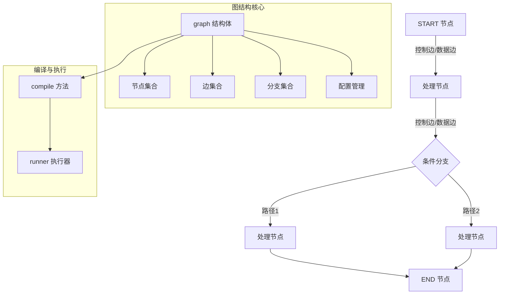

# core_graph_structure 模块技术深度解析

## 1. 概述

`core_graph_structure` 模块是 `compose_graph_engine` 的核心基础设施，它定义了图计算引擎的基础数据结构和构建逻辑。这个模块解决的核心问题是：如何提供一个类型安全、灵活可扩展的图结构定义系统，既能支持有向无环图(DAG)的简单场景，又能处理包含循环的复杂图结构，同时保持良好的类型检查和运行时性能。

想象一下，你正在构建一个工作流引擎，需要将不同的处理步骤（如模型调用、数据转换、工具执行）连接成一个有向图。你需要确保：
- 节点之间的数据类型匹配
- 支持条件分支和并行执行
- 可以在编译时捕获尽可能多的错误
- 同时支持简单的线性流程和复杂的循环流程

这正是 `core_graph_structure` 模块要解决的问题。

## 2. 核心架构

### 2.1 架构图



### 2.2 核心组件角色

1. **graph 结构体**：整个图结构的核心容器，管理节点、边、分支和配置
2. **newGraphConfig**：图创建时的配置结构，封装类型信息和初始化参数
3. **NodePath**：用于定位图中节点的路径结构，支持子图嵌套场景
4. **控制边与数据边分离**：这是一个关键设计，控制边决定执行顺序，数据边决定数据流

## 3. 核心组件深度解析

### 3.1 graph 结构体

`graph` 是整个模块的核心，它不仅仅是一个数据容器，更是一个状态机，管理着图从构建到编译的整个生命周期。

#### 设计意图

这个结构体的设计体现了几个关键理念：
- **分离关注点**：将节点定义、边关系、类型信息、编译状态等分离管理
- **渐进式类型推断**：支持通过边连接自动推断节点类型，特别是处理 passthrough 节点
- **编译时验证**：尽可能在编译阶段捕获错误，而不是运行时
- **不可变性保障**：编译后禁止修改，确保执行时的一致性

#### 核心字段解析

```go
type graph struct {
    // 节点与边的核心结构
    nodes        map[string]*graphNode      // 所有节点的集合
    controlEdges map[string][]string         // 控制依赖边：决定执行顺序
    dataEdges    map[string][]string         // 数据流边：决定数据传递
    branches     map[string][]*GraphBranch   // 条件分支
    
    // 类型系统与验证
    toValidateMap      map[string][]validateEntry  // 待验证的边
    fieldMappingRecords map[string][]*FieldMapping // 字段映射记录
    expectedInputType   reflect.Type                // 图的输入类型
    expectedOutputType  reflect.Type                // 图的输出类型
    
    // 状态管理
    stateType      reflect.Type                     // 状态类型
    stateGenerator func(ctx context.Context) any   // 状态生成器
    
    // 生命周期管理
    buildError error    // 构建过程中的错误
    compiled   bool     // 是否已编译
    
    // 处理器与回调
    handlerOnEdges   map[string]map[string][]handlerPair  // 边上的处理器
    handlerPreNode   map[string][]handlerPair              // 节点前处理器
    handlerPreBranch map[string][][]handlerPair            // 分支前处理器
}
```

#### 关键设计：控制边与数据边分离

这是该模块最值得注意的设计之一。为什么需要两种边？

- **控制边**：决定"何时执行"。例如，节点 B 必须在节点 A 完成后才能执行，无论 A 输出什么数据。
- **数据边**：决定"传递什么"。例如，节点 A 的输出作为节点 B 的输入。

这种分离带来了几个关键优势：
1. **灵活的执行控制**：可以创建"仅控制依赖"的边，不传递数据但确保执行顺序
2. **清晰的职责划分**：数据流和控制流解耦，各自独立演化
3. **支持复杂模式**：例如，一个节点可以等待多个控制依赖，但只从一个数据源接收数据

### 3.2 图的构建与编译流程

#### 构建阶段：addNode 和 addEdge

图的构建是一个渐进式的过程，每次添加节点或边都会进行部分验证：

1. **addNode**：添加节点时会验证
   - 节点名称是否与保留字冲突
   - 节点是否需要状态支持
   - 预处理器/后处理器的类型是否匹配

2. **addEdgeWithMappings**：添加边时会验证
   - 边的起点和终点是否有效
   - 控制边和数据边的唯一性
   - 触发类型推断和验证流程

这里有一个巧妙的设计：`buildError` 字段。一旦构建过程中出现错误，所有后续操作都会直接返回这个错误，避免错误级联和混乱的错误信息。

#### 编译阶段：compile 方法

编译是图从"定义"到"可执行"的关键转换。`compile` 方法执行以下核心步骤：

1. **确定运行模式**：选择 Pregel（支持循环）或 DAG（无环图）模式
2. **验证完整性**：确保有起始节点和结束节点，所有类型都已推断完成
3. **构建执行计划**：创建 `runner` 实例，设置通道、处理器和回调
4. **DAG 验证**（如需要）：检测循环，确保图是真正的 DAG
5. **设置检查点和中断**（如配置）：为恢复和调试做准备

编译后的图被标记为 `compiled = true`，防止后续修改，确保执行时的一致性。

### 3.3 类型推断系统：updateToValidateMap

这是模块中最复杂也最巧妙的部分之一。`updateToValidateMap` 方法实现了一个渐进式的类型推断系统，特别处理 passthrough 节点的类型传播。

#### 设计背景

想象一个场景：你有一个 passthrough 节点，它只是将输入原样传递给输出。当这个节点连接到其他类型明确的节点时，我们希望系统能自动推断出它的类型，而不需要用户显式指定。

#### 工作原理

1. **待验证队列**：`toValidateMap` 保存所有等待类型验证的边
2. **迭代推断**：系统反复遍历待验证边，直到没有更多类型可以推断
3. **类型传播**：
   - 如果源节点类型已知，目标节点是 passthrough，则将类型传播给目标
   - 如果目标节点类型已知，源节点是 passthrough，则将类型反向传播给源
4. **兼容性检查**：对于非 passthrough 节点，检查类型是否可赋值，必要时添加运行时转换器

这种设计使得用户可以灵活地构建图，而不必在每个节点上都显式指定类型，同时仍然保持类型安全。

### 3.4 NodePath：嵌套图的定位机制

#### 设计意图

在复杂的工作流中，图经常是嵌套的——一个图可以作为另一个图的节点。`NodePath` 提供了一种统一的方式来定位嵌套图中的任意节点。

#### 结构与使用

```go
type NodePath struct {
    path []string
}

// 使用示例：定位子图中的节点
path := NewNodePath("sub_graph_node", "inner_node")
```

这种设计类似于文件系统路径：
- 每个元素代表一级嵌套
- 从顶层图开始，逐级深入
- 提供了统一的寻址方式，无论嵌套多深

## 4. 依赖关系与数据流向

### 4.1 模块依赖

`core_graph_structure` 是一个相对基础的模块，它的依赖主要包括：

- **内部依赖**：
  - `genericHelper`：提供泛型支持和类型转换
  - `graphNode`：节点抽象
  - `runner`：执行引擎（来自 [graph_execution_runtime](compose_graph_engine-graph_execution_runtime.md)）

- **外部组件接口**：
  - 各种组件接口：`embedding.Embedder`、`retriever.Retriever`、`model.BaseChatModel` 等

### 4.2 数据流向

图的数据流向遵循以下路径：

1. **构建阶段**：
   ```
   用户调用 AddXxxNode/AddEdge 
   → graph 结构更新 
   → 类型推断触发 
   → 验证队列处理
   ```

2. **编译阶段**：
   ```
   compile() 调用 
   → 运行模式确定 
   → 执行计划构建 
   → runner 创建 
   → composableRunnable 返回
   ```

3. **执行阶段**（虽然不在本模块，但为了完整性）：
   ```
   输入数据 
   → START 节点 
   → 沿边传播 
   → 节点执行 
   → 分支选择 
   → END 节点 
   → 输出结果
   ```

## 5. 设计决策与权衡

### 5.1 两种运行模式：Pregel vs DAG

**决策**：支持两种运行模式，Pregel（默认）和 DAG。

**权衡分析**：
- **Pregel 模式**：
  - 优点：支持循环，更灵活，适合复杂的状态ful工作流
  - 缺点：调度开销更大，需要更多内存维护状态
  - 适用场景：代理循环、状态机、需要迭代的任务

- **DAG 模式**：
  - 优点：调度简单，性能更好，可以进行拓扑排序优化
  - 缺点：不支持循环
  - 适用场景：数据处理管道、简单的工作流

**为什么同时支持？**
不同的使用场景有不同的需求。简单的管道不需要循环的复杂性，而代理系统则循环是核心特性。通过提供两种模式，模块可以在简单性和灵活性之间取得平衡。

### 5.2 编译时 vs 运行时验证

**决策**：尽可能在编译时进行验证，但保留必要的运行时检查。

**权衡分析**：
- **编译时验证**：
  - 优点：早期反馈，性能更好，文档化类型约束
  - 缺点：实现复杂，某些动态场景无法覆盖

- **运行时验证**：
  - 优点：可以处理动态类型，更灵活
  - 缺点：错误发现晚，性能开销

**如何平衡？**
模块使用了一个三层策略：
1. **编译时类型检查**：利用 Go 的泛型系统
2. **图构建时验证**：添加节点和边时检查类型兼容性
3. **必要时的运行时检查**：对于接口转换等无法静态验证的场景

### 5.3 控制边与数据边分离

**决策**：将控制依赖和数据依赖作为两种不同的边。

**权衡分析**：
- **优点**：
  - 更清晰的语义："等待执行" vs "接收数据"
  - 更灵活的模式：例如，等待多个节点完成但只从一个节点接收数据
  - 更好的优化机会：可以独立优化控制流和数据流

- **缺点**：
  - 概念更复杂：用户需要理解两种边的区别
  - API 更复杂：需要更多的配置选项

**为什么值得？**
在实际的工作流场景中，控制依赖和数据依赖经常是不对称的。例如：
- 节点 C 可能需要等待节点 A 和 B 都完成，但只需要节点 A 的输出
- 节点 D 可能需要节点 C 的输出，但不需要等待其他任何节点

分离的边类型使这些模式可以清晰地表达，而不需要 hack。

## 6. 使用指南与最佳实践

### 6.1 基本图构建模式

```go
// 1. 创建图
g := compose.NewGraph[string, string](ctx)

// 2. 添加节点
err := g.AddLambdaNode("process", compose.InvokableLambda(
    func(ctx context.Context, input string) (string, error) {
        return "processed: " + input, nil
    }))

// 3. 添加边
err = g.AddEdge(compose.START, "process")
err = g.AddEdge("process", compose.END)

// 4. 编译
runnable, err := g.Compile(ctx)

// 5. 执行
result, err := runnable.Invoke(ctx, "input")
```

### 6.2 高级模式：条件分支

```go
// 创建分支条件
condition := compose.NewGraphBranch(
    func(ctx context.Context, input string) (string, error) {
        if len(input) > 10 {
            return "long_path", nil
        }
        return "short_path", nil
    },
    map[string]bool{"long_path": true, "short_path": true},
)

// 添加分支
err = g.AddBranch("decide", condition)

// 添加分支路径的边
err = g.AddEdge("long_path", "process_long")
err = g.AddEdge("short_path", "process_short")
```

### 6.3 最佳实践

1. **尽早编译，晚修改**：图编译后不可修改，设计好完整结构后再编译
2. **利用类型推断**：让 passthrough 节点自动推断类型，减少冗余声明
3. **合理命名节点**：使用有意义的节点名称，便于调试和错误追踪
4. **分离控制和数据依赖**：清晰区分何时使用控制边，何时使用数据边
5. **使用编译回调**：通过 `OnCompileFinish` 回调获取图信息，用于调试和可视化

## 7. 常见陷阱与注意事项

### 7.1 类型推断失败

**问题**：有时图无法完全推断类型，编译时报错"some node's input or output types cannot be inferred"。

**原因**：通常发生在以下情况：
- 多个 passthrough 节点链式连接，没有明确的类型来源
- 分支结构中不同路径的类型不兼容

**解决方案**：
- 在关键节点显式指定类型
- 确保分支结构中不同路径的类型兼容
- 避免过深的 passthrough 节点链

### 7.2 循环 vs DAG 模式

**问题**：在 DAG 模式下意外创建了循环，或者在 Pregel 模式下没有正确处理循环终止条件。

**解决方案**：
- 确认使用场景选择合适的模式
- 在 DAG 模式下，使用 `validateDAG` 进行循环检测
- 在 Pregel 模式下，确保循环有明确的退出条件

### 7.3 编译后修改

**问题**：尝试修改已编译的图，得到 `ErrGraphCompiled` 错误。

**解决方案**：
- 重新设计工作流，在编译前完成所有修改
- 如果需要动态修改，考虑创建多个图版本

### 7.4 字段映射冲突

**问题**：多个边映射到同一个目标字段，导致编译错误。

**解决方案**：
- 检查 `fieldMappingRecords`，确保每个目标字段只被映射一次
- 如果确实需要合并多个源，使用 `FanInMergeConfig` 配置合并策略

## 8. 总结

`core_graph_structure` 模块是一个精心设计的图结构定义系统，它在类型安全、灵活性和性能之间取得了良好的平衡。通过分离控制边和数据边、支持渐进式类型推断、提供多种运行模式，它能够满足从简单管道到复杂代理系统的各种工作流需求。

对于新加入团队的开发者，理解这个模块的关键是：
1. 掌握控制边与数据边分离的核心概念
2. 理解渐进式类型推断的工作原理
3. 熟悉两种运行模式的适用场景和限制
4. 注意常见的陷阱，特别是类型推断和循环处理

希望这份文档能帮助你快速理解并有效地使用这个模块！
