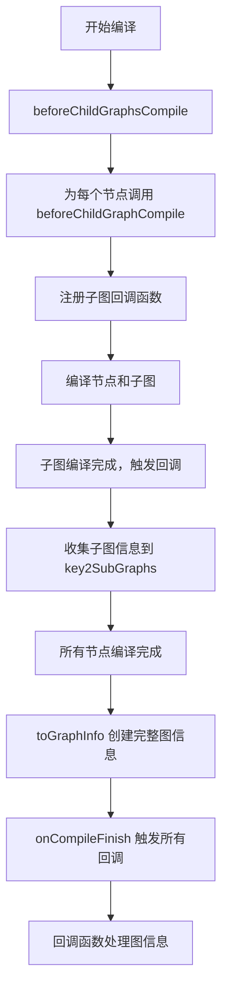

# subgraph_and_callbacks 模块深度解析

## 1. 模块概述

`subgraph_and_callbacks` 模块是 `compose_graph_engine` 中负责处理子图编译和编译回调机制的核心组件。它解决了在构建复杂的组合图时，如何在编译阶段收集图的结构信息、处理嵌套子图以及在编译完成后触发自定义逻辑的问题。

想象一下你正在构建一个包含多个嵌套组件的复杂系统，每个组件本身也是一个小型的图。你需要一种机制在整个系统构建完成时，能够获得完整的结构图，并可以对每个子组件进行检查或配置。这正是本模块所提供的能力。

## 2. 核心问题与设计思路

### 2.1 问题背景

在构建可组合的图执行系统时，开发者面临几个关键挑战：

1. **嵌套图结构的可见性**：当一个图节点本身又是一个子图时，如何在编译过程中收集完整的嵌套结构信息？
2. **编译完成后的扩展点**：如何在图编译完成后，让用户有机会注入自定义逻辑（如验证、优化、监控等）？
3. **类型安全与结构一致性**：如何在保持类型安全的同时，允许对图结构进行动态检查和操作？

### 2.2 设计洞察

模块的核心设计思路是通过**编译回调链**来解决这些问题：

1. 在编译子图前，为每个子图节点注册回调函数
2. 当子图编译完成时，自动收集子图的结构信息
3. 在整个图编译完成后，触发所有注册的回调，提供完整的图信息

这种设计实现了**关注点分离**：图的构建逻辑与编译后的处理逻辑解耦，同时保持了嵌套结构的完整性。

## 3. 核心组件解析

### 3.1 subGraphCompileCallback 结构体

```go
type subGraphCompileCallback struct {
    closure func(ctx context.Context, info *GraphInfo)
}
```

这是一个简单但 powerful 的结构体，它封装了一个在子图编译完成时执行的闭包函数。它的设计体现了**函数式编程**的思想，将行为封装为可以传递和存储的对象。

#### 方法解析

```go
func (s *subGraphCompileCallback) OnFinish(ctx context.Context, info *GraphInfo) {
    s.closure(ctx, info)
}
```

`OnFinish` 方法实现了编译回调接口，当子图编译完成时被调用。它简单地将调用委托给内部封装的闭包函数，这种设计允许我们在运行时动态创建回调逻辑。

### 3.2 编译回调的注册流程

让我们看一下子图回调是如何被注册和触发的：

#### 3.2.1 beforeChildGraphsCompile 方法

```go
func (g *graph) beforeChildGraphsCompile(opt *graphCompileOptions) map[string]*GraphInfo {
    if opt == nil || len(opt.callbacks) == 0 {
        return nil
    }

    return make(map[string]*GraphInfo)
}
```

这个方法在子图编译前被调用，它的作用是初始化一个映射表，用于存储子图的信息。只有当编译选项中包含回调时，才会创建这个映射表，体现了**按需创建**的优化思想。

#### 3.2.2 beforeChildGraphCompile 方法

```go
func (gn *graphNode) beforeChildGraphCompile(nodeKey string, key2SubGraphs map[string]*GraphInfo) {
    if gn.g == nil || key2SubGraphs == nil {
        return
    }

    subGraphCallback := func(ctx2 context.Context, subGraph *GraphInfo) {
        key2SubGraphs[nodeKey] = subGraph
    }

    gn.nodeInfo.compileOption.callbacks = append(gn.nodeInfo.compileOption.callbacks, &subGraphCompileCallback{closure: subGraphCallback})
}
```

这是整个机制的核心。对于每个可能包含子图的节点，它：

1. 检查节点是否包含子图且需要收集子图信息
2. 创建一个闭包函数，该函数将子图信息存储到映射表中
3. 将这个闭包封装成 `subGraphCompileCallback` 并添加到节点的编译选项中

这里的设计非常巧妙：它利用闭包捕获了 `nodeKey` 和 `key2SubGraphs` 变量，使得回调函数在被调用时能够正确地将子图信息与对应的节点关联起来。

### 3.3 图信息的收集与分发

#### 3.3.1 toGraphInfo 方法

```go
func (g *graph) toGraphInfo(opt *graphCompileOptions, key2SubGraphs map[string]*GraphInfo) *GraphInfo {
    // 创建并填充 GraphInfo 对象
    gInfo := &GraphInfo{
        CompileOptions: opt.origOpts,
        Nodes:          make(map[string]GraphNodeInfo, len(g.nodes)),
        Edges:          gmap.Clone(g.controlEdges),
        DataEdges:      gmap.Clone(g.dataEdges),
        // ... 其他字段
    }

    // 处理每个节点
    for key := range g.nodes {
        // ... 填充节点信息
        if gi, ok := key2SubGraphs[key]; ok {
            gNodeInfo.GraphInfo = gi
        }
        gInfo.Nodes[key] = *gNodeInfo
    }

    return gInfo
}
```

这个方法将图的内部结构转换为外部可消费的 `GraphInfo` 对象。它的关键特点是：

1. **深拷贝**：使用 `gmap.Clone` 复制边和分支信息，防止外部修改影响内部状态
2. **递归构建**：如果节点有子图信息，将其嵌入到节点信息中，形成完整的嵌套结构
3. **信息完整性**：包含了图的所有关键信息，包括节点、边、分支、类型等

#### 3.3.2 onCompileFinish 方法

```go
func (g *graph) onCompileFinish(ctx context.Context, opt *graphCompileOptions, key2SubGraphs map[string]*GraphInfo) {
    if opt == nil {
        return
    }

    if len(opt.callbacks) == 0 {
        return
    }

    gInfo := g.toGraphInfo(opt, key2SubGraphs)

    for _, cb := range opt.callbacks {
        cb.OnFinish(ctx, gInfo)
    }
}
```

这个方法是整个回调机制的终点：

1. 它首先检查是否有回调需要触发
2. 然后创建完整的图信息对象
3. 最后遍历所有注册的回调，依次调用它们的 `OnFinish` 方法

这里采用了**观察者模式**，多个回调可以独立地对图编译完成事件做出反应，而不需要知道彼此的存在。

## 4. 架构与数据流程

让我们通过一个 Mermaid 图来展示整个流程：



### 4.1 详细流程解析

1. **初始化阶段**：在图编译开始时，`beforeChildGraphsCompile` 被调用，准备子图信息的存储结构
2. **回调注册阶段**：遍历所有节点，对于包含子图的节点，通过 `beforeChildGraphCompile` 注册回调函数
3. **子图编译阶段**：每个节点被编译，如果是子图节点，其内部的图也会被编译
4. **信息收集阶段**：当子图编译完成时，之前注册的回调被触发，子图信息被收集到 `key2SubGraphs` 映射中
5. **完成回调阶段**：整个图编译完成后，`onCompileFinish` 被调用，创建完整的 `GraphInfo` 对象并触发所有注册的回调

## 5. 设计决策与权衡

### 5.1 闭包 vs 接口实现

**决策**：使用闭包封装回调逻辑，而不是要求用户实现完整接口

**原因**：
- 简化了用户代码，用户只需提供一个函数而不是完整的结构体
- 增加了灵活性，可以在运行时动态创建回调逻辑
- 允许回调捕获上下文变量（如 `nodeKey` 和 `key2SubGraphs`）

**权衡**：
- 降低了类型安全性，因为闭包的类型检查在编译时不完全
- 可能使代码追踪变得稍微复杂，因为回调逻辑是动态创建的

### 5.2 深拷贝 vs 引用共享

**决策**：在创建 `GraphInfo` 时对边、分支等数据结构进行深拷贝

**原因**：
- 防止外部修改影响图的内部状态
- 提供了图结构的快照，确保回调看到的是编译时的状态
- 增强了系统的健壮性和可预测性

**权衡**：
- 增加了内存使用和编译时间
- 对于非常大的图，可能会有性能影响

### 5.3 集中式回调 vs 分布式回调

**决策**：采用集中式的回调机制，在整个图编译完成后统一触发所有回调

**原因**：
- 确保回调能看到完整的图结构，而不是部分构建的图
- 简化了回调逻辑，不需要处理图的部分构建状态
- 提供了一致的执行时机，便于调试和理解

**权衡**：
- 对于非常大的图，可能会增加编译完成后的处理时间
- 无法在图构建的中间阶段触发回调

## 6. 使用指南与最佳实践

### 6.1 注册编译回调

要在图编译完成后执行自定义逻辑，可以通过 `GraphCompileOption` 注册回调：

```go
// 创建回调函数
myCallback := &myCompileCallback{}

// 编译图时传入回调
graph, err := g.Compile(ctx, compose.WithGraphCompileCallbacks(myCallback))
```

### 6.2 实现自定义回调

实现 `GraphCompileCallback` 接口来创建自定义回调：

```go
type myCompileCallback struct{}

func (m *myCompileCallback) OnFinish(ctx context.Context, info *compose.GraphInfo) {
    // 在这里处理图信息
    fmt.Printf("Graph compiled with %d nodes\n", len(info.Nodes))
    
    // 检查是否有子图
    for key, node := range info.Nodes {
        if node.GraphInfo != nil {
            fmt.Printf("Node %s contains a subgraph with %d nodes\n", key, len(node.GraphInfo.Nodes))
        }
    }
}
```

### 6.3 最佳实践

1. **保持回调轻量**：回调函数应当快速执行，避免长时间阻塞编译流程
2. **不要修改 GraphInfo**：虽然技术上可以修改，但应该将其视为只读结构
3. **错误处理**：回调中的错误应当妥善处理，考虑使用上下文传递错误
4. **并发安全**：如果在回调中启动 goroutine，确保正确处理并发访问

## 7. 注意事项与常见陷阱

### 7.1 循环引用

由于 `GraphInfo` 可能包含嵌套的子图结构，在处理时要注意避免循环引用导致的问题：

```go
// 不安全的做法 - 可能导致无限递归
func printAllNodes(info *GraphInfo) {
    for _, node := range info.Nodes {
        fmt.Println(node.Name)
        if node.GraphInfo != nil {
            printAllNodes(node.GraphInfo) // 可能导致无限递归
        }
    }
}

// 安全的做法 - 使用访问集合跟踪已访问的图
func printAllNodesSafe(info *GraphInfo, visited map[*GraphInfo]bool) {
    if visited[info] {
        return
    }
    visited[info] = true
    
    for _, node := range info.Nodes {
        fmt.Println(node.Name)
        if node.GraphInfo != nil {
            printAllNodesSafe(node.GraphInfo, visited)
        }
    }
}
```

### 7.2 编译后的修改

图编译完成后，不应再尝试修改图结构：

```go
graph, err := g.Compile(ctx, opts...)
if err != nil {
    // 处理错误
}

// 错误做法 - 编译后尝试添加节点
err = g.AddLambdaNode("new_node", myLambda) // 返回 ErrGraphCompiled
```

### 7.3 回调执行顺序

回调的执行顺序与它们被添加的顺序一致，但不应依赖这一顺序：

```go
// 不推荐 - 依赖回调执行顺序
graph.Compile(ctx, 
    compose.WithGraphCompileCallbacks(callback1), // 假设先执行
    compose.WithGraphCompileCallbacks(callback2), // 假设后执行
)

// 推荐 - 让回调之间相互独立，或者使用单个回调协调多个操作
graph.Compile(ctx, compose.WithGraphCompileCallbacks(&combinedCallback{
    callbacks: []GraphCompileCallback{callback1, callback2},
}))
```

## 8. 总结

`subgraph_and_callbacks` 模块通过巧妙的回调机制，解决了组合图系统中子图信息收集和编译后扩展的问题。它的设计体现了几个重要的软件工程原则：

1. **关注点分离**：将图的构建和编译后的处理分离
2. **开闭原则**：对扩展开放，通过回调机制允许添加新功能而不修改核心代码
3. **信息隐藏**：通过 `GraphInfo` 提供图结构的快照，隐藏内部实现细节

这个模块虽然代码量不大，但它是整个组合图引擎的重要组成部分，为图的可视化、调试、优化和监控提供了基础设施。
