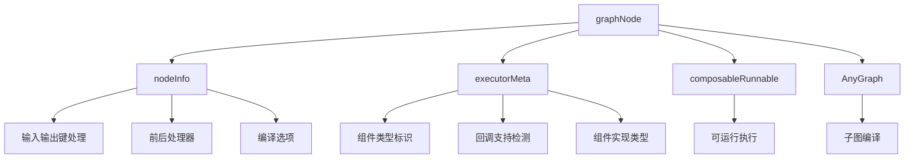

# graph_node_abstractions 模块技术深度解析

## 1. 模块概述

`graph_node_abstractions` 模块是 `compose_graph_engine` 中的核心基础设施，它为图工作流系统提供了节点抽象和统一执行模型。这个模块解决的核心问题是：如何将各种异构的可执行组件（如工具、Lambda 函数、子图等）统一表示为图中的节点，并提供一致的编译和执行机制。

在没有这种抽象的情况下，图执行引擎需要为每种类型的节点编写专门的处理逻辑，导致代码重复、维护困难，并且难以扩展新的节点类型。`graph_node_abstractions` 通过创建统一的节点表示，将这些复杂性隐藏在一致的接口后面。

## 2. 核心抽象与心智模型

### 2.1 核心组件

该模块定义了三个关键结构体，它们共同构成了图节点的完整表示：

1. **`graphNode`**：图节点的完整表示，包含执行所需的所有信息
2. **`nodeInfo`**：节点的元信息，包括名称、输入输出键、处理器等
3. **`executorMeta`**：底层可执行对象的元数据，用于标识和处理原始组件

### 2.2 心智模型

可以将 `graphNode` 想象成一个\"智能适配器\"：
- 它一端连接到用户提供的各种可执行组件（工具、函数、子图等）
- 另一端提供标准化的接口，供图执行引擎使用
- 中间处理输入输出转换、回调管理、类型信息等横切关注点

这种设计类似于计算机网络中的协议栈：每一层都为上层提供统一的接口，同时封装下层的复杂性。

## 3. 架构与数据流程

### 3.1 组件关系图



### 3.2 数据流程解析

当图执行引擎处理一个节点时，典型的数据流程如下：

1. **节点创建**：通过 `getNodeInfo` 解析用户提供的选项，创建 `nodeInfo` 实例
2. **组件信息提取**：通过 `parseExecutorInfoFromComponent` 分析用户提供的可执行组件，提取元数据
3. **节点组装**：创建 `graphNode` 实例，组合以上所有信息
4. **编译准备**：调用 `compileIfNeeded` 方法
   - 如果节点是子图（`AnyGraph`），则先编译子图
   - 应用输入输出键转换
   - 组装最终的 `composableRunnable`
5. **类型信息获取**：通过 `inputType()` 和 `outputType()` 方法获取节点的输入输出类型信息，用于图的类型检查

## 4. 核心组件深度解析

### 4.1 `graphNode` 结构体

`graphNode` 是整个模块的核心，它封装了图中一个节点的完整信息。

```go
type graphNode struct {
    cr *composableRunnable  // 可运行的执行单元
    g AnyGraph               // 子图（如果节点是子图）
    nodeInfo *nodeInfo       // 节点元信息
    executorMeta *executorMeta  // 执行器元数据
    instance any            // 用户提供的原始实例
    opts []GraphAddNodeOpt  // 添加节点时的选项
}
```

**设计意图**：
- 同时支持直接的可运行单元（`cr`）和子图（`g`），提供了灵活性
- 保留原始实例和选项，允许延迟处理和重新配置
- 将不同方面的信息分离到不同的结构体中，提高了可维护性

**关键方法**：

1. **`compileIfNeeded(ctx context.Context) (*composableRunnable, error)`**
   - 目的：确保节点被编译为可执行的 `composableRunnable`
   - 机制：如果是子图，则先编译子图；然后应用输入输出键处理
   - 设计亮点：惰性编译，只在真正需要时才进行编译操作

2. **`inputType() reflect.Type` 和 `outputType() reflect.Type`**
   - 目的：提供节点的输入输出类型信息
   - 机制：根据是否设置了 inputKey/outputKey 决定返回 map 类型还是底层组件的类型
   - 设计亮点：类型信息的统一接口，屏蔽了底层实现的差异

3. **`getGenericHelper() *genericHelper`**
   - 目的：提供泛型辅助功能
   - 机制：根据节点配置创建适当的泛型辅助器
   - 说明：这个方法展示了模块如何处理 Go 语言中的泛型限制

### 4.2 `nodeInfo` 结构体

`nodeInfo` 包含了节点的配置信息和元数据。

```go
type nodeInfo struct {
    name string                 // 节点名称，用于显示
    inputKey string             // 输入键，用于从 map 中提取输入
    outputKey string            // 输出键，用于将输出包装到 map 中
    preProcessor, postProcessor *composableRunnable  // 前后处理器
    compileOption *graphCompileOptions  // 编译选项（仅对子图有效）
}
```

**设计意图**：
- 分离关注点：将节点的配置信息与执行逻辑分开
- 提供统一的配置接口：无论底层组件是什么类型，都使用相同的配置方式
- 支持数据转换：通过 inputKey/outputKey 实现数据格式的灵活转换

### 4.3 `executorMeta` 结构体

`executorMeta` 保存了关于底层可执行组件的元信息。

```go
type executorMeta struct {
    component component          // 组件类型标识
    isComponentCallbackEnabled bool  // 组件是否自己处理回调
    componentImplType string     // 组件实现类型，用于调试和日志
}
```

**设计意图**：
- 保留原始组件信息：便于回调处理和调试
- 支持组件自管理回调：避免重复执行回调逻辑
- 提供组件类型信息：用于运行时类型检查和错误报告

### 4.4 辅助函数

1. **`parseExecutorInfoFromComponent(c component, executor any) *executorMeta`**
   - 目的：从用户提供的组件中提取元信息
   - 机制：使用 `components` 包中的函数获取组件类型和回调支持信息
   - 设计亮点：优雅地处理组件类型推断，当无法获取精确类型时有回退机制

2. **`getNodeInfo(opts ...GraphAddNodeOpt) (*nodeInfo, *graphAddNodeOpts)`**
   - 目的：从选项中创建 nodeInfo 结构
   - 机制：解析用户提供的选项，提取节点配置
   - 设计亮点：使用函数选项模式，提供灵活的配置方式

## 5. 依赖分析

### 5.1 被依赖模块

`graph_node_abstractions` 模块依赖以下关键模块：

1. **`components` 包**：提供组件类型系统和回调支持检测
   - 使用 `components.GetType()` 获取组件类型
   - 使用 `components.IsCallbacksEnabled()` 检查组件是否支持自管理回调

2. **`internal/generic` 包**：提供泛型辅助功能
   - 使用 `generic.TypeOf()` 获取类型信息
   - 使用 `generic.ParseTypeName()` 解析类型名称

### 5.2 依赖此模块的模块

此模块主要被以下模块使用：

1. **[graph_definition_and_compile_configuration](compose_graph_engine-graph_execution_runtime-graph_definition_and_compile_configuration.md)**：用于图的定义和编译
2. **[composition_api_and_workflow_primitives](compose_graph_engine-composition_api_and_workflow_primitives.md)**：提供图构建的 API

### 5.3 数据契约

模块中隐含的关键数据契约包括：

1. **输入输出类型契约**：
   - 如果设置了 `inputKey`，则节点期望接收 `map[string]any` 类型的输入
   - 如果设置了 `outputKey`，则节点会返回 `map[string]any` 类型的输出

2. **组件类型契约**：
   - 所有组件必须能够通过 `components.GetType()` 进行类型识别
   - 组件可以选择是否自己处理回调，通过 `components.IsCallbacksEnabled()` 指示

## 6. 设计决策与权衡

### 6.1 统一节点抽象 vs 专用节点类型

**决策**：创建统一的 `graphNode` 抽象，而不是为每种组件类型创建专用节点

**理由**：
- 减少代码重复：所有节点类型共享相同的处理逻辑
- 提高可扩展性：添加新的组件类型不需要修改图执行引擎
- 简化 API：用户只需要学习一种节点配置方式

**权衡**：
- 牺牲了一些类型安全：统一抽象需要使用 `any` 类型
- 增加了内部复杂性：需要处理各种组件类型的特殊情况

### 6.2 惰性编译 vs 急切编译

**决策**：使用 `compileIfNeeded()` 实现惰性编译

**理由**：
- 提高性能：只在真正需要时才进行编译
- 支持动态配置：允许在图定义后修改节点配置
- 减少启动时间：图的初始创建更快

**权衡**：
- 错误延迟：编译错误可能在运行时才暴露，而不是在图构建时
- 状态管理复杂性：需要跟踪是否已编译的状态

### 6.3 输入输出键的设计

**决策**：通过 `inputKey` 和 `outputKey` 支持 map 数据格式的转换

**理由**：
- 灵活性：允许节点在 map 和特定类型之间自由转换
- 兼容性：便于连接不同类型的节点
- 简洁性：避免了显式的数据转换节点

**权衡**：
- 类型安全降低：运行时才会发现键不匹配的问题
- 隐式行为：数据转换不是显式的，可能导致理解困难

## 7. 使用指南与示例

### 7.1 基本使用模式

虽然这个模块主要是内部使用，但理解其工作原理有助于更好地使用图构建 API：

1. **创建带有输入输出键的节点**：
   ```go
   // 假设这是图构建 API 的使用方式
   graph.AddNode(myComponent, 
       WithNodeName("my-node"),
       WithInputKey("input"),
       WithOutputKey("result"))
   ```

2. **使用子图作为节点**：
   ```go
   subGraph := NewGraph(...)
   // 配置子图...
   
   mainGraph.AddNode(subGraph,
       WithNodeName("sub-graph"),
       WithGraphCompileOption(/* 子图特定的编译选项 */))
   ```

### 7.2 常见模式

1. **数据适配模式**：
   使用 `inputKey` 和 `outputKey` 将一个节点的输出适配到另一个节点的输入格式，无需显式的转换节点。

2. **子图模块化**：
   将复杂的逻辑封装为子图，然后作为一个节点添加到主图中，提高可维护性。

## 8. 边缘情况与陷阱

### 8.1 输入输出键与类型的交互

当同时设置了 `inputKey`/`outputKey` 和特定的输入输出类型时，需要注意：
- 设置了 `inputKey` 后，节点的 `inputType()` 将返回 `map[string]any`，而不是底层组件的输入类型
- 这可能导致类型检查通过，但运行时出现错误

### 8.2 回调处理的重复执行

如果组件自己处理回调（`isComponentCallbackEnabled` 为 true），图级别的回调将不会执行。这是一个有意的设计，但可能导致意外行为，如果不理解这个约定的话。

### 8.3 子图编译选项

子图的编译选项只在第一次编译时使用，如果子图已经被编译过，后续更改编译选项将不会生效。

### 8.4 组件类型推断

当组件类型无法通过 `components.GetType()` 获取时，系统会回退到通过反射解析类型名称。这种方式不保证总是返回理想的结果，可能影响调试和日志的可读性。

## 9. 总结

`graph_node_abstractions` 模块是图工作流系统的关键基础设施，它通过统一的节点抽象解决了异构组件集成的复杂性。该模块的设计体现了几个重要的软件工程原则：

1. **关注点分离**：将节点的不同方面（配置、执行、元数据）分离到不同的结构中
2. **统一接口**：为各种异构组件提供一致的接口
3. **灵活性与可扩展性**：支持多种组件类型和配置方式
4. **惰性处理**：只在必要时进行编译等昂贵操作

虽然这种设计带来了一些权衡（如类型安全的降低和内部复杂性的增加），但总体上它为构建灵活、可扩展的图工作流系统提供了坚实的基础。

对于新的贡献者，理解这个模块的关键是把握\"统一适配器\"的心智模型，以及它如何在保持简单接口的同时处理各种复杂情况。