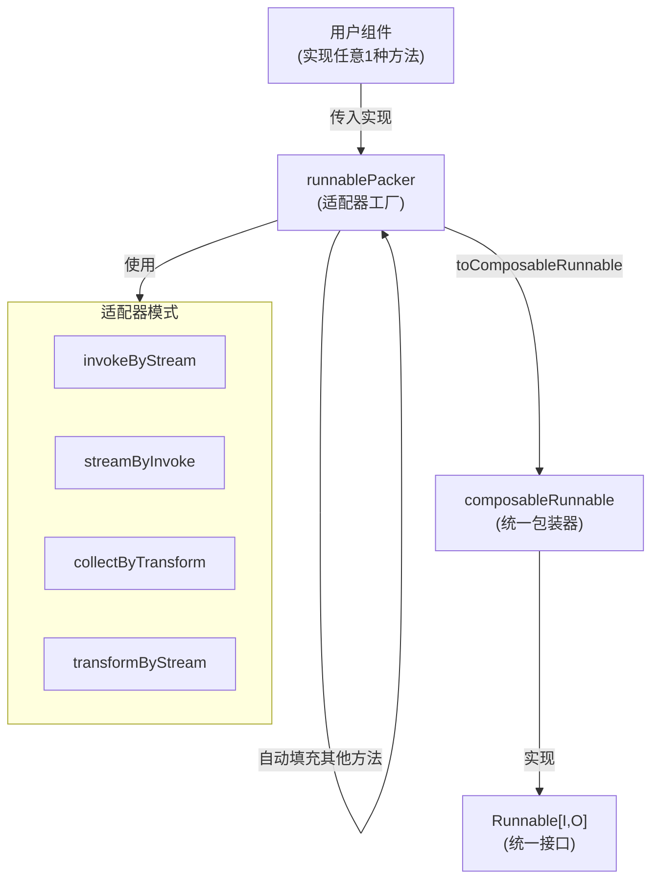

# Runnable Interface and Wrappers 模块深度解析

## 1. 问题背景与核心价值

在构建复杂的 AI 应用时，我们面临两个核心挑战：
- **组件互操作性**：不同的 AI 组件（模型、工具、解析器）可能提供不同的执行接口——有的是单步执行（Invoke），有的是流式输出（Stream），有的专门处理流输入（Collect/Transform）
- **兼容性降级**：当用户只实现了其中一种执行模式时，如何让它无缝支持其他模式？

`runnable_interface_and_wrappers` 模块正是为解决这些问题而设计的。它提供了一个统一的执行抽象层，让开发者可以用任意一种模式实现组件，然后自动获得其他三种模式的支持。

## 2. 核心心智模型

### 2.1 四种数据流模式

想象一个数据处理管道，有四种基本的连接方式：

```
Invoke:     [单值输入] → 处理 → [单值输出]        (ping → pong)
Stream:     [单值输入] → 处理 → [流式输出]        (ping → stream)
Collect:    [流式输入] → 处理 → [单值输出]        (stream → pong)
Transform:  [流式输入] → 处理 → [流式输出]        (stream → stream)
```

### 2.2 兼容性矩阵

这就是模块的核心洞察：只要你实现了任意一种模式，我们可以通过简单的适配器组合出其他三种模式。这就像一个万能插头转换器——无论你是什么接口，都能插到任何插座上。

## 3. 架构概览



## 4. 核心组件深度解析

### 4.1 Runnable 接口

**设计意图**：定义统一的执行契约，让所有可执行对象都能以四种方式被调用。

```go
type Runnable[I, O any] interface {
    Invoke(ctx context.Context, input I, opts ...Option) (output O, err error)
    Stream(ctx context.Context, input I, opts ...Option) (output *schema.StreamReader[O], err error)
    Collect(ctx context.Context, input *schema.StreamReader[I], opts ...Option) (output O, err error)
    Transform(ctx context.Context, input *schema.StreamReader[I], opts ...Option) (output *schema.StreamReader[O], err error)
}
```

**关键特性**：
- **泛型设计**：`I` 和 `O` 分别表示输入和输出类型，提供类型安全
- **四种模式**：覆盖了所有可能的单值/流输入输出组合

### 4.2 runnablePacker 结构体

**设计意图**：作为适配器工厂，负责从用户提供的部分实现中生成完整的执行能力。

```go
type runnablePacker[I, O, TOption any] struct {
    i Invoke[I, O, TOption]
    s Stream[I, O, TOption]
    c Collect[I, O, TOption]
    t Transform[I, O, TOption]
}
```

**工作原理**：
在 `newRunnablePacker` 函数中，它遵循一个优先级策略来填充缺失的方法：

1. **Invoke 的降级顺序**：优先使用用户提供的 `i`，否则尝试 `invokeByStream(s)`，然后 `invokeByCollect(c)`，最后 `invokeByTransform(t)`
2. **Stream 的降级顺序**：优先使用用户提供的 `s`，否则尝试 `streamByTransform(t)`，然后 `streamByInvoke(i)`，最后 `streamByCollect(c)`
3. **Collect 的降级顺序**：优先使用用户提供的 `c`，否则尝试 `collectByTransform(t)`，然后 `collectByInvoke(i)`，最后 `collectByStream(s)`
4. **Transform 的降级顺序**：优先使用用户提供的 `t`，否则尝试 `transformByStream(s)`，然后 `transformByCollect(c)`，最后 `transformByInvoke(i)`

**设计洞察**：为什么是这个优先级？因为某些转换比其他转换更高效。例如，`Stream → Invoke` 只需要消费流，而 `Transform → Invoke` 需要先把单值转成流，再消费流。

### 4.3 composableRunnable 结构体

**设计意图**：作为所有可执行对象的统一包装器，处理类型擦除、类型断言和选项转换。

```go
type composableRunnable struct {
    i invoke
    t transform

    inputType  reflect.Type
    outputType reflect.Type
    optionType reflect.Type

    *genericHelper
    isPassthrough bool
    meta *executorMeta
    nodeInfo *nodeInfo
}
```

**关键机制**：

1. **类型安全与类型擦除的平衡**：
   - 内部使用 `any` 类型（`invoke` 和 `transform` 函数签名）以支持统一处理
   - 通过 `inputType`、`outputType` 和 `optionType` 保存类型信息
   - 在执行时进行类型断言，确保类型安全

2. **nil 处理的特殊技巧**：
   ```go
   if input == nil && reflect.TypeOf((*I)(nil)).Elem().Kind() == reflect.Interface {
       var i I
       in = i
   }
   ```
   这是为了解决 Go 语言中 `nil` 类型信息丢失的问题。当 `nil` 作为 `any` 类型传递时，它的原始类型信息会丢失，导致类型断言失败。这段代码显式地创建了一个类型为 `I` 的 `nil` 值。

## 5. 数据流详解

让我们追踪一个典型的执行流程：假设用户只实现了 `Stream` 方法，但调用了 `Invoke`。

1. **创建阶段**：`newRunnablePacker` 检测到只有 `s` 非空，于是用 `invokeByStream(s)` 填充 `i`
2. **包装阶段**：`toComposableRunnable` 创建 `composableRunnable`，并设置类型信息
3. **执行阶段**：
   - 用户调用 `Invoke(ctx, input, opts...)`
   - 内部调用 `composableRunnable.i`（类型安全的包装器）
   - 类型断言检查 `input` 是否为 `I` 类型
   - 转换 `opts` 为 `TOption` 类型
   - 调用 `runnablePacker.Invoke`
   - 这会调用 `invokeByStream` 生成的函数：
     - 先调用用户的 `Stream` 方法获取 `StreamReader[O]`
     - 然后用 `defaultImplConcatStreamReader` 消费流，得到单值 `O`
   - 返回结果

## 6. 设计决策与权衡

### 6.1 泛型 vs 接口

**选择**：使用泛型 `Runnable[I, O any]` 而不是非泛型接口。

**理由**：
- **类型安全**：在编译时捕获类型错误，而不是运行时
- **更好的开发者体验**：不需要用户手动进行类型断言

**权衡**：
- 更复杂的内部实现（需要处理类型擦除）
- 某些场景下需要使用反射

### 6.2 自动降级 vs 明确要求

**选择**：自动提供所有四种模式，即使只实现了一种。

**理由**：
- 极大简化了组件开发
- 提高了组件的可组合性

**权衡**：
- 可能掩盖性能问题（例如，用户不知道他们的 `Invoke` 实际上是通过 `Stream` 实现的）
- 某些转换可能不是最优的

### 6.3 优先级策略

**选择**：按照特定顺序选择降级路径（例如，Invoke 优先用 Stream 实现，然后是 Collect，最后是 Transform）。

**理由**：
- 某些转换路径比其他路径更高效
- 尽量减少不必要的流操作

**权衡**：
- 优先级策略是固定的，用户无法自定义
- 在某些边缘情况下，可能不是最优选择

## 7. 扩展点与使用模式

### 7.1 基本使用

```go
// 只实现 Stream 方法
myStreamFunc := func(ctx context.Context, input string, opts ...MyOption) (*schema.StreamReader[string], error) {
    // 你的实现
}

// 自动获得所有四种模式
runnable := runnableLambda(nil, myStreamFunc, nil, nil, true)
```

### 7.2 特殊的 Passthrough 组件

`composablePassthrough()` 创建一个特殊的 Runnable，它直接将输入传递到输出，不做任何处理。这在图构建中非常有用，作为连接点或占位符。

### 7.3 Keyed Wrappers

`inputKeyedComposableRunnable` 和 `outputKeyedComposableRunnable` 是两个重要的装饰器，它们允许：
- 从 map 输入中提取特定 key 的值作为输入
- 将输出包装到 map 中的特定 key

这在图构建中至关重要，因为它允许组件之间通过命名端口连接。

## 8. 常见陷阱与注意事项

### 8.1 nil 处理

正如代码注释中提到的，当 `nil` 作为 `any` 类型传递时，它的类型信息会丢失。模块已经内置了处理逻辑，但在自定义扩展时需要特别注意。

### 8.2 性能考虑

虽然自动降级很方便，但要注意：
- `Invoke` 通过 `Stream` 实现会有额外的开销
- 频繁的流/单值转换可能累积性能损失

在性能关键路径上，考虑直接实现所需的模式。

### 8.3 选项类型转换

`convertOption[TOption](opts...)` 函数负责将通用的 `Option` 转换为特定的 `TOption` 类型。确保你的选项类型正确实现了转换逻辑。

## 9. 与其他模块的关系

- **上游**：被 [graph_node_abstractions](compose_graph_engine-graph_execution_runtime-node_execution_and_runnable_abstractions-graph_node_abstractions.md) 模块使用，用于包装图节点
- **下游**：使用 [schema.StreamReader](schema_models_and_streams-streaming_core_and_reader_writer_combinators.md) 进行流处理
- **支持**：依赖 `generic` 包进行类型处理

## 10. 总结

`runnable_interface_and_wrappers` 模块是整个 compose 系统的基石，它通过巧妙的适配器模式实现了：
- **统一的执行抽象**：四种模式，一个接口
- **极大的灵活性**：实现任意一种，获得所有四种
- **类型安全**：泛型设计确保编译时类型检查

这种设计让开发者可以专注于组件的核心逻辑，而不用担心接口兼容性问题，同时为构建复杂的图结构提供了坚实的基础。
