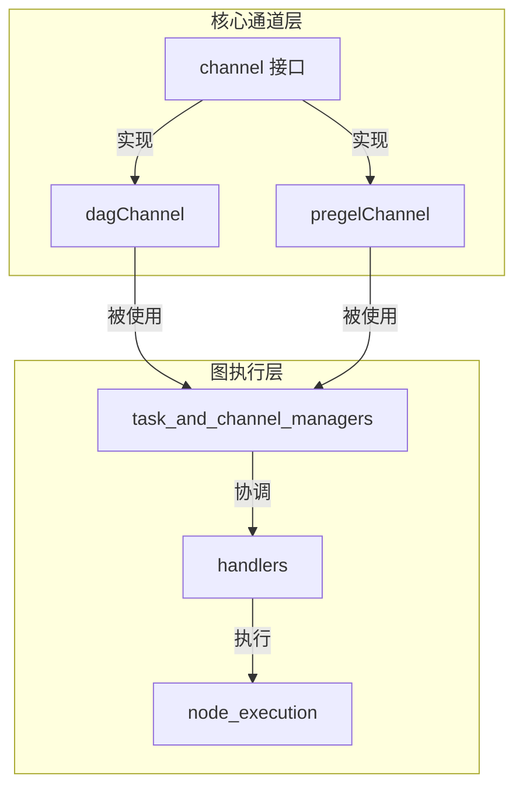

# core_channels 模块技术深度剖析

## 概述

`core_channels` 模块是 `compose_graph_engine` 中负责数据传输和协调的核心基础设施。它实现了两种不同的通道机制——`dagChannel` 和 `pregelChannel`，它们在图执行引擎中扮演着不同的协调角色。

本模块解决了在复杂图执行环境中节点间数据传递和依赖协调的问题。没有这些通道，图节点的执行将无法正确同步，数据流将变得混乱且不可预测。

## 核心问题

在图执行引擎中，节点之间需要满足两个基本需求：
1. **数据流传递**：上游节点的输出需要可靠地传递给下游节点作为输入
2. **执行协调**：下游节点需要知道何时上游节点已经完成执行，自己可以开始工作

不同的图执行模型对这两个需求有不同的侧重点：
- **DAG（有向无环图）** 模型强调严格的依赖关系，节点只有在所有上游依赖都满足后才能执行
- **Pregel** 模型强调迭代计算，节点可以在每个超级步（superstep）中自由交换消息

这就是为什么 `core_channels` 模块提供了两种通道实现——它们针对不同的执行模型进行了优化。

## 架构与数据流程

让我们通过 Mermaid 图来理解这两种通道的角色和关系：



### 数据流程

**dagChannel 的数据流程**：
1. **初始化**：通过 `dagChannelBuilder` 创建，接收控制依赖、数据依赖、零值函数和空流函数
2. **依赖报告**：上游节点完成时调用 `reportDependencies` 更新控制依赖状态
3. **数据报告**：上游节点输出时调用 `reportValues` 存储数据并更新数据依赖状态
4. **跳过处理**：上游节点被跳过时调用 `reportSkip` 处理跳过逻辑
5. **数据消费**：下游节点调用 `get` 获取数据，此时会检查所有依赖是否满足

**pregelChannel 的数据流程**：
1. **初始化**：通过 `pregelChannelBuilder` 创建
2. **数据报告**：节点通过 `reportValues` 发送消息
3. **数据消费**：节点通过 `get` 接收所有可用消息，然后清空通道

## 核心组件详解

### dagChannel

`dagChannel` 是为 DAG 执行模型设计的通道，它的核心职责是跟踪和协调节点间的依赖关系。

#### 核心字段
- `ControlPredecessors`: 跟踪控制依赖节点的状态（等待/就绪/跳过）
- `DataPredecessors`: 跟踪数据依赖节点是否已提供数据
- `Values`: 存储从上游节点接收的实际数据
- `Skipped`: 标记当前通道是否被跳过（当所有控制依赖都被跳过时）
- `mergeConfig`: 配置如何合并多个输入值

#### 关键方法

**`reportDependencies(dependencies []string)`**
这个方法用于通知通道某些控制依赖已经就绪。它不存储实际数据，只是更新依赖状态。这反映了 DAG 模型中控制流和数据流的分离——有些节点可能只是表示执行顺序，不传递数据。

**`reportValues(ins map[string]any) error`**
这个方法接收并存储上游节点的数据。它会同时更新 `DataPredecessors` 状态，标记对应的数据依赖已就绪。注意它只接收已声明的数据依赖，忽略其他输入。

**`reportSkip(keys []string) bool`**
处理上游节点被跳过的情况。这里有一个重要的设计：如果所有控制依赖都被跳过，那么当前通道也会被跳过。这确保了 DAG 中的条件分支可以正确传播跳过状态。

**`get(isStream bool, name string, edgeHandler *edgeHandlerManager) (any, bool, error)`**
这是 `dagChannel` 最复杂的方法。它的工作流程：
1. 检查是否被跳过
2. 验证所有依赖是否满足（控制依赖和数据依赖）
3. 如果满足，使用 `edgeHandler` 处理每个值
4. 根据值的数量决定是返回单个值还是合并多个值
5. 重置通道状态，为下一次执行做准备

注意这里的 "消费即重置" 设计——一旦 `get` 返回数据，通道就会清空并重置所有依赖状态。这确保了 DAG 的每个节点只执行一次。

### pregelChannel

`pregelChannel` 是为 Pregel 迭代计算模型设计的通道，它的设计要简单得多，因为它不需要跟踪复杂的依赖关系。

#### 核心字段
- `Values`: 存储所有收到的消息
- `mergeConfig`: 配置如何合并多个输入值

#### 关键方法

**`reportValues(ins map[string]any) error`**
简单地将输入存储到 `Values` 映射中，没有依赖检查，没有过滤。这反映了 Pregel 模型的自由通信特性——任何节点可以在任何时间向任何其他节点发送消息。

**`get(isStream bool, name string, edgeHandler *edgeHandlerManager) (any, bool, error)`**
返回所有可用消息，然后清空通道。这里没有依赖检查，只要有消息就返回。这符合 Pregel 模型中每个超级步收集所有消息然后处理的模式。

## 设计决策与权衡

### 1. 两种通道 vs 统一通道
**决策**：为 DAG 和 Pregel 模型分别实现专门的通道
**权衡**：
- ✅ 优点：每种通道都针对特定执行模型进行了优化，代码更清晰，性能更好
- ❌ 缺点：增加了代码复杂度，需要维护两套实现

这个决策是合理的，因为这两种执行模型的语义差异太大——DAG 强调依赖顺序，Pregel 强调迭代通信。强行统一只会导致两种场景都不优化。

### 2. 依赖状态机 vs 简单计数器
**决策**：`dagChannel` 使用状态机（`dependencyState`）跟踪每个依赖的状态，而不是简单的就绪计数器
**权衡**：
- ✅ 优点：可以区分"等待"、"就绪"和"跳过"三种状态，支持更复杂的 DAG 语义（如条件分支）
- ❌ 缺点：状态管理更复杂，内存开销略高

这个决策使得系统可以支持条件执行的 DAG，这是一个重要的功能特性。

### 3. 消费即重置
**决策**：`get` 方法在返回数据后立即重置通道状态
**权衡**：
- ✅ 优点：简化了生命周期管理，确保通道状态是自包含的
- ❌ 缺点：调用者必须小心处理返回的数据，因为通道不会保留历史

这个决策与图执行的一次通过（one-pass）特性相匹配——每个节点在单次执行中只应该消费一次输入。

### 4. 值合并策略
**决策**：通道负责合并多个输入值，而不是让调用者处理
**权衡**：
- ✅ 优点：统一了合并逻辑，简化了调用者代码
- ❌ 缺点：增加了通道的复杂度，合并策略可能不够灵活

这个决策通过 `mergeConfig` 和 `edgeHandler` 提供了一定的灵活性，平衡了统一性和可定制性。

## 使用模式与最佳实践

### dagChannel 使用场景

**典型用例**：
```go
// 创建一个有两个控制依赖和一个数据依赖的 dagChannel
ch := dagChannelBuilder(
    []string{"nodeA", "nodeB"},  // 控制依赖
    []string{"nodeC"},             // 数据依赖
    func() any { return 0 },       // 零值函数
    func() streamReader { return emptyStream{} },  // 空流函数
)

// 报告控制依赖就绪
ch.reportDependencies([]string{"nodeA"})
ch.reportDependencies([]string{"nodeB"})

// 报告数据依赖的值
ch.reportValues(map[string]any{"nodeC": 42})

// 获取最终值
value, ready, err := ch.get(false, "myNode", edgeHandler)
if ready {
    // 使用 value
}
```

**最佳实践**：
1. 控制依赖和数据依赖应该清晰分离——控制依赖影响执行顺序，数据依赖影响输入值
2. 如果节点可以有条件地执行，确保正确处理 `reportSkip`
3. 零值函数应该返回类型正确的零值，避免运行时类型错误

### pregelChannel 使用场景

**典型用例**：
```go
// 创建一个 pregelChannel
ch := pregelChannelBuilder(nil, nil, nil, nil)

// 超级步 1：收集消息
ch.reportValues(map[string]any{"node1": "hello"})
ch.reportValues(map[string]any{"node2": "world"})

// 超级步 1：处理消息
messages, ready, err := ch.get(false, "myNode", edgeHandler)
if ready {
    // 处理合并后的消息
}

// 超级步 2：发送新消息
ch.reportValues(map[string]any{"myNode": "response"})
```

**最佳实践**：
1. 每个超级步应该是一个完整的"收集-处理"周期
2. 记住 `get` 会清空通道，所以要确保在处理前收集完所有消息
3. 消息应该是可序列化的，因为 Pregel 模型通常涉及分布式执行

## 常见陷阱与注意事项

### 1. 忘记区分控制依赖和数据依赖
**问题**：在 `dagChannel` 中，如果你把应该是控制依赖的节点放在数据依赖列表中，或者反过来，会导致依赖永远无法满足。
**避免**：仔细思考每个上游节点是影响执行顺序（控制依赖）还是提供输入（数据依赖）。

### 2. 多次调用 get
**问题**：`get` 方法会重置通道状态，如果你在同一个执行周期中多次调用它，第二次调用将返回空结果。
**避免**：确保每个节点在每个执行周期只调用一次 `get`。

### 3. 不处理跳过状态
**问题**：如果你的图支持条件执行，但你没有正确处理 `Skipped` 状态，可能会导致下游节点意外执行或不执行。
**避免**：始终检查通道的 `Skipped` 状态，并确保 `reportSkip` 被正确调用。

### 4. 零值函数返回错误类型
**问题**：如果 `zeroValue` 函数返回的类型与实际期望的类型不匹配，可能会在运行时导致类型断言失败。
**避免**：确保零值函数的返回类型与通道实际传递的数据类型一致。

## 总结

`core_channels` 模块是图执行引擎的协调核心，它通过提供两种专门的通道实现——`dagChannel` 和 `pregelChannel`——满足了不同图执行模型的需求。

`dagChannel` 专注于依赖管理，使用状态机跟踪每个依赖的状态，支持复杂的 DAG 语义和条件执行。`pregelChannel` 专注于消息传递，简化设计以支持迭代计算模型。

这两种通道共享相似的接口，但内部实现差异很大，这反映了它们针对不同场景进行优化的设计理念。理解这些差异和设计权衡对于正确使用和扩展图执行引擎至关重要。
