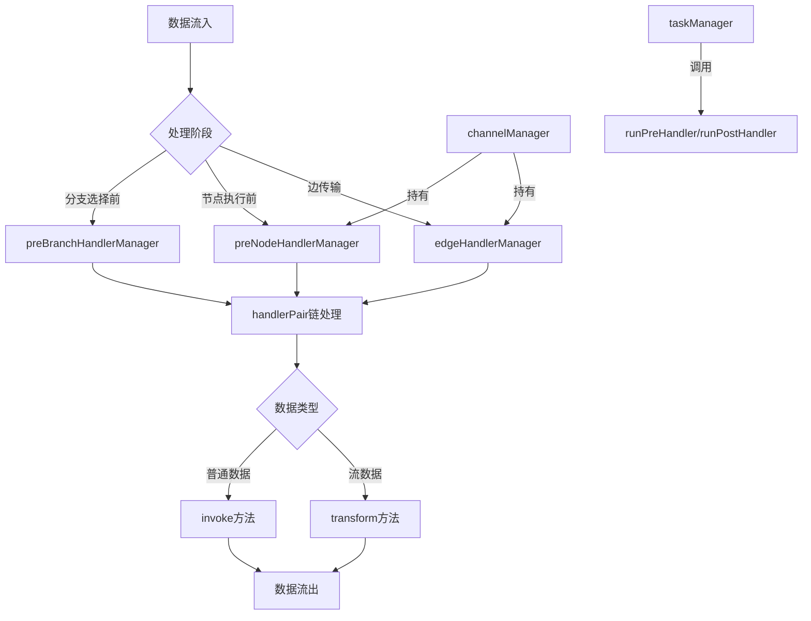

# Handlers 模块技术深度解析

## 1. 模块概述

**handlers** 模块是 compose 图形执行引擎中的核心拦截和转换层，负责在数据流通过图的不同阶段（节点执行前、边传输中、分支选择时）进行灵活处理。该模块解决的核心问题是：如何在不修改核心执行逻辑的情况下，为图执行提供可扩展的拦截和转换能力，从而实现诸如数据验证、日志记录、性能监控、错误处理等横切关注点。

想象一下，如果把图形执行引擎看作一条流水线，那么 handlers 就是流水线各个关键节点的质量检查站和改造站——它们可以检查、修改甚至拒绝正在流动的数据，而不会影响流水线本身的基本运转机制。

## 2. 核心架构与数据流

### 2.1 架构图



### 2.2 核心组件角色

1. **edgeHandlerManager**: 管理节点间边的处理器，负责在数据从一个节点流向另一个节点时进行处理
2. **preNodeHandlerManager**: 管理节点前置处理器，在数据进入节点执行前进行处理
3. **preBranchHandlerManager**: 管理分支前置处理器，在数据进入分支节点前进行处理
4. **channelManager**: 协调处理器与数据流通道的交互
5. **taskManager**: 负责任务执行前后处理器的调用

### 2.3 数据流转

数据在 handlers 模块中的流转路径如下：

1. **边处理流程**：当数据从节点 A 流向节点 B 时，首先通过 `channel.get()` 方法获取数据，然后调用 `edgeHandlerManager.handle(from, to, value, isStream)` 进行处理
2. **节点前置处理**：数据准备好进入节点执行前，通过 `channelManager.getFromReadyChannels()` 获取数据后，立即调用 `preNodeHandlerManager.handle(target, v, c.isStream)`
3. **分支处理**：在分支节点选择前，通过 `preBranchHandlerManager.handle(nodeKey, idx, value, isStream)` 对特定分支索引的数据进行处理
4. **任务级处理**：在 `taskManager.submit()` 中调用 `runPreHandler()`，在任务完成后调用 `runPostHandler()`

## 3. 核心组件深度解析

### 3.1 edgeHandlerManager

**设计意图**：提供节点间数据传输的拦截和转换能力，允许在数据从一个节点流向另一个节点时进行处理。

**内部结构**：
```go
type edgeHandlerManager struct {
    h map[string]map[string][]handlerPair
}
```
采用双层 map 结构：外层 key 是源节点，内层 key 是目标节点，值是处理器链。

**核心方法**：
```go
func (e *edgeHandlerManager) handle(from, to string, value any, isStream bool) (any, error)
```

**工作机制**：
- 检查是否存在从 `from` 到 `to` 的处理器链
- 根据数据类型（流/非流）选择不同的处理方式
- 依次应用处理器链中的每个处理器
- 对于流数据，使用 `transform` 方法；对于非流数据，使用 `invoke` 方法

**设计亮点**：
- 精确的边级粒度控制，可以为任意两个节点之间的数据流单独配置处理器
- 支持处理器链，允许组合多个处理逻辑
- 流数据和非流数据的统一处理接口

### 3.2 preNodeHandlerManager

**设计意图**：在节点执行前对输入数据进行统一处理，适用于需要在节点逻辑执行前进行的数据准备、验证或转换。

**内部结构**：
```go
type preNodeHandlerManager struct {
    h map[string][]handlerPair
}
```
单层 map 结构，key 是节点 key，值是该节点的前置处理器链。

**核心方法**：
```go
func (p *preNodeHandlerManager) handle(nodeKey string, value any, isStream bool) (any, error)
```

**工作机制**：
- 检查指定节点是否有前置处理器
- 依次应用处理器链
- 处理方式与 `edgeHandlerManager` 类似，区分流数据和非流数据

**设计亮点**：
- 节点级粒度的处理，为每个节点单独配置前置处理逻辑
- 与边处理器形成互补，边处理器处理节点间传输，节点处理器处理节点内准备

### 3.3 preBranchHandlerManager

**设计意图**：为分支节点的不同分支提供专门的前置处理能力，允许在选择分支前对数据进行针对特定分支的处理。

**内部结构**：
```go
type preBranchHandlerManager struct {
    h map[string][][]handlerPair
}
```
map 的 value 是二维切片，第一维是分支索引，第二维是该分支的处理器链。

**核心方法**：
```go
func (p *preBranchHandlerManager) handle(nodeKey string, idx int, value any, isStream bool) (any, error)
```

**工作机制**：
- 针对特定节点和特定分支索引查找处理器链
- 依次应用处理器链

**设计亮点**：
- 分支级粒度的精细控制，允许为同一分支节点的不同分支配置不同的处理器
- 支持动态分支选择场景下的数据准备

### 3.4 channelManager 中的处理器集成

**设计意图**：将处理器系统与数据流通道系统无缝集成，确保数据在正确的时机经过正确的处理。

**关键集成点**：
1. **`getFromReadyChannels` 方法**：
   ```go
   v, ready, err := ch.get(c.isStream, target, c.edgeHandlerManager)
   if ready {
       v, err = c.preNodeHandlerManager.handle(target, v, c.isStream)
       // ...
   }
   ```
   这里首先通过通道获取数据（通道内部会应用边处理器），然后应用节点前置处理器。

2. **`reportBranch` 方法**：处理分支跳过逻辑，确保分支处理器在正确的场景下被应用。

### 3.5 taskManager 中的处理器调用

**设计意图**：在任务执行层面提供额外的处理器调用点，与通道级处理器形成多层次处理体系。

**关键调用点**：
1. **`submit` 方法**：在任务提交前调用 `runPreHandler`
2. **`waitOne` 方法**：在任务成功完成后调用 `runPostHandler`

**处理器实现**：
```go
func runPreHandler(ta *task, runWrapper runnableCallWrapper) (err error) {
    // ... 省略 panic 恢复逻辑
    if ta.call.preProcessor != nil && !ta.skipPreHandler {
        nInput, err := runWrapper(ta.ctx, ta.call.preProcessor, ta.input, ta.option...)
        // ...
        ta.input = nInput
    }
    return nil
}
```

## 4. 依赖关系分析

### 4.1 模块依赖

handlers 模块依赖以下核心组件：
- **channel 接口**：提供数据传输的基础抽象
- **handlerPair**：（代码中未完全展示）推测是包含 `invoke` 和 `transform` 方法的处理器对
- **streamReader**：流数据处理的抽象接口
- **internal/safe**：提供 panic 安全处理
- **internal**：提供无界通道实现

### 4.2 被依赖关系

handlers 模块被以下组件依赖：
- **channelManager**：持有并协调各个处理器管理器
- **taskManager**：调用任务级前后处理器
- **graph 执行引擎核心**：通过 channelManager 和 taskManager 间接使用 handlers

### 4.3 数据契约

handlers 模块依赖以下关键数据契约：
1. **handlerPair 契约**：必须提供 `invoke(any) (any, error)` 和 `transform(streamReader) streamReader` 方法
2. **streamReader 契约**：流数据的读取、复制和关闭接口
3. **channel 契约**：与处理器交互的通道接口

## 5. 设计决策与权衡

### 5.1 多层级处理架构

**设计选择**：采用边处理、节点前置处理、分支处理、任务前后处理的多层级处理架构。

**权衡分析**：
- **优点**：
  - 提供了极高的灵活性，可以在数据流的多个关键点进行处理
  - 不同层级的处理器职责清晰，易于理解和维护
  - 可以组合使用不同层级的处理器，实现复杂的处理逻辑
- **缺点**：
  - 增加了系统的复杂性，理解完整的数据流需要考虑多个处理点
  - 多层处理可能带来一定的性能开销
  - 处理器之间的交互和顺序可能导致难以调试的问题

**为什么这样选择**：
这种设计反映了图形执行引擎的复杂性需求——在一个灵活的图执行系统中，用户可能需要在数据流动的任意点进行处理，多层级架构提供了这种灵活性。

### 5.2 处理器链模式

**设计选择**：每个处理点都支持处理器链，而不是单个处理器。

**权衡分析**：
- **优点**：
  - 符合单一职责原则，每个处理器可以专注于一个特定的处理逻辑
  - 处理器可以复用和组合，提高了代码的可维护性和可扩展性
- **缺点**：
  - 处理器链的顺序很重要，错误的顺序可能导致意外的行为
  - 调试时需要追踪整个处理器链，增加了调试难度

**为什么这样选择**：
处理器链模式是处理横切关注点的经典模式，特别适合这种需要灵活组合处理逻辑的场景。

### 5.3 流数据与非流数据的统一处理接口

**设计选择**：处理器同时支持流数据和非流数据的处理，通过 `isStream` 参数区分。

**权衡分析**：
- **优点**：
  - 统一的接口简化了使用，调用者不需要关心数据类型
  - 处理器可以同时支持两种数据类型，提高了代码复用
- **缺点**：
  - 处理器的实现变得更复杂，需要同时考虑两种数据类型
  - 流数据和非流数据的处理语义可能不同，统一接口可能隐藏这种差异

**为什么这样选择**：
图形执行引擎需要同时支持流处理和批处理场景，统一的处理接口可以避免两套独立的处理系统，降低了整体复杂度。

### 5.4 Map 结构的处理器存储

**设计选择**：使用多层 map 结构存储处理器，提供快速的查找能力。

**权衡分析**：
- **优点**：
  - 查找效率高，O(1) 时间复杂度
  - 结构清晰，易于理解
- **缺点**：
  - 内存占用可能较高，特别是对于大图
  - 没有内置的处理器顺序控制机制（除了链内顺序）

**为什么这样选择**：
在图形执行中，处理器的查找是高频操作，使用 map 结构可以确保这一操作的高效性，这对于性能敏感的执行引擎来说是至关重要的。

### 5.5 Panic 安全处理

**设计选择**：在处理器调用点都添加了 panic 恢复机制。

**权衡分析**：
- **优点**：
  - 提高了系统的健壮性，单个处理器的 panic 不会导致整个执行引擎崩溃
  - 提供了详细的 panic 信息，便于调试
- **缺点**：
  - 可能隐藏严重的错误，导致问题被延迟发现
  - 恢复机制本身有一定的性能开销

**为什么这样选择**：
在一个可扩展的系统中，无法保证所有用户自定义的处理器都是完美的，panic 恢复机制提供了必要的容错能力，确保系统的稳定性。

## 6. 使用指南与最佳实践

### 6.1 处理器注册

虽然代码中没有展示处理器注册的具体 API，但根据结构可以推测：

1. **边处理器注册**：
   ```go
   // 推测的 API
   edgeHandlerManager.AddHandler(fromNode, toNode, handler)
   ```

2. **节点前置处理器注册**：
   ```go
   // 推测的 API
   preNodeHandlerManager.AddHandler(nodeKey, handler)
   ```

3. **分支处理器注册**：
   ```go
   // 推测的 API
   preBranchHandlerManager.AddHandler(nodeKey, branchIdx, handler)
   ```

### 6.2 处理器实现

实现自定义处理器时需要考虑：

1. **同时支持流和非流数据**：如果处理器可能用于两种场景，需要同时实现 `invoke` 和 `transform` 方法
2. **错误处理**：处理器应该返回有意义的错误，而不是 panic
3. **不可变性**：尽量避免修改输入数据，而是返回新的数据副本
4. **性能考虑**：处理器是高频调用的，应该保持轻量和高效

### 6.3 最佳实践

1. **保持处理器简单**：每个处理器应该只做一件事，遵循单一职责原则
2. **注意处理器顺序**：处理器链的顺序很重要，确保逻辑上的正确性
3. **充分测试**：处理器可能在各种上下文中被调用，确保充分测试各种场景
4. **文档化**：为处理器提供清晰的文档，说明其用途、输入输出和副作用

## 7. 边缘情况与注意事项

### 7.1 流数据处理的特殊性

- 流数据处理器返回的是新的 `streamReader`，而不是修改原有的
- 流数据的处理是延迟的，实际处理发生在数据被读取时
- 确保正确关闭流，避免资源泄漏

### 7.2 错误传播

- 处理器的错误会立即终止处理链，并传播到调用者
- 边处理器的错误会导致数据传输失败
- 节点前置处理器的错误会导致节点执行失败

### 7.3 循环依赖

- 确保处理器不会引入数据处理的循环依赖
- 特别是在使用多个处理器链时，注意处理器之间的交互

### 7.4 性能考虑

- 处理器链越长，性能开销越大
- 流数据处理可能有更高的内存和性能开销
- 对于性能敏感的场景，考虑合并处理器或优化处理逻辑

### 7.5 并发安全

- 处理器可能在并发环境中被调用，确保处理器是并发安全的
- 避免在处理器中使用共享的可变状态

## 8. 总结

handlers 模块是 compose 图形执行引擎的关键组成部分，它提供了灵活、可扩展的数据处理机制。通过多层级的处理架构、处理器链模式和统一的流/非流处理接口，该模块解决了在不修改核心执行逻辑的情况下实现横切关注点的问题。

虽然这种设计带来了一定的复杂性，但它为图形执行引擎提供了强大的扩展能力，使得用户可以根据需要灵活地添加数据验证、日志记录、性能监控等功能。对于新加入团队的开发者来说，理解这个模块的设计思想和工作原理，将有助于更好地使用和扩展整个图形执行引擎。
