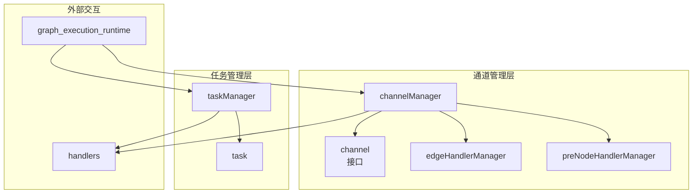

# Task and Channel Managers 技术深度解析

## 1. 模块概览与问题定位

**想象一下：** 你正在构建一个复杂的工作流引擎，需要协调多个节点的执行顺序，处理节点之间的数据传递，支持并行执行、条件分支、错误处理和任务取消。你会如何设计这样一个系统？

这正是 `task_and_channel_managers` 模块要解决的问题。在 [compose_graph_engine](compose_graph_engine.md) 中，它扮演着核心调度器的角色，负责：

- **数据协调**：通过通道机制管理节点间的数据流
- **任务调度**：控制节点的执行顺序和并发策略
- **依赖管理**：处理节点间的控制依赖和数据依赖
- **中断处理**：支持任务取消和超时控制

## 2. 核心抽象与心智模型

### 2.1 核心抽象

该模块建立在两个关键抽象之上：

1. **Channel（通道）**：节点间通信的媒介，负责：
   - 存储来自前驱节点的数据
   - 跟踪依赖关系的完成状态
   - 决定节点何时可以执行

2. **Task（任务）**：封装节点执行的上下文，包括：
   - 节点的输入输出
   - 执行上下文和选项
   - 预处理和后处理逻辑

### 2.2 心智模型

可以将这个系统想象成一个**工厂生产线**：

- **通道**是工作台上的零件盒，每个零件盒对应一个工位（节点）
- 只有当某个工位所需的所有零件（数据依赖）都准备好时，工人才能开始工作
- **任务管理器**是车间调度员，负责：
  - 分配任务给工人
  - 监控任务完成情况
  - 处理紧急情况（如任务取消）
  - 确保生产线按正确顺序运行

## 3. 架构与数据流



### 3.1 组件角色说明

1. **channelManager**：通道管理器
   - 维护所有节点的通道集合
   - 管理节点间的依赖关系图
   - 协调数据更新和就绪检查

2. **channel**：通道接口
   - 定义数据存储和检索的契约
   - 处理值合并和转换
   - 跟踪依赖完成状态

3. **taskManager**：任务管理器
   - 管理任务的提交和执行
   - 处理任务取消和超时
   - 支持同步和异步执行模式

4. **task**：任务结构
   - 封装节点执行的完整上下文
   - 跟踪执行状态和错误

5. **edgeHandlerManager** & **preNodeHandlerManager**：处理器管理器
   - 管理边和节点的处理器链
   - 处理数据转换和验证

### 3.2 关键数据流

#### 数据更新流程：
1. `graph_execution_runtime` 调用 `channelManager.updateValues()` 传入节点输出
2. `channelManager` 过滤有效数据并更新对应通道
3. 同时调用 `updateDependencies()` 更新控制依赖
4. 最后通过 `getFromReadyChannels()` 找出所有就绪节点

#### 任务执行流程：
1. 就绪节点被封装为 `task` 对象
2. `taskManager.submit()` 提交任务
3. 根据配置选择同步或异步执行
4. 任务完成后通过 `done` 通道发送结果
5. `taskManager.wait()` 收集完成的任务

## 4. 核心组件深度解析

### 4.1 channel 接口

```go
type channel interface {
    reportValues(map[string]any) error
    reportDependencies([]string)
    reportSkip([]string) bool
    get(bool, string, *edgeHandlerManager) (any, bool, error)
    convertValues(fn func(map[string]any) error) error
    load(channel) error
    setMergeConfig(FanInMergeConfig)
}
```

**设计意图**：
- `reportValues`：接收来自前驱节点的数据
- `reportDependencies`：报告控制依赖的完成
- `reportSkip`：处理节点被跳过的情况
- `get`：获取就绪的数据（如果所有依赖都满足）
- `convertValues`：转换存储的值
- `load`：从另一个通道加载状态（用于恢复）
- `setMergeConfig`：配置扇入合并策略

### 4.2 channelManager 结构体

```go
type channelManager struct {
    isStream bool
    channels map[string]channel

    successors          map[string][]string
    dataPredecessors    map[string]map[string]struct{}
    controlPredecessors map[string]map[string]struct{}

    edgeHandlerManager    *edgeHandlerManager
    preNodeHandlerManager *preNodeHandlerManager
}
```

**核心字段解析**：
- `isStream`：标识是否处于流模式
- `channels`：节点键到通道的映射
- `successors`：节点到其后继节点的映射
- `dataPredecessors`：节点的数据前驱节点集合
- `controlPredecessors`：节点的控制前驱节点集合
- `edgeHandlerManager`：管理边处理器
- `preNodeHandlerManager`：管理节点前处理器

**关键方法**：

1. **updateAndGet** - 核心协调方法
```go
func (c *channelManager) updateAndGet(ctx context.Context, values map[string]map[string]any, dependencies map[string][]string) (map[string]any, error)
```
这个方法是通道管理的核心，它：
- 首先更新所有通道的值
- 然后更新依赖关系
- 最后返回所有就绪的节点

**设计权衡**：
- 将更新和获取合并为一个方法，减少了状态不一致的窗口
- 但也意味着每次调用都要遍历所有通道，在大图中可能影响性能

2. **reportBranch** - 处理分支跳过
```go
func (c *channelManager) reportBranch(from string, skippedNodes []string) error
```
这个方法处理条件分支中未选择路径的节点跳过：
- 从被跳过的节点开始，递归标记其后继节点
- 使用广度优先搜索确保所有受影响的节点都被正确标记

### 4.3 task 结构体

```go
type task struct {
    ctx            context.Context
    nodeKey        string
    call           *chanCall
    input          any
    originalInput  any
    output         any
    option         []any
    err            error
    skipPreHandler bool
}
```

**设计意图**：
- `ctx`：执行上下文，用于传递取消信号等
- `nodeKey`：节点标识符
- `call`：包含实际要执行的动作和处理器
- `input`/`output`：输入输出数据
- `originalInput`：原始输入（用于重试或持久化）
- `err`：执行过程中的错误
- `skipPreHandler`：是否跳过前处理器

### 4.4 taskManager 结构体

```go
type taskManager struct {
    runWrapper runnableCallWrapper
    opts       []Option
    needAll    bool

    num          uint32
    done         *internal.UnboundedChan[*task]
    runningTasks map[string]*task

    cancelCh chan *time.Duration
    canceled bool
    deadline *time.Time

    persistRerunInput bool
}
```

**核心字段解析**：
- `runWrapper`：执行包装器，用于封装实际的节点执行
- `needAll`：是否需要等待所有任务完成（vs 只要有一个完成就继续）
- `num`：当前运行的任务数
- `done`：完成任务的通道
- `runningTasks`：正在运行的任务映射
- `cancelCh`：取消信号通道
- `persistRerunInput`：是否持久化输入用于重跑

**关键方法**：

1. **submit** - 任务提交
```go
func (t *taskManager) submit(tasks []*task) error
```
这个方法负责任务的提交和初始执行决策：

**设计亮点**：
- **同步执行优化**：当满足以下条件时，会同步执行一个任务：
  - 当前没有运行中的任务
  - 新任务是唯一的，或者设置了 `needAll`
  - 没有取消通道（即不支持中断）
  
  这种设计减少了 goroutine 调度开销，特别是在单任务场景下。

- **输入复制**：如果设置了 `persistRerunInput`，会复制输入流，一份用于执行，一份保存用于可能的重试。

2. **execute** - 任务执行
```go
func (t *taskManager) execute(currentTask *task)
```
这个方法封装了实际的任务执行逻辑：
- 使用 defer 确保 panic 被捕获并转换为错误
- 初始化节点回调
- 执行节点动作
- 通过 `done` 通道发送结果

3. **wait** - 等待任务完成
```go
func (t *taskManager) wait() (tasks []*task, canceled bool, canceledTasks []*task)
```
根据 `needAll` 配置，选择等待一个任务或所有任务：
- 如果 `needAll` 为 true，等待所有任务完成
- 否则，等待一个任务完成，但如果发生取消，则等待所有任务

**设计权衡**：
- `needAll` 模式简化了并行执行的协调，但可能降低吞吐量
- 非 `needAll` 模式可以更快地推进执行，但需要更复杂的状态管理

4. **receive** - 灵活的接收机制
```go
func (t *taskManager) receive(recv func() (*task, bool)) (ta *task, closed bool, canceled bool)
```
这个方法封装了复杂的接收逻辑，支持多种场景：
- 无取消的简单接收
- 带取消监听的接收
- 带截止时间的接收

## 5. 依赖分析

### 5.1 输入依赖

该模块依赖以下组件：

1. **internal.UnboundedChan**：无界通道实现，用于任务完成通知
2. **safe**：安全工具，用于 panic 处理
3. **handlers**：处理器接口（同一目录下）

### 5.2 输出依赖

该模块被以下组件使用：

1. **[graph_execution_runtime](compose_graph_engine-graph_execution_runtime.md)**：图执行运行时，是该模块的主要调用者
2. **[runtime_scheduling_channels_and_handlers](compose_graph_engine-graph_execution_runtime-runtime_scheduling_channels_and_handlers.md)**：运行时调度和通道处理

### 5.3 数据契约

**输入契约**：
- `values`：`map[string]map[string]any` - 目标节点到源节点到值的映射
- `dependencies`：`map[string][]string` - 目标节点到其依赖节点的映射

**输出契约**：
- 就绪节点：`map[string]any` - 节点键到其输入值的映射
- 完成任务：`[]*task` - 完成的任务列表

## 6. 设计决策与权衡

### 6.1 同步 vs 异步执行

**决策**：在 `taskManager.submit()` 中实现了条件同步执行

**原因**：
- 对于单任务场景，避免 goroutine 调度开销
- 对于不支持中断的场景，同步执行更简单
- 但在支持中断或多任务时，异步执行提供更好的响应性

**权衡**：
- ✅ 优点：在常见场景下性能更好
- ❌ 缺点：代码更复杂，需要维护两种执行路径

### 6.2 依赖分离：数据依赖 vs 控制依赖

**决策**：将依赖分为 `dataPredecessors` 和 `controlPredecessors`

**原因**：
- 数据依赖提供节点执行所需的输入
- 控制依赖只决定节点何时可以执行，不提供数据
- 分离两者可以更精确地控制执行流程

**权衡**：
- ✅ 优点：更灵活的依赖表达
- ❌ 缺点：增加了概念复杂度

### 6.3 通道状态管理

**决策**：每个节点有自己的通道，独立管理状态

**原因**：
- 封装性好，每个通道只关心自己的状态
- 便于实现复杂的依赖逻辑
- 支持恢复和重跑

**权衡**：
- ✅ 优点：模块化好，易于理解和测试
- ❌ 缺点：内存占用可能较高，特别是在大图中

### 6.4 处理器链设计

**决策**：使用 `edgeHandlerManager` 和 `preNodeHandlerManager` 管理处理器链

**原因**：
- 支持灵活的数据转换
- 可以在不修改核心逻辑的情况下扩展功能
- 处理器可以独立开发和测试

**权衡**：
- ✅ 优点：扩展性好，关注点分离
- ❌ 缺点：可能增加调用开销，调试更复杂

## 7. 使用指南与示例

### 7.1 基本使用模式

```go
// 创建通道管理器
cm := &channelManager{
    isStream: false,
    channels: make(map[string]channel),
    successors: make(map[string][]string),
    dataPredecessors: make(map[string]map[string]struct{}),
    controlPredecessors: make(map[string]map[string]struct{}),
    edgeHandlerManager: &edgeHandlerManager{h: make(map[string]map[string][]handlerPair)},
    preNodeHandlerManager: &preNodeHandlerManager{h: make(map[string][]handlerPair)},
}

// 创建任务管理器
tm := &taskManager{
    runWrapper: myRunWrapper,
    needAll: false,
    done: internal.NewUnboundedChan[*task](),
    runningTasks: make(map[string]*task),
}

// 更新通道并获取就绪节点
readyNodes, err := cm.updateAndGet(ctx, values, dependencies)
if err != nil {
    // 处理错误
}

// 创建并提交任务
tasks := make([]*task, 0, len(readyNodes))
for nodeKey, input := range readyNodes {
    tasks = append(tasks, &task{
        ctx: ctx,
        nodeKey: nodeKey,
        call: getChanCall(nodeKey),
        input: input,
    })
}
tm.submit(tasks)

// 等待任务完成
completedTasks, canceled, canceledTasks := tm.wait()
```

### 7.2 配置选项

**taskManager 配置**：
- `needAll`：设置为 true 时，等待所有任务完成；设置为 false 时，只要有一个任务完成就继续
- `persistRerunInput`：设置为 true 时，保存原始输入用于可能的重试
- `cancelCh`：提供此通道以支持任务取消

## 8. 边缘情况与陷阱

### 8.1 常见陷阱

1. **流处理中的资源泄漏**
   - 忘记关闭 `streamReader` 可能导致资源泄漏
   - 注意 `channelManager.updateValues()` 会关闭不属于数据依赖的流

2. **处理器链中的 panic**
   - 虽然有 panic 恢复机制，但最好在处理器中避免 panic
   - panic 会被转换为错误，但可能导致状态不一致

3. **并发访问问题**
   - `channelManager` 和 `taskManager` 不是线程安全的
   - 确保同一实例不会被多个 goroutine 同时访问

### 8.2 边缘情况

1. **循环依赖**
   - 模块不检测循环依赖，可能导致死锁
   - 在构建图时确保没有循环依赖

2. **空任务列表**
   - `taskManager.submit()` 可以处理空任务列表，但调用者应该避免这种情况
   - 空列表不会有任何副作用，但可能表示逻辑错误

3. **节点跳过传播**
   - `reportBranch()` 使用 BFS 传播跳过状态
   - 确保跳过的节点列表完整，否则可能导致部分节点永远无法执行

## 9. 总结

`task_and_channel_managers` 模块是 [compose_graph_engine](compose_graph_engine.md) 的核心调度组件，通过通道和任务两个抽象，优雅地解决了复杂工作流的协调问题。

其设计体现了几个关键原则：
- **关注点分离**：通道管理数据依赖，任务管理执行
- **灵活性**：支持多种执行模式和配置选项
- **健壮性**：处理 panic、取消和超时等边缘情况
- **性能优化**：条件同步执行等优化提高常见场景的性能

理解这个模块的设计思想和实现细节，对于有效地使用和扩展 compose_graph_engine 至关重要。
