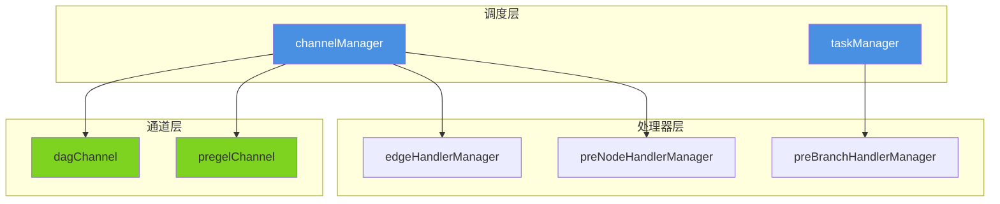

# runtime_scheduling_channels_and_handlers 模块技术深度解析

## 1. 模块概述

**runtime_scheduling_channels_and_handlers** 是 compose_graph_engine 的核心调度层，它解决了图计算引擎中两个最棘手的问题：

1. **如何正确管理节点间的依赖关系** — 确保节点只在所有依赖就绪后才执行，同时优雅处理分支跳过和控制流
2. **如何高效协调并发任务** — 管理节点执行、错误恢复、中断处理，以及任务间的数据传递

想象一下这个模块是**一个智能的流水线调度系统**：
- **通道 (channels)** 就像传送带，在节点间传递数据
- **管理器 (managers)** 就像车间主任，监督任务执行和资源分配
- **处理器 (handlers)** 就像质检站，在数据流经时进行转换和处理

## 2. 核心架构



### 2.1 架构层次说明

**调度层**是核心大脑：
- `channelManager` 负责数据流动和依赖管理
- `taskManager` 负责任务的提交、执行和等待

**通道层**是数据载体：
- `dagChannel` 实现严格依赖的 DAG 调度语义
- `pregelChannel` 实现宽松的消息传递语义

**处理器层**是数据转换器：
- `edgeHandlerManager` 处理边级别的数据转换
- `preNodeHandlerManager` 处理节点级别的前置转换
- `preBranchHandlerManager` 处理分支级别的转换

## 3. 核心组件深度解析

### 3.1 channel 接口 — 统一抽象

`channel` 是整个模块的核心接口，它定义了数据在图中流动的标准契约。

```go
type channel interface {
    reportValues(map[string]any) error              // 报告数据依赖的值
    reportDependencies([]string)                     // 报告控制依赖的完成
    reportSkip([]string) bool                        // 报告某些前驱被跳过
    get(bool, string, *edgeHandlerManager) (any, bool, error)  // 获取就绪的数据
    convertValues(fn func(map[string]any) error) error  // 转换内部存储的值
    load(channel) error                               // 从另一个通道加载状态
    setMergeConfig(FanInMergeConfig)                 // 设置多输入合并配置
}
```

**设计意图**：通过统一接口，我们可以支持不同的调度语义（DAG vs Pregel），而上层调度逻辑无需关心底层实现。

### 3.2 dagChannel — 严格依赖调度

`dagChannel` 实现了有向无环图的严格依赖语义，它是最常用的通道类型。

#### 内部结构

```go
type dagChannel struct {
    ControlPredecessors map[string]dependencyState  // 控制依赖及其状态
    DataPredecessors    map[string]bool             // 数据依赖及其就绪状态
    Values              map[string]any               // 存储的实际数据值
    Skipped             bool                         // 本通道是否被跳过
    // ... 其他字段
}
```

#### 工作原理

`dagChannel` 维护两类依赖：
1. **控制依赖**：必须等待前驱完成（无论成功或失败）
2. **数据依赖**：必须等待前驱提供数据

当所有依赖都满足时，`get()` 方法会：
1. 应用边处理器转换数据
2. 如果有多输入，执行合并逻辑
3. 重置依赖状态，为下一轮迭代做准备

**关键设计**：当所有控制依赖都被跳过时，该通道也会被标记为跳过，这实现了优雅的分支短路。

### 3.3 pregelChannel — 宽松消息传递

`pregelChannel` 实现了更宽松的 Pregel 计算模型语义。

#### 与 dagChannel 的区别

| 特性 | dagChannel | pregelChannel |
|------|------------|---------------|
| 依赖追踪 | ✅ 严格追踪控制和数据依赖 | ❌ 不追踪依赖 |
| 跳过传播 | ✅ 支持跳过传播 | ❌ 不支持跳过 |
| 获取条件 | 所有依赖就绪 | 有任何值 |
| 状态重置 | 每次获取后重置所有状态 | 仅清空值 |

**设计意图**：`pregelChannel` 适用于迭代计算场景，每个节点可以在每轮迭代中自由发送和接收消息，无需严格的依赖关系。

### 3.4 channelManager — 通道协调器

`channelManager` 是所有通道的统一管理者，它协调数据流动和依赖解析。

#### 核心职责

1. **更新通道值**：`updateValues()` 将节点输出路由到目标通道
2. **更新依赖状态**：`updateDependencies()` 通知通道某些节点已完成
3. **获取就绪数据**：`getFromReadyChannels()` 收集所有就绪通道的数据
4. **处理分支跳过**：`reportBranch()` 传播跳过状态到下游节点

#### 数据流动流程

```
节点输出 → updateValues() → 通道存储值
              ↓
节点完成 → updateDependencies() → 通道更新依赖状态
              ↓
getFromReadyChannels() → 检查哪些通道就绪 → 应用处理器 → 返回数据
```

**关键设计**：`channelManager` 在更新值时会过滤掉不相关的数据依赖，并关闭未使用的流，这防止了资源泄漏。

### 3.5 taskManager — 任务调度器

`taskManager` 负责任务的生命周期管理，包括提交、执行、等待和取消。

#### 核心特性

1. **智能同步执行**：如果只有一个任务且满足条件，会同步执行以避免 goroutine 开销
2. **灵活等待策略**：支持 `waitOne()`（等待任意一个完成）和 `waitAll()`（等待所有完成）
3. **中断支持**：可以取消正在运行的任务，并可选设置超时
4. **输入持久化**：为支持断点续跑，可以保存原始输入

#### 任务生命周期

```
submit() → 预处理 → 执行（同步或异步） → 后处理 → done 通道
              ↓
         wait() 等待结果
```

**关键优化**：`taskManager` 优先同步执行单个任务，这在常见的单流场景下减少了并发开销，同时在复杂场景下仍保持并行能力。

### 3.6 处理器管理器 — 数据转换链

三个处理器管理器负责在不同层次应用数据转换：

1. **edgeHandlerManager**：按 `(from, to)` 边对组织处理器
2. **preNodeHandlerManager**：按目标节点组织处理器
3. **preBranchHandlerManager**：按节点和分支索引组织处理器

**设计模式**：所有处理器都实现了相同的应用模式 — 依次调用每个处理器，形成转换链。如果是流数据，使用 `transform()`；如果是普通数据，使用 `invoke()`。

## 4. 依赖分析

### 4.1 模块依赖关系

**被依赖**：
- [graph_run_and_interrupt_execution_flow](compose_graph_engine-graph_execution_runtime-graph_run_and_interrupt_execution_flow.md) — 使用本模块进行实际的图执行调度
- [node_execution_and_runnable_abstractions](compose_graph_engine-graph_execution_runtime-node_execution_and_runnable_abstractions.md) — 提供可运行抽象的定义

**依赖**：
- [state_and_stream_reader_runtime_primitives](compose_graph_engine-graph_execution_runtime-state_and_stream_reader_runtime_primitives.md) — 提供流处理原语
- [internal_runtime_and_mocks](internal_runtime_and_mocks.md) — 提供内部工具和安全原语

### 4.2 数据契约

**输入契约**：
- 节点输出必须是键值对映射，键是源节点标识
- 依赖关系通过节点名称字符串标识
- 处理器必须能处理 `any` 类型的数据

**输出契约**：
- `getFromReadyChannels()` 返回就绪节点的输入数据
- 任务完成后通过 `done` 通道传递结果
- 错误通过 `task.err` 字段传递

## 5. 设计决策与权衡

### 5.1 通道抽象的选择

**决策**：使用统一的 `channel` 接口，支持多种实现

**权衡**：
- ✅ 灵活性：可以支持 DAG 和 Pregel 两种完全不同的语义
- ✅ 可扩展性：未来可以添加新的通道类型
- ❌ 复杂性：接口需要容纳不同实现的所有需求
- ❌ 开销：通过接口调用有轻微的性能损失

**为什么这样设计**：图计算引擎需要支持多种计算范式，统一抽象让上层调度逻辑无需关心底层语义差异。

### 5.2 同步执行优化

**决策**：在特定条件下同步执行单个任务

**权衡**：
- ✅ 性能：避免了 goroutine 调度开销
- ✅ 简单性：同步执行更容易调试和追踪
- ❌ 一致性：执行模式不一致可能导致意外行为
- ❌ 限制：当可能被中断时不能使用此优化

**为什么这样设计**：实际场景中大多数图是单流的，这个优化在保持通用性的同时显著提升了常见场景的性能。

### 5.3 处理器链模式

**决策**：使用简单的处理器链模式，而非更复杂的中间件模式

**权衡**：
- ✅ 简单：易于理解和实现
- ✅ 高效：没有复杂的上下文传递
- ❌ 限制：处理器之间不能直接通信
- ❌ 功能：不支持短路和异步处理

**为什么这样设计**：处理器的职责很简单（数据转换），不需要复杂的中间件能力，简单设计足够且更高效。

### 5.4 跳过传播机制

**决策**：在 `dagChannel` 中实现跳过状态的传播

**权衡**：
- ✅ 正确性：确保条件分支的正确语义
- ✅ 效率：被跳过的节点不会浪费资源
- ❌ 复杂性：增加了通道的状态管理复杂度
- ❌ 限制：只在 DAG 模式下支持

**为什么这样设计**：条件分支是工作流的核心需求，跳过传播是实现正确分支语义的关键。

## 6. 使用示例与最佳实践

### 6.1 创建通道

```go
// 创建 DAG 通道
ch := dagChannelBuilder(
    []string{"controlDep1", "controlDep2"},  // 控制依赖
    []string{"dataDep1", "dataDep2"},        // 数据依赖
    func() any { return struct{}{} },        // 零值工厂
    func() streamReader { return emptyStream{} },  // 空流工厂
)

// 创建 Pregel 通道
ch := pregelChannelBuilder(nil, nil, nil, nil)
```

### 6.2 使用 taskManager

```go
tm := &taskManager{
    runWrapper: myRunWrapper,
    needAll: false,  // 等待任意一个完成
    done: internal.NewUnboundedChan[*task](),
    runningTasks: make(map[string]*task),
}

// 提交任务
tm.submit([]*task{myTask})

// 等待结果
tasks, canceled, canceledTasks := tm.wait()
```

### 6.3 最佳实践

1. **选择合适的通道类型**：
   - 大多数工作流场景使用 `dagChannel`
   - 迭代计算或消息传递场景使用 `pregelChannel`

2. **合理设置 `needAll`**：
   - 如果需要所有节点都完成后再继续（如并行聚合），设置为 `true`
   - 如果可以处理部分完成（如条件分支），设置为 `false`

3. **注意资源管理**：
   - 确保所有流都被正确关闭
   - 在处理器中避免持有外部资源的引用

4. **错误处理**：
   - 检查 `task.err` 获取业务错误
   - 区分恐慌错误和普通错误（使用 `safe.IsPanicErr()`）

## 7. 边缘情况与陷阱

### 7.1 常见陷阱

1. **忘记检查 `ready` 返回值**
   ```go
   // 错误：不检查 ready 就使用值
   val, _, _ := ch.get(...)
   process(val)  // val 可能是 nil！
   
   // 正确：先检查 ready
   val, ready, _ := ch.get(...)
   if ready {
       process(val)
   }
   ```

2. **循环依赖导致死锁**
   - `dagChannel` 不检测循环依赖
   - 如果 A 依赖 B，B 又依赖 A，永远不会就绪

3. **处理器修改原始数据**
   - 处理器应该返回新数据，而不是修改输入
   - 修改输入可能导致其他节点看到意外的状态

### 7.2 边缘情况处理

1. **所有依赖都被跳过**
   - `dagChannel` 会正确标记自己为跳过
   - 跳过状态会传播到下游节点

2. **多输入合并**
   - 当有多个数据输入时，会根据 `FanInMergeConfig` 合并
   - 流合并特别注意配置 `StreamMergeWithSourceEOF`

3. **中断与超时**
   - 中断后任务可能仍在运行
   - 设置超时可以确保最终释放所有资源

## 8. 总结

**runtime_scheduling_channels_and_handlers** 是图计算引擎的心脏，它通过精心设计的抽象和机制，解决了图执行中的复杂问题：

- **通道抽象**统一了不同的调度语义
- **任务管理**平衡了性能和灵活性
- **处理器链**提供了可扩展的数据转换能力
- **跳过传播**实现了正确的条件分支语义

理解这个模块的关键是把握"依赖就绪触发执行"的核心思想，以及"管理器协调通道和任务"的架构模式。
