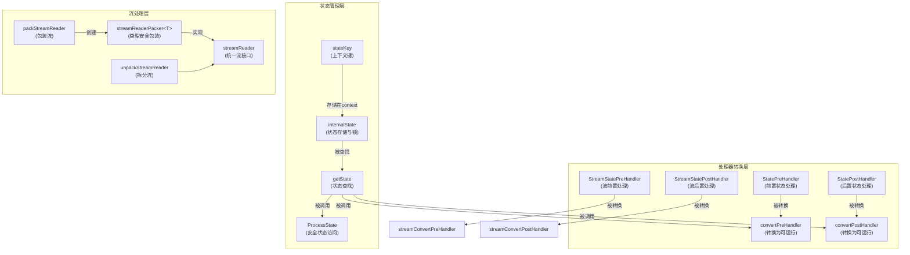

# state_and_stream_reader_runtime_primitives 模块深度解析

## 为什么需要这个模块？

在构建图执行引擎时，我们面临两个核心挑战：

1. **状态管理的复杂性**：在嵌套图结构中，节点需要安全地访问和修改状态，同时保持并发安全。如果没有统一的状态管理机制，开发者不得不手动处理互斥锁、状态传递和作用域问题，这会导致代码混乱且容易出错。

2. **流式数据的统一处理**：不同类型的流式数据需要复制、合并、转换等操作，但直接操作泛型流会导致大量重复代码和类型安全问题。我们需要一个类型擦除的封装层，让图引擎能够以统一的方式处理各种类型的流。

这个模块就是为了解决这两个问题而设计的——它为图执行引擎提供了**类型安全的状态管理**和**统一的流处理抽象**。

## 核心心智模型

### 状态管理：链式作用域的"储物柜系统"

把状态想象成一个**多层储物柜系统**：
- 每一层储物柜代表一个图的作用域（当前图或父图）
- 每个储物柜有自己的锁，保证并发安全
- 当你需要某个类型的物品（状态）时，会从当前层开始向上查找，直到找到为止
- 内层的同类型储物柜会"遮蔽"外层的，遵循词法作用域规则

`ProcessState` 就像是储物柜管理员：它帮你找到正确的储物柜，上锁，然后让你安全地操作里面的物品。

### 流处理：类型安全的"快递包装器"

`streamReader` 接口就像是一个**通用快递包装器**：
- 不管里面装的是什么类型的包裹（流数据），包装器都提供统一的操作方式（复制、合并、标记等）
- `streamReaderPacker` 是具体的包装盒，它知道里面装的是什么类型的物品
- 当需要具体操作时，可以通过 `unpackStreamReader` 拆包获取原始类型的流

这种设计让图引擎可以在不关心具体流类型的情况下处理流，同时保持类型安全。

## 架构概览

### 架构详解

这个模块由三个紧密协作的子系统组成：

1. **状态管理子系统**：
   - `stateKey`：作为 context 中的键，用于存储状态
   - `internalState`：实际存储状态的结构体，包含互斥锁和指向父状态的指针
   - `ProcessState` 和 `getState`：提供安全的状态访问机制

2. **流处理子系统**：
   - `streamReader` 接口：定义了流的统一操作
   - `streamReaderPacker<T>`：类型安全的流包装实现
   - `packStreamReader` / `unpackStreamReader`：流的包装和拆解工具

3. **处理器转换子系统**：
   - 各种处理器类型（`StatePreHandler`、`StreamStatePostHandler` 等）
   - 转换函数，将这些处理器转换为图引擎可执行的 `composableRunnable`

## 数据流程分析

### 状态访问流程

当一个节点需要访问状态时，数据流程如下：

1. 节点调用 `ProcessState[S]`，传入 context 和处理函数
2. `ProcessState` 调用 `getState[S]` 查找状态
3. `getState` 从 context 中取出 `internalState` 链表
4. 从当前层开始向上遍历，查找类型匹配的状态
5. 找到后返回状态和对应的互斥锁
6. `ProcessState` 加锁，执行处理函数，然后解锁

**关键点**：状态查找遵循词法作用域，内层状态遮蔽外层状态，每层有独立的锁。

### 流处理流程

当图引擎需要处理多个流时：

1. 各个类型的流通过 `packStreamReader` 包装为 `streamReader` 接口
2. 图引擎可以调用统一的方法如 `copy()`、`merge()`、`withKey()` 等
3. 当需要传递给具体节点时，通过 `unpackStreamReader[T]` 还原为类型安全的 `schema.StreamReader[T]`

**关键点**：类型擦除发生在包装层，图引擎不需要知道具体类型，但最终拆包时会恢复类型安全。

### 状态处理器执行流程

以 `StatePreHandler` 为例：

1. 用户定义 `StatePreHandler[I, S]` 函数
2. 调用 `convertPreHandler` 将其转换为 `composableRunnable`
3. 当节点执行时，转换后的函数会：
   - 调用 `getState[S]` 获取状态和锁
   - 加锁
   - 执行用户的处理器
   - 解锁
   - 返回处理后的输入

**关键点**：如果在流模式下使用非流处理器，系统会先读取所有流块合并为单个对象。

## 关键设计决策

### 1. 状态管理：链式作用域 vs 扁平映射

**选择**：链式作用域（通过 `internalState.parent` 实现）

**替代方案**：使用一个扁平化的 map，以类型为键存储所有状态

**权衡分析**：
- ✅ **支持嵌套图的词法作用域**：内层图可以遮蔽外层图的同类型状态
- ✅ **每层独立锁**：不同层级的状态访问互不阻塞，提高并发性能
- ❌ **状态查找时间 O(n)**：最坏情况下需要遍历整个状态链
- ❌ **不支持同层多个同类型状态**：这是有意的限制，简化了状态管理模型

**为什么适合**：在图执行引擎中，嵌套图的作用域隔离比同层多状态更重要，且状态链深度通常较浅。

### 2. 流处理：类型擦除包装器 vs 直接使用泛型

**选择**：类型擦除的 `streamReader` 接口 + `streamReaderPacker<T>` 实现

**替代方案**：在图引擎中直接使用泛型 `schema.StreamReader[T]`

**权衡分析**：
- ✅ **统一处理所有流类型**：图引擎不需要为每种流类型编写重复代码
- ✅ **保持最终类型安全**：通过 `unpackStreamReader` 在边界处恢复类型
- ✅ **支持运行时类型 introspection**：通过 `getType()` 和 `getChunkType()`
- ❌ **增加一层抽象**：有轻微的性能开销
- ❌ **拆包时可能失败**：如果类型不匹配会返回错误

**为什么适合**：图引擎需要处理多种流类型，统一抽象比重复代码更重要，且类型可以在编译时通过正确使用得到保证。

### 3. 状态访问：集中式 ProcessState vs 直接暴露锁

**选择**：集中式 `ProcessState` 函数，自动处理加锁解锁

**替代方案**：让用户直接获取锁和状态，手动管理并发

**权衡分析**：
- ✅ **难以误用**：用户无法忘记解锁，也无法在未加锁的情况下访问状态
- ✅ **API 简洁**：用户只需要传入处理函数
- ❌ **限制了锁的粒度**：整个处理函数期间都会持有锁
- ❌ **不支持跨函数持有锁**：无法在一个函数中加锁，在另一个函数中解锁

**为什么适合**：在图执行节点中，状态访问通常是短暂的、局部的，安全性比灵活性更重要。

### 4. 处理器设计：分离流和非流版本

**选择**：提供 `StatePreHandler` 和 `StreamStatePreHandler` 两套独立接口

**替代方案**：只提供流版本，非流情况通过适配器转换

**权衡分析**：
- ✅ **性能优化**：非流版本避免了流处理的开销
- ✅ **清晰的意图表达**：用户明确知道自己在处理流还是非流
- ❌ **API 表面积增加**：需要学习两套接口
- ❌ **转换逻辑复杂**：内部需要处理两种类型的转换

**为什么适合**：流和非流处理是两种常见模式，提供明确的分离可以让用户写出更清晰、更高效的代码。

## 新开发者注意事项

### 1. 状态类型必须唯一且匹配

**陷阱**：
- 如果在同一个作用域链中有多个相同类型的状态，只有最内层的可见
- 如果类型不匹配，`ProcessState` 会返回错误

**最佳实践**：
- 为每个图定义专用的状态类型，避免使用基本类型
- 如果需要嵌套图访问父状态，确保父状态类型是唯一的
- 在开发阶段尽早测试状态访问，捕获类型错误

### 2. 流处理器 vs 非流处理器的选择

**陷阱**：
- 如果在流模式下使用非流处理器（`StatePreHandler`），系统会读取所有流块合并为单个对象，这可能导致：
  - 内存占用过高（如果流很大）
  - 延迟增加（需要等待整个流结束）
  - 失去流式处理的优势

**最佳实践**：
- 明确知道输入是流时，使用 `StreamStatePreHandler` 和 `StreamStatePostHandler`
- 在处理器文档中说明是否支持流式处理
- 测试两种模式下的行为

### 3. ProcessState 中的锁持有时间

**陷阱**：
- `ProcessState` 会在整个处理函数执行期间持有锁
- 如果处理函数包含耗时操作（如 IO、网络请求），会阻塞其他需要访问同一状态的节点

**最佳实践**：
- 尽量缩短 `ProcessState` 处理函数的执行时间
- 只在处理函数中进行状态读写，将耗时操作移到外面
- 如果需要长时间操作，可以先从状态中复制需要的数据，解锁后再处理

### 4. 流包装器的类型安全

**陷阱**：
- `unpackStreamReader` 在类型不匹配时会返回 `(nil, false)`
- 如果忽略这个错误，会导致空指针引用或运行时 panic
- 对于接口类型，`unpackStreamReader` 会返回一个转换流，运行时才检查类型断言

**最佳实践**：
- 始终检查 `unpackStreamReader` 的返回值
- 在编译时确保类型一致性
- 对于接口类型，考虑在使用前进行类型断言检查

### 5. 嵌套图中的状态可见性

**陷阱**：
- 子图默认可以访问父图的状态
- 如果子图定义了同类型的状态，会遮蔽父图的状态
- 这种遮蔽是永久性的，无法在子图中再访问父图的同类型状态

**最佳实践**：
- 设计清晰的状态层次结构
- 避免在嵌套图中使用与父图相同的状态类型
- 如果需要共享状态，考虑使用包含关系而不是相同类型

## 与其他模块的关系

这个模块在整个系统中处于**底层基础设施**的位置：

- **被依赖**：[graph_execution_runtime](compose_graph_engine-graph_execution_runtime.md) 中的图执行引擎依赖这个模块来管理状态和处理流
- **依赖**：依赖 [schema_models_and_streams](schema_models_and_streams.md) 中的 `schema.StreamReader` 作为底层流抽象
- **协作**：与 [node_execution_and_runnable_abstractions](compose_graph_engine-graph_execution_runtime-node_execution_and_runnable_abstractions.md) 中的 `composableRunnable` 协作，将状态处理器转换为可执行单元

理解这个模块的关键是认识到它是图执行引擎的"隐形基础设施"——大多数用户不会直接使用它，但它支撑着整个图执行系统的状态管理和流处理能力。
