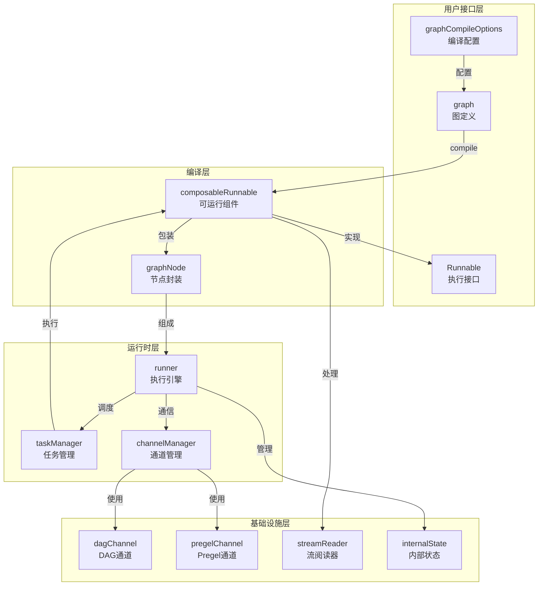

# Graph Execution Runtime 深度解析

## 概述

想象一下，你正在构建一个复杂的 AI 工作流：它需要将用户查询转换为嵌入向量、检索相关文档、调用语言模型生成回答，最后将结果格式化输出。这些步骤之间有依赖关系，有些可以并行执行，有些需要按顺序执行，你还希望能够在执行过程中暂停和恢复。

**Graph Execution Runtime** 就是为了解决这类问题而设计的。它是一个通用的图执行引擎，允许你以声明式的方式定义复杂的计算图，然后高效、可靠地执行它们。

这个模块的核心价值在于：
- **统一的抽象**：将不同类型的组件（模型、工具、自定义函数）统一为图中的节点
- **灵活的执行模式**：支持 DAG（有向无环图）和 Pregel（支持循环）两种执行模式
- **状态管理**：内置支持跨节点的状态传递和维护
- **中断与恢复**：支持在执行过程中暂停、检查点和恢复
- **流式处理**：原生支持流式输入输出，兼容实时场景

## 架构概览



这个架构的设计遵循了清晰的分层原则：

1. **用户接口层**：提供 `graph` 结构体让用户定义计算图，通过 `GraphCompileOptions` 配置编译行为，最终编译成实现 `Runnable` 接口的可执行对象。

2. **编译层**：负责将用户定义的图转换为可执行的形式。`graphNode` 封装了节点的元信息和执行逻辑，`composableRunnable` 则是对各种可执行组件的统一包装。

3. **运行时层**：是整个模块的核心。`runner` 协调整个执行流程，`taskManager` 管理任务的提交和等待，`channelManager` 处理节点间的通信和依赖关系。

4. **基础设施层**：提供底层支持。`dagChannel` 和 `pregelChannel` 实现了不同执行模式下的依赖跟踪，`streamReader` 处理流式数据，`internalState` 管理执行状态。

## 数据流详解

让我们通过一个具体的例子来追踪数据在 Graph Execution Runtime 中的流动过程：

### 示例场景

假设我们有一个简单的图：
```
START → "preprocess" → "transform" → "output" → END
```

### 数据流动过程

1. **初始化阶段**
   ```go
   // 用户调用 Invoke
   result, err := runnable.Invoke(ctx, "input data")
   
   // runner.run() 被调用
   // 初始化 channelManager 和 taskManager
   ```

2. **启动阶段**
   ```go
   // 计算初始任务
   nextTasks, result, isEnd, err := r.calculateNextTasks(
       ctx, 
       []*task{{nodeKey: START, call: r.inputChannels, output: input}},
       isStream, cm, optMap
   )
   
   // START 的输出被发送到 "preprocess" 的通道
   // "preprocess" 的通道报告值就绪
   // 创建执行 "preprocess" 的任务
   ```

3. **执行循环**
   ```go
   // 提交任务
   err = tm.submit(nextTasks)
   
   // 等待任务完成
   completedTasks, canceled, canceledTasks := tm.wait()
   
   // "preprocess" 完成后
   // 1. 它的输出被发送到 "transform" 的通道
   // 2. "transform" 的通道检查依赖是否就绪
   // 3. 如果就绪，创建执行 "transform" 的任务
   // 4. 循环继续...
   ```

4. **结束阶段**
   ```go
   // 当 "output" 完成后，它的输出被发送到 END 的通道
   // 当 calculateNextTasks() 发现 END 有值时
   if v, ok := nodeMap[END]; ok {
       return nil, v, true, nil  // isEnd = true
   }
   
   // 执行结束，返回结果
   ```

### 中断与恢复流程

如果在执行过程中发生中断：

1. **中断发生**
   ```go
   // 检测到中断条件
   if len(tempInfo.interruptBeforeNodes) > 0 {
       // 创建检查点
       cp := &checkpoint{
           Channels: channels,
           Inputs: make(map[string]any),
           // ...
       }
       
       // 抛出中断错误
       return &interruptError{Info: intInfo}
   }
   ```

2. **恢复执行**
   ```go
   // 用户使用检查点 ID 恢复
   result, err = runnable.Invoke(
       ctx, input,
       compose.WithCheckpointID(interruptID),
   )
   
   // 从存储加载检查点
   cp, err := getCheckPointFromStore(ctx, *checkPointID, r.checkPointer)
   
   // 恢复通道状态
   err = cm.loadChannels(cp.Channels)
   
   // 恢复任务
   nextTasks, err = r.restoreTasks(ctx, cp.Inputs, ...)
   
   // 继续执行...
   ```

## 核心设计决策

### 1. 双模式执行引擎：DAG vs Pregel

**问题**：不同的应用场景对图执行有不同的需求。有些场景是简单的数据流处理（如数据预处理管道），只需要无环图；而有些场景（如多轮对话、迭代优化）则需要支持循环。

**选择**：模块提供了两种执行模式：
- **DAG 模式**：适用于有向无环图，节点在所有前驱完成后触发（`AllPredecessor`）
- **Pregel 模式**：支持循环图，节点在任意前驱完成后即可触发（`AnyPredecessor`）

**权衡分析**：
- DAG 模式更容易理解和调试，执行顺序确定，无需担心无限循环
- Pregel 模式更灵活，能够表达更复杂的逻辑，但需要设置最大步数防止死循环
- 通过 `nodeTriggerMode` 配置选项统一切换，用户无需了解内部实现差异

**代码体现**：
```go
// 两种通道实现对应两种模式
func dagChannelBuilder(...) channel { /* ... */ }
func pregelChannelBuilder(...) channel { /* ... */ }

// 编译时根据配置选择
if (opt != nil && opt.nodeTriggerMode == AllPredecessor) || isWorkflow(g.cmp) {
    runType = runTypeDAG
    cb = dagChannelBuilder
} else {
    runType = runTypePregel
    cb = pregelChannelBuilder
}
```

### 2. 控制依赖与数据依赖分离

**问题**：在复杂的图中，有时我们需要表达"节点 B 必须在节点 A 之后执行，但不需要 A 的输出"这种关系。如果只用数据依赖，会导致不必要的数据传递和内存占用。

**选择**：将依赖分为两种类型：
- **控制依赖**：只规定执行顺序，不传递数据
- **数据依赖**：既规定执行顺序，又传递数据

**权衡分析**：
- 分离后，用户可以更精确地表达意图
- 减少不必要的数据拷贝，提高性能
- 但增加了用户的认知负担，需要理解两种依赖的区别

**代码体现**：
```go
type graph struct {
    // ...
    controlEdges map[string][]string  // 控制依赖边
    dataEdges    map[string][]string  // 数据依赖边
    // ...
}
```

### 3. Runnable 接口的四方法设计

**问题**：不同的组件有不同的执行方式——有些是同步的（输入→输出），有些是流式的（输入→流输出），有些需要从流中收集结果（流输入→输出），有些是纯流转换（流输入→流输出）。如何统一这些不同的执行模式？

**选择**：设计 `Runnable` 接口，包含四个方法：
- `Invoke`：同步执行，输入→输出
- `Stream`：流式输出，输入→流输出
- `Collect`：从流收集，流输入→输出
- `Transform`：流转换，流输入→流输出

**权衡分析**：
- 灵活性：组件可以只实现部分方法，运行时会自动适配
- 兼容性：用户可以用任意方式调用组件，系统会自动转换
- 复杂性：接口较庞大，内部需要实现方法间的自动转换逻辑

**代码体现**：
```go
type Runnable[I, O any] interface {
    Invoke(ctx context.Context, input I, opts ...Option) (output O, err error)
    Stream(ctx context.Context, input I, opts ...Option) (output *schema.StreamReader[O], err error)
    Collect(ctx context.Context, input *schema.StreamReader[I], opts ...Option) (output O, err error)
    Transform(ctx context.Context, input *schema.StreamReader[I], opts ...Option) (output *schema.StreamReader[O], err error)
}

// 自动转换逻辑示例
func invokeByStream[I, O, TOption any](s Stream[I, O, TOption]) Invoke[I, O, TOption] {
    return func(ctx context.Context, input I, opts ...TOption) (output O, err error) {
        sr, err := s(ctx, input, opts...)
        if err != nil {
            return output, err
        }
        return defaultImplConcatStreamReader(sr)
    }
}
```

### 4. 基于通道的依赖管理

**问题**：如何高效地跟踪节点的依赖状态，确定何时可以执行节点？

**选择**：使用通道（channel）抽象来管理每个节点的依赖状态。每个节点对应一个通道，通道负责：
- 跟踪哪些依赖已经完成
- 存储来自依赖的数据
- 决定节点是否可以执行
- 处理依赖被跳过的情况

**权衡分析**：
- 将依赖管理逻辑封装在通道中，使 runner 代码更简洁
- 不同的执行模式可以有不同的通道实现（dagChannel vs pregelChannel）
- 但通道之间有一些重复代码

**代码体现**：
```go
type channel interface {
    reportValues(map[string]any) error
    reportDependencies([]string)
    reportSkip([]string) bool
    get(bool, string, *edgeHandlerManager) (any, bool, error)
    // ...
}

// DAG 模式下的 get 实现
func (ch *dagChannel) get(isStream bool, name string, edgeHandler *edgeHandlerManager) (any, bool, error) {
    // 检查所有控制依赖是否就绪
    for _, state := range ch.ControlPredecessors {
        if state == dependencyStateWaiting {
            return nil, false, nil
        }
    }
    // 检查所有数据依赖是否就绪
    for _, ready := range ch.DataPredecessors {
        if !ready {
            return nil, false, nil
        }
    }
    // ... 合并数据并返回
}
```

### 5. 层次化状态管理

**问题**：在嵌套图（子图）场景下，如何让子图既能访问自己的状态，又能访问父图的状态？

**选择**：使用链表结构的 `internalState`，每个状态持有父状态的引用。查找状态时，从当前状态开始向上遍历，直到找到匹配类型的状态。

**权衡分析**：
- 支持自然的状态作用域：内层状态遮蔽外层状态
- 允许子图访问父图状态，实现灵活的数据共享
- 每个状态有自己的互斥锁，减少锁竞争
- 但类型匹配的查找方式可能导致意外的行为（如果有多个相同类型的状态）

**代码体现**：
```go
type internalState struct {
    state  any
    mu     sync.Mutex
    parent *internalState
}

func getState[S any](ctx context.Context) (S, *sync.Mutex, error) {
    state := ctx.Value(stateKey{}).(*internalState)
    for state != nil {
        if cState, ok := state.state.(S); ok {
            return cState, &state.mu, nil
        }
        state = state.parent  // 向上查找
    }
    // ... 错误处理
}
```

## 子模块概览

Graph Execution Runtime 模块由以下子模块组成：

- **[graph_definition_and_compile_configuration](compose_graph_engine-graph_execution_runtime-graph_definition_and_compile_configuration.md)**：负责图的定义和编译配置，包括 `graph` 结构体、`graphCompileOptions` 等核心组件。这是用户与系统交互的入口点，提供了构建图的 API 和配置选项。
- **[node_execution_and_runnable_abstractions](compose_graph_engine-graph_execution_runtime-node_execution_and_runnable_abstractions.md)**：定义了节点执行的抽象，包括 `graphNode`、`Runnable` 接口和 `composableRunnable` 等。这个子模块是系统的核心抽象层，统一了不同类型组件的执行方式。
- **[runtime_scheduling_channels_and_handlers](compose_graph_engine-graph_execution_runtime-runtime_scheduling_channels_and_handlers.md)**：运行时调度核心，包括 `taskManager`、`channelManager` 和各种 handler 管理器。这个子模块负责实际的调度逻辑，管理任务执行和节点间通信。
- **[graph_run_and_interrupt_execution_flow](compose_graph_engine-graph_execution_runtime-graph_run_and_interrupt_execution_flow.md)**：图执行和中断流程，包括 `runner` 结构体和中断/恢复逻辑。这是整个执行引擎的总指挥，协调整个图的执行流程。
- **[state_and_stream_reader_runtime_primitives](compose_graph_engine-graph_execution_runtime-state_and_stream_reader_runtime_primitives.md)**：状态管理和流处理原语，包括 `internalState` 和 `streamReader`。这个子模块提供了底层的基础设施支持。
- **[graph_introspection_and_compile_callbacks](compose_graph_engine-graph_execution_runtime-graph_introspection_and_compile_callbacks.md)**：图内省和编译回调，包括 `GraphInfo` 和 `GraphCompileCallback`。这个子模块提供了观察和扩展系统的钩子。

## 与其他模块的关系

Graph Execution Runtime 是 compose_graph_engine 的核心执行引擎，它与其他模块有密切的关系：

1. **[composition_api_and_workflow_primitives](../compose_graph_engine-composition_api_and_workflow_primitives.md)**：提供了构建图的高级 API，Graph Execution Runtime 负责执行这些 API 构建的图。

2. **[tool_node_execution_and_interrupt_control](../compose_graph_engine-tool_node_execution_and_interrupt_control.md)**：构建在 Graph Execution Runtime 之上，提供了工具节点的特定功能和中断控制。

3. **[checkpointing_and_rerun_persistence](../compose_graph_engine-checkpointing_and_rerun_persistence.md)**：依赖 Graph Execution Runtime 的检查点机制，提供持久化的中断和恢复功能。

## 关键使用示例

### 定义并执行一个简单的图

```go
// 创建图
g := compose.NewGraph[string, string](context.Background())

// 添加节点
g.AddLambdaNode("process", compose.InvokableLambda(
    func(ctx context.Context, input string) (string, error) {
        return "processed: " + input, nil
    }
))

// 添加边
g.AddEdge(compose.START, "process")
g.AddEdge("process", compose.END)

// 编译图
runnable, err := g.Compile(context.Background())
if err != nil {
    // 处理错误
}

// 执行图
result, err := runnable.Invoke(context.Background(), "hello")
// 结果: "processed: hello"
```

### 使用状态管理

```go
// 定义状态类型
type MyState struct {
    Count int
}

// 创建带状态的图
g := compose.NewGraphWithState[string, string, *MyState](
    context.Background(),
    func(ctx context.Context) *MyState {
        return &MyState{Count: 0}
    },
)

// 添加带状态处理的节点
g.AddLambdaNode("increment", compose.InvokableLambda(
    func(ctx context.Context, input string) (string, error) {
        // 安全地访问和修改状态
        err := compose.ProcessState[*MyState](ctx, func(ctx context.Context, state *MyState) error {
            state.Count++
            return nil
        })
        if err != nil {
            return "", err
        }
        return input, nil
    }
))

// 添加边并编译执行...
```

### 配置中断点

```go
// 编译时配置中断点
runnable, err := g.Compile(
    context.Background(),
    compose.WithInterruptBeforeNodes("critical_step"),
    compose.WithCheckpointStore(myCheckpointStore),
)

// 执行时会在 "critical_step" 前中断
result, err := runnable.Invoke(ctx, input)
if interruptErr, ok := err.(*compose.InterruptError); ok {
    // 保存中断 ID
    interruptID := interruptErr.Info.InterruptID
    
    // 稍后恢复执行
    result, err = runnable.Invoke(
        ctx, input,
        compose.WithCheckpointID(interruptID),
    )
}
```

## 新贡献者指南

### 常见陷阱

1. **忘记编译图**：图必须先编译才能执行，否则会 panic。
2. **类型不匹配**：图的输入输出类型、节点间的数据类型必须匹配，编译时会检查，但运行时也可能有问题。
3. **循环图忘记设置最大步数**：在 Pregel 模式下，如果有循环，必须设置 `WithMaxRunSteps`，否则可能无限执行。
4. **状态并发访问**：状态不是线程安全的，必须使用 `ProcessState` 来访问。
5. **流处理与状态处理器混用**：如果使用流处理，同时又有状态处理器，状态处理器会消耗整个流，可能导致性能问题。

### 调试技巧

1. **使用编译回调**：通过 `WithGraphCompileCallbacks` 可以在编译后获取 `GraphInfo`，查看图的结构是否符合预期。
2. **命名节点和图**：使用 `WithNodeName` 和 `WithGraphName` 给节点和图命名，便于调试和日志。
3. **检查依赖关系**：如果节点没有按预期执行，检查控制依赖和数据依赖是否正确设置。
4. **逐步构建图**：先构建简单的图，测试通过后再添加复杂的逻辑。

### 扩展点

1. **自定义 Channel**：可以通过实现 `channel` 接口来创建新的执行模式。
2. **自定义 Runnable**：通过实现 `Runnable` 接口或使用 `AnyLambda` 来创建自定义组件。
3. **编译回调**：使用 `GraphCompileCallback` 可以在编译后进行自定义处理，如验证、日志等。
4. **状态修饰符**：使用 `WithStateModifier` 可以在恢复时修改状态。
