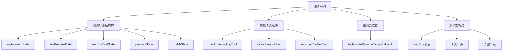

# `resume_test_harness` 模块深度解析

## 1. 概述

`resume_test_harness` 模块是 `compose_graph_engine` 测试套件中的关键组件，专门用于测试图执行引擎的中断与恢复机制。在构建可靠的工作流系统时，能够处理执行过程中的中断并从正确位置恢复是至关重要的功能。这个模块提供了一套全面的测试基础设施，用于验证中断状态保存、恢复上下文传递、嵌套图中断处理、复合中断等复杂场景。

想象一下，你正在构建一个自动化系统，它可能需要在执行过程中暂停以等待人工输入、处理外部依赖失败，或者因为资源限制而暂停。`resume_test_harness` 就是用来确保当这些情况发生时，系统能够正确地记住它在哪里停止、保存了什么状态，并在恢复时从正确的位置继续执行。

## 2. 核心概念与架构

### 2.1 核心抽象

这个模块围绕几个关键抽象构建：

- **中断状态（Interrupt State）**：在中断点保存的上下文信息，允许恢复时访问原始执行环境
- **恢复数据（Resume Data）**：恢复执行时提供的新输入或指令
- **中断上下文（Interrupt Context）**：描述中断位置、原因和层级关系的元数据
- **复合中断（Composite Interrupt）**：支持多个并行中断点的高级中断机制
- **地址路径（Address Path）**：用于精确定位图执行中具体中断位置的路径表示

### 2.2 架构组件



### 2.3 数据流向

1. **首次执行**：测试图启动 → 节点执行 → 检测到中断条件 → 调用 `StatefulInterrupt` → 保存状态与上下文 → 返回中断错误
2. **中断提取**：调用方使用 `ExtractInterruptInfo` 从错误中提取中断上下文 → 获取中断点信息
3. **恢复执行**：调用方使用 `ResumeWithData` 或 `Resume` 准备恢复上下文 → 重新调用图执行 → 引擎加载检查点 → 恢复到中断节点
4. **状态验证**：恢复的节点通过 `GetInterruptState` 和 `GetResumeContext` 验证状态与数据 → 继续执行

## 3. 核心组件深度解析

### 3.1 状态结构体

#### `myInterruptState`
```go
type myInterruptState struct {
    OriginalInput string
}
```
这是一个简单的中断状态结构体，用于保存中断时的原始输入。它的作用是在恢复时让节点能够访问首次执行时的上下文信息。

#### `myResumeData`
```go
type myResumeData struct {
    Message string
}
```
恢复数据结构体，用于在恢复执行时传递新的信息或指令给中断节点。

#### `resumeTestState`
```go
type resumeTestState struct {
    OnStartCalledOnResume bool `json:"on_start_called_on_resume"`
    Counter               int  `json:"counter"`
}
```
这个结构体专门用于测试状态处理在恢复过程中的行为，特别是 `OnStart` 回调中的状态操作。注意它使用了 JSON 标签，这是因为状态需要被序列化和反序列化到检查点存储中。

#### `processState` 和 `batchState`
```go
type processState struct {
    Step int
}

type batchState struct {
    ProcessStates map[string]*processState
    Results       map[string]string
}
```
这两个结构体用于支持复合中断测试。`batchState` 实现了 `CompositeInterruptState` 接口，允许管理多个并行子进程的状态。

### 3.2 模拟工具组件

#### `mockInterruptingTool`
这个工具是测试嵌套工具中断的核心组件。它的 `InvokableRun` 方法实现了以下逻辑：
1. 首次调用时，使用 `tool.StatefulInterrupt` 中断执行并保存状态
2. 恢复调用时，验证中断状态和恢复数据，然后返回成功结果

这种设计模拟了真实世界中可能需要暂停等待外部输入的工具。

#### `mockReentryTool`
这是一个更复杂的模拟工具，专门用于测试工具的"重入"行为。它的关键特性包括：
1. 跟踪每个工具调用 ID 是否是恢复目标
2. 区分首次调用、恢复调用和新调用
3. 验证重入调用的上下文隔离性

这个工具的设计反映了实际 ReAct 模式中可能出现的情况：同一个工具可能在同一次执行流程中被多次调用，有些是恢复的，有些是全新的。

#### `wrapperToolForTest`
这个工具包装了一个嵌套图，用于测试工具作为复合节点的场景。它的关键行为是：
1. 跟踪自身是否是恢复目标
2. 调用内部图
3. 如果内部图中断，使用 `tool.CompositeInterrupt` 将中断传播出去

这种设计模拟了工具内部可能包含复杂逻辑甚至子工作流的场景。

### 3.3 回调处理器

#### `toolsNodeResumeTargetCallback`
这个回调处理器用于监控工具节点在恢复过程中的行为。它的核心逻辑在 `OnStart` 方法中：
```go
func (c *toolsNodeResumeTargetCallback) OnStart(ctx context.Context, info *callbacks.RunInfo, _ callbacks.CallbackInput) context.Context {
    if info.Component == ComponentOfToolsNode {
        isResumeTarget, _, _ := GetResumeContext[any](ctx)
        c.mu.Lock()
        c.isResumeTargetLog = append(c.isResumeTargetLog, isResumeTarget)
        c.mu.Unlock()
    }
    return ctx
}
```

这个回调的设计允许测试验证工具节点是否正确识别自己是否是恢复目标，特别是在处理多个工具调用的复杂场景中。

## 4. 测试场景解析

### 4.1 根图中断与恢复 (`TestInterruptStateAndResumeForRootGraph`)

这个测试验证了最基本的中断与恢复场景：
1. 创建一个包含 Lambda 节点的图
2. Lambda 节点在首次执行时中断并保存状态
3. 验证中断信息被正确提取
4. 使用恢复数据恢复执行
5. 验证 Lambda 节点能够正确访问中断状态和恢复数据

这个测试的设计反映了最简单的中断恢复模式，是理解更复杂场景的基础。

### 4.2 恢复过程中的状态处理 (`TestProcessStateInOnStartDuringResume`)

这个测试关注一个更微妙但关键的场景：在恢复过程中，图的 `OnStart` 回调中是否可以正确处理状态。这对于需要在恢复时进行初始化或状态调整的场景非常重要。

测试的关键 insight 是：状态处理不仅在节点执行期间可用，在回调中也应该可用，这确保了图执行的一致性。

### 4.3 子图中断与恢复 (`TestInterruptStateAndResumeForSubGraph`)

这个测试将中断恢复的场景扩展到了子图。关键验证点是：
1. 中断地址正确包含子图的路径
2. 恢复时能够正确定位到子图中的节点
3. 状态和恢复数据能够正确传递到子图节点

这反映了真实世界中复杂工作流通常由多层子图组成的情况。

### 4.4 嵌套子图中的工具中断 (`TestInterruptStateAndResumeForToolInNestedSubGraph`)

这是一个更复杂的集成测试，验证了：
1. 多层嵌套子图中的工具中断
2. 中断上下文的层级关系（根原因与父节点）
3. 工具节点中的中断状态和恢复数据处理

这个测试的设计反映了真实世界中最复杂的工作流结构，确保了中断恢复机制在各种嵌套场景下的健壮性。

### 4.5 多中断与恢复 (`TestMultipleInterruptsAndResumes`)

这个测试引入了复合中断的概念，验证了：
1. 单个节点可以产生多个并行中断点
2. 复合中断状态的管理
3. 选择性恢复部分中断点
4. 带数据和不带数据的恢复

这个测试的设计反映了批处理或并行工作流的场景，其中多个子任务可能同时需要中断和恢复。

### 4.6 恢复工具的重入 (`TestReentryForResumedTools`)

这个测试针对 ReAct 模式中的一个特殊场景：恢复执行后，模型可能会再次调用同一个工具。关键验证点是：
1. 新的工具调用不会被错误地标记为"已中断"
2. 恢复的工具调用和新的工具调用有清晰的上下文隔离
3. 工具节点能够正确处理混合的恢复和新调用

这是一个非常细致的测试，反映了实际 AI 代理工作流中可能出现的复杂交互模式。

### 4.7 Lambda 中的图中断 (`TestGraphInterruptWithinLambda`)

这个测试验证了一个高级场景：在 Lambda 节点内部调用另一个图，并且内部图发生中断。关键验证点是：
1. Lambda 节点能够正确提取内部图的中断信息
2. 使用 `CompositeInterrupt` 正确传播中断
3. 中断地址包含完整的路径（包括外部图、Lambda 节点、内部图等）
4. 恢复时能够正确穿透多层结构

这个测试的设计反映了模块化工作流的场景，其中复杂逻辑被封装在可重用的图中，然后在更高层级的工作流中使用。

### 4.8 传统中断 (`TestLegacyInterrupt`)

这个测试确保了与旧版中断 API 的兼容性。它验证了：
1. 传统的 `InterruptAndRerun` 和 `NewInterruptAndRerunErr` 仍然可以工作
2. 使用 `WrapInterruptAndRerunIfNeeded` 可以给传统中断添加地址信息
3. 传统中断可以与现代中断一起在复合中断中使用

这个测试的存在反映了框架的演进过程，以及对向后兼容性的重视。

### 4.9 嵌套图中断的工具复合中断 (`TestToolCompositeInterruptWithNestedGraphInterrupt`)

这个测试将多个概念结合在一起：工具作为复合节点、内部嵌套图、中断传播。关键验证点是：
1. 工具内部的图中断可以正确传播到外部
2. 工具作为复合节点在中断层次结构中有正确的表示
3. 恢复时工具和内部图都能正确识别自己是否是恢复目标

## 5. 设计决策与权衡

### 5.1 状态序列化与类型注册

**决策**：使用 `schema.Register` 和 `schema.RegisterName` 注册状态类型。

**原因**：状态需要被序列化到检查点存储中，然后在恢复时反序列化。注册类型允许序列化引擎正确处理自定义类型。

**权衡**：这增加了使用的复杂性（需要记得注册类型），但提供了类型安全和灵活性。

### 5.2 地址路径系统

**决策**：使用分段的地址路径来定位中断点，格式如 `runnable:root;node:batch;process:p0`。

**原因**：这种设计允许精确定位到图执行中的任何位置，包括嵌套子图和工具调用。它也支持构建中断上下文的层级关系。

**权衡**：地址路径的解析和构建增加了一定的复杂性，但提供了强大的定位能力和可扩展性。

### 5.3 复合中断模式

**决策**：引入 `CompositeInterrupt` 来支持多个并行中断点。

**原因**：在批处理或并行工作流中，可能有多个子任务同时需要中断。复合中断允许将这些中断点收集在一起，呈现给用户。

**权衡**：这增加了中断处理的复杂性，但支持了更丰富的工作流模式。

### 5.4 中断与恢复的上下文传递

**决策**：使用 context 来传递中断状态和恢复数据。

**原因**：Context 是 Go 中传递请求范围数据的标准方式，它自然地与图执行的流程结合在一起。

**权衡**：依赖 context 使得 API 更加简洁，但也意味着状态和数据不是显式可见的，可能导致误用。

### 5.5 测试基础设施的可重用性

**决策**：构建一套可重用的测试组件（模拟工具、状态结构体、回调）。

**原因**：中断与恢复的测试场景非常多样化，但它们共享许多共同的元素。可重用的组件减少了代码重复，使测试更加一致和可维护。

**权衡**：这增加了初始设计和实现的时间，但从长远来看提高了测试开发的效率。

## 6. 使用指南与最佳实践

### 6.1 如何测试中断与恢复

1. **定义状态和数据类型**：创建保存中断状态和恢复数据的结构体，并注册它们。
2. **构建测试图**：创建包含会中断的节点的图。
3. **首次执行并验证中断**：调用图执行，验证它返回中断错误，并检查中断信息。
4. **恢复执行并验证结果**：使用恢复数据准备上下文，再次调用图执行，验证结果正确。

### 6.2 常见模式

#### 基本中断模式
```go
// 在节点中
wasInterrupted, hasState, state := GetInterruptState[*MyState](ctx)
if !wasInterrupted {
    return "", StatefulInterrupt(ctx, info, &MyState{...})
}
// 处理恢复逻辑
```

#### 复合中断模式
```go
// 在复合节点中
var errs []error
for _, subTask := range subTasks {
    subCtx := AppendAddressSegment(ctx, "segment", id)
    res, err := subTask(subCtx)
    if err != nil {
        errs = append(errs, err)
    }
}
if len(errs) > 0 {
    return "", CompositeInterrupt(ctx, info, state, errs...)
}
```

### 6.3 陷阱与注意事项

1. **忘记注册类型**：如果状态类型没有注册，序列化会失败。始终记得在 `init` 函数中注册类型。
2. **地址路径错误**：在构建复合中断时，确保正确使用 `AppendAddressSegment` 来构建地址路径，否则恢复时无法定位到正确的位置。
3. **状态可变性**：状态应该是可序列化的，避免包含不可序列化的字段（如函数、通道）。
4. **恢复上下文隔离**：确保新的调用不会错误地继承恢复上下文，特别是在 ReAct 循环中。
5. **检查点存储配置**：测试时必须配置检查点存储，否则中断与恢复无法工作。

## 7. 依赖关系与集成

`resume_test_harness` 模块与以下模块紧密集成：

- [graph_execution_runtime](compose_graph_engine-graph_execution_runtime.md)：提供中断与恢复的核心机制
- [tool_node_execution_and_interrupt_control](compose_graph_engine-tool_node_execution_and_interrupt_control.md)：提供工具节点的中断支持
- [checkpointing_and_rerun_persistence](compose_graph_engine-checkpointing_and_rerun_persistence.md)：提供检查点存储功能

这些模块共同构成了完整的中断与恢复系统，`resume_test_harness` 则负责验证这个系统在各种场景下的正确性。

## 8. 总结

`resume_test_harness` 模块是一个全面的测试基础设施，用于验证图执行引擎的中断与恢复机制。它通过精心设计的测试组件和多样化的测试场景，确保了中断状态保存、恢复上下文传递、嵌套图中断处理、复合中断等功能在各种复杂情况下都能正确工作。

这个模块不仅是一组测试，更是中断与恢复机制的"活文档"，展示了如何在实际场景中使用这些功能，以及应该注意哪些边界情况和陷阱。对于构建可靠的工作流系统来说，这种测试基础设施是不可或缺的。
