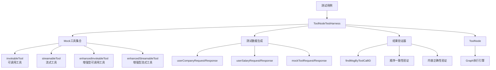

# Tool Node Test Harness 模块技术深潜

## 1. 问题背景与模块定位

在构建基于图的工具执行系统时，我们需要一个可靠的方式来测试 `ToolNode` 的各种功能特性。`ToolNode` 作为连接 AI 模型和实际工具执行的桥梁，其正确性和健壮性直接影响整个系统的可靠性。

**主要问题：**
- 如何验证 `ToolNode` 正确处理多种工具类型（可调用工具、流式工具）？
- 如何确保工具调用顺序的一致性？
- 如何测试工具中断和重跑机制？
- 如何验证工具中间件的正确应用？
- 如何测试未知工具的处理逻辑？

`tool_node_test_harness` 模块就是为了解决这些问题而设计的，它提供了一套完整的测试基础设施，包含模拟工具、测试数据和验证逻辑，用于全面测试 `ToolNode` 的各项功能。

## 2. 核心概念与心智模型

可以将 `tool_node_test_harness` 看作是 `ToolNode` 的"测试实验室"，它包含了：

1. **模拟工具库**：提供各种类型的模拟工具（可调用工具、流式工具、增强型工具）
2. **测试数据生成器**：创建标准化的工具调用请求和响应
3. **验证框架**：检查工具执行结果的正确性
4. **场景模拟器**：模拟各种边界情况和错误条件

**关键抽象：**
- **Mock Tool**：模拟真实工具行为的测试替身
- **Tool Call 序列**：模拟模型生成的工具调用请求
- **结果验证器**：检查工具执行输出是否符合预期

## 3. 系统架构与数据流程

让我们通过一个架构图来理解这个模块的组成和工作方式：



### 数据流程详解

1. **测试初始化阶段**：
   - 测试用例创建 `ToolNodeTestHarness` 实例
   - 配置模拟工具集合（可调用工具、流式工具等）
   - 设置测试数据和预期结果

2. **工具调用执行阶段**：
   - 测试用例构造包含工具调用的输入消息
   - 将输入传递给 `ToolNode` 进行处理
   - `ToolNode` 根据工具类型选择适当的执行路径

3. **结果验证阶段**：
   - 收集 `ToolNode` 的执行结果
   - 使用结果验证器检查输出的正确性
   - 验证工具调用顺序、内容格式等

## 4. 核心组件详解

### 4.1 模拟工具实现

#### invokableTool - 泛型可调用工具包装器

```go
type invokableTool[I, O any] struct {
    info *schema.ToolInfo
    fn   func(ctx context.Context, in I) (O, error)
}
```

**设计意图**：提供一个类型安全的通用工具包装器，允许开发者将普通函数转换为符合 `tool.InvokableTool` 接口的工具。它处理 JSON 序列化/反序列化的细节，让工具开发者专注于业务逻辑。

**工作原理**：
1. 接收 JSON 格式的输入参数
2. 使用泛型机制反序列化为指定类型 `I`
3. 调用用户提供的处理函数 `fn`
4. 将结果 `O` 序列化为 JSON 字符串返回

#### streamableTool - 泛型流式工具包装器

```go
type streamableTool[I, O any] struct {
    info *schema.ToolInfo
    fn   func(ctx context.Context, in I) (*schema.StreamReader[O], error)
}
```

**设计意图**：类似 `invokableTool`，但专为流式输出工具设计。它处理流式数据的转换和传播，同时保持类型安全。

**关键特性**：
- 使用 `schema.StreamReader` 处理流式数据
- 自动将每个流式数据项序列化为 JSON
- 保持流式处理的延迟特性

#### enhancedInvokableTool / enhancedStreamableTool - 增强型工具

```go
type enhancedInvokableTool struct {
    info *schema.ToolInfo
    fn   func(ctx context.Context, input *schema.ToolArgument) (*schema.ToolResult, error)
}
```

**设计意图**：提供更灵活的工具接口，支持结构化的工具参数和结果，而不仅仅是 JSON 字符串。这允许工具处理更复杂的输入输出格式，如多部分内容。

**与普通工具的区别**：
- 接收 `*schema.ToolArgument` 而不是 JSON 字符串
- 返回 `*schema.ToolResult` 而不是 JSON 字符串
- 支持多部分输出（文本、图像等）

### 4.2 测试辅助函数

#### newTool / newStreamableTool

```go
func newTool[I, O any](info *schema.ToolInfo, f func(ctx context.Context, in I) (O, error)) tool.InvokableTool
```

**设计意图**：提供便捷的工厂函数，简化模拟工具的创建过程。这些函数封装了泛型类型的复杂性，让测试代码更加简洁。

#### findMsgByToolCallID

```go
func findMsgByToolCallID(msgs []*schema.Message, toolCallID string) *schema.Message
```

**设计意图**：在测试验证阶段，快速定位特定工具调用的结果消息。这对于验证多个工具调用的场景特别有用。

### 4.3 模拟工具实例

#### userCompanyTool / userSalaryTool

这两个工具用于测试基本的工具调用功能：
- `userCompanyTool`：查询用户公司信息，返回一次性结果
- `userSalaryTool`：查询用户薪资信息，返回流式结果

**设计意图**：模拟真实世界中常见的工具类型，测试 `ToolNode` 对不同工具类型的处理能力。

#### mockTool

```go
type mockTool struct{}
```

**设计意图**：一个通用的模拟工具，用于测试工具选项的传递和处理。它支持自定义选项（如 `WithAge`），并在响应中回显这些选项的值。

#### myTool1 / myTool2 / myTool3 / myTool4

这些工具专门用于测试高级功能：
- `myTool1`：测试可调用工具的中断和重跑机制
- `myTool2`：测试流式工具的中断和重跑机制
- `myTool3`/`myTool4`：验证工具只执行一次（避免重复执行）

### 4.4 mockIntentChatModel

```go
type mockIntentChatModel struct{}
```

**设计意图**：模拟一个能够生成工具调用意图的聊天模型。它在测试中扮演"工具调用发起者"的角色，生成包含预定义工具调用的消息。

**关键功能**：
- `Generate`：生成包含工具调用的完整消息
- `Stream`：流式生成工具调用消息
- `BindTools`：空实现，满足接口要求

## 5. 关键设计决策与权衡

### 5.1 泛型 vs 接口的选择

**决策**：使用泛型实现工具包装器（`invokableTool`、`streamableTool`）

**原因**：
- 提供类型安全，避免运行时类型断言错误
- 减少样板代码，自动处理 JSON 序列化/反序列化
- 保持接口简洁性，工具开发者只需关注业务逻辑

**权衡**：
- 增加了编译时复杂度
- 对不熟悉泛型的开发者有一定学习曲线

### 5.2 增强型工具的优先级设计

**决策**：当工具同时实现普通接口和增强型接口时，优先使用增强型接口

**原因**：
- 增强型接口提供更丰富的功能（多部分内容、结构化数据）
- 向后兼容，不破坏现有工具的工作方式
- 鼓励迁移到更强大的接口

**验证**：`TestEnhancedToolPriority` 测试用例专门验证这一行为

### 5.3 工具调用顺序一致性保证

**决策**：严格保证工具调用和结果返回的顺序与输入顺序一致

**原因**：
- 某些应用场景依赖工具调用的顺序语义
- 避免因顺序问题导致的难以调试的错误
- 提供可预测的行为

**验证**：`TestToolsNode/order_consistency` 测试用例专门验证这一行为

### 5.4 测试数据的隔离性设计

**决策**：每个测试用例使用独立的模拟工具实例和测试数据

**原因**：
- 避免测试之间的状态污染
- 提高测试的可靠性和可重复性
- 便于并行执行测试

**实现**：测试用例内部创建工具实例，不共享全局状态

## 6. 实际使用指南

### 6.1 创建基本测试场景

```go
// 1. 创建工具信息
userCompanyToolInfo := &schema.ToolInfo{
    Name: "user_company",
    Desc: "Query user's company information",
    ParamsOneOf: schema.NewParamsOneOfByParams(
        map[string]*schema.ParameterInfo{
            "name": {Type: "string", Desc: "User's name"},
        }),
}

// 2. 创建模拟工具
userCompanyTool := newTool(userCompanyToolInfo, func(ctx context.Context, req *userCompanyRequest) (*userCompanyResponse, error) {
    return &userCompanyResponse{
        UserID:  req.Name,
        Company: "bytedance",
    }, nil
})

// 3. 创建 ToolNode
toolsNode, err := NewToolNode(ctx, &ToolsNodeConfig{
    Tools: []tool.BaseTool{userCompanyTool},
})

// 4. 执行测试
input := &schema.Message{
    Role: schema.Assistant,
    ToolCalls: []schema.ToolCall{
        {
            ID: "test_call_1",
            Function: schema.FunctionCall{
                Name:      "user_company",
                Arguments: `{"name": "zhangsan"}`,
            },
        },
    },
}

output, err := toolsNode.Invoke(ctx, input)
```

### 6.2 测试流式工具

```go
// 创建流式工具
userSalaryTool := newStreamableTool(userSalaryToolInfo, func(ctx context.Context, req *userSalaryRequest) (*schema.StreamReader[*userSalaryResponse], error) {
    sr, sw := schema.Pipe[*userSalaryResponse](10)
    // 发送多个流式数据块
    sw.Send(&userSalaryResponse{Salary: 5000}, nil)
    sw.Send(&userSalaryResponse{Salary: 3000}, nil)
    sw.Close()
    return sr, nil
})

// 使用 Stream 方法测试
streamReader, err := toolsNode.Stream(ctx, input)
for {
    chunk, err := streamReader.Recv()
    if err == io.EOF {
        break
    }
    // 验证每个数据块
}
```

### 6.3 测试工具中断和重跑

```go
// 创建会中断的工具
interruptTool := &myTool1{}

// 配置带有检查点存储的图
g := NewGraph[*schema.Message, string](WithGenLocalState(...))
r, err := g.Compile(ctx, WithCheckPointStore(&inMemoryStore{}))

// 第一次执行 - 会中断
_, err = r.Stream(ctx, input, WithCheckPointID("1"))
info, ok := ExtractInterruptInfo(err)

// 第二次执行 - 从中断点继续
sr, err := r.Stream(ctx, nil, WithCheckPointID("1"))
```

### 6.4 测试工具中间件

```go
// 创建带有中间件的 ToolNode
toolsNode, err := NewToolNode(ctx, &ToolsNodeConfig{
    Tools: []tool.BaseTool{myTool},
    ToolCallMiddlewares: []ToolMiddleware{
        {
            Invokable: func(endpoint InvokableToolEndpoint) InvokableToolEndpoint {
                return func(ctx context.Context, input *ToolInput) (*ToolOutput, error) {
                    // 前置处理
                    result, err := endpoint(ctx, input)
                    // 后置处理
                    return &ToolOutput{Result: "modified: " + result.Result}, nil
                }
            },
        },
    },
})
```

## 7. 常见陷阱与注意事项

### 7.1 工具调用 ID 的重要性

**问题**：在测试中，工具调用 ID 必须与预期一致，否则验证会失败。

**示例**：`queryUserCompany` 和 `queryUserSalary` 函数会检查 `GetToolCallID(ctx)` 返回的 ID 是否匹配预期值。

**建议**：在测试中使用明确的、有意义的工具调用 ID，并确保它们在整个测试流程中保持一致。

### 7.2 流式工具的资源清理

**问题**：忘记关闭 `StreamReader` 可能导致资源泄漏。

**示例**：
```go
// 错误做法
reader, _ := toolsNode.Stream(ctx, input)
// 使用 reader 但不关闭

// 正确做法
reader, _ := toolsNode.Stream(ctx, input)
defer reader.Close()
```

### 7.3 泛型工具的类型参数

**问题**：使用 `newTool` 和 `newStreamableTool` 时，类型参数必须与函数签名匹配。

**示例**：
```go
// 正确 - 函数签名与类型参数匹配
newTool[userCompanyRequest, userCompanyResponse](info, queryUserCompany)

// 错误 - 类型参数不匹配
newTool[userSalaryRequest, userCompanyResponse](info, queryUserCompany)
```

### 7.4 增强型工具的自动转换

**问题**：当只有增强型可调用工具时，`ToolNode` 会自动将其转换为流式工具，但转换行为可能与预期不同。

**建议**：如果需要流式行为，最好直接实现增强型流式工具接口，而不是依赖自动转换。

### 7.5 测试状态的隔离

**问题**：在多个测试用例之间共享模拟工具实例可能导致状态污染。

**示例**：`myTool1` 和 `myTool2` 使用内部状态（`times` 字段）来跟踪执行次数，如果在测试之间不重置，会影响后续测试。

**建议**：
- 每个测试用例创建新的工具实例
- 在测试之间重置工具的内部状态
- 避免使用全局状态

## 8. 扩展与演进方向

### 8.1 可能的扩展点

1. **更多工具类型模拟**：添加支持异步工具、批处理工具等的模拟实现
2. **错误场景模拟**：提供更丰富的错误注入机制，模拟各种失败场景
3. **性能测试支持**：添加性能监控和基准测试功能
4. **测试场景组合**：提供更高级的测试场景组合能力，模拟复杂的工具调用链

### 8.2 与其他模块的集成

- **[graph_and_workflow_test_harnesses](compose_graph_engine-graph_and_workflow_test_harnesses.md)**：结合使用可以测试更复杂的图执行场景
- **[checkpointing_and_rerun_persistence](compose_graph_engine-checkpointing_and_rerun_persistence.md)**：结合测试工具中断和重跑功能

## 9. 总结

`tool_node_test_harness` 模块是确保 `ToolNode` 正确性和可靠性的关键基础设施。它通过提供丰富的模拟工具、测试数据和验证机制，使开发者能够全面测试 `ToolNode` 的各项功能。

该模块的设计体现了几个重要原则：
1. **全面性**：覆盖从基本工具调用到高级中断重跑的各种场景
2. **可扩展性**：提供灵活的抽象，便于添加新的测试场景
3. **易用性**：简化测试代码的编写，降低测试门槛
4. **可靠性**：确保测试结果的一致性和可重复性

对于新加入团队的开发者，理解这个模块将帮助他们：
- 更有效地测试和调试 `ToolNode` 相关功能
- 理解 `ToolNode` 的设计意图和工作原理
- 编写更高质量的测试代码
- 避免常见的陷阱和错误

通过掌握 `tool_node_test_harness`，开发者可以更加自信地构建和维护基于 `ToolNode` 的应用程序。
