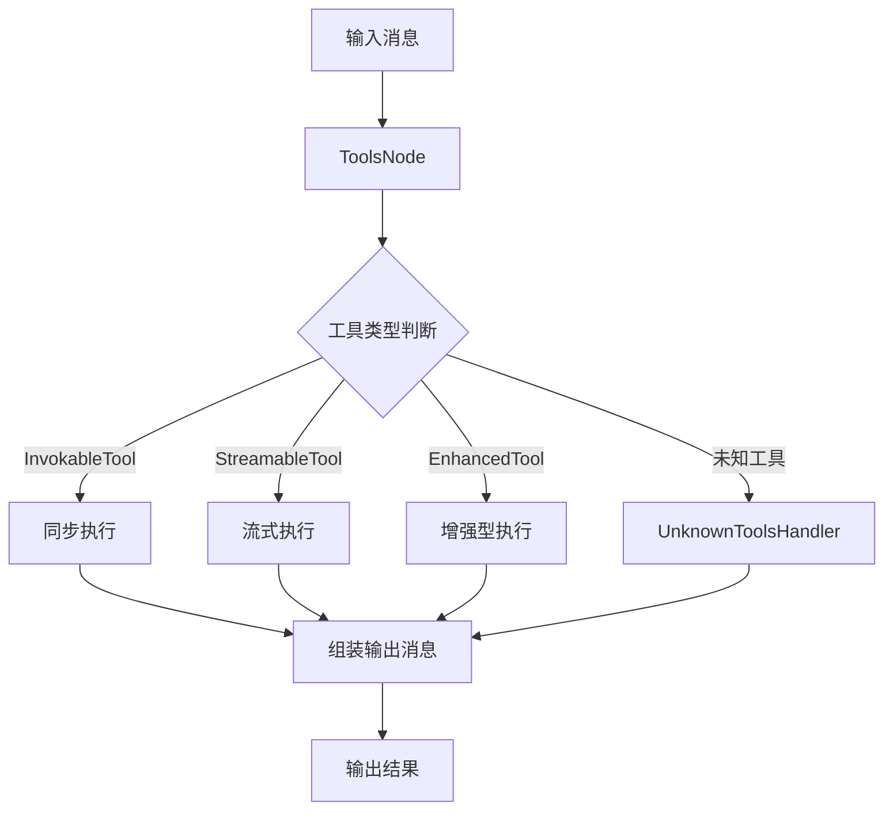
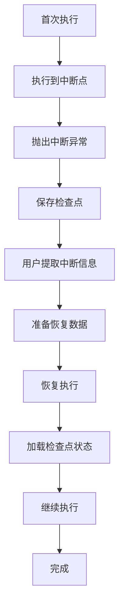

# 工具节点与中断恢复测试框架

## 概述

`tool_node_and_resume_test_harnesses` 模块是 `compose_graph_engine` 的核心测试基础设施，专门用于验证工具节点（ToolNode）的执行逻辑和中断恢复（Interrupt/Resume）机制的正确性。这个模块提供了一套完整的测试工具和模拟实现，使得开发者能够在受控环境中测试复杂的图执行流程，特别是涉及工具调用、状态持久化和执行恢复的场景。

想象一下，这个模块就像是一个"飞行模拟器"——它不是为了实际执行任务，而是为了在安全的环境中测试各种边界情况、故障场景和恢复流程，确保实际运行时的可靠性。

## 核心组件与架构

### 模块结构

本模块主要由两个测试子模块组成，每个都有详细的文档：

1. **[工具节点测试框架](compose_graph_engine-tool_node_and_resume_test_harnesses-tool_node_test_harness.md)** - 专注于工具节点的核心功能测试
2. **[中断恢复测试框架](compose_graph_engine-tool_node_and_resume_test_harnesses-resume_test_harness.md)** - 专注于中断恢复机制的测试

### 核心组件

#### 工具节点测试组件

- **模拟工具实现**：`mockTool`、`myTool1`-`myTool4`、`invokableTool`、`streamableTool` 等
- **增强型工具**：`enhancedInvokableTool`、`enhancedStreamableTool`
- **模拟聊天模型**：`mockIntentChatModel`
- **数据结构**：`userCompanyRequest/Response`、`userSalaryRequest/Response` 等

#### 中断恢复测试组件

- **中断状态管理**：`myInterruptState`、`myResumeData`、`resumeTestState`
- **模拟工具**：`mockInterruptingTool`、`mockReentryTool`、`wrapperToolForTest`
- **状态结构**：`processState`、`batchState`、`processResumeData`
- **回调工具**：`toolsNodeResumeTargetCallback`

## 架构设计与数据流程

### 工具节点执行流程



工具节点的核心职责是接收包含工具调用的消息，根据工具类型选择合适的执行策略，然后将执行结果组装成标准的消息格式返回。这个设计使得不同类型的工具（同步、流式、增强型）能够在同一个节点中统一处理。

### 中断恢复执行流程



中断恢复机制的核心思想是：当执行遇到需要用户干预的情况时，不是简单地失败，而是将当前状态持久化到检查点，然后抛出中断异常。用户可以提取中断信息，准备必要的恢复数据，然后从断点处继续执行。

## 关键设计决策

### 1. 测试驱动的组件设计

这个模块采用了"测试优先"的设计理念，通过丰富的测试用例来定义和验证核心功能。这种设计带来了几个重要优势：

- **契约明确**：测试用例清晰地定义了组件的预期行为
- **边界覆盖**：通过模拟各种边界情况确保组件的健壮性
- **重构安全**：完整的测试套件使得重构时能够保持功能一致性

### 2. 多层次的模拟策略

模块中使用了多种模拟策略来测试不同层级的功能：

- **简单模拟**：如 `mockIntentChatModel` 用于基本的工具调用触发
- **状态模拟**：如 `myTool1` 和 `myTool2` 用于测试中断和重入逻辑
- **复合模拟**：如 `mockReentryTool` 用于测试复杂的重入场景

这种多层次的模拟策略使得我们能够在保持测试简单性的同时，覆盖复杂的实际使用场景。

### 3. 状态持久化与恢复的分离

中断恢复机制的一个关键设计决策是将状态持久化和恢复逻辑分离：

- **中断时**：只保存必要的状态信息，不处理恢复逻辑
- **恢复时**：从检查点加载状态，根据恢复数据继续执行

这种分离使得中断点可以在任何时候抛出，而恢复逻辑可以在用户准备好后独立处理，大大增加了系统的灵活性。

### 4. 地址分层与复合中断

为了支持嵌套图和复合节点的中断恢复，模块引入了地址分层和复合中断的概念：

- **地址分层**：每个执行单元都有唯一的地址，包含完整的执行路径信息
- **复合中断**：允许一个节点包含多个中断点，用户可以选择性地恢复

这种设计使得即使在非常复杂的嵌套图结构中，也能够精确地定位和恢复特定的中断点。

## 核心组件详解

本模块的核心组件分为两个主要部分，详细信息请参考各自的子模块文档：

### 工具节点测试组件

完整的工具节点测试组件详解请参考 **[工具节点测试框架](compose_graph_engine-tool_node_and_resume_test_harnesses-tool_node_test_harness.md)** 文档，其中包括：

- 各种模拟工具的实现和用途（`mockTool`、`myTool1`-`myTool4` 等）
- 增强型工具接口的测试方法
- 工具节点选项和中间件的验证
- 工具调用顺序保证的测试

### 中断恢复测试组件

完整的中断恢复测试组件详解请参考 **[中断恢复测试框架](compose_graph_engine-tool_node_and_resume_test_harnesses-resume_test_harness.md)** 文档，其中包括：

- 中断状态管理组件的设计和使用
- 各类模拟中断工具的实现细节
- 复合中断和批量恢复的测试方法
- 嵌套图和工具重入场景的验证

## 使用指南

### 测试工具节点的基本功能

要测试工具节点的基本功能，你可以参考 `TestToolsNode` 函数的模式：

1. 创建模拟工具（可调用、流式或增强型）
2. 创建 ToolsNode 并配置工具
3. 将 ToolsNode 添加到图中
4. 编译并执行图
5. 验证输出结果

```go
// 示例：创建工具节点并测试
toolsNode, err := NewToolNode(ctx, &ToolsNodeConfig{
    Tools: []tool.BaseTool{myTool},
})
// ... 添加到图中并执行
```

### 测试中断恢复功能

要测试中断恢复功能，可以参考 `TestInterruptStateAndResumeForRootGraph` 等函数的模式：

1. 创建会中断的节点（Lambda 或工具）
2. 配置图使用检查点存储
3. 首次执行图，捕获中断异常
4. 提取中断信息，准备恢复数据
5. 使用恢复数据重新执行图
6. 验证恢复后的执行结果

```go
// 示例：中断恢复流程
_, err = graph.Invoke(ctx, input, WithCheckPointID(checkPointID))
interruptInfo, _ := ExtractInterruptInfo(err)
resumeCtx := ResumeWithData(ctx, interruptInfo.InterruptContexts[0].ID, resumeData)
output, err := graph.Invoke(resumeCtx, "", WithCheckPointID(checkPointID))
```

### 测试复合中断

对于复合中断场景（如批量处理多个子流程），可以参考 `TestMultipleInterruptsAndResumes`：

1. 创建复合节点，内部启动多个子流程
2. 每个子流程独立中断
3. 使用 `CompositeInterrupt` 包装所有中断
4. 用户可以选择性地恢复部分或全部中断点

## 常见陷阱与注意事项

### 1. 状态注册

使用自定义状态类型时，必须通过 `schema.Register` 或 `schema.RegisterName` 注册，否则状态无法正确序列化和反序列化。

```go
// 正确示例
schema.Register[myInterruptState]()
// 或
schema.RegisterName[*myInterruptState]("my_interrupt_state")
```

### 2. 工具调用顺序

ToolsNode 保证工具调用的输出顺序与输入顺序一致，即使某些工具是流式的。测试时要注意验证这一点。

### 3. 重入状态隔离

当一个工具被多次调用时（如 ReAct 循环），每次调用的中断状态是隔离的。`mockReentryTool` 的测试展示了如何验证这种隔离性。

### 4. 复合中断的地址处理

在复合节点中处理中断时，要使用 `AppendAddressSegment` 为每个子流程创建唯一的地址，否则中断点无法正确区分。

### 5. 检查点 ID 的一致性

恢复执行时必须使用与首次执行相同的检查点 ID，否则无法找到之前保存的状态。

## 与其他模块的关系

本模块与以下模块密切相关：

- **[tool_node_execution_and_interrupt_control](compose_graph_engine-tool_node_execution_and_interrupt_control.md)** - 提供工具节点的核心实现
- **[checkpointing_and_rerun_persistence](compose_graph_engine-checkpointing_and_rerun_persistence.md)** - 提供检查点持久化功能
- **[graph_execution_runtime](compose_graph_engine-graph_execution_runtime.md)** - 提供图执行的核心运行时
- **[graph_and_workflow_test_harnesses](compose_graph_engine-graph_and_workflow_test_harnesses.md)** - 提供更通用的图测试框架

## 总结

`tool_node_and_resume_test_harnesses` 模块是确保工具节点和中断恢复机制正确性的关键基础设施。它通过丰富的测试用例和模拟组件，不仅验证了核心功能的正确性，还展示了这些功能的设计意图和最佳实践。

理解这个模块的最好方式是将其视为一个"可执行的规范"——每个测试用例都定义了系统在特定场景下应该如何行为，而每个模拟组件都展示了如何与系统交互。通过学习这些测试，开发者可以深入理解系统的设计理念和使用方法。
