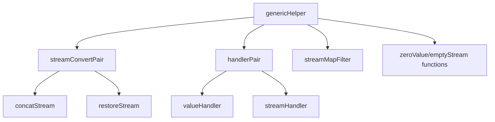

# generic_stream_and_handler_adapters 模块技术深度解析

## 1. 模块概述

`generic_stream_and_handler_adapters` 模块是 compose_graph_engine 中的一个核心基础设施组件，位于 `tool_node_execution_and_interrupt_control` 子模块下。它的主要职责是解决图执行引擎中类型系统的灵活性问题，特别是在处理流式与非流式数据转换、字段映射和类型检查等场景时。

### 核心问题空间

在构建一个通用的图执行引擎时，我们面临一个基本矛盾：一方面，我们希望利用 Go 的强类型系统来提供编译时的类型安全；另一方面，图的节点可能有不同的输入输出类型，需要在运行时动态连接和转换。此外，系统还需要支持流式数据与非流式数据之间的无缝转换，以满足 checkpointing、中断恢复等高级功能的需求。

一个简单的解决方案可能是完全使用 `interface{}` 来绕过类型系统，但这会失去编译时类型检查的好处，并且在运行时需要大量的类型断言和错误处理。本模块的设计目标是在保持类型安全的同时，提供足够的灵活性来处理动态场景。

## 2. 核心架构与设计思想

### 2.1 设计模式与抽象

本模块的核心思想是**类型擦除与运行时类型恢复**的结合。它通过泛型在编译时构建类型特定的处理函数，然后将这些函数封装在非泛型的结构体中，以便在运行时动态使用。

可以将这个模块想象成一个**通用适配器工厂**：对于每一种具体的输入输出类型组合，它都能生产一套完整的适配器，包括类型检查器、流转换器、字段映射器等。这些适配器可以在图执行时动态组装，解决不同节点之间的类型不匹配问题。

### 2.2 核心组件关系图



## 3. 核心组件深度解析

### 3.1 genericHelper 结构体

`genericHelper` 是整个模块的核心，它聚合了所有类型相关的处理函数。这个结构体本身不使用泛型，而是在内部存储了各种类型特定的函数指针。

#### 主要功能分区

- **流过滤器** (`inputStreamFilter`, `outputStreamFilter`)：用于从 map 类型的流中提取特定字段的流
- **类型转换器** (`inputConverter`, `outputConverter`)：用于验证和转换单值和流的类型
- **字段映射器** (`inputFieldMappingConverter`, `outputFieldMappingConverter`)：用于将 map 输入转换为预期的结构体类型
- **流转换对** (`inputStreamConvertPair`, `outputStreamConvertPair`)：用于在流和非流之间进行转换（主要用于 checkpointing）
- **零值和空流生成器**：用于生成类型特定的零值和空流

#### 设计意图

`genericHelper` 的设计巧妙地解决了 Go 语言中泛型结构体不能直接存储在非泛型容器中的问题。通过将类型特定的逻辑封装在函数指针中，它实现了类型擦除，同时保留了类型安全的处理能力。

### 3.2 streamConvertPair 结构体

`streamConvertPair` 封装了一对函数，用于在流式数据和非流式数据之间进行转换。

#### 核心方法

- **concatStream**: 将一个流合并为单个值
- **restoreStream**: 将单个值恢复为流

#### 实现细节

```go
func defaultStreamConvertPair[T any]() streamConvertPair {
    // ...
    concatStream: func(sr streamReader) (any, error) {
        tsr, ok := unpackStreamReader[T](sr)
        if !ok {
            return nil, fmt.Errorf("cannot convert sr to streamReader[%T]", t)
        }
        value, err := concatStreamReader(tsr)
        // ...
    },
    restoreStream: func(a any) (streamReader, error) {
        // ...
    },
}
```

这个函数通过泛型创建了类型特定的流转换函数。`concatStream` 首先尝试将通用的 `streamReader` 转换为类型特定的版本，然后调用 `concatStreamReader` 将流中的所有值合并为一个。`restoreStream` 则相反，它将一个单独的值包装成一个单元素的流。

#### 应用场景

这对函数主要用于 checkpointing 场景。当需要保存节点的执行状态时，可能需要将流式数据转换为非流式数据以便序列化；当恢复执行时，又需要将这些数据重新转换回流的形式。

### 3.3 handlerPair 结构体

`handlerPair` 封装了两个处理函数：一个用于处理单个值，另一个用于处理流。

#### 核心方法

- **invoke**: 处理单个值
- **transform**: 处理流

#### 典型实现

以 `defaultValueChecker` 和 `defaultStreamConverter` 为例：

```go
func defaultValueChecker[T any](v any) (any, error) {
    nValue, ok := v.(T)
    if !ok {
        var t T
        return nil, fmt.Errorf("runtime type check fail, expected type: %T, actual type: %T", t, v)
    }
    return nValue, nil
}

func defaultStreamConverter[T any](reader streamReader) streamReader {
    return packStreamReader(schema.StreamReaderWithConvert(reader.toAnyStreamReader(), func(v any) (T, error) {
        vv, ok := v.(T)
        if !ok {
            var t T
            return t, fmt.Errorf("runtime type check fail, expected type: %T, actual type: %T", t, v)
        }
        return vv, nil
    }))
}
```

这两个函数都执行运行时类型检查，确保输入值或流中的元素符合预期类型。它们是图节点之间类型安全的守护者。

### 3.4 辅助方法

`genericHelper` 提供了几个用于创建变体的方法：

- **forMapInput**: 创建一个输入为 map 类型的变体
- **forMapOutput**: 创建一个输出为 map 类型的变体
- **forPredecessorPassthrough**: 创建一个将输入配置直接传递给输出的变体
- **forSuccessorPassthrough**: 创建一个将输出配置直接传递给输入的变体

这些方法展示了 `genericHelper` 的另一个设计优势：它可以轻松地创建特定场景的变体，而不需要重新初始化整个结构体。

## 4. 数据流动与依赖关系

### 4.1 模块在系统中的位置

`generic_stream_and_handler_adapters` 模块位于 `tool_node_execution_and_interrupt_control` 子模块下，它是图执行引擎的基础设施，为图节点的执行提供类型转换和适配能力。

### 4.2 与其他模块的交互

虽然我们没有完整的调用链信息，但从代码结构可以推测：

1. **被 graph_execution_runtime 使用**：在节点执行时进行类型检查和转换
2. **与 tool_node_execution_and_interrupt_control 协作**：处理工具节点的输入输出，支持中断和恢复
3. **依赖 schema 模块**：使用 `schema.StreamReader` 等类型

### 4.3 典型数据流程

以一个典型的图节点执行为例，数据可能会经过以下步骤：

1. 前一个节点的输出流到达
2. 使用 `inputStreamFilter` 从 map 流中提取所需字段（如果需要）
3. 使用 `inputConverter.transform` 验证流中元素的类型
4. 节点执行处理
5. 使用 `outputConverter.transform` 验证输出类型
6. 输出流传递到下一个节点

在 checkpointing 场景下：

1. 使用 `inputStreamConvertPair.concatStream` 将输入流转换为单个值
2. 保存到检查点
3. 恢复时，使用 `inputStreamConvertPair.restoreStream` 将值恢复为流

## 5. 设计决策与权衡

### 5.1 类型擦除 vs 类型安全

**决策**：使用类型擦除技术，将泛型逻辑封装在非泛型结构体中。

**权衡**：
- ✅ 优点：可以在运行时动态处理不同类型，保持了系统的灵活性
- ❌ 缺点：失去了部分编译时类型检查，需要依赖运行时类型验证
- **合理性**：对于一个图执行引擎来说，灵活性是首要需求，这种权衡是合理的

### 5.2 集中式 vs 分散式适配器

**决策**：将所有类型相关的适配器集中在一个 `genericHelper` 结构体中。

**权衡**：
- ✅ 优点：便于管理和传递，确保类型处理逻辑的一致性
- ❌ 缺点：结构体变得较大，可能包含某些场景下不需要的功能
- **合理性**：图节点通常需要多种类型处理功能，集中管理更方便

### 5.3 函数指针 vs 接口

**决策**：使用函数指针而不是接口来封装类型特定的逻辑。

**权衡**：
- ✅ 优点：更灵活，可以单独替换某个功能，不需要定义完整的接口
- ❌ 缺点：代码可能不如接口那么清晰，需要更多的函数指针管理
- **合理性**：对于这种需要高度定制的组件，函数指针提供了更好的灵活性

### 5.4 预创建 vs 延迟创建

**决策**：在 `newGenericHelper` 中预创建所有适配器函数。

**权衡**：
- ✅ 优点：运行时直接使用，无需额外初始化
- ❌ 缺点：可能创建一些永远不会使用的函数，轻微增加内存开销
- **合理性**：这些函数都很小，创建成本低，预创建是合理的

## 6. 使用指南与最佳实践

### 6.1 创建 genericHelper

通常，你不需要直接创建 `genericHelper`，它应该由图执行引擎内部使用。但如果你需要创建一个，可以使用：

```go
helper := newGenericHelper[MyInputType, MyOutputType]()
```

### 6.2 使用变体方法

当你需要处理特定场景时，可以使用变体方法：

```go
// 处理 map 输入
mapInputHelper := helper.forMapInput()

// 处理直通场景
passthroughHelper := helper.forPredecessorPassthrough()
```

### 6.3 扩展点

虽然这个模块主要是内部使用，但你可以通过以下方式扩展它：

1. 提供自定义的 `streamMapFilter` 来实现特殊的字段提取逻辑
2. 替换 `handlerPair` 中的函数来实现自定义类型转换
3. 提供自定义的 `streamConvertPair` 来处理特殊的流合并/恢复逻辑

## 7. 注意事项与潜在陷阱

### 7.1 运行时类型检查

虽然这个模块提供了类型安全，但它主要依赖于运行时类型检查。这意味着：

- 类型错误可能在运行时才暴露，而不是编译时
- 需要确保错误处理得当，避免类型不匹配导致的 panic

### 7.2 流的处理

流的处理需要特别注意：

- 流只能消费一次，确保不要重复消费
- 流的转换可能会有性能开销，避免不必要的转换
- 处理空流时要小心，`concatStream` 对空流会返回 `nil, nil`

### 7.3 类型擦除的局限性

类型擦除虽然提供了灵活性，但也有局限性：

- 无法在运行时获取泛型参数的类型信息（除非使用反射）
- 某些类型操作可能变得更加复杂
- 调试可能会更困难，因为类型信息在运行时不那么明显

## 8. 总结

`generic_stream_and_handler_adapters` 模块是一个精心设计的基础设施组件，它解决了图执行引擎中类型系统的灵活性问题。通过类型擦除和运行时类型恢复的结合，它在保持类型安全的同时，提供了足够的灵活性来处理动态场景。

这个模块的设计展示了如何在 Go 语言的限制下，通过巧妙的抽象和封装，构建出强大而灵活的系统。它是图执行引擎能够支持多种节点类型和数据格式的关键基础设施。
