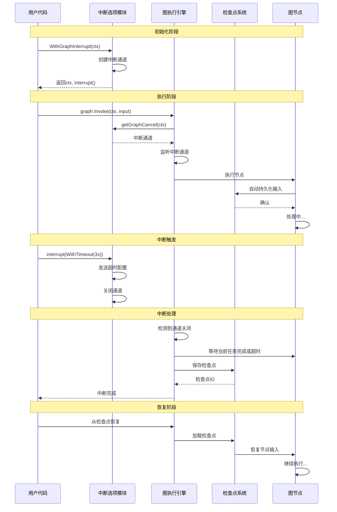

# 图级中断与取消选项模块深度解析

## 1. 模块概览

`graph_level_interrupt_and_cancellation_options` 模块为图执行引擎提供了优雅的外部中断机制。想象一下，你正在运行一个复杂的多步骤工作流，突然需要暂停它去处理更紧急的任务——这个模块就像是工作流的"暂停键"，不仅能安全地停止执行，还能确保后续可以从中断处无缝恢复。

与节点内部中断不同，这种图级中断是外部触发的，可以在任何时刻发生，因此需要更健壮的输入持久化机制来保证恢复时的状态一致性。

## 2. 核心组件分析

### 2.1 上下文传递机制

```go
type graphCancelChanKey struct{}
type graphCancelChanVal struct {
        ch chan *time.Duration
}
```

这两个结构体构成了中断信号的传递通道。`graphCancelChanKey` 作为上下文键，类型安全地将中断通道嵌入到 `context.Context` 中；`graphCancelChanVal` 则封装了实际的信号通道，用于传递超时配置。

**设计意图**：使用空结构体作为上下文键是 Go 的经典模式，确保键的唯一性，避免与其他模块的上下文键冲突。通道缓冲大小为 1，保证即使接收方未准备好，中断信号也不会丢失。

### 2.2 中断选项配置

```go
type graphInterruptOptions struct {
        timeout *time.Duration
}

type GraphInterruptOption func(o *graphInterruptOptions)

func WithGraphInterruptTimeout(timeout time.Duration) GraphInterruptOption {
        return func(o *graphInterruptOptions) {
                o.timeout = &timeout
        }
}
```

这部分实现了函数式选项模式，用于配置中断行为。目前只支持超时配置，但设计为可扩展的。

**设计意图**：函数式选项模式提供了极佳的扩展性——未来添加新的中断配置（如中断策略、优先级等）时，无需修改现有 API，只需添加新的 `WithXxx` 函数即可。

### 2.3 中断上下文创建

```go
func WithGraphInterrupt(parent context.Context) (ctx context.Context, interrupt func(opts ...GraphInterruptOption)) {
        ch := make(chan *time.Duration, 1)
        ctx = context.WithValue(parent, graphCancelChanKey{}, &graphCancelChanVal{
                ch: ch,
        })
        return ctx, func(opts ...GraphInterruptOption) {
                o := &graphInterruptOptions{}
                for _, opt := range opts {
                        opt(o)
                }
                ch <- o.timeout
                close(ch)
        }
}
```

这是模块的核心函数，它创建一个支持中断的上下文，并返回一个中断函数。当调用中断函数时，它会通过通道发送超时配置，然后关闭通道。

**设计意图**：
1. **通道关闭作为信号**：关闭通道是一种可靠的完成信号，即使多个 goroutine 同时监听，也能确保所有监听者都能收到中断通知。
2. **一次性使用**：通道发送后立即关闭，确保中断是一次性操作，避免重复触发导致的状态混乱。

### 2.4 内部辅助函数

```go
func getGraphCancel(ctx context.Context) *graphCancelChanVal {
        val, ok := ctx.Value(graphCancelChanKey{}).(*graphCancelChanVal)
        if !ok {
                return nil
        }
        return val
}
```

这个内部函数从上下文中安全地提取中断通道。它是连接用户 API 和图执行引擎的桥梁。

**设计意图**：封装上下文值的提取逻辑，提供类型安全的访问，并优雅处理未设置中断通道的情况。

## 3. 数据流向与架构角色

### 架构图



### 数据流向详解

1. **初始化阶段**：用户调用 `WithGraphInterrupt` 创建可中断上下文
   - 模块内部创建一个缓冲通道
   - 将通道通过 `graphCancelChanVal` 封装到 context 中
   - 返回新的 context 和中断函数

2. **执行阶段**：该上下文传递给图执行引擎
   - 图执行引擎通过 `getGraphCancel` 获取中断通道
   - 开始在后台监听通道状态
   - 同时，由于使用了 `WithGraphInterrupt`，所有节点在执行前自动持久化输入

3. **中断触发**：用户调用返回的 `interrupt` 函数
   - 函数应用所有选项（如超时配置）
   - 通过通道发送超时配置
   - 关闭通道作为完成信号

4. **中断处理**：图执行引擎检测到通道关闭
   - 开始有序中断当前任务
   - 确保所有节点输入已持久化
   - 保存完整检查点

5. **恢复阶段**：使用检查点恢复执行
   - 从检查点加载状态
   - 持久化的输入被重新加载到对应节点
   - 从中断处继续执行

### 架构角色

该模块在整个图执行引擎中扮演**中断控制器**的角色：
- 向上为用户提供简洁的中断 API
- 向下通过上下文机制与图执行 runtime 通信
- 侧面与检查点系统协作，确保输入持久化

从依赖关系看，它是连接用户代码与图执行引擎之间的桥梁，解耦了中断策略与执行逻辑。

## 4. 设计决策与权衡

### 4.1 外部中断 vs 内部中断

**设计决策**：明确区分外部中断（通过 `WithGraphInterrupt`）和内部中断（通过 `compose.Interrupt`），并为它们采用不同的输入持久化策略。

**权衡分析**：
- **外部中断自动持久化**：因为外部中断可能在任何时刻发生，节点无法预知并准备，所以系统必须自动持久化所有输入
- **内部中断手动持久化**：内部中断由节点代码触发，节点作者可以控制中断时机，因此让他们手动管理输入持久化更灵活
- **为什么不全自动**：全自动持久化会破坏依赖 `input == nil` 判断是否首次运行的现有代码，这是向后兼容性的考虑

### 4.2 通道作为中断信号

**设计决策**：使用通道而非 `context.Context` 的取消机制来传递中断信号。

**权衡分析**：
- **通道的优势**：可以传递额外信息（如超时配置），且关闭操作是广播式的，所有监听者都能收到
- **Context 取消的局限**：`context.WithCancel` 只能传递取消信号，无法附带配置信息
- **为什么不两者结合**：模块内部确实可能结合使用，但对外 API 保持简洁，只暴露通道机制

### 4.3 函数式选项模式

**设计决策**：使用函数式选项模式配置中断行为，而非结构体配置。

**权衡分析**：
- **优点**：API 演进更平滑，默认值处理更自然，调用方代码更清晰
- **缺点**：对于简单配置可能略显繁琐
- **为什么选择**：考虑到中断配置未来可能变得复杂（如添加中断策略、重试逻辑等），函数式选项是更具前瞻性的选择

## 5. 使用指南与最佳实践

### 基本使用

```go
// 创建可中断上下文
ctx, interrupt := compose.WithGraphInterrupt(context.Background())

// 在另一个 goroutine 中执行业务逻辑
go func() {
    // 运行图或工作流
    result, err := graph.Invoke(ctx, input)
    // 处理结果...
}()

// 稍后决定中断
time.Sleep(5 * time.Second)
interrupt() // 使用默认行为中断
```

### 带超时的中断

```go
// 创建可中断上下文
ctx, interrupt := compose.WithGraphInterrupt(context.Background())

// 执行业务逻辑...

// 带超时中断：给当前任务 3 秒时间完成，之后强制中断
interrupt(compose.WithGraphInterruptTimeout(3 * time.Second))
```

### 最佳实践

1. **始终检查恢复状态**：在节点代码中使用 `compose.GetInterruptState()` 而非依赖 `input == nil` 来判断是否是恢复执行
2. **合理设置超时**：超时时间应足够长，允许当前任务完成，但又不能太长，避免等待过久
3. **配合检查点使用**：确保图配置了检查点，否则中断后无法恢复
4. **避免频繁中断**：中断和恢复都有开销，只在必要时使用

## 6. 注意事项与潜在陷阱

### 隐式契约

1. **输入必须可序列化**：由于外部中断会自动持久化所有节点输入，确保所有输入类型都支持序列化
2. **中断不是立即停止**：中断会等待当前任务完成（或超时），不是硬终止，所以代码应能处理这种优雅停止
3. **子图也受影响**：中断是图级的，会影响根图和所有子图

### 常见陷阱

1. **忘记保存检查点 ID**：中断后需要使用检查点 ID 恢复，确保保存了该 ID
2. **在中断后继续使用上下文**：中断后的上下文不应再用于新的图执行
3. **忽略超时配置**：如果设置了超时但节点不支持优雅停止，可能导致状态不一致

### 与其他模块的关系

- 依赖：[graph_run_and_interrupt_execution_flow](compose_graph_engine-graph_execution_runtime-graph_run_and_interrupt_execution_flow.md) - 实际处理中断逻辑的运行时
- 协作：[checkpointing_and_rerun_persistence](compose_graph_engine-checkpointing_and_rerun_persistence.md) - 负责输入持久化和恢复
- 对比：[tool_interrupt_and_rerun_state](compose_graph_engine-tool_node_execution_and_interrupt_control-tool_interrupt_and_rerun_state.md) - 节点级中断机制

## 7. 总结

`graph_level_interrupt_and_cancellation_options` 模块通过巧妙的上下文通道机制，为图执行引擎提供了安全、灵活的外部中断能力。它在设计上 carefully 平衡了自动化与灵活性、向后兼容性与功能丰富性，是构建可靠工作流系统的重要基石。

理解这个模块的关键在于认识到外部中断的不可预测性——它可能在任何时刻发生，因此需要更健壮的保障机制。这也是为什么它与内部中断采用不同策略的核心原因。
