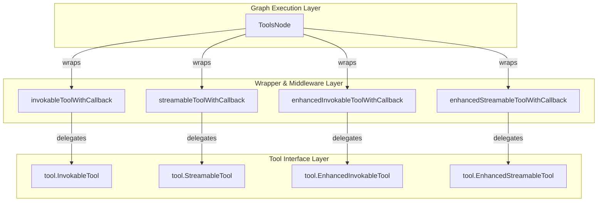

# tool_call_execution_and_callback_wrappers 模块深度解析

## 1. 模块概述与问题域

### 1.1 问题背景

在构建复杂的 AI Agent 系统时，工具调用执行是一个核心环节。开发者面临以下挑战：

1. **多样性的工具类型**：工具可能支持同步调用、流式调用、增强型调用等多种模式
2. **统一的回调与中间件机制**：需要在工具执行前后插入日志、监控、参数验证等横切关注点
3. **中断与恢复能力**：在多工具调用场景下，需要支持部分失败后的重新执行，避免重复调用已成功的工具
4. **并行与顺序执行**：需要灵活控制多个工具调用的执行策略
5. **错误处理与未知工具**：优雅处理 LLM 产生的幻觉工具调用

### 1.2 模块定位

`tool_call_execution_and_callback_wrappers` 模块是 Eino 框架中工具调用执行的核心编排层，它位于 `compose_graph_engine` 包下，作为 Graph 执行引擎与具体工具实现之间的桥梁。该模块解决了工具调用的标准化、可观测性、容错性和灵活性问题。

## 2. 核心架构与数据流程

### 2.1 架构视图



### 2.2 核心数据结构

#### 2.2.1 ToolsNode

`ToolsNode` 是整个模块的核心编排者，它持有：
- 工具元组（`toolsTuple`）：包含索引和各种类型的工具端点
- 配置项：未知工具处理器、执行顺序策略、参数处理器等
- 中间件链：四种类型工具的中间件

#### 2.2.2 toolsTuple

`toolsTuple` 是工具的容器，它维护：
- 工具名称到索引的映射
- 工具元数据
- 四种类型的工具端点数组（同步、流式、增强同步、增强流式）

#### 2.2.3 toolCallTask

`toolCallTask` 是工具调用的任务表示，包含：
- 输入：端点引用、名称、参数、callID 等
- 输出：执行结果、错误、是否已执行等状态

### 2.3 数据流程

让我们追踪一次完整的 `Invoke` 调用流程：

1. **准备阶段**：
   - 从配置或选项中获取工具列表
   - 检查是否有中断状态，恢复已执行工具的结果
   - 生成 `toolCallTask` 列表

2. **执行阶段**：
   - 根据 `executeSequentially` 选择顺序或并行执行策略
   - 对每个任务：
     - 跳过已执行的任务
     - 设置上下文信息（回调处理器、工具调用信息、地址段）
     - 调用对应的端点

3. **结果收集阶段**：
   - 检查是否有中断/重运行错误
   - 收集执行结果到 `rerunExtra` 和 `rerunState`
   - 将结果转换为 `schema.Message` 数组返回

## 3. 核心组件深度解析

### 3.1 工具包装器（Wrapper）

这四个结构体是回调机制的核心：

#### invokableToolWithCallback
```go
type invokableToolWithCallback struct {
    it tool.InvokableTool
}
```
**作用**：为同步工具添加回调支持。
**设计意图**：通过组合而非继承的方式，在不修改原工具实现的前提下，为其注入回调逻辑。这符合开闭原则（对扩展开放，对修改关闭）。

#### streamableToolWithCallback
类似地，为流式工具添加回调支持。

#### enhancedInvokableToolWithCallback
为增强型同步工具（支持多模态输出）添加回调支持。

#### enhancedStreamableToolWithCallback
为增强型流式工具添加回调支持。

### 3.2 工具端点转换

模块提供了四种工具端点之间的转换函数：

- `streamableToInvokable`：将流式端点转换为同步端点
- `invokableToStreamable`：将同步端点转换为流式端点
- `enhancedStreamableToEnhancedInvokable`：增强型流式到同步
- `enhancedInvokableToEnhancedStreamable`：增强型同步到流式

**设计意图**：这种设计允许工具只实现一种接口，但可以被两种调用方式使用。例如，一个只实现了同步接口的工具，可以通过 `invokableToStreamable` 被流式调用，这大大提高了工具的复用性。

### 3.3 任务生成与执行

#### genToolCallTasks
这个函数负责从输入消息生成工具调用任务列表。它处理：
- 角色验证（必须是 Assistant 消息）
- 已执行工具的恢复
- 未知工具的处理
- 参数预处理
- 选择使用标准工具还是增强工具

#### 执行策略
模块提供了两种执行策略：
- `sequentialRunToolCall`：按顺序执行，适合有依赖关系的工具调用
- `parallelRunToolCall`：并行执行（第一个任务在当前 goroutine，其余在新 goroutine），提高吞吐量

**并行执行的设计细节**：
```go
// 第一个任务在当前 goroutine 执行
if !tasks[0].executed {
    run(ctx, &tasks[0], opts...)
}

// 其余任务并行执行
for i := 1; i < len(tasks); i++ {
    // ... 创建 goroutine
}
```

这种设计既利用了并行性，又避免了不必要的 goroutine 创建开销。

### 3.4 中断与恢复机制

模块实现了强大的中断与恢复能力，核心数据结构是：
- `ToolsInterruptAndRerunExtra`：携带中断元数据，用于外部交互
- `toolsInterruptAndRerunState`：内部状态，用于恢复执行

**设计意图**：在复杂的 Agent 流程中，工具调用可能会因为各种原因中断（如用户干预、资源限制、需要人工确认等）。这个机制允许：
1. 保存已执行工具的结果
2. 记录需要重新执行的工具
3. 在恢复时跳过已成功的工具，只重执行失败或未执行的工具

## 4. 设计决策与权衡

### 4.1 中间件应用顺序

```go
middleware := func(next InvokableToolEndpoint) InvokableToolEndpoint {
    for i := len(middlewares) - 1; i >= 0; i-- {
        next = middlewares[i](next)
    }
    return next
}
```

**决策**：中间件从后往前应用。
**原因**：这是函数式中间件的常见模式，确保中间件的执行顺序与注册顺序一致。例如，注册顺序是 [A, B, C]，实际执行顺序也是 A → B → C → 工具 → C → B → A。

### 4.2 回调注入的条件

```go
if needCallback {
    it = &invokableToolWithCallback{it: it}
}
```

**决策**：根据 `isComponentCallbackEnabled` 决定是否注入回调包装器。
**权衡**：
- 优点：避免重复注入回调，提高性能
- 缺点：增加了状态管理的复杂度，需要正确设置 `isComponentCallbackEnabled`

### 4.3 错误处理策略

在 `Invoke` 和 `Stream` 方法中，错误处理分为两个层次：
1. 立即返回非中断错误
2. 收集中断错误，组合成复合中断返回

**设计意图**：区分可恢复的中断和不可恢复的错误，提供更好的容错能力。

### 4.4 增强型工具的优先级

```go
if tuple.enhancedInvokableEndpoints[index] != nil && tuple.enhancedStreamableEndpoints[index] != nil {
    // 使用增强型工具
} else {
    // 使用标准工具
}
```

**决策**：优先使用增强型工具。
**原因**：增强型工具提供更丰富的功能（如多模态输出），在可用时应该优先使用。

## 5. 使用指南与最佳实践

### 5.1 创建 ToolsNode

```go
conf := &ToolsNodeConfig{
    Tools: []tool.BaseTool{myTool1, myTool2},
    UnknownToolsHandler: func(ctx context.Context, name, input string) (string, error) {
        return fmt.Sprintf("Unknown tool: %s", name), nil
    },
    ExecuteSequentially: false, // 并行执行
    ToolCallMiddlewares: []ToolMiddleware{
        {
            Invokable: myLoggingMiddleware,
            Streamable: myStreamingLoggingMiddleware,
        },
    },
}

toolsNode, err := NewToolNode(ctx, conf)
```

### 5.2 编写中间件

```go
func myLoggingMiddleware(next InvokableToolEndpoint) InvokableToolEndpoint {
    return func(ctx context.Context, input *ToolInput) (*ToolOutput, error) {
        log.Printf("Calling tool %s with args: %s", input.Name, input.Arguments)
        start := time.Now()
        
        output, err := next(ctx, input)
        
        if err != nil {
            log.Printf("Tool %s failed: %v", input.Name, err)
        } else {
            log.Printf("Tool %s succeeded in %v, result: %s", input.Name, time.Since(start), output.Result)
        }
        
        return output, err
    }
}
```

### 5.3 获取工具调用 ID

在工具实现或中间件中，可以通过 `GetToolCallID` 获取当前的工具调用 ID：

```go
callID := GetToolCallID(ctx)
if callID != "" {
    // 使用 callID 进行追踪或关联
}
```

## 6. 边缘情况与注意事项

### 6.1 工具类型验证

`convTools` 函数会验证工具是否至少实现了一种接口：
```go
if st == nil && it == nil && eiTool == nil && esTool == nil {
    return nil, fmt.Errorf("tool %s is not invokable, streamable, enhanced invokable or enhanced streamable", toolName)
}
```

**注意**：确保你的工具实现了至少一种接口。

### 6.2 并行执行中的 panic 处理

`parallelRunToolCall` 中有 panic 恢复机制：
```go
defer func() {
    panicErr := recover()
    if panicErr != nil {
        t.err = safe.NewPanicErr(panicErr, debug.Stack())
    }
}()
```

**注意**：只有在并行执行的子 goroutine 中才有 panic 恢复，第一个任务（在当前 goroutine 执行）没有这个保护。

### 6.3 流式调用中的中断处理

在 `Stream` 方法中，如果检测到中断错误，会先将已执行的流式结果拼接保存：
```go
// concat and save tool output
for _, t := range tasks {
    if t.executed {
        if t.useEnhanced {
            eo, err_ := concatStreamReader(t.enhancedSOutput)
            // ...
        } else {
            o, err_ := concatStreamReader(t.sOutput)
            // ...
        }
    }
}
```

**设计意图**：确保流式输出不会因为中断而丢失。

## 7. 依赖关系与模块交互

这个模块与以下模块有紧密交互：

- [tool_contracts_and_options](components_core-tool_contracts_and_options.md)：定义了工具接口
- [schema_models_and_streams](schema_models_and_streams.md)：提供了消息和流的基础类型
- [tool_interrupt_and_rerun_state](compose_graph_engine-tool_node_execution_and_interrupt_control-tool_interrupt_and_rerun_state.md)：中断状态管理

## 8. 总结

`tool_call_execution_and_callback_wrappers` 模块是 Eino 框架中工具调用的核心编排层，它通过精巧的设计解决了工具调用的多样性、可观测性、容错性和灵活性问题。其核心思想包括：

1. **包装器模式**：通过组合为工具添加回调和中间件支持
2. **端点转换**：允许工具只实现一种接口，但支持多种调用方式
3. **任务抽象**：将工具调用抽象为任务，便于统一管理和执行
4. **中断恢复**：支持部分失败后的智能重执行
5. **灵活的执行策略**：提供顺序和并行两种执行方式

这个模块的设计体现了良好的软件工程实践，如开闭原则、单一职责原则、组合优于继承等，同时也考虑了性能和容错性的平衡。
