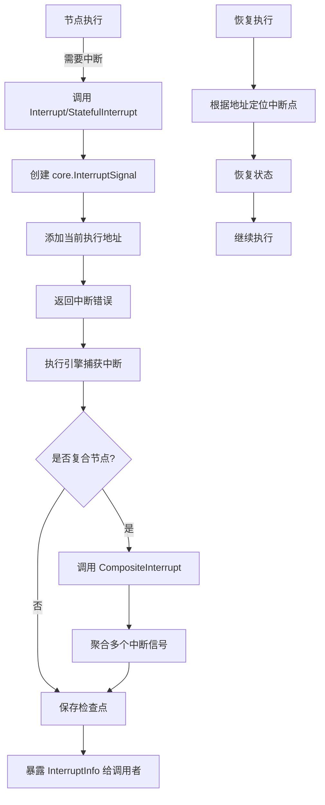

# interrupt_core_components 模块技术深度解析

## 1. 为什么这个模块存在

在构建复杂的工作流执行引擎时，一个核心挑战是如何优雅地处理执行过程中的中断与恢复。想象一下，你有一个由多个节点组成的图，某些节点需要暂停执行（比如等待用户输入、获取外部资源、或者遇到可重试的错误），然后在未来某个时刻从中断的地方继续执行。

传统的错误处理机制无法满足这种需求：
- 普通错误会导致执行完全失败，无法恢复
- 简单的重试机制会丢失执行上下文
- 没有标准的方式来保存和恢复节点的内部状态

`interrupt_core_components` 模块的核心设计洞察是：**将中断建模为一种特殊的、可序列化的错误信号**，这种信号携带了足够的信息，让执行引擎能够：
1. 准确识别中断发生的位置
2. 保存必要的状态信息
3. 在恢复时能够精确地从断点继续执行

这不是简单的错误处理，而是一种**协作式多任务**机制，让工作流节点可以主动"让出"执行权，然后在合适的时机重新获得执行权。

## 2. 核心概念与心智模型

理解这个模块的关键是掌握以下几个核心抽象：

### 2.1 执行地址（Address）
把执行地址想象成文件系统路径——它唯一标识了图执行过程中的一个精确位置。一个地址由多个段（AddressSegment）组成，每个段可以是：
- `node`：图中的一个节点
- `tool`：工具节点中的特定工具调用
- `runnable`：一个独立的可运行实体（如整个图、工作流或链）

例如，地址可能看起来像：`[runnable:"main_graph", node:"process_data", tool:"validate_input"]`

### 2.2 中断信号（InterruptSignal）
这是中断机制的核心载体。它不仅仅是一个错误，更是一个包含了所有必要信息的数据结构：
- **ID**：中断的唯一标识符
- **Address**：中断发生的精确位置
- **InterruptInfo**：面向用户的中断信息（如原因）
- **InterruptState**：需要持久化的组件内部状态

### 2.3 复合中断（CompositeInterrupt）
对于管理多个子流程的复合节点（如 ToolsNode），我们需要一种方式来聚合多个子中断。`CompositeInterrupt` 就像是一个中断的"容器"，它可以：
- 收集多个子流程的中断信号
- 保持它们的层次结构
- 让引擎能够将它们扁平化处理

### 2.4 心智模型类比
你可以把这个中断系统想象成**带有书签的阅读体验**：
- 执行地址 = 书的章节、页码和行号
- 中断信号 = 你放下书时插入的书签，上面写着你读到哪里了以及为什么停下
- 中断状态 = 你在页边做的笔记，帮助你回忆当时的思路
- 复合中断 = 一本合集，每篇文章都有自己的书签

## 3. 架构与数据流向

让我们通过一个典型的中断生命周期来理解这个模块的工作方式：



### 3.1 关键组件角色

1. **`Interrupt()` / `StatefulInterrupt()`**：
   - 角色：单个非复合组件的标准中断入口点
   - 职责：创建带有当前执行地址的中断信号

2. **`CompositeInterrupt()`**：
   - 角色：复合节点的中断聚合器
   - 职责：将多个子中断打包成一个单一的中断信号

3. **`wrappedInterruptAndRerun`**：
   - 角色：向后兼容的包装器
   - 职责：为旧版中断错误添加执行地址信息

4. **`InterruptInfo`**：
   - 角色：中断元数据的聚合器
   - 职责：收集和组织复合或嵌套运行的中断信息

### 3.2 数据流向详解

当一个节点需要中断时，数据流如下：

1. **中断创建阶段**：
   - 节点调用 `Interrupt(ctx, info)` 或 `StatefulInterrupt(ctx, info, state)`
   - 函数从 context 中获取当前执行地址
   - 创建 `core.InterruptSignal`，填充 ID、地址、信息和状态
   - 将信号作为错误返回

2. **中断传播阶段**：
   - 如果是复合节点，可能会调用 `CompositeInterrupt` 来聚合多个子中断
   - 中断错误向上传播到执行引擎

3. **中断处理阶段**：
   - 执行引擎识别中断错误
   - 提取 `InterruptInfo` 和检查点信息
   - 保存检查点（包括状态）
   - 将中断信息暴露给调用应用

4. **恢复阶段**（在其他模块处理）：
   - 调用者提供恢复所需的信息
   - 执行引擎根据地址定位到中断点
   - 恢复保存的状态
   - 继续执行

## 4. 核心组件深度解析

### 4.1 `wrappedInterruptAndRerun` 结构体

```go
type wrappedInterruptAndRerun struct {
    ps    Address
    inner error
}
```

**设计意图**：
这是一个典型的装饰器模式，用于为旧版中断错误添加执行地址信息。它存在的主要原因是**向后兼容性**——在新的中断系统引入之前，已经有代码使用简单的 `InterruptAndRerun` 错误，这些错误没有地址信息。

**工作原理**：
- 包装了原始的中断错误
- 添加了执行地址（`ps` 字段）
- 实现了 `error` 接口和 `Unwrap()` 方法，支持错误链

**使用场景**：
主要通过 `WrapInterruptAndRerunIfNeeded` 函数使用，该函数会智能地判断是否需要包装：
- 如果是旧版错误 → 包装并添加地址
- 如果是新版中断信号且已有地址 → 直接返回
- 如果是新版中断信号但没有地址 → 包装并添加地址

### 4.2 `InterruptInfo` 结构体

```go
type InterruptInfo struct {
    State             any
    BeforeNodes       []string
    AfterNodes        []string
    RerunNodes        []string
    RerunNodesExtra   map[string]any
    SubGraphs         map[string]*InterruptInfo
    InterruptContexts []*InterruptCtx
}
```

**设计意图**：
这是一个**元数据聚合器**，用于收集和组织复杂的、可能嵌套的中断场景中的所有相关信息。它不仅仅是关于单个中断点的信息，而是关于整个执行图中所有中断点的全景视图。

**字段解析**：
- `State`：中断点的状态信息
- `BeforeNodes`/`AfterNodes`：配置在哪些节点之前/之后中断
- `RerunNodes`：需要重新运行的节点列表
- `RerunNodesExtra`：与重新运行节点相关的额外信息
- `SubGraphs`：嵌套子图的中断信息（支持递归）
- `InterruptContexts`：完整的、面向用户的中断上下文列表

**设计亮点**：
注意这个结构是**自递归**的（`SubGraphs` 字段）——这允许它表示任意深度的嵌套中断场景，这对于复杂的工作流系统至关重要。

### 4.3 中断创建函数

#### `Interrupt(ctx context.Context, info any) error`

**用途**：创建一个无状态的中断信号。

**设计意图**：
这是最简单的中断方式，适用于不需要保存内部状态的场景。它的存在是为了提供一个简洁的 API，让开发者不需要考虑状态管理的复杂性。

**参数**：
- `ctx`：运行组件的上下文，用于获取当前执行地址
- `info`：面向用户的中断信息，不会被持久化，但会通过 `InterruptCtx` 暴露给调用应用

#### `StatefulInterrupt(ctx context.Context, info any, state any) error`

**用途**：创建一个带有状态的中断信号。

**设计意图**：
当组件需要保存内部状态以便在恢复时继续工作时，使用这个函数。这是中断机制真正强大的地方——它允许组件"冻结"其当前状态，然后在未来"解冻"并继续。

**参数**：
- `ctx`：同上
- `info`：同上
- `state`：中断组件需要持久化的内部状态，保存在检查点中，恢复时通过 `GetInterruptState` 提供回组件

#### `CompositeInterrupt(ctx context.Context, info any, state any, errs ...error) error`

**用途**：创建一个复合中断信号，用于管理多个子流程的中断。

**设计意图**：
这是为复合节点（如 ToolsNode）设计的，这些节点管理多个独立的、可中断的子流程。它的核心价值在于**能够将多个子中断整合成一个单一的、可处理的单元**，同时保留每个子中断的完整性。

**处理的错误类型**：
1. 简单组件的 `Interrupt` 或 `StatefulInterrupt` 错误
2. 另一个复合组件的嵌套 `CompositeInterrupt` 错误
3. 包含 `InterruptInfo` 的错误
4. 通过 `WrapInterruptAndRerunIfNeeded` 包装的旧版中断错误

**设计亮点**：
注意它如何处理不同类型的错误——这是一个很好的例子，展示了如何在保持向后兼容性的同时引入新的更强大的抽象。

## 5. 依赖分析

### 5.1 模块依赖关系

`interrupt_core_components` 模块位于依赖链的中间位置：

**依赖的模块**：
- `internal_runtime_and_mocks.interrupt_and_addressing_runtime_primitives`：提供核心的中断上下文和状态管理原语
- `schema_models_and_streams`：提供消息 schema 和序列化支持

**被依赖的模块**：
- `tool_node_execution_and_interrupt_control.tool_node_interrupt_components`：使用这个模块实现工具节点的中断
- `graph_execution_runtime.graph_run_and_interrupt_execution_flow`：使用这个模块处理图级别的中断

### 5.2 数据契约

这个模块建立了几个关键的数据契约：

1. **中断错误契约**：中断必须作为错误返回，并且必须包含足够的信息来定位和恢复
2. **地址契约**：执行地址必须是一个分层的结构，能够唯一标识执行图中的任何位置
3. **状态契约**：中断状态必须是可序列化的，以便保存到检查点

### 5.3 与执行引擎的交互

这个模块与执行引擎的交互是**错误驱动**的：
- 模块创建特殊的中断错误
- 执行引擎通过 `IsInterruptRerunError` 和 `ExtractInterruptInfo` 识别这些错误
- 执行引擎负责保存检查点和恢复执行

这种设计的好处是**解耦**——中断创建者不需要知道执行引擎的细节，只需要创建正确格式的错误。

## 6. 设计决策与权衡

### 6.1 将中断建模为错误 vs 特殊返回值

**选择**：将中断建模为特殊类型的错误。

**权衡**：
- ✅ 优点：
  - 利用了 Go 语言现有的错误传播机制
  - 不需要修改所有函数签名来支持中断
  - 错误链机制（`Unwrap()`）天然支持嵌套中断
- ❌ 缺点：
  - 概念上的混淆：中断不是"错误"，而是一种控制流机制
  - 可能会与真正的错误处理代码产生冲突

**为什么这个选择是合理的**：
在 Go 语言生态中，使用错误进行控制流虽然不常见，但在某些场景下是可接受的。对于中断这种需要跨多个调用栈传播的机制，利用错误系统是最实用的选择。

### 6.2 集中式中断信息 vs 分布式中断信息

**选择**：使用 `InterruptInfo` 集中聚合所有中断信息。

**权衡**：
- ✅ 优点：
  - 调用者可以在一个地方获取所有中断信息
  - 更容易处理复合中断场景
  - 支持复杂的嵌套中断结构
- ❌ 缺点：
  - 需要额外的聚合逻辑
  - 可能导致信息冗余

**为什么这个选择是合理的**：
对于复杂的工作流系统，提供一个统一的中断信息视图比分散的信息更有价值。调用者不需要遍历整个图来找出所有中断点。

### 6.3 向后兼容性 vs 干净的 API

**选择**：同时保留旧 API 和新 API，并提供迁移路径。

**权衡**：
- ✅ 优点：
  - 现有代码不会立即破损
  - 给开发者时间迁移到新 API
- ❌ 缺点：
  - 代码库中有冗余
  - 新开发者可能会困惑应该使用哪个 API

**为什么这个选择是合理的**：
这是一个成熟的库应该做的选择——尊重现有用户的投资，同时提供更好的解决方案。注意代码中明确标记了旧 API 为 `Deprecated`，并给出了迁移建议。

## 7. 使用指南与示例

### 7.1 基本中断模式

对于简单的、无状态的中断：

```go
func MyComponent(ctx context.Context, input Input) (Output, error) {
    // 一些处理...
    
    if needToInterrupt {
        return nil, compose.Interrupt(ctx, map[string]any{
            "reason": "需要用户输入",
            "prompt": "请提供更多信息",
        })
    }
    
    // 继续处理...
}
```

### 7.2 有状态中断模式

当需要保存状态时：

```go
func StatefulComponent(ctx context.Context, input Input) (Output, error) {
    // 检查是否有保存的状态
    if savedState := compose.GetInterruptState(ctx); savedState != nil {
        // 恢复状态
        state := savedState.(*MyState)
        // 从保存的状态继续...
    }
    
    // 一些处理...
    
    if needToInterrupt {
        // 保存当前状态
        state := &MyState{
            ProcessedData: processed,
            CurrentIndex:  idx,
        }
        
        return nil, compose.StatefulInterrupt(ctx, map[string]any{
            "reason": "需要外部资源",
        }, state)
    }
    
    // 继续处理...
}
```

### 7.3 复合中断模式

对于管理多个子流程的复合组件：

```go
func CompositeComponent(ctx context.Context, inputs []Input) ([]Output, error) {
    var errs []error
    var results []Output
    
    for i, input := range inputs {
        result, err := processSubTask(ctx, input)
        if err != nil {
            if compose.IsInterruptRerunError(err) {
                // 包装子中断（如果需要）
                wrappedErr := compose.WrapInterruptAndRerunIfNeeded(
                    ctx, 
                    compose.AddressSegment{Type: compose.AddressSegmentTool, ID: fmt.Sprintf("subtask-%d", i)},
                    err,
                )
                errs = append(errs, wrappedErr)
            } else {
                // 处理真正的错误
                return nil, err
            }
        } else {
            results = append(results, result)
        }
    }
    
    if len(errs) > 0 {
        // 聚合所有中断
        return nil, compose.CompositeInterrupt(ctx, nil, nil, errs...)
    }
    
    return results, nil
}
```

## 8. 边缘情况与陷阱

### 8.1 隐式契约

1. **地址的正确获取**：
   - `Interrupt` 和 `StatefulInterrupt` 依赖于从 context 中获取正确的执行地址
   - 如果你手动创建 context 或者没有正确传递 context，地址可能会出错

2. **状态的序列化**：
   - 中断状态必须是可序列化的，否则无法保存到检查点
   - 避免在状态中保存函数、通道或不可序列化的类型

3. **旧版错误的包装**：
   - 如果你将旧版中断错误传递给 `CompositeInterrupt`，必须先使用 `WrapInterruptAndRerunIfNeeded` 包装
   - 忘记包装会导致错误无法被正确识别

### 8.2 常见陷阱

1. **混淆中断与错误**：
   - 中断不是错误——不要用中断来处理真正的错误情况
   - 只有在你打算将来恢复执行时才使用中断

2. **过度使用有状态中断**：
   - 只保存真正需要的状态，保存过多状态会增加检查点的大小和复杂度
   - 考虑是否可以通过重新计算而不是保存来获取相同的信息

3. **忽略复合中断的嵌套性**：
   - 复合中断可以包含其他复合中断
   - 处理中断信息时，要考虑递归遍历 `SubGraphs` 字段

### 8.3 性能考虑

- 中断创建本身是轻量级的，但检查点的保存可能很昂贵
- 如果在一个循环中频繁中断，考虑是否可以批量处理
- 状态越大，保存和恢复检查点的成本越高

## 9. 扩展点与自定义

虽然这个模块主要是供内部使用的，但有几个扩展点值得注意：

1. **自定义中断信息**：
   - `info` 参数可以是任何类型，你可以定义自己的中断信息结构
   - 只要确保它对调用者有用，并且不需要持久化

2. **复合组件的中断策略**：
   - `CompositeInterrupt` 允许你定义复合组件如何处理子中断
   - 你可以根据自己的需求创建类似的聚合函数

3. **中断检测与处理**：
   - 你可以使用 `IsInterruptRerunError` 和 `ExtractInterruptInfo` 构建自定义的中断处理逻辑

## 10. 相关模块参考

- [tool_node_interrupt_components](compose_graph_engine-tool_node_execution_and_interrupt_control-tool_node_interrupt_components.md)：工具节点级别的中断组件
- [graph_run_and_interrupt_execution_flow](compose_graph_engine-graph_execution_runtime-graph_run_and_interrupt_execution_flow.md)：图执行和中断流程
- [interrupt_contexts_and_state_management](internal_runtime_and_mocks-interrupt_and_addressing_runtime_primitives-interrupt_contexts_and_state_management.md)：内部中断上下文和状态管理
- [runner_execution_and_resume](adk_runtime-flow_runner_interrupt_and_transfer-runner_execution_and_resume.md)：流运行器执行和恢复

## 总结

`interrupt_core_components` 模块是一个精心设计的中断机制，它将中断建模为特殊的错误信号，提供了从简单到复杂场景的完整解决方案。它的核心价值在于：

1. **精确的中断定位**：通过执行地址系统，能够精确定位中断发生的位置
2. **完整的状态保存**：支持保存和恢复组件的内部状态
3. **灵活的组合能力**：通过复合中断支持复杂的嵌套场景
4. **平滑的迁移路径**：保持向后兼容性，同时提供更好的 API

理解这个模块的关键是认识到它不仅仅是一个错误处理机制，而是一个**协作式多任务系统**，让工作流节点可以主动让出执行权，然后在合适的时机继续执行。这种设计使得构建复杂的、可中断的工作流变得简单而优雅。
