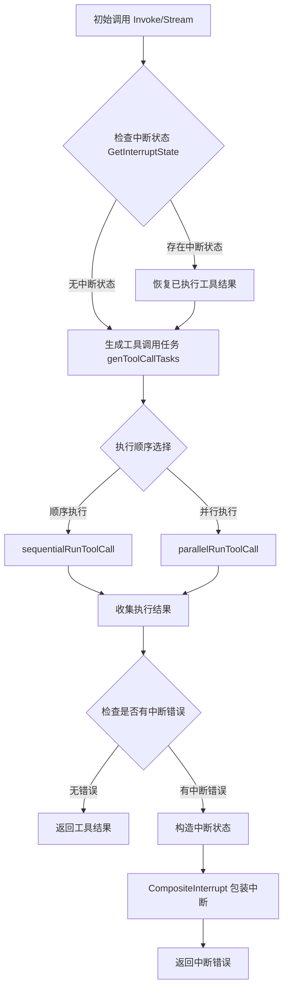

# tool_node_interrupt_components 模块技术深度解析

## 1. 问题背景与模块定位

在理解这个模块之前，让我们先思考一个实际场景：当执行一个包含多个工具调用的工作流时，可能会遇到部分工具执行成功、部分工具执行失败的情况。如果我们简单地重试整个流程，那么已经成功执行的工具会被再次执行，这不仅浪费资源，还可能导致副作用重复发生。

**这正是 `tool_node_interrupt_components` 模块要解决的核心问题**：它为工具节点提供了中断-重运行能力，能够精确跟踪哪些工具已经成功执行，哪些需要重新执行，从而实现"增量重运行"而非"全量重运行"。

## 2. 核心抽象与心智模型

这个模块的设计可以用**"断点续传"**的概念来类比理解。想象一下下载一个大文件时，如果网络中断，我们不需要从头重新下载，而是可以从中断的地方继续。这个模块做的就是类似的事情，但针对的是工具调用执行。

### 核心数据结构

#### `ToolsInterruptAndRerunExtra`
这个结构是中断元数据的"公开"版本，用于与外部系统交互：

```go
type ToolsInterruptAndRerunExtra struct {
    ToolCalls             []schema.ToolCall           // 原始助手消息中的所有工具调用
    ExecutedTools         map[string]string           // 已成功执行的标准工具及其输出
    ExecutedEnhancedTools map[string]*schema.ToolResult // 已成功执行的增强工具及其结构化输出
    RerunTools            []string                    // 需要重新执行的工具调用ID
    RerunExtraMap         map[string]any              // 每个需要重运行工具的额外元数据
}
```

#### `toolsInterruptAndRerunState`
这个结构是内部使用的状态版本，用于在执行过程中持久化：

```go
type toolsInterruptAndRerunState struct {
    Input                 *schema.Message             // 原始输入消息
    ExecutedTools         map[string]string           // 已执行的标准工具
    ExecutedEnhancedTools map[string]*schema.ToolResult // 已执行的增强工具
    RerunTools            []string                    // 需要重运行的工具
}
```

## 3. 数据流程与架构

让我们通过 Mermaid 图表来理解这个模块的数据流程：



### 关键流程解析

1. **中断状态检测与恢复**：
   - 在 `Invoke` 和 `Stream` 方法开始时，都会调用 `GetInterruptState` 检查是否存在之前的中断状态
   - 如果存在，会恢复 `ExecutedTools` 和 `ExecutedEnhancedTools` 的状态

2. **任务生成与过滤**：
   - `genToolCallTasks` 方法会根据输入消息和已执行工具状态，生成需要执行的任务列表
   - 对于已经执行过的工具，会标记为 `executed = true`，跳过实际执行

3. **中断错误处理**：
   - 在收集执行结果时，会检查是否有中断错误（通过 `IsInterruptRerunError`）
   - 如果有，会构造 `ToolsInterruptAndRerunExtra` 和 `toolsInterruptAndRerunState`
   - 最后通过 `CompositeInterrupt` 包装后返回

## 4. 设计决策与权衡

这个模块的设计体现了几个重要的权衡：

### 4.1 重复数据结构设计

**设计决策**：同时维护 `ToolsInterruptAndRerunExtra` 和 `toolsInterruptAndRerunState` 两个相似的数据结构

**权衡分析**：
- **优点**：分离了对外接口和内部实现，外部不需要知道内部状态的细节
- **缺点**：增加了代码重复和维护成本

**设计意图**：这是一个典型的"关注点分离"设计，`Extra` 结构关注的是"需要暴露给外部的信息"，而 `State` 结构关注的是"内部执行需要的完整状态"。

### 4.2 标准工具与增强工具的分离

**设计决策**：在两个结构中都分别维护了 `ExecutedTools`（标准工具）和 `ExecutedEnhancedTools`（增强工具）

**权衡分析**：
- **优点**：清晰区分了不同类型工具的执行结果，支持多种工具类型的共存
- **缺点**：增加了结构的复杂度

**设计意图**：这是为了支持系统中存在的多种工具接口（`InvokableTool`、`StreamableTool`、`EnhancedInvokableTool`、`EnhancedStreamableTool`），同时保持向后兼容。

### 4.3 中断时的流处理

**设计决策**：在 `Stream` 方法中，如果检测到中断错误，会先将所有已执行工具的流完全消费并保存

**权衡分析**：
- **优点**：确保中断时不会丢失任何已执行工具的结果
- **缺点**：在流较大时可能会增加内存使用和处理延迟

**设计意图**：这是一个"正确性优先"的设计选择，确保即使在中断情况下，我们也能完整保存所有已执行工具的结果，避免重复执行。

## 5. 关键实现细节

### 5.1 注册机制

```go
func init() {
    schema.RegisterName[*ToolsInterruptAndRerunExtra]("_eino_compose_tools_interrupt_and_rerun_extra")
    schema.RegisterName[*toolsInterruptAndRerunState]("_eino_compose_tools_interrupt_and_rerun_state")
}
```

这个 `init` 函数注册了两个类型的名称，这是为了序列化和反序列化时能够正确识别类型。这是一个常见的 Go 语言模式，用于在运行时保持类型信息。

### 5.2 工具执行任务的生成

在 `genToolCallTasks` 方法中，有一个关键的逻辑：

```go
if enhancedResult, executed := executedEnhancedTools[toolCall.ID]; executed {
    // 处理已执行的增强工具
    // ...
} else if result, executed := executedTools[toolCall.ID]; executed {
    // 处理已执行的标准工具
    // ...
} else {
    // 生成新的执行任务
    // ...
}
```

这个逻辑确保了：
1. 优先检查增强工具，因为它们提供更丰富的功能
2. 对于已执行的工具，直接恢复结果而不是重新执行
3. 对于未执行的工具，生成新的执行任务

### 5.3 中断状态的构造与传播

在收集执行结果时，如果发现中断错误，会构造中断状态：

```go
rerunExtra := &ToolsInterruptAndRerunExtra{
    ToolCalls:             input.ToolCalls,
    ExecutedTools:         make(map[string]string),
    ExecutedEnhancedTools: make(map[string]*schema.ToolResult),
    RerunExtraMap:         make(map[string]any),
}
rerunState := &toolsInterruptAndRerunState{
    Input:                 input,
    ExecutedTools:         make(map[string]string),
    ExecutedEnhancedTools: make(map[string]*schema.ToolResult),
}
```

然后通过 `CompositeInterrupt` 包装后返回，这样上层调用者就可以捕获这个中断，处理后重新调用，而我们的模块会从中断点继续执行。

## 6. 使用示例与常见模式

### 6.1 基本使用流程

```go
// 1. 创建工具节点
toolsNode, err := NewToolNode(ctx, &ToolsNodeConfig{
    Tools: []tool.BaseTool{myTool1, myTool2},
})

// 2. 第一次调用（可能会中断）
result, err := toolsNode.Invoke(ctx, inputMessage)
if err != nil {
    // 检查是否是中断错误
    if interruptInfo, ok := IsInterruptRerunError(err); ok {
        // 处理中断（例如：获取用户确认、补充信息等）
        // ...
        
        // 3. 重新调用，会自动从中断点继续
        result, err = toolsNode.Invoke(ctx, inputMessage)
    }
}
```

### 6.2 自定义中断处理

你可以通过在工具中返回特定的中断错误来触发这个机制：

```go
// 在工具实现中
func (t *MyTool) InvokableRun(ctx context.Context, args string, opts ...tool.Option) (string, error) {
    // ... 执行一些操作
    
    // 如果需要中断并等待用户输入
    if needUserInput {
        return "", NewInterruptRerunError("需要用户确认", extraInfo)
    }
    
    // ... 继续执行
}
```

## 7. 注意事项与常见陷阱

### 7.1 工具的幂等性

虽然这个模块避免了已执行工具的重复调用，但在设计工具时仍然应该考虑幂等性。因为：
- 中断可能发生在工具执行过程中，而不是完成后
- 在某些边缘情况下，工具可能仍然会被重复调用

### 7.2 增强工具与标准工具的混合使用

当同时使用增强工具和标准工具时，要注意：
- 增强工具会优先被检查和恢复
- 确保你的工具不会同时实现两种接口，或者如果实现了，确保它们的行为一致

### 7.3 流模式下的内存使用

在流模式下，如果发生中断，所有已执行工具的流会被完全消费并保存在内存中。对于大流量的工具，这可能会导致内存压力。

解决方法：
- 考虑在工具设计时限制单次输出的大小
- 或者使用标准（非流式）工具来处理大数据

### 7.4 序列化限制

由于中断状态需要被序列化，所以：
- `RerunExtraMap` 中的值必须是可序列化的
- 避免放入函数、通道等不可序列化的类型
- 如果需要传递复杂状态，考虑使用可序列化的结构

## 8. 模块间依赖关系

这个模块与以下模块有紧密的依赖关系：

- [tool_interrupt_and_rerun_state](compose_graph_engine-tool_node_execution_and_interrupt_control-tool_interrupt_and_rerun_state.md)：包含中断核心组件，这个模块是它的子模块
- [graph_run_and_interrupt_execution_flow](compose_graph_engine-graph_execution_runtime-graph_run_and_interrupt_execution_flow.md)：提供中断执行流程的基础设施
- [tool_node_api_and_data_contracts](compose_graph_engine-tool_node_execution_and_interrupt_control-tool_node_api_and_data_contracts.md)：定义工具节点的 API 和数据契约

## 9. 总结

`tool_node_interrupt_components` 模块是一个精心设计的组件，它为工具节点提供了"断点续传"能力，解决了部分执行失败时的增量重运行问题。通过分离对外接口和内部状态，支持多种工具类型，以及在流模式下的谨慎处理，它在灵活性和正确性之间取得了很好的平衡。

作为新加入团队的工程师，理解这个模块的关键是：
1. 把它想象成工具调用的"断点续传"机制
2. 注意两个相似但用途不同的数据结构
3. 理解中断检测、恢复和传播的完整流程
4. 记住在设计工具时考虑幂等性和序列化限制
