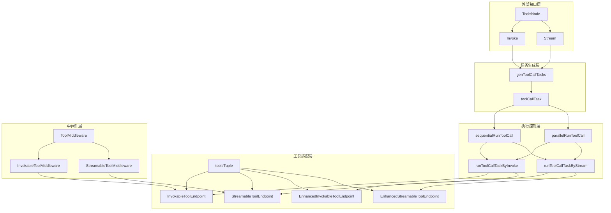

# tool_node_api_and_data_contracts 模块技术深度解析

## 概述

在构建复杂的 AI 应用程序时，工具调用（Tool Calling）是连接 LLM 与外部世界的桥梁。但工具调用的实现往往伴随着一系列挑战：如何处理并行工具调用？如何支持流式与非流式工具？如何优雅地处理工具执行中断与恢复？如何为工具调用添加通用的横切关注点（如日志、监控、错误处理）？

`tool_node_api_and_data_contracts` 模块正是为了解决这些问题而设计的。它提供了一个统一的工具调用执行层，将原始工具与图执行引擎解耦，同时提供了中间件机制、中断恢复支持、并行/串行执行控制等高级特性。

## 核心问题与设计思路

### 问题空间

在没有这个模块之前，工具调用的实现可能会面临以下问题：

1. **工具类型多样性**：工具可能是非流式的、流式的，或者支持结构化输出的增强型工具，需要统一的调用接口
2. **执行策略差异**：有时需要并行执行多个工具调用以提高效率，有时需要按顺序执行以保证正确性
3. **中断与恢复**：在复杂工作流中，工具执行可能被中断，需要能够在恢复时跳过已执行的工具
4. **横切关注点**：日志、监控、参数验证等功能需要在每个工具调用中重复实现
5. **未知工具处理**：LLM 可能会"幻觉"出不存在的工具，需要优雅的降级策略

### 设计洞察

该模块的核心设计思路是将工具调用的执行过程抽象为一个**管道**：

- **端点（Endpoint）**：工具的实际执行逻辑
- **中间件（Middleware）**：环绕端点执行的横切逻辑
- **任务（Task）**：将工具调用请求封装为可调度的任务
- **执行器（Executor）**：根据配置选择并行或串行策略执行任务

这种设计使得工具调用的各个方面可以独立演进，同时保持了统一的调用接口。

## 架构概览



这个架构图展示了 `tool_node_api_and_data_contracts` 模块的核心组件及其交互关系。数据流从 `ToolsNode` 的 `Invoke` 或 `Stream` 方法开始，经过任务生成、执行控制，最终到达工具适配层，中间件层则在工具执行前后插入横切逻辑。

## 核心组件深度解析

### ToolsNode：工具调用的统一入口

`ToolsNode` 是整个模块的门面（Facade），它封装了工具调用的所有复杂性，提供了简洁的 `Invoke` 和 `Stream` 接口。

**设计意图**：
- 作为图执行引擎与工具之间的适配器
- 统一处理流式与非流式工具调用
- 管理工具执行的生命周期（包括中断与恢复）

**关键特性**：
- 支持通过 `ToolsNodeConfig` 配置工具列表、未知工具处理器、执行策略等
- 支持通过 `ToolsNodeOption` 在调用时动态覆盖配置
- 自动处理中断恢复，跳过已执行的工具

### toolsTuple：工具的内部表示

`toolsTuple` 是一个内部数据结构，它将原始工具转换为统一的内部表示，并建立工具名到索引的映射。

**设计意图**：
- 将不同类型的工具（流式/非流式/增强型）统一封装为端点
- 建立工具名到执行端点的快速索引
- 预计算和缓存工具元数据

**内部结构**：
```go
type toolsTuple struct {
    indexes                     map[string]int  // 工具名到索引的映射
    meta                        []*executorMeta // 工具元数据
    endpoints                   []InvokableToolEndpoint
    streamEndpoints             []StreamableToolEndpoint
    enhancedInvokableEndpoints  []EnhancedInvokableToolEndpoint
    enhancedStreamableEndpoints []EnhancedStreamableToolEndpoint
}
```

### ToolMiddleware：横切关注点的注入点

`ToolMiddleware` 提供了一种机制，可以在不修改工具实现的情况下，为工具调用添加横切逻辑。

**设计意图**：
- 遵循开闭原则（Open/Closed Principle），对扩展开放，对修改关闭
- 将日志、监控、参数验证等横切关注点与工具核心逻辑分离
- 支持中间件链式组合

**四种中间件类型**：
1. `InvokableToolMiddleware`：适用于非流式工具
2. `StreamableToolMiddleware`：适用于流式工具
3. `EnhancedInvokableToolMiddleware`：适用于非流式增强型工具
4. `EnhancedStreamableToolMiddleware`：适用于流式增强型工具

**中间件执行顺序**：
中间件按注册顺序的逆序执行，即第一个注册的中间件最外层，最后一个注册的中间件最内层。

### toolCallTask：工具调用的任务封装

`toolCallTask` 将单个工具调用请求封装为一个任务，包含执行所需的所有信息和执行结果。

**设计意图**：
- 将工具调用请求与执行逻辑解耦
- 支持任务的延迟执行和结果缓存
- 为并行/串行执行提供统一的任务抽象

### 中断与恢复机制

该模块设计了完善的中断与恢复机制，核心组件包括：

1. `ToolsInterruptAndRerunExtra`：携带中断元数据，用于外部获取中断信息
2. `toolsInterruptAndRerunState`：内部状态，用于恢复执行时跳过已执行的工具

**设计意图**：
- 支持工具执行过程中的优雅中断
- 在恢复执行时，避免重复执行已成功完成的工具
- 保留足够的上下文信息，用于调试和监控

## 数据流程解析

### Invoke 流程（非流式执行）

1. **配置准备**：合并默认配置与调用时提供的选项
2. **中断状态检查**：如果是恢复执行，从上下文中提取已执行工具的结果
3. **任务生成**：将输入消息中的工具调用转换为 `toolCallTask` 列表
4. **任务执行**：根据配置选择并行或串行策略执行任务
5. **结果收集**：收集执行结果，处理错误和中断
6. **消息转换**：将工具执行结果转换为 `schema.Message` 列表

### Stream 流程（流式执行）

流式执行流程与非流式类似，但有几个关键区别：

1. **任务执行**：调用流式端点而不是非流式端点
2. **中断处理**：如果发生中断，需要先消费并缓存已启动的流
3. **结果合并**：将多个工具的输出流合并为一个统一的流

## 设计决策与权衡

### 1. 并行 vs 串行执行

**决策**：默认并行执行，但提供 `ExecuteSequentially` 选项支持串行执行

**权衡**：
- 并行执行可以显著提高多工具调用场景的吞吐量
- 但并行执行需要考虑工具之间的依赖关系和资源竞争
- 串行执行更简单、更可预测，但效率较低

### 2. 中间件设计

**决策**：为不同类型的工具提供独立的中间件接口

**权衡**：
- 优点：类型安全，中间件可以针对不同类型的工具做特定优化
- 缺点：增加了接口的复杂性，需要维护四套中间件机制

### 3. 工具类型自动适配

**决策**：自动在流式和非流式工具之间进行转换

**权衡**：
- 优点：简化了用户的使用，无论工具是什么类型，都可以通过统一的接口调用
- 缺点：转换可能会带来性能开销，并且可能丢失一些流式工具的特性（如实时性）

### 4. 中断恢复设计

**决策**：将中断状态分为内部状态（`toolsInterruptAndRerunState`）和外部元数据（`ToolsInterruptAndRerunExtra`）

**权衡**：
- 优点：内部状态可以包含实现细节，而外部元数据提供稳定的接口
- 缺点：需要维护两套结构，增加了代码复杂性

## 使用指南与最佳实践

### 创建 ToolsNode

```go
conf := &compose.ToolsNodeConfig{
    Tools: []tool.BaseTool{myTool1, myTool2},
    UnknownToolsHandler: func(ctx context.Context, name, input string) (string, error) {
        return fmt.Sprintf("工具 %s 不存在", name), nil
    },
    ExecuteSequentially: false, // 默认并行执行
    ToolArgumentsHandler: func(ctx context.Context, name, arguments string) (string, error) {
        // 可以在这里验证或修改工具参数
        return arguments, nil
    },
    ToolCallMiddlewares: []compose.ToolMiddleware{
        {
            Invokable: func(next compose.InvokableToolEndpoint) compose.InvokableToolEndpoint {
                return func(ctx context.Context, input *compose.ToolInput) (*compose.ToolOutput, error) {
                    // 前置逻辑
                    log.Printf("调用工具 %s", input.Name)
                    // 调用下一个中间件或实际工具
                    output, err := next(ctx, input)
                    // 后置逻辑
                    if err != nil {
                        log.Printf("工具 %s 调用失败: %v", input.Name, err)
                    }
                    return output, err
                }
            },
        },
    },
}

toolsNode, err := compose.NewToolNode(ctx, conf)
```

### 使用 ToolsNode

```go
// 非流式调用
messages, err := toolsNode.Invoke(ctx, assistantMessage)

// 流式调用
stream, err := toolsNode.Stream(ctx, assistantMessage)
if err != nil {
    // 处理错误
}
defer stream.Close()

for {
    msgBatch, err := stream.Recv(ctx)
    if err != nil {
        break
    }
    // 处理消息批次
}
```

## 边缘情况与注意事项

### 1. 工具执行顺序

在并行执行模式下，工具调用的执行顺序是不确定的。如果工具之间有依赖关系，必须设置 `ExecuteSequentially: true`。

### 2. 未知工具处理

如果没有设置 `UnknownToolsHandler`，调用未知工具会导致错误。建议始终设置这个处理器，以便优雅地处理 LLM 的幻觉。

### 3. 中间件错误处理

中间件应该正确地处理和传播错误。如果中间件捕获了错误但不传播，工具调用将被静默失败。

### 4. 流的关闭

在使用 `Stream` 方法时，必须确保关闭返回的 `StreamReader`，以避免资源泄漏。

### 5. 中断恢复上下文

中断恢复依赖于上下文传递状态。在恢复执行时，必须使用与中断时相同的上下文链。

## 总结

`tool_node_api_and_data_contracts` 模块是连接图执行引擎与工具的关键桥梁，它通过巧妙的设计解决了工具调用中的诸多复杂性问题。其核心价值在于：

1. **统一接口**：为不同类型的工具提供统一的调用接口
2. **灵活执行**：支持并行和串行执行策略
3. **可扩展性**：通过中间件机制支持横切关注点
4. **容错性**：支持未知工具处理和中断恢复

理解这个模块的设计思想和实现细节，将帮助你更好地使用和扩展 Eino 框架中的工具调用功能。
