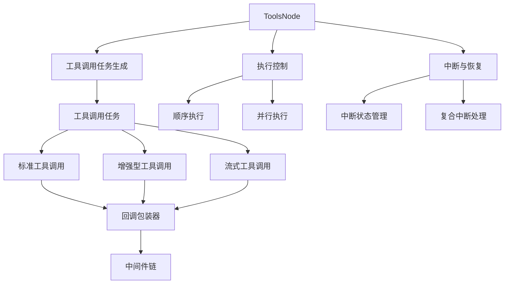

# 工具节点执行与中断控制模块

## 概述

`tool_node_execution_and_interrupt_control` 模块是 Graph Engine 的核心组件，它负责在工作流中执行工具调用并处理中断和恢复逻辑。这个模块的核心价值在于它为多工具执行环境提供了统一的执行、监控、中断和恢复机制。

想象一下，你有一个复杂的工作流，其中包含多个工具调用节点。当某个工具调用失败或需要人工干预时，你希望能够安全地中断执行，记录已完成的工作，然后在稍后从断点处恢复。这个模块就是为了解决这个问题而设计的——它就像一个智能的任务调度器，不仅能并行或顺序执行多个工具调用，还能在遇到问题时保存现场，让你有机会修复问题后继续执行。

## 架构概览



这个模块的架构围绕几个核心组件展开：

1. **ToolsNode**：整个模块的核心入口，负责协调工具调用的执行、中断和恢复。
2. **工具调用任务系统**：将输入的工具调用转换为可执行的任务，支持多种工具类型。
3. **执行控制器**：提供顺序和并行两种执行模式，满足不同场景的需求。
4. **中断与恢复机制**：这是模块最复杂也最强大的部分，它能够在执行过程中安全地中断，保存已完成的工具结果，并在恢复时跳过已执行的部分。
5. **回调和中间件系统**：为工具调用提供统一的回调和中间件支持，便于监控和扩展。

### 数据流

当 `ToolsNode` 接收到一个包含工具调用的输入消息时，数据流如下：

1. **输入解析**：从消息中提取工具调用列表
2. **任务生成**：为每个工具调用创建一个任务，检查是否有已执行的结果
3. **执行调度**：根据配置选择顺序或并行执行
4. **结果收集**：收集所有工具调用的结果
5. **中断处理**：如果发生中断，保存状态并返回复合中断错误
6. **输出构建**：将结果转换为输出消息格式

## 核心设计决策

### 1. 统一的工具执行抽象

**决策**：创建了多种工具端点类型（`InvokableToolEndpoint`、`StreamableToolEndpoint` 等）和对应的包装器，同时提供了相互转换的能力。

**原因**：不同的工具可能有不同的执行模式（同步、异步、流式），但在 `ToolsNode` 层面需要统一处理。这种设计使得无论工具本身是什么类型，都可以在 `ToolsNode` 中无缝执行。

**权衡**：
- ✅ 灵活性：支持多种工具类型
- ✅ 兼容性：可以在不同类型之间转换
- ❌ 复杂性：需要维护多种类型和转换逻辑

### 2. 复合中断机制

**决策**：实现了 `CompositeInterrupt` 机制，能够将多个子中断合并为一个，同时保留每个中断的上下文。

**原因**：`ToolsNode` 是一个复合节点，可能同时执行多个工具调用。如果其中几个工具调用需要中断，我们需要能够捕获所有这些中断，而不是在第一个中断时就停止。

**权衡**：
- ✅ 完整性：不会丢失任何中断信息
- ✅ 可恢复性：可以从所有中断点恢复
- ❌ 复杂性：中断错误的处理逻辑变得更复杂

### 3. 顺序与并行执行选择

**决策**：提供 `ExecuteSequentially` 配置选项，允许用户选择是顺序执行还是并行执行工具调用。

**原因**：不同的使用场景有不同的需求。有些工具调用可能有依赖关系，必须顺序执行；而有些工具调用是独立的，可以并行执行以提高性能。

**权衡**：
- ✅ 灵活性：满足不同场景需求
- ✅ 性能：并行执行可以提高吞吐量
- ❌ 资源消耗：并行执行需要更多的系统资源

### 4. 未知工具处理

**决策**：提供 `UnknownToolsHandler` 配置选项，允许用户自定义处理不存在的工具调用。

**原因**：LLM 可能会产生幻觉，调用不存在的工具。与其直接报错，不如提供一个机制让用户可以优雅地处理这种情况。

**权衡**：
- ✅ 鲁棒性：可以优雅处理幻觉工具调用
- ✅ 可定制性：用户可以根据需求自定义处理逻辑
- ❌ 潜在风险：如果处理不当，可能会掩盖真实问题

## 子模块概述

### [工具节点 API 与数据契约](compose_graph_engine-tool_node_execution_and_interrupt_control-tool_node_api_and_data_contracts.md)

这个子模块定义了 `ToolsNode` 的公共 API 和数据结构，包括配置选项、输入输出类型、工具中间件等。它是整个模块的门面，为用户提供了清晰的接口。

### [工具调用执行与回调包装器](compose_graph_engine-tool_node_execution_and_interrupt_control-tool_call_execution_and_callback_wrappers.md)

这个子模块负责实际执行工具调用，并为工具调用添加回调支持。它包含了多种工具类型的包装器，以及任务执行和调度的逻辑。

### [工具中断与重运行状态](compose_graph_engine-tool_node_execution_and_interrupt_control-tool_interrupt_and_rerun_state.md)

这个子模块管理工具执行过程中的中断状态和重运行逻辑。它定义了中断时需要保存的状态信息，以及如何从断点处恢复执行。

### [图级别中断与取消选项](compose_graph_engine-tool_node_execution_and_interrupt_control-graph_level_interrupt_and_cancellation_options.md)

这个子模块提供了图级别的中断和取消支持，包括中断超时配置、取消通道等。它使得外部可以安全地中断正在运行的图执行。

### [通用流与处理器适配器](compose_graph_engine-tool_node_execution_and_interrupt_control-generic_stream_and_handler_adapters.md)

这个子模块提供了通用的流处理和类型转换功能，支持在不同类型之间进行转换，以及流的合并和处理。

## 跨模块依赖

这个模块与系统的其他部分有以下关键依赖：

1. **工具契约模块**：依赖于 `tool_contracts_and_options` 模块定义的工具接口和选项。
2. **图执行运行时**：作为图执行运行时的一部分，与 `graph_execution_runtime` 模块紧密协作。
3. **回调系统**：使用 `callbacks_and_handler_templates` 模块提供的回调基础设施。
4. **模式模型**：依赖于 `schema_models_and_streams` 模块定义的消息和流模型。

## 使用指南

### 基本使用

创建一个 `ToolsNode` 的基本步骤：

```go
conf := &ToolsNodeConfig{
    Tools: []tool.BaseTool{myTool1, myTool2},
    ExecuteSequentially: false, // 并行执行
}

toolsNode, err := NewToolNode(ctx, conf)
if err != nil {
    // 处理错误
}
```

### 执行工具调用

```go
// 输入是一个包含工具调用的助手消息
input := &schema.Message{
    Role: schema.Assistant,
    ToolCalls: []schema.ToolCall{
        // 工具调用列表
    },
}

// 执行工具调用
output, err := toolsNode.Invoke(ctx, input)
```

### 处理中断和恢复

```go
output, err := toolsNode.Invoke(ctx, input)
if err != nil {
    // 检查是否是中断错误
    if info, ok := ExtractInterruptInfo(err); ok {
        // 处理中断信息
        // 稍后可以使用保存的状态恢复执行
    }
}
```

## 注意事项和陷阱

1. **工具类型兼容性**：确保你添加到 `ToolsNode` 的工具实现了至少一个工具接口（`InvokableTool`、`StreamableTool` 等）。
2. **中断状态管理**：当处理中断时，确保正确保存和恢复状态，特别是在处理复合中断时。
3. **并行执行的资源消耗**：并行执行多个工具调用可能会消耗大量系统资源，在资源受限的环境中要小心使用。
4. **未知工具处理**：使用 `UnknownToolsHandler` 时要谨慎，确保它不会掩盖真实的问题。
5. **流式输出的处理**：处理流式工具输出时，要确保正确关闭流，避免资源泄漏。
