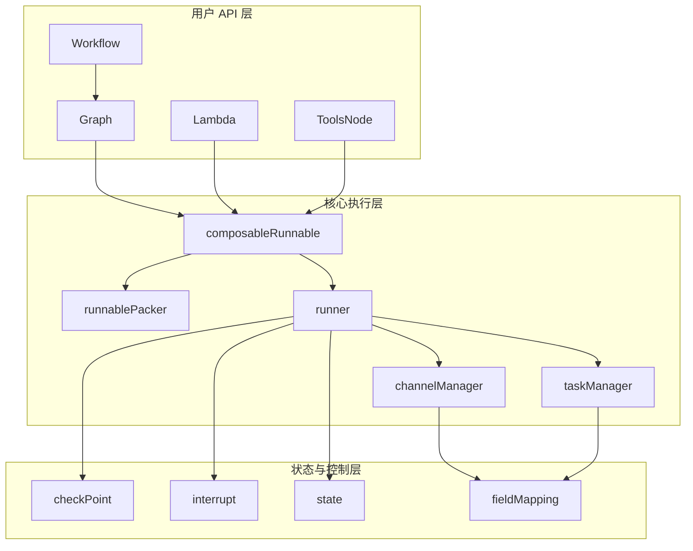
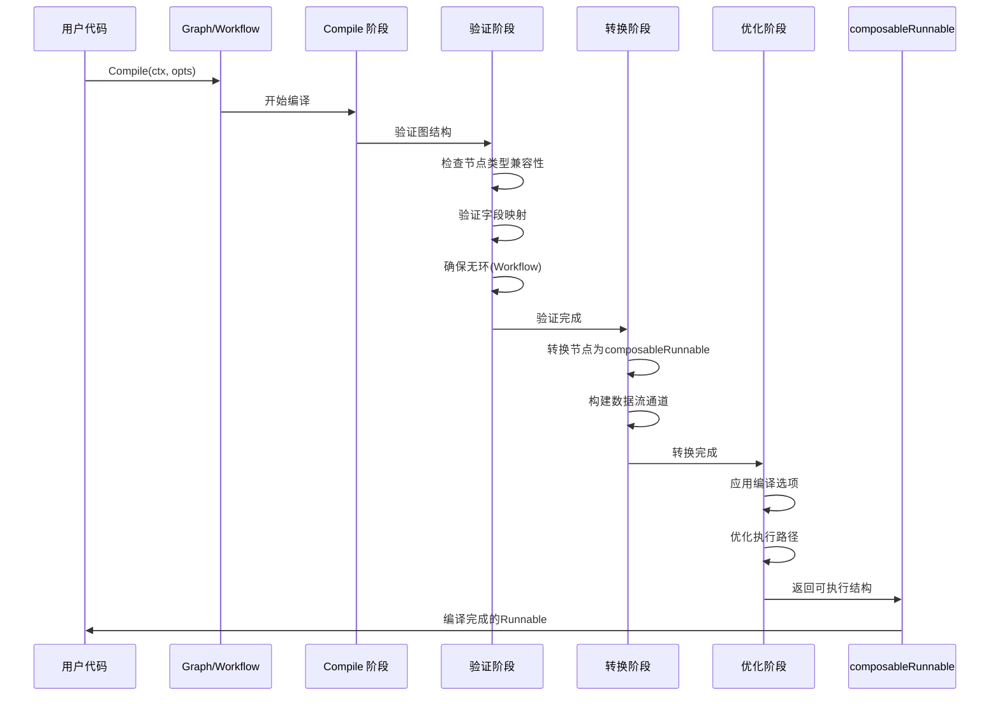

# Compose Graph Engine 技术深度解析

## 概述

`compose_graph_engine` 是一个强大的图编排引擎，专为构建和执行复杂的有向无环图 (DAG) 工作流而设计。它提供了一套完整的工具，允许开发者定义节点、节点之间的依赖关系以及字段映射，然后以高效且类型安全的方式执行该图。

### 解决的核心问题

在现代应用开发中，我们经常需要处理复杂的数据处理流程，这些流程可能包含多个步骤、条件分支和并行操作。传统的线性编程模型在处理这类问题时往往显得力不从心：

1. **复杂流程难以可视化和维护** - 当流程包含多个分支和条件时，代码变得难以理解和修改
2. **难以实现并行执行** - 手动管理并行任务和同步是一项复杂且容易出错的工作
3. **缺乏灵活性** - 硬编码的流程难以根据不同的输入进行调整
4. **错误处理困难** - 在复杂流程中，处理部分失败和恢复执行是一个挑战

`compose_graph_engine` 正是为了解决这些问题而设计的，它提供了一种声明式的方式来定义和执行复杂的工作流。

## 与其他模块的关系

`compose_graph_engine` 作为一个核心编排引擎，与系统中的其他关键模块有着紧密的联系：

### 作为基础的 [components_core](components_core.md)
`components_core` 模块提供了可在图中使用的基础组件，包括：
- 文档加载器和解析器
- 模型接口和提示模板
- 嵌入、索引和检索原语
- 工具契约和适配器

这些组件可以直接作为节点添加到图中，形成完整的处理管道。

### 被 [adk_runtime](adk_runtime.md) 使用
`adk_runtime` 模块提供了运行时环境，图引擎在其中执行。它提供：
- 代理契约和上下文
- 反应式运行时状态
- 流程运行器中断和传输

图引擎是构建在 adk_runtime 提供的基础设施之上的。

### 支持 [flow_agents_and_retrieval](flow_agents_and_retrieval.md)
`flow_agents_and_retrieval` 模块构建在图引擎之上，提供了：
- 代理编排和多代理主机
- 反应式代理运行时
- 检索策略和路由

这些高级功能利用了图引擎的强大编排能力。

了解这些关系有助于理解图引擎在整个系统中的位置，以及如何最好地利用它与其他模块协同工作。

## 核心概念

### 图 (Graph)

图是整个引擎的核心概念，它由以下几个主要部分组成：

- **节点 (Node)** - 图中的执行单元，可以是 Lambda 函数、工具节点、其他图等
- **边 (Edge)** - 定义节点之间的数据流和依赖关系
- **分支 (Branch)** - 允许基于条件进行流程控制
- **字段映射 (Field Mapping)** - 定义如何在节点之间传递数据

### 工作流 (Workflow)

Workflow 是 Graph 的一个高级封装，它简化了依赖关系的定义方式：

- 不需要显式添加边，而是通过 `AddInput` 和 `AddDependency` 方法隐式定义
- 提供了更直观的 API 来处理复杂的数据流动
- 支持静态值设置和间接依赖

### 运行时 (Runtime)

图编译后，可以通过以下四种执行模式之一运行：

1. **Invoke** - 输入 → 输出，一次性执行
2. **Stream** - 输入 → 流式输出，适合处理大结果
3. **Collect** - 流式输入 → 输出，适合处理大输入
4. **Transform** - 流式输入 → 流式输出，最灵活的执行模式

## 架构详解

### 核心组件关系

下面是 `compose_graph_engine` 模块的核心组件及其关系的 Mermaid 图：



### 编译流程

图的编译过程是将用户定义的节点和依赖关系转换为可执行结构的关键步骤：

1. **验证阶段**
   - 检查节点类型兼容性
   - 验证字段映射的有效性
   - 确保图的结构完整性

2. **转换阶段**
   - 将节点转换为 `composableRunnable`
   - 构建数据流通道
   - 准备执行环境

3. **优化阶段**
   - 应用编译选项
   - 优化执行路径
   - 准备检查点机制

下面是图编译过程的详细 Mermaid 流程图：



## 数据流动

### 数据流机制

`compose_graph_engine` 采用了一种灵活的数据流机制，允许数据在节点之间以多种方式流动：

1. **完整传递** - 将一个节点的完整输出作为下一个节点的输入
2. **字段映射** - 仅传递指定的字段，并可以进行重命名
3. **静态值** - 为节点提供预定义的静态输入
4. **多输入合并** - 从多个节点接收输入并合并

### 字段映射系统

字段映射系统是 `compose_graph_engine` 的一个核心特性，它允许精确控制数据如何在节点之间流动：

```go
// 基本字段映射
MapFields("source_field", "target_field")

// 从源节点取整个输出
FromField("source_field")

// 输出到目标节点的特定字段
ToField("target_field")

// 嵌套字段路径
MapFieldPaths(FieldPath{"user", "profile", "name"}, FieldPath{"profile", "userName"})
```

字段映射支持：
- 结构体字段访问
- 映射键访问
- 嵌套路径
- 自定义提取器

## 关键设计决策

### 为什么选择 DAG 而非通用图？

`compose_graph_engine` 明确选择了 DAG（有向无环图）作为其核心数据结构，而非支持任意图结构。这个决策基于以下考虑：

1. **执行确定性** - DAG 保证了没有循环依赖，这使得执行顺序可以被确定性地确定
2. **简化推理** - 开发者可以更容易地理解和推理 DAG 结构的工作流
3. **优化机会** - DAG 结构提供了更多的优化机会，如并行执行独立分支
4. **错误处理简化** - 在无环结构中处理部分失败和恢复更加简单

对于需要循环的场景，引擎提供了其他机制，如检查点和中断/恢复模式，而不是直接支持图中的循环。

### 类型安全 vs 灵活性

在设计 `compose_graph_engine` 时，一个关键的权衡是在类型安全和灵活性之间找到平衡：

1. **编译时类型检查** - 尽可能在编译时捕获类型错误
2. **运行时验证** - 对于无法在编译时确定的类型，提供运行时验证
3. `any` 类型支持 - 为完全灵活的场景提供 `any` 类型支持

这个平衡通过以下方式实现：
- 泛型 API 提供类型安全
- `FieldMapping` 系统在编译时验证结构
- 对于动态场景提供运行时检查

###  eager vs lazy 执行

引擎支持两种主要的执行模式：

1. **Eager 执行** (默认)
   - 节点一旦准备好就立即执行
   - 适合大多数用例
   - 可以更好地利用并行性

2. **Lazy 执行** (可选)
   - 等到所有依赖都完成后才执行
   - 适合需要精确控制执行顺序的场景
   - 可以减少资源使用

这个选择是基于实际使用场景的观察，大多数工作流受益于 eager 执行带来的并行性，而某些特定场景需要更严格的执行控制。

## 子模块概览

`compose_graph_engine` 模块被组织成几个关键子模块，每个子模块负责引擎的特定方面：

### [composition_api_and_workflow_primitives](compose_graph_engine-composition_api_and_workflow_primitives.md)
这个子模块提供了用于构建图和工作流的基本 API 和原语，包括：
- 图分支 (GraphBranch) 和链分支 (ChainBranch)
- 并行执行原语 (Parallel)
- 字段映射系统 (FieldMapping)
- 工作流定义 (Workflow)

### [graph_execution_runtime](compose_graph_engine-graph_execution_runtime.md)
这个子模块包含图执行的核心运行时引擎，处理：
- 图的核心结构 (graph)
- 执行协调器 (runner)
- 通道管理 (pregelChannel, dagChannel)
- 可运行接口 (Runnable)

### [tool_node_execution_and_interrupt_control](compose_graph_engine-tool_node_execution_and_interrupt_control.md)
这个子模块提供工具节点执行和中断控制功能：
- 工具节点 (ToolsNode)
- 中断信息 (InterruptInfo)
- 工具输入/输出 (ToolInput, ToolOutput)

### [checkpointing_and_rerun_persistence](compose_graph_engine-checkpointing_and_rerun_persistence.md)
这个子模块处理检查点和持久化重运行：
- 检查点数据结构 (checkpoint)
- 检查点管理器 (checkPointer)
- 序列化接口 (Serializer)

这些子模块共同构成了完整的图编排引擎，每个子模块都专注于特定的功能领域。

### 创建基本工作流

以下是创建和执行基本工作流的示例：

```go
// 创建工作流
wf := compose.NewWorkflow[map[string]any, map[string]any]()

// 添加节点
wf.AddLambdaNode("process", compose.InvokableLambda(func(ctx context.Context, input string) (string, error) {
    return "processed: " + input, nil
})).AddInput(START, compose.FromField("raw_data"))

wf.AddLambdaNode("format", compose.InvokableLambda(func(ctx context.Context, input string) (map[string]any, error) {
    return map[string]any{"result": input}, nil
})).AddInput("process")

// 连接到结束节点
wf.End().AddInput("format")

// 编译并执行
runnable, err := wf.Compile(context.Background())
if err != nil {
    // 处理编译错误
}

result, err := runnable.Invoke(context.Background(), map[string]any{"raw_data": "hello"})
```

### 处理条件分支

使用分支功能创建条件工作流：

```go
// 创建分支
branch := compose.NewGraphBranch(func(ctx context.Context, input map[string]any) (string, error) {
    if input["type"] == "A" {
        return "path_a", nil
    }
    return "path_b", nil
}, map[string]bool{
    "path_a": true,
    "path_b": true,
})

// 添加分支节点
wf.AddPassthroughNode("branch_point").AddInput(START)
wf.AddBranch("branch_point", branch)

// 添加不同路径的处理节点
wf.AddLambdaNode("path_a", processA).AddInput("branch_point", compose.WithNoDirectDependency())
wf.AddLambdaNode("path_b", processB).AddInput("branch_point", compose.WithNoDirectDependency())

// 两个路径都连接到结束节点
wf.End().AddInput("path_a").AddInput("path_b")
```

### 使用检查点和中断

对于长时间运行的工作流，检查点和中断功能非常有用：

```go
// 编译时设置检查点存储
runnable, err := wf.Compile(ctx, 
    compose.WithCheckPointStore(store),
    compose.WithInterruptAfterNodes([]string{"long_running_node"}))

// 第一次执行（会在指定节点后中断）
_, err := runnable.Invoke(ctx, input, compose.WithCheckPointID("checkpoint_1"))
if err != nil {
    // 提取中断信息
    info, ok := compose.ExtractInterruptInfo(err)
    if ok {
        // 处理中断，例如等待用户输入
        // ...
        
        // 恢复执行
        resumeCtx := compose.ResumeWithData(ctx, info.InterruptContexts[0].ID, resumeData)
        result, err := runnable.Invoke(resumeCtx, input, compose.WithCheckPointID("checkpoint_1"))
    }
}
```

## 高级特性

### 自定义合并函数

对于需要特殊合并逻辑的类型，可以注册自定义合并函数：

```go
// 定义自定义合并函数
compose.RegisterValuesMergeFunc(func(items []*MyType) (*MyType, error) {
    // 自定义合并逻辑
    result := &MyType{}
    for _, item := range items {
        // 合并项到结果
    }
    return result, nil
})
```

### 工具节点集成

ToolsNode 提供了与工具系统的深度集成：

```go
// 创建工具节点配置
toolsConfig := &compose.ToolsNodeConfig{
    Tools: []tool.BaseTool{myTool1, myTool2},
    ToolCallMiddlewares: []compose.ToolMiddleware{
        {
            Invokable: func(next compose.InvokableToolEndpoint) compose.InvokableToolEndpoint {
                return func(ctx context.Context, input *compose.ToolInput) (*compose.ToolOutput, error) {
                    // 工具调用前的处理
                    result, err := next(ctx, input)
                    // 工具调用后的处理
                    return result, err
                }
            },
        },
    },
}

// 添加工具节点到工作流
wf.AddToolsNode("tools", toolsNode).AddInput("previous_node")
```

## 常见陷阱与注意事项

### 字段映射中的路径分隔符

字段映射使用特殊字符 `\x1F` 作为路径分隔符，这个字符在用户定义的字段名或映射键中极其罕见。如果您的字段名包含这个特殊字符，可能会导致意外的行为。

### 循环依赖检查

Workflow 不允许循环依赖，而 Graph（在特定模式下）可以支持。如果您需要循环执行模式，请考虑使用 Graph 与检查点/中断功能，而不是尝试在 Workflow 中创建循环。

### 类型转换错误

虽然系统尽力提供类型安全，但在使用 `any` 类型或自定义字段提取器时，仍可能发生运行时类型错误。建议在关键路径上添加适当的错误处理和类型检查。

### 检查点中的流处理

当使用检查点功能时，流数据会被特殊处理。如果您的工作流依赖流式处理，请确保测试检查点保存和恢复场景，以确保行为符合预期。

## 扩展与集成

### 自定义节点类型

虽然系统提供了多种内置节点类型，但您也可以通过实现相关接口来创建自定义节点类型。主要的扩展点包括：

1. **自定义 Lambda 逻辑** - 通过 `AnyLambda` 创建复杂的 Lambda 节点
2. **工具集成** - 通过 `ToolsNodeConfig` 集成自定义工具
3. **图嵌套** - 将一个图作为另一个图的节点

### 与其他模块的关系

`compose_graph_engine` 作为一个核心编排引擎，与其他模块有重要的关系：

- **[components_core](components_core.md)** - 提供了可在图中使用的基础组件
- **[adk_runtime](adk_runtime.md)** - 提供了运行时环境和集成点
- **[flow_agents_and_retrieval](flow_agents_and_retrieval.md)** - 构建在图引擎之上，提供了代理和检索功能

这些模块共同构成了一个完整的工作流执行和代理开发框架。
