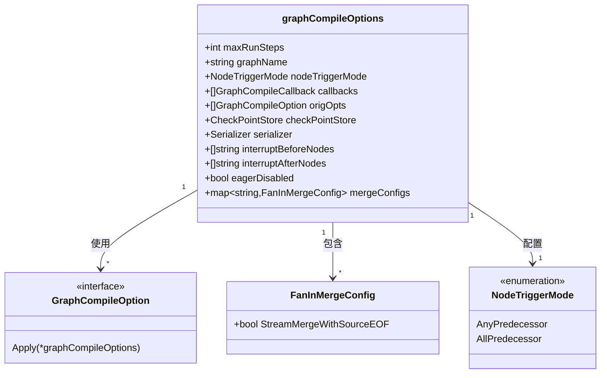
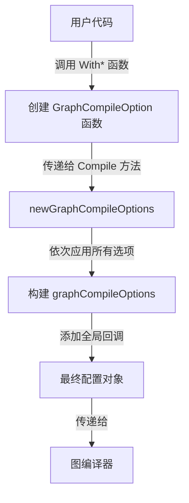

# Graph Compile Configuration 模块深度解析

## 1. 模块概述与问题定位

在分布式系统和复杂工作流编排中，图计算引擎是一个核心组件。`graph_compile_configuration` 模块位于整个 `compose_graph_engine` 系统的核心配置层，它解决的是 **"如何让一张静态定义的图在运行时表现出不同的行为特性"** 这一关键问题。

想象一下，你定义了一个相同的业务流程图，但在不同的场景下需要：
- 在测试环境中限制最大执行步数，防止死循环
- 在生产环境中启用检查点，支持故障恢复
- 在某些关键节点前后插入中断点，便于人工审核
- 控制节点的触发模式（任意前驱完成即触发 vs 所有前驱完成才触发）

如果没有这个配置模块，你需要为每种场景定义不同的图，或者在图定义中硬编码这些行为。这会导致图定义与运行时行为耦合，降低系统的灵活性和可维护性。

`graph_compile_configuration` 模块的核心价值在于：**将图的静态结构定义与动态运行时行为配置解耦**，让同一张图可以在不同的配置下表现出不同的运行特性。

## 2. 核心架构与数据模型

### 2.1 核心结构与关系



### 2.2 选项模式的设计

这个模块采用了经典的 **选项模式（Option Pattern）**，通过函数式编程的方式来构建配置对象。这种设计有几个显著的优点：

1. **灵活性**：可以只设置需要的选项，其他选项保持默认值
2. **可扩展性**：添加新的配置选项不需要修改现有代码
3. **可读性**：调用代码清晰地表达了意图

## 3. 核心组件深度解析

### 3.1 graphCompileOptions 结构

`graphCompileOptions` 是整个模块的核心，它收集并存储所有图编译时的配置选项。让我们深入分析每个字段的设计意图：

#### 3.1.1 执行控制类配置

**maxRunSteps**：限制图的最大执行步数。这是一个防止死循环的安全机制，特别适用于包含循环的图结构。在测试环境中，你可能希望设置一个较小的值来快速发现问题；在生产环境中，你可能设置一个较大的值或者不设置（值为0表示不限制）。

**nodeTriggerMode**：控制节点的触发时机。这是一个影响图执行语义的核心配置：
- `AnyPredecessor`：任意一个前驱节点完成就触发当前节点（类似Pregel模型）
- `AllPredecessor`：所有前驱节点都完成才触发当前节点（类似DAG执行）

这个选择直接影响图的执行顺序和并行度，需要根据业务场景仔细选择。

#### 3.1.2 执行增强类配置

**checkPointStore** 和 **serializer**：这两个字段配合使用，实现图执行的检查点和恢复功能。在长时间运行的工作流中，故障恢复是一个关键需求。通过定期保存执行状态，系统可以在失败后从最近的检查点恢复，而不需要重新执行整个流程。

**interruptBeforeNodes** 和 **interruptAfterNodes**：允许在指定节点的执行前后插入中断点。这对于需要人工审核的场景非常有用，比如在执行关键操作前暂停，等待人工确认。

#### 3.1.3 执行优化类配置

**eagerDisabled**：控制是否禁用"急切执行"模式。在急切执行模式下，节点一旦准备好就立即执行，而不需要等待整个超级步（super step）完成。这可以提高并行度和执行效率，但也会增加系统的复杂性。

值得注意的是，`WithEagerExecution` 函数现在已经被标记为废弃，这表明系统的设计理念发生了变化：急切执行现在是根据节点触发模式自动决定的，而不是一个独立的配置选项。

#### 3.1.4 数据流控制类配置

**mergeConfigs**：为具有多个输入源的节点配置合并策略。`FanInMergeConfig` 结构目前只有一个字段 `StreamMergeWithSourceEOF`，它控制在合并多个流时，是否在每个流结束时发出 `SourceEOF` 错误。这对于追踪各个输入流的完成状态非常有用。

### 3.2 FanInMergeConfig 结构

这个结构虽然简单，但它体现了系统的一个重要设计理念：**数据流的精细控制**。在处理多个输入流时，了解每个流的完成状态对于正确处理数据至关重要。

想象一个场景，你有多个数据源同时 feeding 到一个处理节点，你需要知道每个数据源何时完成，以便进行一些清理工作或后续处理。通过设置 `StreamMergeWithSourceEOF` 为 `true`，你可以在每个流结束时收到通知，而不必等到所有流都结束。

## 4. 数据流程与依赖关系

### 4.1 配置构建流程



### 4.2 典型使用场景

让我们通过一个典型的使用场景来理解这个模块如何融入整个系统：

1. **图定义**：用户首先定义图的结构（节点和边），这部分不涉及任何运行时配置
2. **配置构建**：用户通过调用各种 `With*` 函数来构建编译选项
3. **图编译**：将图定义和编译选项一起传递给编译器
4. **图执行**：编译后的图按照配置的行为执行

这种分离使得同一张图可以在不同的配置下运行，极大地提高了代码的复用性。

### 4.3 与其他模块的交互

这个模块在整个系统中扮演着 **"配置提供者"** 的角色，它主要被以下模块使用：

- **[graph_definition_and_compile_configuration](compose_graph_engine-graph_definition_and_compile_configuration.md)**：使用这些配置来编译图
- **[graph_run_and_interrupt_execution_flow](compose_graph_engine-graph_execution_runtime-graph_run_and_interrupt_execution_flow.md)**：在运行时使用这些配置来控制执行行为
- **checkpointing_and_rerun_persistence**：使用检查点存储和序列化器来实现持久化

## 5. 设计决策与权衡

### 5.1 选项模式 vs 配置对象模式

在设计配置模块时，常见的有两种选择：
1. **选项模式**：通过函数来设置配置
2. **配置对象模式**：直接暴露配置结构，让用户设置字段

这个模块选择了选项模式，主要基于以下考虑：

**优点**：
- 更好的封装性：内部结构可以自由变化，只要保持选项函数的接口不变
- 更清晰的API：用户只需要了解他们需要的选项，而不需要面对整个配置结构
- 更好的默认值处理：未设置的选项自动使用合理的默认值

**缺点**：
- 代码量稍多：需要为每个配置项创建一个函数
- 发现性稍差：用户需要查看文档来了解有哪些选项可用

在这个场景下，选项模式的优点明显大于缺点，因为它提供了更好的向前兼容性和API稳定性。

### 5.2 全局回调 vs 实例回调

系统中有两种设置回调的方式：
1. `WithGraphCompileCallbacks`：为单个图实例设置回调
2. `InitGraphCompileCallbacks`：设置全局回调，应用于所有顶层图

这种设计反映了一个常见的权衡：**便利性 vs 灵活性**。全局回调提供了便利性，让你可以在一个地方设置所有图都需要的回调；而实例回调提供了灵活性，让你可以为特定的图设置特定的回调。

需要注意的是，全局回调只应用于顶层图，这避免了在子图中重复执行回调的问题。

### 5.3 急切执行的自动管理

如前所述，`WithEagerExecution` 函数现在已经被标记为废弃，这是一个有趣的设计演变。最初，急切执行是一个独立的配置选项，但现在它是根据节点触发模式自动决定的。

这种变化背后的思考是：**系统应该根据用户的高层意图自动做出低层决策**。用户只需要关心节点的触发模式（AnyPredecessor 或 AllPredecessor），而不需要关心是否启用急切执行这样的低层细节。

这是一个很好的 **"渐进式披露"** 设计原则的例子：系统在默认情况下隐藏复杂性，只在需要时才暴露给用户。

## 6. 使用指南与最佳实践

### 6.1 基本使用

```go
// 创建编译选项
opts := []compose.GraphCompileOption{
    compose.WithMaxRunSteps(1000), // 限制最大执行步数
    compose.WithGraphName("my-workflow"), // 设置图名称
    compose.WithNodeTriggerMode(compose.AllPredecessor), // 设置触发模式
    compose.WithEagerExecutionDisabled(), // 禁用急切执行
}

// 编译图
graph, err := myGraph.Compile(ctx, opts...)
if err != nil {
    // 处理错误
}
```

### 6.2 高级配置

```go
// 设置检查点存储
checkpointStore := myCheckpointStore{}
serializer := mySerializer{}

// 设置中断点
interruptBefore := []string{"approval-node"}
interruptAfter := []string{"data-collection-node"}

// 设置合并配置
mergeConfigs := map[string]compose.FanInMergeConfig{
    "merge-node": {
        StreamMergeWithSourceEOF: true,
    },
}

opts := []compose.GraphCompileOption{
    compose.WithCheckpointStore(checkpointStore),
    compose.WithSerializer(serializer),
    compose.WithInterruptBeforeNodes(interruptBefore),
    compose.WithInterruptAfterNodes(interruptAfter),
    compose.WithFanInMergeConfig(mergeConfigs),
}
```

### 6.3 最佳实践

1. **总是设置 maxRunSteps**：在生产环境中，即使你认为图不会有死循环，设置一个合理的最大值也是一个好习惯。

2. **使用有意义的 graphName**：在有多个图的系统中，有意义的名称对于调试和日志分析非常有帮助。

3. **根据业务场景选择触发模式**：
   - 如果你需要最大的并行度，并且节点之间没有严格的依赖顺序，使用 `AnyPredecessor`
   - 如果你需要确保所有输入都准备好后再处理，使用 `AllPredecessor`

4. **谨慎使用全局回调**：全局回调会应用于所有顶层图，确保它们不会产生意外的副作用。

## 7. 常见问题与注意事项

### 7.1 已知的限制

1. **maxRunSteps 的计数方式**：这个值计算的是"超级步"（super steps）的数量，而不是单个节点执行的数量。在 `AnyPredecessor` 模式下，一个超级步可能包含多个节点的执行。

2. **中断点的位置**：中断点只能在节点的前后设置，不能在节点执行过程中设置。如果你需要更细粒度的控制，考虑将节点拆分成多个较小的节点。

3. **合并配置的范围**：`mergeConfigs` 是按节点名称配置的，如果你重命名了节点，记得更新相应的配置。

### 7.2 常见陷阱

1. **忘记保存 origOpts**：`graphCompileOptions` 结构保存了原始的选项函数，这对于子图的编译非常重要。如果你创建自定义的配置处理逻辑，记得保留这些原始选项。

2. **在子图中使用全局回调**：如前所述，全局回调只应用于顶层图。如果你需要在子图中也有回调，需要通过其他方式设置。

3. **过度使用 eagerDisabled**：禁用急切执行会降低并行度，只有在确实需要同步执行的情况下才使用。

## 8. 总结与展望

`graph_compile_configuration` 模块是一个看似简单但设计精良的配置模块，它体现了几个重要的设计原则：

1. **关注点分离**：将图的结构定义与运行时配置分离
2. **选项模式**：提供灵活、可扩展的配置API
3. **渐进式披露**：默认隐藏复杂性，只在需要时暴露
4. **向后兼容**：通过废弃机制平滑地演进API

这个模块虽然不包含复杂的业务逻辑，但它是整个图计算引擎的重要基础设施，为上层提供了灵活、可靠的配置支持。对于新加入团队的开发者，理解这个模块的设计理念和使用方式，将有助于更好地使用和扩展整个图计算系统。
