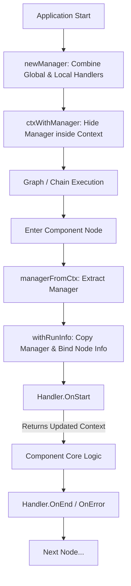

# Core Abstractions (Callbacks System)

## 1. 为什么这个模块存在 (Why this module exists)

在构建复杂的 LLM 应用（如多 Agent 协同、编排图 Graph 或链式调用 Chain）时，数据的执行流往往深埋在被高度抽象的组件（如大模型、检索器、工具）内部。当我们需要对系统进行可观测性建设（如日志记录、链路追踪 Tracing、耗时统计或指标打点）时，如果采用朴素的方案——将 Logger 或 Tracer 直接传递进每个组件内部，会导致严重的逻辑耦合，并且破坏组件的通用性。

`core_abstractions` 模块解决的正是这个问题。它提供了一套**基于上下文（Context）驱动的轻量级、非侵入式回调机制**。
你可以将这个模块想象成一个“隐形的随车观察员”。数据的流转载体是 `context.Context`，而回调系统的管理者（`manager`）就潜伏在这个 Context 中。每当执行流到达某个节点（例如准备调用大模型）时，节点会唤醒这位观察员，向其汇报自己的身份（`RunInfo`）和输入数据。观察员不仅能记录信息，还能顺手给 Context 塞入一些追踪标记（如 Trace Span），这一切对业务组件的核心逻辑完全透明。

## 2. 架构与数据流 (Architecture & Data Flow)



**心智模型：**
1. **潜入 Context**：在任务最开始，系统会收集所有的全局拦截器和局部拦截器，将它们打包进一个 `manager` 实例，并隐藏在 `context.Context` 中。
2. **写时复制（Copy-on-Write）绑定**：当流转到具体的图节点时，执行器会把 `manager` 拔出来。为了不干扰同时在运行的其他并行节点，它会克隆一份 `manager`，并打上当前节点的专属烙印（`RunInfo`），然后再放回一个新的 Context 中。
3. **前置拦截（OnStart）**：在组件真正干活前，触发所有回调的 `OnStart`。这些回调可以修改并返回新的 Context，形成责任链。
4. **后置拦截（OnEnd/OnError）**：组件干完活后，带着成功的结果或报错，再次触发回调进行收尾（如闭合 Trace Span、记录耗时）。

## 3. 核心组件深度解析 (Component Deep-dives)

### 3.1 `RunInfo` 与 I/O 抽象
```go
type RunInfo struct {
        Name      string               // 节点名称（用于展示视图，非唯一）
        Type      string               // 组件类型（如 chat_model, retriever）
        Component components.Component // 具体的组件实例引用
}
type CallbackInput any
type CallbackOutput any
```
- **设计意图**：`RunInfo` 是执行上下文的“身份证”，告诉回调函数“当前是谁在干活”。它使得跨组件通用的回调处理器（如耗时统计器）能够对所有的 `RunInfo.Type` 做出相应的打点聚合。
- **抽象视角**：输入和输出被定义为极度抽象的 `any`（空接口）。因为系统的回调需要拦截千姿百态的组件，模型处理的是 `[]*schema.Message`，检索器处理的是 `string`，工具处理的是 `JSON`。使用 `any` 提供了一个统一的网关。（*注：更上层的模块提供了类型安全的模板化封装来解决泛型缺失带来的不便*）。

### 3.2 `Handler` (回调契约)
```go
type Handler interface {
        OnStart(ctx context.Context, info *RunInfo, input CallbackInput) context.Context
        OnEnd(ctx context.Context, info *RunInfo, output CallbackOutput) context.Context
        OnError(ctx context.Context, info *RunInfo, err error) context.Context
        
        OnStartWithStreamInput(ctx context.Context, info *RunInfo, input *schema.StreamReader[CallbackInput]) context.Context
        OnEndWithStreamOutput(ctx context.Context, info *RunInfo, output *schema.StreamReader[CallbackOutput]) context.Context
}
```
- **核心机制**：这是整个可观测性系统的底层接口。它严格区分了同步执行（前三个方法）和流式执行（后两个带 `Stream` 的方法）。
- **为什么返回 `context.Context`？** `OnStart` 不仅接收 Context，**必须**返回 Context。这是一个非常关键的设计——它允许底层如 OpenTelemetry 的插件在 `OnStart` 中创建一个 Span，并将其注入到 Context 中返回。随后业务组件使用的就是这个带有 Span 的 Context，从而实现完美的链路追踪连贯性。

### 3.3 `manager` (内部协调者)
`manager` 是一个私有结构体，负责维护拦截器列表。
```go
func (m *manager) withRunInfo(runInfo *RunInfo) *manager {
        if m == nil { return nil }
        n := *m
        n.runInfo = runInfo
        return &n
}
```
- **内部机制**：`withRunInfo` 实现了一个极其优雅的**写时复制（Copy-on-Write）** 模式。
- **设计推理**：在并发图引擎（如 Parallel 节点）中，多个节点可能共享同一个父 Context。如果直接修改 `m.runInfo`，会引发严重的数据竞争。通过 `n := *m` 进行浅拷贝，每个分支节点都能以极低的开销获得一个独立的 manager 副本，**全程实现了无锁（Lock-free）并发安全**。

## 4. 依赖关系与数据契约 (Dependency Analysis)

- **模块的架构角色**：该模块是框架“可观测性底座”的绝对核心枢纽。它不实现任何具体的日志或追踪逻辑，只负责制定契约，并借助 Context 将生命周期广播至全剧。
- **依赖谁 (Depends on)**：依赖 `schema` 模块（处理流式 `StreamReader` 的定义）和 `components` 模块中的核心接口（作为 `RunInfo` 中的 Component 标识）。
- **谁依赖它 (Depended by)**：
  - **`typed_templates` 模块**：直接依赖 `Handler` 接口，通过组合包装将其转化为各组件特化的、类型安全的 Handler（如 `ModelCallbackHandler`）。
  - **`compose` 图引擎模块**：在图的每一步流转中，都会依赖这里的 manager 进行 Context 的管理和生命周期的触发。
  - **各路中间件与具体组件**：都在运行时依赖 Context 提取 manager 来报告进度和暴露状态。

## 5. 设计决策与权衡 (Design Decisions & Tradeoffs)

### 5.1 泛型缺失 vs 统一接口 (`any` 的使用)
- **决策**：选择 `any` 作为统一的 `CallbackInput/Output`，而不是将 `Handler` 接口泛型化（如 `Handler[I, O]`）。
- **权衡**：这是在“灵活度”与“类型安全”之间的妥协。如果 `Handler` 是强类型泛型的，那么 `manager` 就无法用一个统一的 `[]Handler` 切片来容纳所有的拦截器。这好比机场的安检传送带，为了能让所有的行李（不管是背包还是纸箱）都能放上来统一过检，牺牲了针对某种特定行李类型（Type）的预设检查轨道。这也意味着，开发者在直接使用底层 `Handler` 时，需要承担运行时 `Type Assertion`（类型断言）的成本。

### 5.2 强耦合的同步执行 (Synchronous Context Return)
- **决策**：回调方法（如 `OnStart`）是同步执行且阻塞主执行流的，并且要求显式返回更新后的 Context。
- **权衡**：通常对于纯日志记录，我们会倾向于“触发即走（Fire-and-forget）”的异步模式以提升性能。但为了能够支持分布式追踪（Tracing）对 Context 层级传递的刚性需求（比如将 Parent Span ID 传递给被调用的组件），本模块刻意选择了同步阻塞模型。这也意味着，任何耗时或可能挂起的操作，都不应该直接阻塞在回调函数的同步主干逻辑中，这形成了一道硬性的契约。

## 6. 避坑指南与最佳实践 (Edge Cases & Gotchas)

对于新加入团队并准备基于该模块开发拦截器（如自定义 Metrics 插件）的开发者，请务必注意以下几点：

1. **类型断言导致的 Panic**
   由于 Input/Output 是 `any`，切忌进行盲目的类型强转（如 `val := input.(string)`）。必须始终使用安全断言模式：`if val, ok := input.(string); ok { ... }`，否则在处理非预期组件的流转时会引发不可预知的空指针异常或宕机。
   *推荐做法：尽可能使用 [typed_templates](typed_templates.md) 模块中已经为你封装好的强类型 Helper 模板来构建你的观测逻辑。*

2. **阻塞主执行流**
   由于 `OnStart` 会在组件真正发起调用（如请求几十秒的 LLM 网络交互）之前被同步调用，如果在你的 Handler 里包含了耗时的网络请求（比如向外部监控平台同步打点数据），会直接拖慢整个应用的响应耗时。**涉及 IO 操作或大计算量的观测逻辑务必发送到 Go channel 交给后台 goroutine 异步处理**。

3. **流式数据（Stream）的“薛定谔”拦截**
   在实现 `OnEndWithStreamOutput` 时，传递进来的是一个 `*schema.StreamReader`。
   **大坑警告**：如果你在回调中直接调用 `Recv()` 把流里的数据读出来用于记录全量输出（例如打印生成文本），那么下游真实的业务组件将面临 `EOF`（数据流已被你拦截并抽干）！如果你的 Handler 既需要提取数据留底又需要保持流顺畅通过，必须依赖框架在流处理上提供的 `StreamReader` 复制或转发工具机制（类似 Linux 的 `tee` 命令），千万不可越俎代庖直接消耗原始数据流。

4. **不可伪造的 Context Manager**
   由于 `manager` 挂载在 Context 上时使用的是私有空结构体 `CtxManagerKey{}`，外部包是无法通过 `ctx.Value` 伪造或强行提取覆盖它的。必须使用暴露的 `managerFromCtx` 和 `ctxWithManager` 等正规行为接口来操作。这个小细节有效保证了框架内部执行状态的防篡改和健壮性。