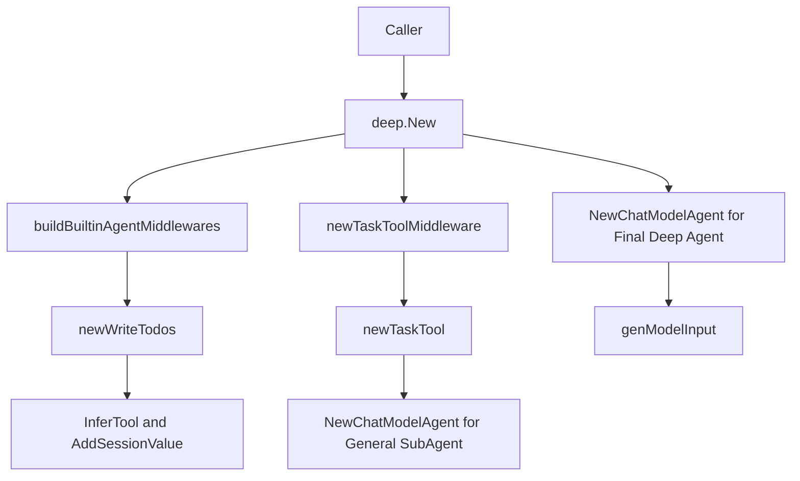

# deep_agent_composition（`adk/prebuilt/deep/deep.go`）技术深潜

`deep_agent_composition` 的核心价值，不是“再包一层 agent”，而是把“深度任务执行”里最容易散掉的三件事——**任务拆分入口（task tool）**、**执行过程记忆（todos）**、**统一的 ChatModelAgent 装配**——收敛成一个可复用的构造函数 `New`。你可以把它想成一个“预制指挥部”：上游只给配置，它就把指挥规则、协作工具和执行引擎组装好，最终返回一个可恢复（`adk.ResumableAgent`）的深度研究型 agent。没有这层组合，调用方通常会在多个地方手工拼 middleware、拼 tools、拼 instruction，结果是行为不一致、扩展点分散、回归风险高。

---

## 1. 这个模块要解决什么问题？

在复杂任务场景中，单次 LLM 回答往往不够：需要多轮推理、调用工具、可能还要把子任务转给子 agent。朴素做法是每个业务方都手工创建 `adk.ChatModelAgentConfig`，自己决定要不要挂 task tool、要不要挂 todo 工具、怎么拼 system prompt、怎么处理子 agent。问题在于：

一是**装配逻辑重复**。同一套“深度代理”能力会在不同入口被复制粘贴；

二是**行为漂移**。有的入口忘了加 `write_todos`，有的入口给了不同 instruction，最后“同名 deep agent”行为不一致；

三是**扩展困难**。比如要统一加一个内建 middleware，若没有中心化装配点，就要改很多调用处。

这个模块通过一个 `Config` + `New` 的组合，把“默认能力 + 可选能力 + 用户注入能力”组织成一条确定的构建路径，目标是让 deep agent 的创建方式**标准化且可裁剪**。

---

## 2. 心智模型：把它当成“分层装配线”

理解本模块最有效的方式是把它看成三层装配线：

- **底座层**：`adk.NewChatModelAgent` 提供通用 agent 运行时；
- **内建能力层**：`buildBuiltinAgentMiddlewares` 决定是否注入 `write_todos`；
- **协作编排层**：`newTaskToolMiddleware`（来自 `task_tool` 子模块）把“任务分发给子 agent”的能力封装成 tool middleware。

`New` 的工作就是按顺序把这三层叠起来，再把用户传入的 `cfg.Middlewares` 和 `cfg.ToolsConfig` 合并进去。类比真实世界：底座是操作系统，内建能力像系统服务，task tool 像调度器插件，而 `Config` 是安装脚本。

---

## 3. 架构与数据流



主路径从调用方进入 `New(ctx, cfg)` 开始。`New` 先调用 `buildBuiltinAgentMiddlewares(cfg.WithoutWriteTodos)`，这里唯一的内建 middleware 是通过 `newWriteTodos` 生成的 `write_todos` 工具型 middleware。随后，`New` 会根据 `WithoutGeneralSubAgent` 和 `SubAgents` 的组合判断是否需要接入 task tool；如果需要，就调用 `newTaskToolMiddleware(...)`。这个步骤可能在内部再调用一次 `adk.NewChatModelAgent` 来创建“通用子 agent”（general subagent），再把它和显式 `SubAgents` 一起暴露给 task tool。

最后 `New` 调用 `adk.NewChatModelAgent` 产出最终 deep agent，并把 `GenModelInput` 固定为本模块提供的 `genModelInput`。运行时当 agent 需要向模型发请求时，`genModelInput` 会把 `instruction`（转成 `schema.SystemMessage`）和 `input.Messages` 拼成模型输入消息序列。

一个关键的数据副作用发生在 `write_todos` 被调用时：`newWriteTodos` 里定义的函数会执行 `adk.AddSessionValue(ctx, SessionKeyTodos, input.Todos)`，把结构化 TODO 列表写入 run session。这让 TODO 不只是“回复文本”，而是可被后续步骤读取的状态。

---

## 4. 组件深潜

## `Config`

`Config` 是 deep agent 的单一装配描述。字段设计体现了“预置默认 + 可禁用 + 可注入”：

- 基本身份：`Name`、`Description`。
- 核心执行：`ChatModel`、`ToolsConfig`、`MaxIteration`、`ModelRetryConfig`。
- 行为指导：`Instruction`（为空时回退到 `baseAgentInstruction`）。
- 多 agent 协作：`SubAgents`、`WithoutGeneralSubAgent`、`TaskToolDescriptionGenerator`。
- 内建能力开关：`WithoutWriteTodos`。
- 扩展注入：`Middlewares`。
- 输出落盘（会话态）：`OutputKey`。

这里最值得注意的是布尔开关风格：用 `WithoutXxx` 而非 `EnableXxx`。这意味着默认策略是“开启推荐能力”，调用方显式选择关闭。这种 API 倾向于提高开箱即用体验，但代价是调用方需要理解默认行为，而不是从字段名直接看出“启用项”。

## `New(ctx, cfg)`

`New` 是模块的编排中枢，按以下顺序做决定：

1. 构建内建 middleware（当前是 todos）。
2. 解析 instruction（空则使用 `baseAgentInstruction`）。
3. 判断是否需要 task tool middleware：条件是 `!cfg.WithoutGeneralSubAgent || len(cfg.SubAgents) > 0`。
4. 汇总 middleware 并创建最终 `adk.ChatModelAgent`。

一个非显然但重要的点：传给 `newTaskToolMiddleware` 的 middleware 是 `append(middlewares, cfg.Middlewares...)`，即 task tool 里创建 general subagent 时会继承当前可见的 middleware 集；而最终 deep agent 再次接收 `append(middlewares, cfg.Middlewares...)`。这保证了“主 agent 与通用子 agent”在策略上尽量一致。

## `genModelInput(ctx, instruction, input)`

它的策略非常克制：如果 `instruction != ""`，先放一条 `schema.SystemMessage(instruction)`，再拼 `input.Messages`。没有模板展开、没有额外注入。这样做的好处是行为可预测，坏处是高级输入整形能力要交给上层 middleware 或替换到别的 agent 构造逻辑中。

## `buildBuiltinAgentMiddlewares(withoutWriteTodos)`

这是内建能力注册器，目前只处理 `write_todos`。这个函数存在的意义不是逻辑复杂，而是保留了“内建能力集合可增长”的结构位。如果未来要加新的 built-in middleware，不必污染 `New` 的主流程。

## `TODO` 与 `writeTodosArguments`

`TODO` 定义了会话中持久化的任务单元：`Content`、`ActiveForm`、`Status`，其中 `Status` 用 `jsonschema` 枚举约束为 `pending/in_progress/completed`。`writeTodosArguments` 则把工具输入约束为 `Todos []TODO`。这组类型通过 `init` 中的 `schema.RegisterName` 注册了稳定类型名，服务于序列化/反序列化场景。

## `newWriteTodos()`

该函数用 `utils.InferTool` 从 Go 函数签名推导出 `tool.InvokableTool`，工具名固定为 `write_todos`。工具执行时：

- 把 `input.Todos` 写入 session（`AddSessionValue`）；
- 用 `sonic.MarshalString` 把 todos 序列化，返回确认文本。

最后包装成 `adk.AgentMiddleware`，同时注入 `AdditionalInstruction`（`writeTodosPrompt`）和 `AdditionalTools`（该工具本身）。

这是一种“工具即状态提交接口”的设计：模型不是直接改内部状态，而是通过显式 tool call 进行状态变更，便于审计和回放。

---

## 5. 依赖关系分析（调用它的 / 它调用的）

从模块内调用图看，核心关系非常集中：`New -> buildBuiltinAgentMiddlewares -> newWriteTodos`。这说明 deep.go 自身承担的是**装配职责**，不是执行引擎。

向外依赖方面，本模块主要依赖四类能力：

- Agent 运行时：`adk.NewChatModelAgent`（最终实例化 agent）；
- 子任务分发：`newTaskToolMiddleware`（来自 task tool 子模块）；
- 工具推导：`utils.InferTool`（把 typed function 变成工具）；
- 会话状态：`adk.AddSessionValue`（把 todos 写入 run session）。

反向看谁“调用它”：任何需要构造深度研究型 agent 的上层入口会调用 `deep.New`，并期待得到 `adk.ResumableAgent`。这个返回契约意味着上游通常会把它交给 Runner 体系执行与恢复。

契约层面最关键的是：

- `ChatModel` 必须满足 `model.ToolCallingChatModel`；
- `Name`/`Description`/`Model` 的有效性最终由 `adk.NewChatModelAgent` 校验（缺失会报错）；
- `write_todos` 写入的 session key（`SessionKeyTodos`）是隐式共享约定，消费方必须使用同一 key 才能读到。

---

## 6. 设计决策与权衡

这个模块明显选择了“**组合优先**”而非“继承/专用 runtime”。它不改 ChatModelAgent 内核，而是通过 middleware 和 tool 注入能力。这降低了维护成本并复用现有生态，但也带来一个代价：能力边界受 `AgentMiddleware` 机制限制，若要做跨循环的深度控制，可能需要修改更底层模块。

在“简单 vs 灵活”上，它给了一个平衡点：

- 简单：一键 `New`，默认带 instruction 与常用工具；
- 灵活：可关闭 `write_todos`、关闭 general subagent、替换 task tool 描述生成器、继续叠加自定义 middleware。

在“解耦 vs 一致性”上，它偏向一致性。通过在主 agent 和 general subagent 复用同一 middleware 集，减少行为分叉；但这也提高了耦合，某个 middleware 若不适配子 agent 场景，影响会同时扩散到两侧。

---

## 7. 使用方式与示例

```go
ctx := context.Background()

agent, err := deep.New(ctx, &deep.Config{
    Name:        "deep_research_agent",
    Description: "Handle complex multi-step research tasks",
    ChatModel:   myToolCallingModel, // model.ToolCallingChatModel

    Instruction: "You are a rigorous research agent.",
    ToolsConfig: adk.ToolsConfig{
        Tools: myTools,
    },
    SubAgents:     mySubAgents,
    MaxIteration:  30,
    OutputKey:     "final_answer",
    Middlewares:   myMiddlewares,
    ModelRetryConfig: &adk.ModelRetryConfig{
        // 根据实际配置填写
    },
})
if err != nil {
    // handle error
}

_ = agent // adk.ResumableAgent
```

常见定制模式是先保持默认（含 `write_todos` 与 general subagent），观察行为后再做减法：例如在高确定性任务中关闭 `WithoutGeneralSubAgent` 以收缩搜索空间，或在已有外部任务系统时关闭 `WithoutWriteTodos` 避免状态重复。

---

## 8. 边界条件与新贡献者易踩坑

第一类坑来自 middleware 叠加。`New` 在构建 task tool 与最终 agent 时都使用 `append(middlewares, cfg.Middlewares...)`，意味着你传入的 middleware 可能影响主 agent和内部 general subagent 两条链路。若 middleware 依赖某些只在主链路存在的上下文，可能出现非预期行为。

第二类坑是 session 语义。`newWriteTodos` 使用 `AddSessionValue`，而该函数在 session 不存在时会静默返回，不报错。这会导致“工具调用成功文本返回了，但状态没落盘”的错觉；排查时要先确认运行上下文是否携带了有效 run session。

第三类坑是配置前置校验分散。`deep.New` 本身不校验 `cfg.Name`、`cfg.Description`、`cfg.ChatModel`，错误会在 `adk.NewChatModelAgent` 处抛出。对调用方来说，错误来源看起来“偏后置”，调试时要知道这层转发关系。

第四类是 task tool 触发条件：只要 `!WithoutGeneralSubAgent` 或 `len(SubAgents)>0`，就会创建 task tool middleware。新同学常误以为“没有显式 SubAgents 就不会有 task tool”，但默认 general subagent 会让条件成立。

---

## 9. 与其他模块的关系（参考阅读）

建议按下面顺序阅读，建立完整上下文：

- [ADK ChatModel Agent](ADK ChatModel Agent.md)：`adk.NewChatModelAgent` 如何拼 instruction、tools 与 middleware。
- [agent_runtime_and_orchestration](agent_runtime_and_orchestration.md)：ChatModelAgent 运行时行为细节。
- [task_tool_subagent_dispatch](task_tool_subagent_dispatch.md)：`newTaskToolMiddleware` / `newTaskTool` 的子 agent 分发逻辑。
- [runner_lifecycle_and_checkpointing](runner_lifecycle_and_checkpointing.md)：`adk.ResumableAgent` 在 Runner 中如何执行与恢复。
- [tool_options_callback_and_function_adapters](tool_options_callback_and_function_adapters.md)：`utils.InferTool` 的工具推导机制。

这份文档聚焦 `deep.go` 的组合设计；更底层执行细节请以上述模块文档为准。
