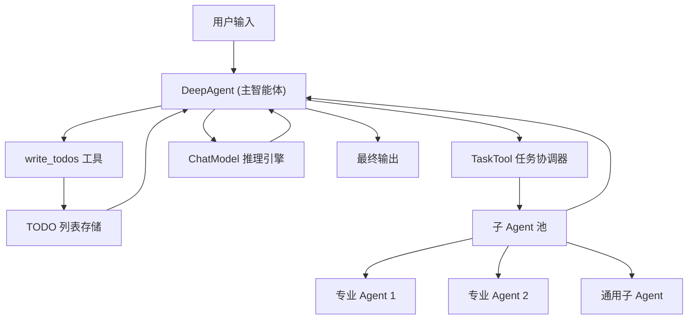

# Deep Core 模块技术深度解析

## 1. 问题与核心价值

在复杂的 AI 应用场景中，单一的 Agent 往往无法很好地处理多步骤、多层次的任务。Deep Core 模块解决了以下关键问题：

### 1.1 核心挑战
- **任务分解与规划**：如何将复杂目标分解为可管理的子任务？
- **子 Agent 协调**：如何在多个专业化的子 Agent 之间实现无缝协作？
- **执行状态追踪**：如何跟踪任务的执行进度并动态调整策略？
- **可扩展性与灵活性**：如何在保持系统架构简洁的同时支持各种定制化需求？

### 1.2 解决思路
Deep Core 采用**分层 Agent 架构 + 任务规划系统**的方案，通过以下核心机制解决上述问题：
- 内置 `write_todos` 工具实现任务规划与状态管理
- 任务工具系统（Task Tool）实现子 Agent 的动态协调与调用
- 基于 ChatModel 的推理系统负责智能决策与任务分配

---

## 2. 架构设计与工作流

### 2.1 架构概览图



### 2.2 核心组件角色

#### Config 结构体
作为 DeepAgent 的配置中心，`Config` 定义了所有必要的参数：
- **Name/Description**：Agent 的身份标识
- **ChatModel**：核心推理引擎，必须支持工具调用
- **Instruction**：系统提示词，为空时使用内置默认提示
- **SubAgents**：可调用的专业化子 Agent 列表
- **ToolsConfig**：工具配置
- **MaxIteration**：最大推理迭代次数限制
- **WithoutWriteTodos/WithoutGeneralSubAgent**：用于禁用特定内置功能的开关
- **TaskToolDescriptionGenerator**：自定义任务工具描述的钩子
- **Middlewares**：Agent 中间件链
- **ModelRetryConfig**：模型重试配置
- **OutputKey**：会话输出存储键

#### TODO 结构体
任务跟踪的核心数据结构，表示一个待办事项：
- **Content**：任务内容描述
- **ActiveForm**：任务的主动形式（用于指令生成）
- **Status**：任务状态，支持 `pending`、`in_progress`、`completed` 三种状态

#### writeTodosArguments 结构体
`write_todos` 工具的输入参数，包含一个 TODO 列表。

---

## 3. 核心组件深度解析

### 3.1 DeepAgent 初始化流程

`New` 函数是创建 DeepAgent 的入口，其内部执行流程如下：

1. **构建内置中间件**：通过 `buildBuiltinAgentMiddlewares` 函数创建内置中间件
   - 默认包含 `write_todos` 工具，除非 `WithoutWriteTodos` 为 true
   
2. **处理系统提示词**：如果用户未提供自定义指令，使用内置的 `baseAgentInstruction`

3. **构建任务工具中间件**：如果满足条件（未禁用通用子 Agent 或有子 Agent 列表），则创建任务工具中间件
   - 该中间件封装了子 Agent 的调用逻辑
   - 支持自定义任务工具描述生成器

4. **创建 ChatModelAgent**：最终通过 `adk.NewChatModelAgent` 创建实际的 Agent 实例

### 3.2 TODO 系统与 write_todos 工具

TODO 系统是 DeepAgent 的任务规划核心，设计精巧且实用：

```go
type TODO struct {
    Content    string `json:"content"`
    ActiveForm string `json:"activeForm"`
    Status     string `json:"status" jsonschema:"enum=pending,enum=in_progress,enum=completed"`
}
```

**设计亮点**：
- **Content + ActiveForm 双字段设计**：既保留了任务描述的自然性，又为 Agent 提供了明确的执行指令
- **有限状态机**：通过 `pending` → `in_progress` → `completed` 的状态流转，实现了清晰的任务生命周期管理
- **会话状态持久化**：通过 `adk.AddSessionValue(ctx, SessionKeyTodos, input.Todos)` 将 TODO 列表存储在会话上下文中

`write_todos` 工具的实现使用了 `utils.InferTool` 函数，这是一个类型安全的工具创建方法，它会自动从函数签名中推断工具的输入输出 schema。

### 3.3 TaskTool 任务协调机制（示意）

虽然 TaskTool 的具体实现细节在其他文件中，但从 Config 结构体中可以看出其设计意图：

- **子 Agent 映射**：内部维护子 Agent 的名称到实例的映射
- **动态描述生成**：通过 `TaskToolDescriptionGenerator` 钩子支持运行时生成工具描述
- **统一调用接口**：为不同的子 Agent 提供统一的调用抽象

---

## 4. 数据流动与依赖关系

### 4.1 依赖关系分析

Deep Core 模块依赖以下关键模块：
- **[schema](schema.md)**：提供消息结构、序列化支持等基础设施
- **[adk](adk.md)**：Agent 开发框架，提供 ChatModelAgent、Agent 接口等
- **components/model**：模型接口，特别是 ToolCallingChatModel
- **components/tool**：工具接口与工具创建工具

被以下模块依赖：
- 应用层代码，用于构建复杂的 AI 应用

### 4.2 关键数据流

以一个典型的任务执行场景为例：

1. **输入阶段**：用户输入 → AgentInput → genModelInput → 消息列表（含系统提示）
2. **推理阶段**：消息列表 → ChatModel → 响应（可能包含工具调用）
3. **工具执行阶段**：
   - 如调用 `write_todos`：解析参数 → 更新会话 TODO 状态 → 返回确认消息
   - 如调用 TaskTool：解析子 Agent 类型 → 路由到对应子 Agent → 执行 → 返回结果
4. **迭代阶段**：工具执行结果 → 新一轮推理 → 直到满足终止条件
5. **输出阶段**：最终响应 → AgentOutput → （可选）存储到会话 OutputKey

---

## 5. 设计决策与权衡

### 5.1 内置工具 vs 完全可配置

**决策**：提供内置的 `write_todos` 工具，但允许通过 `WithoutWriteTodos` 禁用

**权衡分析**：
- ✅ **优点**：开箱即用，降低使用门槛
- ✅ **优点**：内置工具经过优化，与系统其他部分配合良好
- ⚠️ **考虑**：增加了系统复杂度，对于不需要此功能的场景是一种负担
- 💡 **缓解**：提供明确的禁用开关，保持灵活性

### 5.2 TODO 状态的存储方式

**决策**：使用会话上下文存储 TODO 列表，而非独立的状态管理系统

**权衡分析**：
- ✅ **优点**：实现简单，与 ADK 的会话机制自然集成
- ✅ **优点**：状态随会话自动管理，无需额外的清理逻辑
- ⚠️ **限制**：不适合超大规模的任务列表
- 💡 **适用场景**：对于大多数 Agent 任务规划场景已经足够

### 5.3 基于中间件的扩展机制

**决策**：使用 AgentMiddleware 模式扩展功能

**权衡分析**：
- ✅ **优点**：关注点分离，每个中间件负责特定功能
- ✅ **优点**：组合灵活，可以按需启用/禁用特定中间件
- ⚠️ **考虑**：中间件顺序可能影响行为，需要明确的文档说明
- 💡 **设计**：内置中间件先于用户自定义中间件执行，确保基础功能可用

---

## 6. 使用指南与最佳实践

### 6.1 基本使用示例

```go
// 创建 DeepAgent 配置
cfg := &deep.Config{
    Name:        "my-deep-agent",
    Description: "A deep research agent",
    ChatModel:   myToolCallingModel,
    SubAgents:   []adk.Agent{specialistAgent1, specialistAgent2},
    MaxIteration: 10,
}

// 创建 Agent
agent, err := deep.New(ctx, cfg)
if err != nil {
    // 处理错误
}

// 使用 Agent
output, err := agent.Run(ctx, &adk.AgentInput{
    Messages: []*schema.Message{
        schema.UserMessage("Research the history of Go programming language"),
    },
})
```

### 6.2 自定义任务工具描述

```go
cfg := &deep.Config{
    // ... 其他配置
    TaskToolDescriptionGenerator: func(ctx context.Context, agents []adk.Agent) (string, error) {
        // 根据可用的子 Agent 动态生成描述
        var desc strings.Builder
        desc.WriteString("A tool to delegate tasks to specialized agents. Available agents:\n")
        for _, agent := range agents {
            fmt.Fprintf(&desc, "- %s: %s\n", agent.Name(), agent.Description())
        }
        return desc.String(), nil
    },
}
```

### 6.3 访问 TODO 列表

TODO 列表存储在会话上下文中，可以通过 `adk.GetSessionValue` 访问：

```go
// 在 Agent 运行后获取 TODO 列表
todosVal := adk.GetSessionValue(ctx, deep.SessionKeyTodos)
if todosVal != nil {
    todos, ok := todosVal.([]deep.TODO)
    if ok {
        // 处理 TODO 列表
    }
}
```

---

## 7. 注意事项与常见陷阱

### 7.1 迭代次数限制

`MaxIteration` 参数非常重要，它可以防止 Agent 陷入无限循环。建议：
- 对于简单任务，设置较小的值（如 5-10）
- 对于复杂任务，可以适当增大，但建议设置合理的上限
- 监控实际使用的迭代次数，调整为最优值

### 7.2 工具调用的顺序敏感性

当同时使用多个工具时，工具的描述和顺序可能影响模型的选择。如果遇到模型不按预期使用工具的情况：
- 检查工具描述是否清晰
- 考虑调整工具的顺序
- 使用更明确的指令指导模型

### 7.3 序列化注册

注意 `init` 函数中的序列化注册：
```go
schema.RegisterName[TODO]("_eino_adk_prebuilt_deep_todo")
schema.RegisterName[[]TODO]("_eino_adk_prebuilt_deep_todo_slice")
```
如果在自定义代码中也需要序列化 TODO 类型，确保这些注册已经执行。

### 7.4 子 Agent 协调的复杂性

虽然 TaskTool 提供了子 Agent 协调机制，但在实际使用中：
- 避免创建过多的子 Agent，保持层次简洁
- 为每个子 Agent 提供清晰的职责边界
- 考虑子 Agent 之间的通信成本，合理设计任务粒度

---

## 8. 总结

Deep Core 模块是一个精心设计的任务型 Agent 框架，它通过 TODO 系统实现任务规划，通过 TaskTool 实现子 Agent 协调，为构建复杂的 AI 应用提供了坚实的基础。其设计体现了以下核心理念：

- **实用性优先**：内置常用功能，降低使用门槛
- **扩展性设计**：通过开关和钩子支持定制化需求
- **简洁架构**：在功能丰富性和架构简洁性之间取得平衡

对于需要处理复杂任务、多层推理的 AI 应用场景，Deep Core 提供了一个理想的起点。

---

## 9. 相关文档链接

- [ADK 模块文档](adk.md) - 了解 Agent 开发框架的核心概念
- [Schema 模块文档](schema.md) - 了解消息结构和序列化机制
- [Compose Graph Engine 文档](compose_graph_engine.md) - 了解更底层的执行引擎
