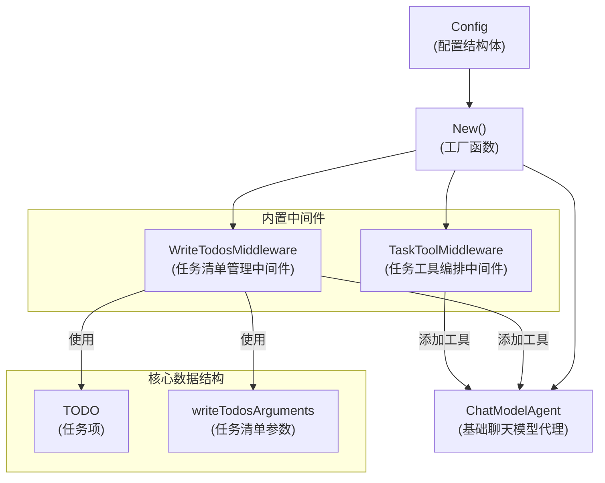

# Deep Research Core 模块深度技术分析

## 1. 模块概述与问题空间

### 问题背景
在构建复杂的多代理系统时，我们经常面临这样的挑战：如何让一个智能代理能够规划、执行并跟踪复杂任务的进展？传统的单代理方法在处理需要分解为多个子任务的问题时显得力不从心，而简单的多代理协作又缺乏统一的任务编排和进度管理机制。

`deep_research_core` 模块正是为了解决这一问题而设计的。它提供了一个预构建的深度研究代理，该代理能够：
- 将复杂任务分解为多个可管理的子任务
- 跟踪任务进度和状态
- 协调多个子代理协作
- 提供内置的任务管理工具

### 核心设计洞察
这个模块的核心设计思想是：**通过任务清单管理和子代理编排，将复杂问题转化为一系列可执行的、可追踪的子任务**。它不是重新发明一个代理，而是在现有 [ChatModelAgent](adk_chatmodel_agent.md) 基础上，通过中间件模式增强其任务编排能力。

---

## 2. 架构与组件关系

### 系统架构图



### 组件角色与职责

1. **Config**：配置结构体，定义了创建 DeepAgent 所需的所有参数
2. **New()**：工厂函数，负责组装和配置 DeepAgent
3. **WriteTodosMiddleware**：内置的任务清单管理中间件，提供 `write_todos` 工具
4. **TaskToolMiddleware**：任务工具编排中间件，提供子代理调用能力
5. **TODO**：任务项数据结构，表示单个待办事项
6. **writeTodosArguments**：任务清单工具的参数结构

### 数据流向

1. 调用者提供 `Config` 配置
2. `New()` 函数构建内置中间件
3. 根据配置决定是否启用任务工具中间件
4. 将所有中间件应用到底层 `ChatModelAgent`
5. 返回配置好的 `ResumableAgent` 供调用者使用

---

## 3. 核心组件深度分析

### Config 结构体

```go
type Config struct {
    // 代理基本信息
    Name string
    Description string
    
    // 核心依赖
    ChatModel model.ToolCallingChatModel
    Instruction string
    SubAgents []adk.Agent
    ToolsConfig adk.ToolsConfig
    MaxIteration int
    
    // 功能开关
    WithoutWriteTodos bool
    WithoutGeneralSubAgent bool
    
    // 自定义选项
    TaskToolDescriptionGenerator func(ctx context.Context, availableAgents []adk.Agent) (string, error)
    Middlewares []adk.AgentMiddleware
    ModelRetryConfig *adk.ModelRetryConfig
    OutputKey string
}
```

**设计意图**：
- `Config` 采用了**选项模式**的变种，通过布尔开关控制功能启用
- 核心依赖（`ChatModel`、`SubAgents`）与配置选项清晰分离
- 提供了合理的默认行为（如空 `Instruction` 时使用内置提示词）

**关键点**：
- `WithoutWriteTodos` 和 `WithoutGeneralSubAgent` 是**负向开关**，这种设计在需要默认启用功能时很常见
- `TaskToolDescriptionGenerator` 允许自定义任务工具的描述，提高了灵活性
- `OutputKey` 支持将输出存储到会话中，便于多代理协作时的信息传递

### New() 工厂函数

`New()` 是整个模块的核心编排函数，它的工作流程如下：

1. **构建内置中间件**：首先调用 `buildBuiltinAgentMiddlewares()` 创建任务清单管理中间件
2. **准备指令**：如果未提供自定义指令，使用内置的 `baseAgentInstruction`
3. **创建任务工具中间件**：如果启用了子代理功能，创建任务工具中间件
4. **组装 ChatModelAgent**：使用所有配置和中间件创建最终的代理

**设计亮点**：
- **条件性功能启用**：根据配置动态决定是否添加特定中间件，避免了不必要的功能开销
- **中间件组合**：将内置中间件与用户提供的中间件合并，实现了功能的叠加
- **委托给底层实现**：最终实际的代理执行逻辑委托给了 `adk.NewChatModelAgent`，符合单一职责原则

### TODO 与 writeTodosArguments

```go
type TODO struct {
    Content    string `json:"content"`
    ActiveForm string `json:"activeForm"`
    Status     string `json:"status" jsonschema:"enum=pending,enum=in_progress,enum=completed"`
}

type writeTodosArguments struct {
    Todos []TODO `json:"todos"`
}
```

**设计意图**：
- `TODO` 结构体设计简洁但信息丰富，包含了任务内容、主动形式和状态
- 使用 `jsonschema` 标签限制 `Status` 字段的可能值，确保数据一致性
- `writeTodosArguments` 作为工具参数的包装，符合工具调用的接口要求

**关键设计决策**：
- `ActiveForm` 字段的存在值得注意，它可能用于生成更自然的语言描述任务进度
- 状态使用字符串而非枚举类型，提高了序列化兼容性和灵活性

### 任务清单中间件 (newWriteTodos)

```go
func newWriteTodos() (adk.AgentMiddleware, error) {
    t, err := utils.InferTool("write_todos", writeTodosToolDescription, 
        func(ctx context.Context, input writeTodosArguments) (output string, err error) {
            adk.AddSessionValue(ctx, SessionKeyTodos, input.Todos)
            todos, err := sonic.MarshalString(input.Todos)
            if err != nil {
                return "", err
            }
            return fmt.Sprintf("Updated todo list to %s", todos), nil
        })
    // ...
}
```

**设计意图**：
- 使用 `utils.InferTool` 自动从函数签名推断工具定义，减少了样板代码
- 通过 `adk.AddSessionValue` 将任务清单存储到会话中，实现了状态持久化
- 返回格式化的确认消息，让代理知道任务清单已更新

**关键点**：
- 这里使用了 **会话存储** 模式，任务状态保存在上下文的会话中，而非代理内部状态
- 这种设计使得任务状态可以在多次调用间保持，也支持在中断后恢复

---

## 4. 依赖关系分析

### 入站依赖 (Depended By)
- 上层应用代码直接调用 `deep.New()` 创建深度研究代理

### 出站依赖 (Depends On)
- **adk.ChatModelAgent**：底层代理实现，负责实际的对话和工具调用
- **model.ToolCallingChatModel**：语言模型，提供推理能力
- **adk.AgentMiddleware**：中间件接口，用于扩展代理功能
- **adk.ToolsConfig**：工具配置，定义工具调用行为
- **utils.InferTool**：工具推断工具，简化工具定义
- **schema.Message**：消息结构，用于与模型交互

### 数据流契约
1. **输入**：`Config` 结构体，包含所有必要的配置和依赖
2. **输出**：`adk.ResumableAgent` 接口，支持运行和恢复功能
3. **内部数据**：任务清单通过 `SessionKeyTodos` 键存储在会话中

---

## 5. 设计决策与权衡

### 1. 中间件模式而非继承
**决策**：使用中间件模式扩展 ChatModelAgent 功能，而非创建子类
**理由**：
- 中间件提供了更好的**组合性**，可以按需启用功能
- 避免了继承可能带来的层次复杂问题
- 符合"组合优于继承"的设计原则

**权衡**：
- ✅ 优点：功能模块化，可灵活组合
- ❌ 缺点：中间件之间的交互可能产生意外影响，需要仔细设计

### 2. 负向开关设计
**决策**：使用 `WithoutWriteTodos` 和 `WithoutGeneralSubAgent` 这样的负向开关
**理由**：
- 默认启用常用功能，减少用户配置负担
- 对于不需要的功能，用户可以显式禁用

**权衡**：
- ✅ 优点：开箱即用体验好
- ❌ 缺点：API 可读性稍差，需要理解"Without"的含义

### 3. 会话存储而非内部状态
**决策**：将任务清单存储在会话中，而非代理的内部字段
**理由**：
- 支持**可恢复性**，会话状态可以序列化和恢复
- 任务状态在多次运行间保持一致
- 支持多代理协作时共享任务状态

**权衡**：
- ✅ 优点：状态持久化，支持中断恢复
- ❌ 缺点：依赖会话机制，增加了对上下文的依赖

### 4. 委托给 ChatModelAgent
**决策**：DeepAgent 实际上是 ChatModelAgent 的包装，而非独立实现
**理由**：
- 复用已有的成熟代理实现
- 专注于任务编排这一核心价值，不重复造轮子
- 保持与 ChatModelAgent 相同的接口，便于替换和组合

**权衡**：
- ✅ 优点：代码复用，关注点分离
- ❌ 缺点：受限于 ChatModelAgent 的设计，某些定制可能受限

---

## 6. 使用指南与示例

### 基本使用

```go
// 创建 DeepAgent 配置
cfg := &deep.Config{
    Name:        "research-assistant",
    Description: "A deep research assistant that can plan and execute complex tasks",
    ChatModel:   myChatModel, // 已初始化的 ToolCallingChatModel
    SubAgents:   []adk.Agent{specialistAgent1, specialistAgent2},
    MaxIteration: 10,
}

// 创建代理
agent, err := deep.New(ctx, cfg)
if err != nil {
    // 处理错误
}

// 运行代理
input := &adk.AgentInput{
    Messages: []*schema.Message{
        schema.UserMessage("Research the latest advancements in quantum computing"),
    },
}

events := agent.Run(ctx, input)
// 处理事件...
```

### 自定义配置

```go
cfg := &deep.Config{
    Name:        "custom-researcher",
    ChatModel:   myChatModel,
    Instruction: "You are a specialized researcher focusing on renewable energy...", // 自定义指令
    WithoutWriteTodos: true, // 禁用任务清单功能
    WithoutGeneralSubAgent: true, // 禁用通用子代理
    TaskToolDescriptionGenerator: func(ctx context.Context, agents []adk.Agent) (string, error) {
        // 自定义任务工具描述
        return "A tool for delegating tasks to specialized energy research agents...", nil
    },
    Middlewares: []adk.AgentMiddleware{myCustomMiddleware}, // 添加自定义中间件
}
```

### 从会话中获取任务清单

```go
// 在代理运行后或在中间件中
todos, ok := adk.GetSessionValue(ctx, deep.SessionKeyTodos).([]deep.TODO)
if ok {
    // 使用任务清单...
    for _, todo := range todos {
        fmt.Printf("Task: %s, Status: %s\n", todo.Content, todo.Status)
    }
}
```

---

## 7. 边界情况与潜在陷阱

### 1. 任务清单的并发访问
**问题**：如果多个中间件或工具同时修改任务清单，可能导致竞态条件
**缓解**：会话存储机制通常已经处理了并发访问，但在自定义中间件中修改任务清单时应谨慎

### 2. 子代理循环调用
**问题**：如果配置不当，子代理可能会回调父代理，导致无限循环
**缓解**：
- 仔细设计子代理的职责和指令
- 考虑使用 `MaxIteration` 限制迭代次数
- 监控代理运行，及时检测异常行为

### 3. 序列化兼容性
**问题**：`TODO` 结构体通过 `schema.RegisterName` 注册了序列化名称，如果修改结构体字段可能破坏兼容性
**缓解**：
- 遵循向后兼容的原则修改数据结构
- 考虑使用版本化的任务结构
- 充分测试序列化和恢复功能

### 4. 工具描述的重要性
**问题**：`write_todos` 工具和任务工具的描述对代理正确使用这些工具至关重要，如果描述不清晰，代理可能无法有效使用工具
**缓解**：
- 仔细编写工具描述，明确工具的用途和参数
- 考虑使用 `TaskToolDescriptionGenerator` 自定义任务工具描述
- 测试代理对工具的使用情况，根据需要调整描述

### 5. 中间件顺序
**问题**：中间件的应用顺序可能影响功能，特别是如果中间件之间有依赖关系
**缓解**：
- 注意 `New()` 函数中中间件的添加顺序
- 自定义中间件添加在内置中间件之后，可能会覆盖或修改内置中间件的行为
- 如果中间件顺序很重要，文档中应明确说明

---

## 8. 参考资料

- [ChatModelAgent 模块](adk_chatmodel_agent.md) - 底层代理实现
- [ADK Agent 接口](adk_agent_interface.md) - 代理接口定义
- [Compose Graph Engine](compose_graph_engine.md) - 底层图执行引擎
- [Tool 接口](component_interfaces.md#tool_interfaces) - 工具接口定义
