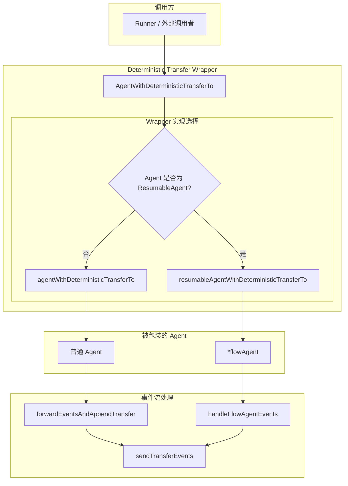

# Deterministic Transfer Wrappers 模块深度解析

## 概述

在多 Agent 协作系统中，当一个 Agent 完成任务后，如何可靠地将控制权传递给下游 Agent 是一个关键问题。`deterministic_transfer_wrappers` 模块通过装饰器模式为 Agent 添加**确定性转移能力**——即保证在 Agent 正常结束后，自动按照预定义的顺序生成转移事件，将控制权传递给指定的目标 Agent。

想象一下机场的自动传送带系统：当行李（执行控制流）到达一个处理站（Agent）后，如果这个站点不需要进行特殊处理（如中断或退出），传送带会自动将行李送到下一个指定站点。这个模块就是那个"自动传送带"，它拦截 Agent 的事件流，在合适的时机自动生成转移动作。

## 为什么需要这个模块

### 问题场景

在复杂的多 Agent 工作流中，你可能会遇到以下问题：

1. **手动转移的脆弱性**：如果每个 Agent 都需要在代码中显式调用转移函数，容易遗漏或出错
2. **执行顺序的不确定性**：在分布式或异步环境中，Agent 完成后立即转移到多个下游 Agent 时，顺序可能无法保证
3. **状态恢复的复杂性**：当 Agent 执行过程中被中断并需要恢复时，如何确保转移逻辑仍然正确执行
4. **会话隔离的需求**：在某些场景下（特别是 flowAgent），子 Agent 的执行需要隔离的会话空间，避免污染父 Agent 的状态

### 朴素方案的不足

最简单的做法是在每个 Agent 的 Run 方法末尾手动添加转移逻辑。但这种方法有以下问题：

- **侵入性强**：每个 Agent 都需要修改自己的实现
- **重复代码**：相同的转移逻辑在多个 Agent 中重复出现
- **难以维护**：当转移策略变化时，需要修改所有 Agent
- **无法处理中断**：手动添加的代码通常无法正确处理中断和恢复的场景

### 设计洞察

这个模块的核心洞察是：**转移是一个横切关注点（cross-cutting concern）**，它不应该属于单个 Agent 的业务逻辑，而应该作为一个独立的层，透明地包装在 Agent 之外。这样既保持了 Agent 的纯粹性，又实现了统一的转移策略。

## 架构与数据流

### 组件架构图



### 数据流追踪

让我们追踪一个典型的执行场景：包装一个普通 Agent 并执行，然后自动生成转移事件。

#### 场景 1：普通 Agent 的自动转移

```
1. Runner 调用 AgentWithDeterministicTransferTo()
   └─> 创建 agentWithDeterministicTransferTo 包装器

2. 调用 wrapper.Run(ctx, input, options...)
   └─> 调用内部 agent.Run(ctx, input, options...)
       └─> 返回 *AsyncIterator[*AgentEvent]

3. 创建新的 iterator/generator 对对
   └─> 启动 goroutine: forwardEventsAndAppendTransfer()

4. forwardEventsAndAppendTransfer 执行循环：
   └─> 从原始 iterator 读取事件
       └─> 将事件转发到 generator
           └─> 记录最后一个事件

5. 检查最后一个事件：
   └─> 如果 Action.Interrupted != nil → 不生成转移，直接返回
   └─> 如果 Action.Exit == true → 不生成转移，直接返回
   └─> 否则 → 调用 sendTransferEvents()
       └─> 为每个 toAgentNames 中的 Agent 生成两个事件：
           ├─> AssistantMessage (包含 ToolCall)
           └─> ToolMessage (包含 TransferToAgentAction)
```

#### 场景 2：flowAgent 的特殊处理（含中断和恢复）

```
初始执行阶段：
1. 调用 wrapper.Run(ctx, input, options...)
   └─> 检测到 agent 是 *flowAgent
       └─> 调用 runFlowAgentWithIsolatedSession()

2. 创建隔离的会话：
   └─> isolatedSession = &runSession{
       Values: parentSession.Values,
       Events: nil (新建)
   }
   └─> 更新 context 中的 runContext

3. 执行 flowAgent.Run()
   └─> 启动 goroutine: handleFlowAgentEvents()

4. handleFlowAgentEvents 处理事件：
   └─> 从 flowAgent 读取事件
       └─> 如果不是中断事件：
           └─> 复制事件到 parentSession
           └─> 复制事件到 isolatedSession
       └─> 发送事件到 generator
       └─> 记录最后一个事件

5. 遇到内部中断：
   └─> event.Action.internalInterrupted != nil
       └─> 保存状态: deterministicTransferState{EventList: isolatedSession.Events}
       └─> 调用 CompositeInterrupt() 生成复合中断事件
           └─> 返回，不生成转移事件

恢复执行阶段：
1. 调用 wrapper.Resume(ctx, info, opts...)
   └─> 检测到 agent 是 *flowAgent
       └─> 调用 resumeFlowAgentWithIsolatedSession()

2. 从 info.InterruptState 恢复：
   └─> state := info.InterruptState.(*deterministicTransferState)
   └─> isolatedSession.Events = state.EventList

3. 调用 flowAgent.Resume()
   └─> 继续执行并正常完成

4. 正常完成后：
   └─> 调用 sendTransferEvents()
       └─> 生成转移事件序列
```

## 核心组件详解

### deterministicTransferState

**作用**：持久化状态，用于保存 flowAgent 执行过程中产生的所有事件。

```go
type deterministicTransferState struct {
    EventList []*agentEventWrapper
}
```

**设计考虑**：
- 只用于 flowAgent 场景，因为普通 Agent 不需要保存事件历史
- `EventList` 使用 `agentEventWrapper` 而非直接的 `AgentEvent`，因为包装器包含了额外的元数据（如流的拼接结果）
- 通过 `schema.RegisterName` 注册为可序列化类型，支持 gob 编码存储到 checkpoint

**为什么需要这个状态**：当 flowAgent 执行过程中被中断时，需要保存已经产生的事件列表。恢复时，这些事件需要被恢复到隔离的会话中，以便子 Agent 能够正确构建上下文。

### AgentWithDeterministicTransferTo

**作用**：工厂函数，根据 Agent 类型创建合适的包装器。

```go
func AgentWithDeterministicTransferTo(_ context.Context, config *DeterministicTransferConfig) Agent
```

**参数**：
- `config.Agent`：要包装的 Agent
- `config.ToAgentNames`：转移目标 Agent 名称列表

**返回**：
- 如果 Agent 实现了 `ResumableAgent` 接口，返回 `resumableAgentWithDeterministicTransferTo`
- 否则返回 `agentWithDeterministicTransferTo`

**设计模式**：这里使用了**类型判断 + 策略模式**。Go 没有类继承，通过接口断言来选择不同的实现，这是一种在 Go 中实现多态的常见做法。

### agentWithDeterministicTransferTo

**作用**：包装普通 Agent，添加确定性转移能力。

**核心方法**：

```go
func (a *agentWithDeterministicTransferTo) Run(ctx context.Context,
    input *AgentInput, options ...AgentRunOption) *AsyncIterator[*AgentEvent]
```

**执行流程**：
1. 如果被包装的是 `*flowAgent`，调用特殊路径（见下文）
2. 否则：
   - 调用内部 agent 的 Run 方法获取原始事件流
   - 创建新的 iterator/generator 对
   - 启动 goroutine 执行 `forwardEventsAndAppendTransfer`

**设计考虑**：
- 不修改原始 Agent 的行为，只是拦截和增强事件流
- 使用 goroutine 处理事件流，避免阻塞调用方
- 通过 panic recovery 机制确保 goroutine 中的错误能正确传播

### resumableAgentWithDeterministicTransferTo

**作用**：包装 `ResumableAgent`，添加确定性转移能力，同时支持恢复执行。

**核心方法**：

```go
func (a *resumableAgentWithDeterministicTransferTo) Run(ctx context.Context,
    input *AgentInput, options ...AgentRunOption) *AsyncIterator[*AgentEvent]

func (a *resumableAgentWithDeterministicTransferTo) Resume(ctx context.Context,
    info *ResumeInfo, opts ...AgentRunOption) *AsyncIterator[*AgentEvent]
```

**与普通包装器的区别**：
- 实现了 `Resume` 方法，用于从中断点恢复
- Resume 方法同样会创建包装后的事件流

**设计考虑**：
- `ResumableAgent` 是 `Agent` 的扩展接口，增加恢复能力
- 包装器同样需要实现恢复能力，保持接口一致性
- 恢复时的行为应该与初次运行一致（正常完成后自动转移）

### runFlowAgentWithIsolatedSession

**作用**：为 flowAgent 创建隔离会话环境并执行。

**关键步骤**：

```go
func runFlowAgentWithIsolatedSession(ctx context.Context, fa *flowAgent, input *AgentInput,
    toAgentNames []string, options ...AgentRunOption) *AsyncIterator[*AgentEvent]
```

1. **提取父会话和运行上下文**：
   ```go
   parentSession := getSession(ctx)
   parentRunCtx := getRunCtx(ctx)
   ```

2. **创建隔离会话**：
   ```go
   isolatedSession := &runSession{
       Values:    parentSession.Values,  // 共享 Values
       valuesMtx: parentSession.valuesMtx,  // 共享互斥锁
       // Events 字段为 nil，将独立记录
   }
   ```
   
   **为什么共享 Values 但隔离 Events**：
   - `Values` 是会话级别的键值存储，需要在父子 Agent 之间共享
   - `Events` 是执行历史，flowAgent 的内部事件不应该直接污染父级的事件列表
   - 通过选择性复制，既实现了数据共享，又实现了执行隔离

3. **更新 context**：
   ```go
   ctx = setRunCtx(ctx, &runContext{
       Session:   isolatedSession,
       RootInput: parentRunCtx.RootInput,
       RunPath:   parentRunCtx.RunPath,
   })
   ```
   
   这个新的 context 会被传递给 flowAgent，使其在隔离环境中执行。

4. **启动事件处理**：
   ```go
   go handleFlowAgentEvents(ctx, iter, generator, isolatedSession, parentSession, toAgentNames)
   ```

### resumeFlowAgentWithIsolatedSession

**作用**：在隔离环境中恢复 flowAgent 的执行。

**关键步骤**：

```go
func resumeFlowAgentWithIsolatedSession(ctx context.Context, fa *flowAgent, info *ResumeInfo,
    toAgentNames []string, opts ...AgentRunOption) *AsyncIterator[*AgentEvent]
```

1. **恢复状态**：
   ```go
   state, ok := info.InterruptState.(*deterministicTransferState)
   if !ok || state == nil {
       return genErrorIter(errors.New("invalid interrupt state..."))
   }
   ```
   
   **验证状态**：如果中断状态无效或类型不匹配，立即返回错误迭代器。

2. **重建隔离会话**：
   ```go
   isolatedSession := &runSession{
       Values:    parentSession.Values,
       valuesMtx: parentSession.valuesMtx,
       Events:    state.EventList,  // 恢复之前保存的事件
   }
   ```
   
   **事件恢复**：将保存的事件列表恢复到隔离会话中，这些事件会作为子 Agent 执行的上下文。

3. **调用 flowAgent.Resume**：
   ```go
   iter := fa.Resume(ctx, info, opts...)
   ```

### handleFlowAgentEvents

**作用**：处理 flowAgent 的事件流，维护双重会话，并处理中断和转移逻辑。

**执行流程**：

```go
func handleFlowAgentEvents(ctx context.Context, iter *AsyncIterator[*AgentEvent],
    generator *AsyncGenerator[*AgentEvent], isolatedSession, parentSession *runSession, toAgentNames []string)
```

1. **从 flowAgent 读取事件**：
   ```go
   for {
       event, ok := iter.Next()
       if !ok {
           break
       }
       // 处理事件...
   }
   ```

2. **双重事件记录**：
   ```go
   if parentSession != nil && (event.Action == nil || event.Action.Interrupted == nil) {
       copied := copyAgentEvent(event)
       setAutomaticClose(copied)
       setAutomaticClose(event)
       parentSession.addEvent(copied)  // 父会话也记录
   }
   ```
   
   **为什么需要复制**：
   - 事件可能包含可变的流（MessageStream），复制后可以安全地分别消费
   - `setAutomaticClose` 确保即使事件未被处理，流也能被正确关闭

3. **内部中断处理**：
   ```go
   if event.Action != nil && event.Action.internalInterrupted != nil {
       lastEvent = event
       continue  // 不立即发送，等待所有事件读取完毕
   }
   ```
   
   **延迟处理**：遇到内部中断时不立即发送，而是在循环结束后统一处理，这样可以收集完整的状态。

4. **生成复合中断事件**：
   ```go
   if lastEvent != nil && lastEvent.Action != nil {
       if lastEvent.Action.internalInterrupted != nil {
           events := isolatedSession.getEvents()
           state := &deterministicTransferState{EventList: events}
           compositeEvent := CompositeInterrupt(ctx, "deterministic transfer wrapper interrupted",
               state, lastEvent.Action.internalInterrupted)
           generator.Send(compositeEvent)
           return
       }
   }
   ```
   
   **复合中断**：将 flowAgent 的内部中断包装成一个复合中断事件，包含：
   - 描述信息："deterministic transfer wrapper interrupted"
   - 保存的状态：`deterministicTransferState`
   - 原始的中断信号

5. **正常完成后的转移**：
   ```go
   if lastEvent != nil && lastEvent.Action != nil {
       if lastEvent.Action.Exit {
           return  // 退出时不转移
       }
   }
   sendTransferEvents(generator, toAgentNames)
   ```

### forwardEventsAndAppendTransfer

**作用**：普通 Agent 的事件流处理器，更简单的逻辑。

```go
func forwardEventsAndAppendTransfer(iter *AsyncIterator[*AgentEvent],
    generator *AsyncGenerator[*AgentEvent], toAgentNames []string)
```

**执行流程**：

1. **转发所有事件**：
   ```go
   for {
       event, ok := iter.Next()
       if !ok {
           break
       }
       generator.Send(event)
       lastEvent = event
   }
   ```

2. **检查最后事件**：
   ```go
   if lastEvent != nil && lastEvent.Action != nil && 
      (lastEvent.Action.Interrupted != nil || lastEvent.Action.Exit) {
       return  // 中断或退出，不转移
   }
   ```

3. **生成转移事件**：
   ```go
   sendTransferEvents(generator, toAgentNames)
   ```

**与 handleFlowAgentEvents 的对比**：

| 特性 | forwardEventsAndAppendTransfer | handleFlowAgentEvents |
|------|-------------------------------|----------------------|
| 双重会话维护 | 否 | 是 |
| 事件复制 | 否 | 是 |
| 内部中断处理 | 不处理 | 包装为复合中断 |
| 状态保存 | 不需要 | 保存 deterministicTransferState |

### sendTransferEvents

**作用**：生成转移事件序列。

```go
func sendTransferEvents(generator *AsyncGenerator[*AgentEvent], toAgentNames []string)
```

**为每个目标 Agent 生成两个事件**：

1. **Assistant Message 事件**：
   ```go
   aMsg, tMsg := GenTransferMessages(context.Background(), toAgentName)
   aEvent := EventFromMessage(aMsg, nil, schema.Assistant, "")
   generator.Send(aEvent)
   ```
   
   这个事件包含一个 `ToolCall`，告诉 LLM 调用了转移工具。

2. **Tool Message 事件**：
   ```go
   tEvent := EventFromMessage(tMsg, nil, schema.Tool, tMsg.ToolName)
   tEvent.Action = &AgentAction{
       TransferToAgent: &TransferToAgentAction{
           DestAgentName: toAgentName,
       },
   }
   generator.Send(tEvent)
   ```
   
   这个事件包含实际的 `TransferToAgentAction`，框架会识别这个 action 并实际执行转移。

**为什么需要两个事件**：
- Assistant Message 代表 LLM 的决策（"我要调用工具"）
- Tool Message 代表工具执行的结果（包含实际的转移动作）
- 这种结构保持了与 ChatModel 的消息格式兼容性

## 依赖关系分析

### 调用本模块的组件

1. **[flow_agent_orchestration](flow-agent-orchestration.md)**：
   - `DeterministicTransferConfig` 定义在 `flow.go` 中
   - flowAgent 在构建子 Agent 时可以使用此包装器

2. **[runner_execution_and_resume](runner-execution-and-resume.md)**：
   - Runner 执行被包装的 Agent
   - 依赖生成的 TransferToAgentAction 来处理实际转移

3. **测试代码**：
   - `deterministic_transfer_test.go`：测试各种场景

### 本模块调用的组件

1. **接口层**：
   - `Agent` / `ResumableAgent`：被包装的对象
   - `AgentEvent` / `AgentAction`：事件和动作类型
   - `ResumeInfo`：恢复信息

2. **运行时上下文**：
   - `runContext` / `runSession`：会话管理
   - `getSession` / `setSession`：上下文操作
   - `getRunCtx` / `setRunCtx`：运行上下文操作

3. **工具函数**：
   - `NewAsyncIteratorPair`：创建迭代器对
   - `GenTransferMessages`：生成转移消息
   - `EventFromMessage`：从消息创建事件
   - `copyAgentEvent`：复制事件
   - `CompositeInterrupt`：创建复合中断

4. **异常处理**：
   - `safe.NewPanicErr`：安全地创建 panic 错误
   - `debug.Stack()`：获取堆栈信息

### 数据契约

**输入**：
- `DeterministicTransferConfig.ToAgentNames`：目标 Agent 名称列表，必须非空
- `Agent.Run()` 的输入参数：必须符合 Agent 接口约定

**输出**：
- 生成的 AgentEvent 流：必须遵循事件约定
  - 事件的 `RunPath` 由框架设置
  - 事件的 `MessageStream` 必须是独占的
- 最后的 TransferToAgentAction：包含目标 Agent 名称

**隐式假设**：
- 如果 Agent 是 flowAgent，它会在隔离的会话环境中执行
- 目标 Agent 必须已注册到父 Agent 的子 Agent 列表中（否则转移会失败）

## 设计决策与权衡

### 决策 1：使用装饰器模式而非修改 Agent

**选择**：创建包装器，包装 Agent 的事件流

**优点**：
- Agent 实现保持纯净，不需要关心转移逻辑
- 可以动态添加/移除转移能力
- 符合开闭原则（对扩展开放，对修改关闭）

**代价**：
- 增加了一层间接调用
- 需要复制事件流，增加了内存开销

**权衡理由**：在多 Agent 系统中，Agent 的业务逻辑和协调逻辑应该分离。转移是协调层的职责，不应该侵入到业务逻辑中。少量的性能开销换取更好的代码组织是值得的。

### 决策 2：对 flowAgent 特殊处理

**选择**：检测 `*flowAgent` 类型，使用隔离会话路径

**优点**：
- 满足 flowAgent 的会话隔离需求
- 可以保存和恢复内部事件状态
- 避免事件污染父级会话

**代价**：
- 增加了代码复杂度（需要维护两个处理路径）
- 类型检查（`*flowAgent`）破坏了接口抽象

**权衡理由**：
- flowAgent 是一个内部实现细节，其会话隔离是框架级别的需求
- 这种"实用主义"的类型检查是 Go 中处理内部特化需求的常见模式
- 如果没有这个特殊处理，flowAgent 的历史记录会混乱，影响上下文传递

### 决策 3：在事件流中添加转移事件

**选择**：在 Agent 事件流的末尾追加转移事件

**优点**：
- 转移逻辑对 Agent 完全透明
- 转移事件和 Agent 事件在同一个流中，便于顺序处理
- 保持与 ChatModel 消息格式的兼容性

**代价**：
- 调用方需要区分 Agent 生成的事件和包装器添加的事件
- 增加了事件流的长度

**权衡理由**：
- 统一的事件流简化了上层处理逻辑
- AgentAction 已经有类型区分（TransferToAgentAction），调用方可以轻松识别
- 这种设计使得框架可以透明地处理 Agent 的输出和转移动作

### 决策 4：中断时不生成转移

**选择**：当最后一个事件是 `Interrupted` 或 `Exit` 时，不生成转移事件

**优点**：
- 中断意味着需要外部干预，转移没有意义
- Exit 表示 Agent 主动结束，不应该继续流转
- 避免不必要的转移尝试

**代价**：
- 需要记录最后一个事件的状态

**权衡理由**：
- 语义上，中断和退出都是明确的终止信号
- 在这些情况下生成转移会导致困惑和潜在的错误
- 这符合"确定性"的设计目标——只在明确的场景下转移

### 决策 5：使用 goroutine 处理事件流

**选择**：在 Run 方法中启动 goroutine 处理事件流

**优点**：
- 不阻塞调用方
- 支持异步迭代器模式
- 可以同时处理多个 Agent 的事件流

**代价**：
- 需要处理 goroutine 的 panic recovery
- 增加了并发复杂度

**权衡理由**：
- 异步迭代器是 ADK 的核心抽象，保持一致性很重要
- 通过 `defer` 和 `recover()` 机制，错误可以安全地传播
- 并发的收益（处理多个 Agent）超过了复杂性

## 使用指南

### 基本用法

**包装一个普通 Agent**：

```go
import "github.com/cloudwego/eino/adk"

// 创建普通 Agent
myAgent := &MyAgent{}

// 包装 Agent，添加确定性转移
wrappedAgent := adk.AgentWithDeterministicTransferTo(ctx, &adk.DeterministicTransferConfig{
    Agent:        myAgent,
    ToAgentNames: []string{"next_agent_1", "next_agent_2"},
})

// 执行包装后的 Agent
iter := wrappedAgent.Run(ctx, &adk.AgentInput{...})

for {
    event, ok := iter.Next()
    if !ok {
        break
    }
    // 处理事件...
    // myAgent 的所有事件会先到来
    // 最后会自动生成 TransferToAgentAction 事件
}
```

**包装一个 ResumableAgent**：

```go
// ResumableAgent 会自动被识别并正确包装
resumableAgent := &MyResumableAgent{}

wrappedAgent := adk.AgentWithDeterministicTransferTo(ctx, &adk.DeterministicTransferConfig{
    Agent:        resumableAgent,
    ToAgentNames: []string{"next_agent"},
})

// 正常执行
iter := wrappedAgent.Run(ctx, &adk.AgentInput{...})

// 恢复执行（如果包装后的 Agent 实现了 ResumableAgent）
resumeIter := wrappedAgent.(adk.ResumableAgent).Resume(ctx, resumeInfo)
```

**在 flowAgent 中使用**：

```go
// 创建子 Agent
innerAgent := adk.NewChatModelAgent(ctx, &adk.ChatModelAgentConfig{
    Name:        "inner",
    Description: "Inner agent",
    Model:       model,
    // ...
})

// 转换为 flowAgent
innerFlowAgent, err := adk.SetSubAgents(ctx, innerAgent, []adk.Agent{...})

// 包装子 Agent，添加确定性转移
wrappedInner := adk.AgentWithDeterministicTransferTo(ctx, &adk.DeterministicTransferConfig{
    Agent:        innerFlowAgent,
    ToAgentNames: []string{"next_agent"},
})

// 在父 flowAgent 中使用
parentFlowAgent, err := adk.SetSubAgents(ctx, parentAgent, []adk.Agent{wrappedInner})
```

### 转移顺序

`ToAgentNames` 列表中的 Agent 会按顺序依次转移：

```go
wrappedAgent := adk.AgentWithDeterministicTransferTo(ctx, &adk.DeterministicTransferConfig{
    Agent:        myAgent,
    ToAgentNames: []string{"agent_a", "agent_b", "agent_c"},
})

// 执行顺序：
// 1. myAgent 的所有事件
// 2. 转移到 agent_a
// 3. agent_a 的所有事件
// 4. 转移到 agent_b
// 5. agent_b 的所有事件
// 6. 转移到 agent_c
// 7. agent_c 的所有事件
```

### 与其他机制的交互

**与 Exit 的交互**：
```go
// 如果 Agent 最后的事件包含 Exit Action，不会生成转移
myAgent := &ExitAgent{}  // 返回 Exit: true

wrappedAgent := adk.AgentWithDeterministicTransferTo(ctx, &adk.DeterministicTransferConfig{
    Agent:        myAgent,
    ToAgentNames: []string{"next_agent"},  // 这个转移不会发生
})
```

**与 Interrupt 的交互**：
```go
// 如果 Agent 返回 Interrupt Action，不会生成转移
myAgent := &InterruptAgent{}  // 调用 adk.Interrupt()

wrappedAgent := adk.AgentWithDeterministicTransferTo(ctx, &adk.DeterministicTransferConfig{
    Agent:        myAgent,
    ToAgentNames: []string{"next_agent"},  // 这个转移不会发生
})

// 恢复执行后，才会生成转移
```

**与手动 TransferToAgentAction 的交互**：
```go
// 如果 Agent 自己生成了 TransferToAgentAction，包装器仍然会追加额外的转移
// 这可能导致意外的双重转移
// 建议：使用确定性转移时，Agent 不应生成自己的 TransferToAgentAction
```

## 边界情况与注意事项

### 1. 空的 ToAgentNames

```go
wrappedAgent := adk.AgentWithDeterministicTransferTo(ctx, &adk.DeterministicTransferConfig{
    Agent:        myAgent,
    ToAgentNames: []string{},  // 空列表
})

// Agent 正常完成后，不会生成任何转移事件
// 这个行为是合理的：空列表意味着没有转移目标
```

### 2. 不存在的目标 Agent

```go
wrappedAgent := adk.AgentWithDeterministicTransferTo(ctx, &adk.DeterministicTransferConfig{
    Agent:        myAgent,
    ToAgentNames: []string{"non_existent_agent"},  // 不存在的 Agent
})

// 转移事件会被生成，但执行时 flowAgent 会报错：
// "transfer failed: agent 'non_existent_agent' not found..."
```

### 3. 流式输出中的转移

```go
// Agent 返回流式输出
myAgent := &StreamingAgent{
    runFn: func(...) *AsyncIterator[*AgentEvent] {
        iter, gen := NewAsyncIteratorPair[*AgentEvent]()
        go func() {
            gen.Send(createChunkEvent("chunk1"))
            gen.Send(createChunkEvent("chunk2"))
            gen.Send(createChunkEvent("chunk3"))
            gen.Close()
        }()
        return iter
    },
}

wrappedAgent := adk.AgentWithDeterministicTransferTo(ctx, &adk.DeterministicTransferConfig{
    Agent:        myAgent,
    ToAgentNames: []string{"next_agent"},
})

// 执行顺序：
// 1. chunk1
// 2. chunk2
// 3. chunk3
// 4. 转移事件（在流结束后）
```

**注意**：转移事件总是在流式输出完全结束后生成。

### 4. 中断恢复中的状态一致性

```go
// 场景：flowAgent 执行过程中被中断
// 1. flowAgent 产生事件 A, B, C
// 2. 子 Agent 中断
// 3. 包装器保存 deterministicTransferState{EventList: [A, B, C]}
// 4. 恢复时，这些事件被恢复到隔离会话
// 5. 子 Agent 可以访问这些事件作为上下文
```

**关键**：恢复后的事件顺序必须与中断前一致，否则上下文会混乱。

### 5. 循环依赖

```go
// 场景：Agent A 转移到 Agent B，Agent B 转移到 Agent A
agentA := adk.AgentWithDeterministicTransferTo(ctx, &adk.DeterministicTransferConfig{
    Agent:        rawAgentA,
    ToAgentNames: []string{"agent_b"},
})

agentB := adk.AgentWithDeterministicTransferTo(ctx, &adk.DeterministicTransferConfig{
    Agent:        rawAgentB,
    ToAgentNames: []string{"agent_a"},
})

// 结果：无限循环
// 建议：确保转移图是无环的
```

### 6. 会话值的可见性

```go
// flowAgent 的隔离会话共享父会话的 Values
parentAgent := &MyAgent{
    runFn: func(ctx context.Context, ...) *AsyncIterator[*AgentEvent] {
        adk.AddSessionValue(ctx, "key", "value")
        // ...
    },
}

innerWrapped := adk.AgentWithDeterministicTransferTo(ctx, &adk.DeterministicTransferConfig{
    Agent:        innerAgent,
    ToAgentNames: []string{"next_agent"},
})

// innerAgent 可以访问 parentAgent 设置的 session value
// 但 innerAgent 的事件不会污染 parentAgent 的事件列表
```

### 7. 错误处理

```go
// 如果 Agent 执行过程中产生错误
myAgent := &ErrorAgent{
    runFn: func(...) *AsyncIterator[*AgentEvent] {
        iter, gen := NewAsyncIteratorPair[*AgentEvent]()
        go func() {
            gen.Send(&AgentEvent{Err: errors.New("agent error")})
            gen.Close()
        }()
        return iter
    },
}

wrappedAgent := adk.AgentWithDeterministicTransferTo(ctx, &adk.DeterministicTransferConfig{
    Agent:        myAgent,
    ToAgentNames: []string{"next_agent"},
})

// 执行结果：
// 1. 错误事件
// 2. 不会生成转移事件（最后一个事件是错误，不是正常完成）
```

### 8. Panic 恢复

```go
// 如果 Agent 在 goroutine 中 panic
myAgent := &PanicAgent{
    runFn: func(...) *AsyncIterator[*AgentEvent] {
        iter, gen := NewAsyncIteratorPair[*AgentEvent]()
        go func() {
            panic("something went wrong")
        }()
        return iter
    },
}

wrappedAgent := adk.AgentWithDeterministicTransferTo(ctx, &adk.DeterministicTransferConfig{
    Agent:        myAgent,
    ToAgentNames: []string{"next_agent"},
})

// panic 会被捕获并转换为 AgentEvent{Err: ...}
// 调用方可以通过 event.Err 检查错误
```

### 9. 多层嵌套

```go
// 场景：多层包装
rawAgent := &MyAgent{}

level1 := adk.AgentWithDeterministicTransferTo(ctx, &adk.DeterministicTransferConfig{
    Agent:        rawAgent,
    ToAgentNames: []string{"intermediate"},
})

level2 := adk.AgentWithDeterministicTransferTo(ctx, &adk.DeterministicTransferConfig{
    Agent:        level1,  // 再次包装
    ToAgentNames: []string{"final"},
})

// 执行顺序：
// 1. rawAgent 的事件
// 2. 转移到 intermediate
// 3. intermediate 的事件
// 4. 转移到 final
// 5. final 的事件
```

**建议**：避免多层包装，除非有明确的需求。

## 常见问题

### Q1: 为什么 Agent 完成后没有生成转移事件？

**可能原因**：
1. Agent 的最后一个事件包含 `Exit: true`
2. Agent 的最后一个事件包含 `Interrupted != nil`
3. Agent 执行过程中产生错误
4. `ToAgentNames` 为空列表

**调试方法**：
```go
for {
    event, ok := iter.Next()
    if !ok {
        break
    }
    if event.Action != nil {
        if event.Action.Exit {
            log.Println("Agent exited, no transfer")
        }
        if event.Action.Interrupted != nil {
            log.Println("Agent interrupted, no transfer")
        }
    }
}
```

### Q2: 转移到目标 Agent 时报错 "agent not found"

**原因**：目标 Agent 没有注册到父 flowAgent 的子 Agent 列表中。

**解决方案**：
```go
// 确保使用 SetSubAgents 注册所有子 Agent
parentAgent, err := adk.SetSubAgents(ctx, parent, []adk.Agent{
    targetAgent,  // 确保目标 Agent 在这里
    wrappedAgent,
})
```

### Q3: 恢复执行后事件顺序不对

**原因**：可能是 `deterministicTransferState` 的事件列表没有正确保存或恢复。

**检查清单**：
1. `info.InterruptState` 是否正确转换为 `*deterministicTransferState`
2. `isolatedSession.Events` 是否正确设置为 `state.EventList`
3. flowAgent 的 Resume 方法是否正确使用恢复的事件

### Q4: 如何调试转移事件？

**方法**：
```go
for {
    event, ok := iter.Next()
    if !ok {
        break
    }
    
    // 打印事件类型
    if event.Action != nil {
        if event.Action.TransferToAgent != nil {
            log.Printf("Transfer to: %s", event.Action.TransferToAgent.DestAgentName)
        }
    }
    
    // 打印消息内容
    if event.Output != nil && event.Output.MessageOutput != nil {
        msg := event.Output.MessageOutput.Message
        log.Printf("Message: %v", msg)
    }
}
```

### Q5: 可以在运行时动态改变转移目标吗？

**答案**：不能。`ToAgentNames` 在创建包装器时就确定了，之后无法修改。

**替代方案**：
```go
// 使用 Agent 内部的逻辑动态决定转移
myAgent := &DynamicAgent{
    runFn: func(...) *AsyncIterator[*AgentEvent] {
        iter, gen := NewAsyncIteratorPair[*AgentEvent]()
        go func() {
            // 根据某些条件决定目标
            target := decideTarget()
            gen.Send(createTransferEvent(target))
            gen.Close()
        }()
        return iter
    },
}

// 不使用确定性转移包装器
// Agent 自己控制转移
```

## 参考文档

- **[agent_contracts_and_handoff](agent-contracts-and-handoff.md)**：Agent 接口定义和转移动作
- **[flow_agent_orchestration](flow-agent-orchestration.md)**：flowAgent 的详细实现
- **[run_context_and_session_state](run-context-and-session-state.md)**：运行上下文和会话管理
- **[interrupt_resume_bridge](interrupt-resume-bridge.md)**：中断和恢复机制
- **[runner_execution_and_resume](runner-execution-and-resume.md)**：Runner 如何处理 Agent 执行和转移
