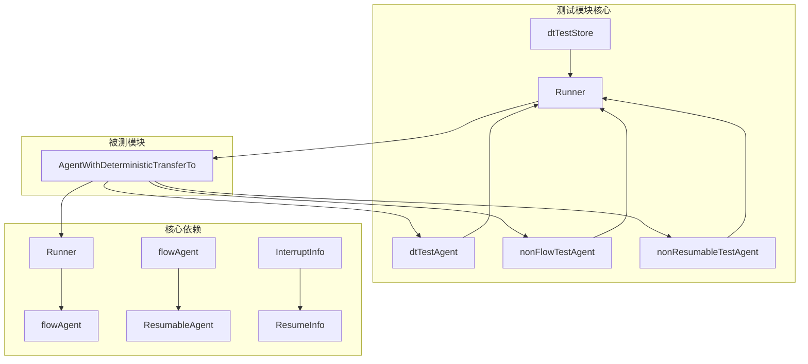

# deterministic_transfer_tests 模块技术文档

## 模块概述

`deterministic_transfer_tests` 是 ADK 框架中专门用于测试确定性转移（Deterministic Transfer）功能的模块。确定性转移是一种强大的多 Agent 编排模式——当一个 Agent 完成执行后，不需要 LLM 决策，而是由框架自动、确定地将控制权移交给下一个指定的 Agent。

这个模块解决的问题可以类比为一列火车的车厢连接器：在传统的多 Agent 系统中，每个 Agent 就像一节独立的车厢，需要人工（LLM）决定何时连接下一节；而确定性转移就像自动车钩，Agent A 完成时，框架自动将控制权传递给 Agent B，整个过程是确定性的、可预测的、可被中断和恢复的。

对于一个新加入团队的工程师来说，理解这个模块的关键在于把握一个核心矛盾：**确定性转移动态地组合了两个独立的 Agent，但这两个 Agent 各自有自己的执行上下文和状态管理**。测试模块正是围绕这个核心矛盾，设计了各种场景来验证组合后的行为是否符合预期。

---

## 架构与依赖关系

### 组件角色分析

该模块包含四个核心测试辅助组件，它们共同构成了测试的基础设施：

**dtTestStore** 是一个轻量级的内存 Checkpoint Store 实现。在 ADK 框架中，当 Agent 执行被中断时，需要将状态持久化以便后续恢复。dtTestStore 模拟了这个存储层，提供 `Set` 和 `Get` 两个基本方法。它不涉及复杂的序列化逻辑，仅在内存中维护一个 `map[string][]byte`，这使得测试能够快速验证中断恢复的核心流程，而无需依赖外部存储系统。

**dtTestAgent** 是一个支持完整生命周期的测试 Agent。它同时实现了 `Run` 和 `Resume` 方法，能够模拟一个可中断、可恢复的 Agent 行为。这个设计非常关键——在真实的生产环境中，Agent 可能被中断然后恢复继续执行，dtTestAgent 让我们能够在测试中精确控制这个中断-恢复的流程。dtTestAgent 的 `runFn` 和 `resumeFn` 是函数类型的字段，允许测试代码自定义每个阶段的行为，这是测试基础设施的一个巧妙设计。

**nonFlowTestAgent** 模拟的是没有转换为 flowAgent 的普通 Agent。flowAgent 是 ADK 框架中管理子 Agent 生命周期的组件，它提供了事件聚合、RunPath 追踪等高级功能。nonFlowTestAgent 帮助我们验证确定性转移包装器在处理普通 Agent 时的行为是否正确。

**nonResumableTestAgent** 则更进一步，它只实现了 `Run` 方法，不支持 `Resume`。这用于测试当被包装的 Agent 本身不可恢复时，整个包装器的行为是否符合预期。



从依赖图可以看到，测试模块实际上是在验证 `AgentWithDeterministicTransferTo` 与 `Runner`、`flowAgent` 以及中断恢复机制的集成。测试不直接测试 deterministic_transfer.go 的内部实现，而是通过端到端的方式验证整个系统在各种场景下的正确性。

---

## 数据流分析

### 典型执行路径：中断与恢复

让我们追踪 `TestDeterministicTransferFlowAgentInterruptResume` 测试中的数据流，这个测试最能体现确定性转移的核心设计：

**第一阶段：Run 执行**

1. 用户通过 `Runner.Run()` 启动执行，传入消息 "test"
2. Runner 创建 outerFlowAgent 作为根 Agent
3. outerAgent.Run() 被调用，它内部调用 wrapped Agent 的 Run 方法
4. wrapped Agent 实际上是 `AgentWithDeterministicTransferTo` 包装后的 innerFlowAgent
5. innerAgent 的 runFn 被执行，发送一条消息 "before interrupt"
6. 然后触发 `Interrupt(ctx, interruptData)`，这会创建一个中断事件
7. 关键点：确定性转移包装器检测到中断事件，不生成 transfer 事件，而是创建一个 `CompositeInterrupt`，携带 `deterministicTransferState` 状态
8. 中断事件被保存到 Checkpoint Store

**第二阶段：Resume 恢复**

1. 用户调用 `Runner.ResumeWithParams(ctx, "cp1", &ResumeParams{Targets: ...})`
2. Runner 从 Checkpoint Store 加载状态，获取 `deterministicTransferState`
3. 调用 wrapped Agent 的 Resume 方法
4. 包装器将保存的 EventList 恢复到隔离的 Session 中
5. innerAgent 的 resumeFn 被执行，恢复执行
6. 恢复执行完成后，包装器检测到这是正常完成（而非中断或 Exit），生成 Transfer 事件
7. Transfer 事件指导 Runner 将控制权移交给 "next_agent"
8. 由于 "next_agent" 不存在，返回错误

这个流程揭示了确定性转移的核心设计理念：**包装器不仅转发事件，还管理状态的保存和恢复**。当 flowAgent 被中断时，包装器创建一个特殊的 `deterministicTransferState` 来保存事件列表，然后在恢复时将这些事件重新注入到隔离的 Session 中。

### RunPath 传播机制

另一个关键的数据流是 RunPath 的传播。RunPath 记录了从根 Agent 到当前事件来源的完整执行路径。在 `TestDeterministicTransferRunPathPreserved` 测试中，我们看到：

```go
assert.Len(t, rp, 2, "RunPath should have 2 steps (outer agent, inner agent)")
assert.Equal(t, "outer", rp[0].agentName, "RunPath[0] should be outer agent")
assert.Equal(t, "inner", rp[1].agentName, "RunPath[1] should be inner agent")
```

这个测试验证了一个重要的不变量：**即使 Agent 被确定性转移包装器包装，RunPath 仍然正确地包含所有祖先 Agent**。这对于调试和审计至关重要——工程师需要知道一个事件是在哪个 Agent 链中产生的。

---

## 核心设计决策与权衡

### 决策一：两种包装器类型

`AgentWithDeterministicTransferTo` 函数根据被包装的 Agent 是否实现了 `ResumableAgent` 接口，返回两种不同的包装器：

- 如果 Agent 实现了 `Resume` 方法，使用 `resumableAgentWithDeterministicTransferTo`
- 否则，使用 `agentWithDeterministicTransferTo`

这是一个经典的**静态分发**模式。选择这个设计的原因是：可恢复的 Agent 需要额外的状态管理逻辑（保存和恢复 EventList），而不可恢复的 Agent 则不需要这些开销。这种设计避免了运行时检查的性能损耗，同时保持了代码的简洁性。

### 决策二：Session 隔离

对于 flowAgent，确定性转移包装器会创建一个**隔离的 Session**。这是因为 flowAgent 管理自己的子 Agent 事件，如果直接使用父 Session，会导致事件重复或者状态混乱。

隔离 Session 的实现方式是：创建一个新的 `runSession`，但共享父 Session 的 `Values` 和 `valuesMtx`。这意味着：
- 子 Agent 可以修改 Session Values，这些修改对父 Agent 可见
- 但事件历史是隔离的，各自维护自己的事件列表

这是一个**共享状态 vs 隔离历史**的权衡。选择隔离历史是因为事件流是线性的，过早合并会导致难以追踪事件的来源。

### 决策三：Transfer 跳过条件

确定性转移只在以下条件都满足时生成：
1. 最后一个事件不是 `Exit` 动作
2. 最后一个事件不是 `Interrupted` 状态
3. 最后一个事件没有 `internalInterrupted` 信号

这个设计是合理的：Exit 和 Interrupt 都表示执行没有正常完成，此时不应该进行转移。工程师需要理解的是，这个决策是在包装器层面做的，被包装的 Agent 不需要关心这些问题。

---

## 测试场景深度解析

### 场景一：Flow Agent 的中断恢复

`TestDeterministicTransferFlowAgentInterruptResume` 是最复杂的测试，它验证了：

1. **中断事件正确传播**：中断信息包含 `interruptData`，并且有正确的 InterruptContexts
2. **状态正确保存**：Checkpoint Store 中保存了状态，可以被加载
3. **恢复后事件恢复**：Session.Events 恢复后包含中断前的事件
4. **RunPath 正确**：恢复后的事件仍然有正确的 RunPath
5. **恢复后转移正确**：恢复完成后仍然生成 Transfer 事件

### 场景二：Exit 跳过转移

`TestDeterministicTransferExitSkipsTransfer` 和 `TestDeterministicTransferNonFlowAgent_ExitSkipsTransfer` 验证了当被包装的 Agent 发送 Exit 动作时，不会生成转移事件。

这个设计背后有一个清晰的业务逻辑：如果一个 Agent 明确表示要退出（可能是完成了它的主要任务），那么继续转移给下一个 Agent 是不合适的。Exit 信号通常意味着整个工作流应该结束。

### 场景三：不可恢复 Agent 的处理

`TestDeterministicTransferNonResumableAgent` 验证了当包装一个不支持恢复的 Agent 时：
- 包装后的 Agent 也不应该实现 `ResumableAgent` 接口
- 基本的 `Name` 和 `Description` 方法正确委托给内部 Agent
- 正常执行时仍然生成 Transfer 事件

这是一个**透明委托**的设计——包装器只在必要时添加行为，对于不需要的功能（如恢复），它不会伪造支持。

---

## 常见陷阱与注意事项

### 陷阱一：flowAgent vs 普通 Agent 的行为差异

测试代码中大量使用了 `toFlowAgent(ctx, innerAgent)` 来将测试 Agent 转换为 flowAgent。这不是任意的——flowAgent 提供了完整的事件管理和中断恢复支持。如果不转换为 flowAgent，很多行为会不同。

工程师在实际使用时需要注意：如果你需要一个 Agent 支持完整的中断恢复能力，应该将其包装为 flowAgent。

### 陷阱二：InterruptState 的类型断言

在 `resumeFlowAgentWithIsolatedSession` 中，有这样一段代码：

```go
state, ok := info.InterruptState.(*deterministicTransferState)
if !ok || state == nil {
    return genErrorIter(errors.New("invalid interrupt state for flowAgent resume in deterministic transfer"))
}
```

这个类型断言揭示了一个重要的契约：**恢复时传入的 InterruptState 必须是 deterministicTransferState 类型**。如果状态在保存或加载过程中被损坏（比如不同版本的序列化），恢复会失败并返回错误。

### 陷阱三：嵌套包装的限制

测试中没有覆盖的场景是：多个确定性转移包装器嵌套使用。这种情况下，每个包装器都会尝试管理自己的状态，可能导致状态冲突或丢失。如果需要链式转移，建议在单一包装器中指定多个 `ToAgentNames`。

---

## 与其他模块的关系

这个测试模块验证的功能与多个核心模块交互：

- **[flow_agent_orchestration](flow_agent_orchestration.md)**：flowAgent 是确定性转移的核心依赖，提供了子 Agent 管理和事件聚合能力
- **[interrupt_resume_bridge](interrupt_resume_bridge.md)**：中断和恢复机制是确定性转移能够"可恢复"的基础
- **[runner_execution_and_resume](runner_execution_and_resume.md)**：Runner 是执行 Agent 的入口，它协调整个运行生命周期
- **[deterministic_transfer_wrappers](deterministic_transfer_wrappers.md)**：这是被测试的实际实现模块

---

## 总结

`deterministic_transfer_tests` 模块通过精心设计的测试场景，验证了确定性转移功能的正确性。对于新加入的工程师，理解这个模块的关键在于把握以下几点：

1. **确定性转移是一种框架级的 Agent 组合模式**，它不依赖 LLM 决策，而是在框架层面确保 Agent 按指定顺序执行

2. **Session 隔离是关键设计**，它确保子 Agent 的事件历史不会污染父 Agent，同时又共享状态

3. **中断恢复需要状态管理**，`deterministicTransferState` 保存了恢复所需的所有事件

4. **Exit 和 Interrupt 跳过转移**是一个明确的业务规则，表示非正常结束的 Agent 不应该继续转移

5. **测试覆盖了端到端场景**，通过 Runner 完整验证了从 Run 到 Resume 的整个生命周期