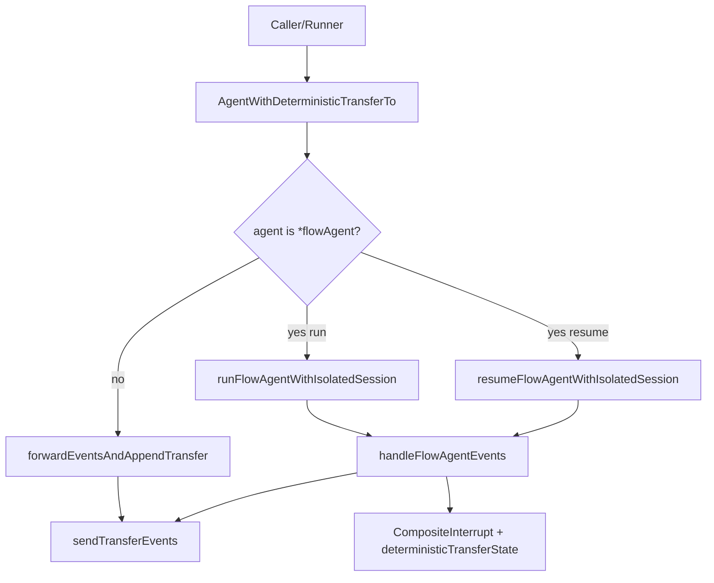

# deterministic_transfer_wrapper 深入解析

`deterministic_transfer_wrapper`（代码位于 `adk/deterministic_transfer.go`）本质上是一个“收尾控制器”：它不改变 agent 的主逻辑，而是在 agent 正常跑完后，**稳定地追加一组 `TransferToAgent` 事件**，把执行流按预设顺序交给下一个 agent。它存在的核心原因是：在多 agent 场景里，如果把“是否转移、转移到谁”完全交给模型输出，会引入不可预测性；而生产系统常常需要可审计、可恢复、可复现的 handoff 路径。这个 wrapper 就是把“转移决策”从模型概率空间里拿出来，变成框架层的确定性行为。

## 为什么需要这个模块：它解决了什么“朴素方案做不好”的问题

朴素做法是让每个 agent 自己输出 transfer tool call（例如让模型决定调用 `transfer_to_agent`）。这个方案简单，但会遇到三类系统级问题。

第一类是**确定性不足**。同样输入下，模型可能因为温度、上下文扰动、重试路径不同而给出不同 transfer 行为，导致多 agent pipeline 的拓扑不稳定。对于需要 SLA、回放、风控审计的系统，这种不稳定不可接受。

第二类是**中断/恢复一致性**。ADK 支持 interrupt + checkpoint + resume。如果 transfer 逻辑散落在 agent 内部，恢复后很容易出现“重复 transfer”或“漏 transfer”。`deterministic_transfer_wrapper` 通过 `deterministicTransferState` 和 `CompositeInterrupt(...)` 把 wrapper 自己的中间态纳入恢复链路，保证 resume 后行为一致。

第三类是**与 `flowAgent` 会话模型的耦合**。`flowAgent` 会把历史事件写入 `runSession.Events` 并在后续 `genAgentInput(...)` 里重放。如果 wrapper 不做额外隔离，可能污染父 session 或破坏 RunPath/事件归属。该模块专门为 `*flowAgent` 分支设计了隔离 session 路径（`runFlowAgentWithIsolatedSession` / `resumeFlowAgentWithIsolatedSession`），避免副作用扩散。

可以把它类比成机场的“自动转机闸口”：乘客（事件）先按原航班流程通行；如果没有“终止/中断”标记，闸口自动把乘客导到下一段航班（transfer 事件），而且这个闸口对异常中断和改签（resume）有完整记录。

## 心智模型：三层职责叠加

理解这个模块，建议在脑中建立三个同心层。

最内层是**透明代理层**：`agentWithDeterministicTransferTo` / `resumableAgentWithDeterministicTransferTo` 对 `Name(...)`、`Description(...)` 直接透传，对 `Run(...)` / `Resume(...)` 只做后处理，不侵入业务 agent 内部。

中间层是**事件后处理层**：`forwardEventsAndAppendTransfer(...)` 与 `handleFlowAgentEvents(...)` 都在做“先转发原始事件，再依据末事件状态决定是否追加 transfer”。关键判定是：末事件若 `Interrupted` 或 `Exit`，就不追加；否则调用 `sendTransferEvents(...)`。

最外层是**flow 专用一致性层**：当被包装对象是 `*flowAgent`，不走通用路径，而是走 isolated session 分支，专门处理父子 session 共享值、事件复制、内部中断封装（`internalInterrupted` -> `CompositeInterrupt`）等细节，保证 checkpoint/resume 链路完整。

## 架构与数据流



从调用关系上看，入口是 `AgentWithDeterministicTransferTo(...)`。它根据 `config.Agent` 是否实现 `ResumableAgent`，返回两种 wrapper 之一。这是一个很实用的设计：**不强迫所有 agent 实现 resume**，但如果底层支持 resume，wrapper 能保持该能力不丢失。

`Run(...)` 的关键分叉是 `if fa, ok := a.agent.(*flowAgent); ok`。非 flow 场景直接拿到底层 iterator，后台 goroutine 执行 `forwardEventsAndAppendTransfer(...)`；flow 场景改走 `runFlowAgentWithIsolatedSession(...)`。后者会从上下文拿到 `parentSession` 与 `parentRunCtx`，创建 `isolatedSession`，共享 `Values/valuesMtx`，但把事件链路隔离开来，然后把新 `runContext` 注入 context 再调用 `fa.Run(...)`。

`handleFlowAgentEvents(...)` 是最热路径之一：它持续消费 flow 输出事件，按条件把事件复制后写入 `parentSession.addEvent(...)`，同时把可见事件发给下游 generator。若检测到 `event.Action.internalInterrupted != nil`，它不会立刻向外发这个原始中断事件，而是先缓存为 `lastEvent`；循环结束后将 `isolatedSession.getEvents()` 封装进 `deterministicTransferState`，再通过 `CompositeInterrupt(...)` 发出“组合中断”，从而让 wrapper 自身成为可恢复层级的一部分。

恢复路径 `resumeFlowAgentWithIsolatedSession(...)` 则要求 `info.InterruptState` 必须是 `*deterministicTransferState`，否则通过 `genErrorIter(...)` 返回错误事件。也就是说，这里有一个明确的数据契约：**flow wrapper 的 resume 必须配套 wrapper 生成的 interrupt state**。

## 组件深潜

### `deterministicTransferState`

这是一个极小但关键的状态容器：

```go
type deterministicTransferState struct {
    EventList []*agentEventWrapper
}
```

它在 `init()` 里通过 `schema.RegisterName[*deterministicTransferState](...)` 注册序列化名称，目的非常明确：让 checkpoint 反序列化时能还原具体类型。没有这一步，`ResumeInfo.InterruptState` 很可能只能以 `any` 的不透明形式存在，无法安全断言回该结构。

### `AgentWithDeterministicTransferTo(...)`

它是工厂函数，不直接返回接口实现细节，而是根据能力选择 wrapper 类型：

- 底层是 `ResumableAgent` -> `resumableAgentWithDeterministicTransferTo`
- 否则 -> `agentWithDeterministicTransferTo`

这个选择体现了“能力保持”原则：wrapper 不应该降级被包装对象的特性。

### `agentWithDeterministicTransferTo` / `resumableAgentWithDeterministicTransferTo`

两者的 `Name(...)`、`Description(...)` 都是纯透传；`Run(...)` 逻辑几乎一致。`resumable...` 额外实现 `Resume(...)`，并在 flow/non-flow 两条分支里分别调用 `resumeFlowAgentWithIsolatedSession(...)` 或通用后处理路径。

这里的设计取舍是“少抽象、强可读”：理论上两者可抽象为一个泛型组合，但 Go 当前接口组合下可读性未必更好。当前实现用少量重复换来直观行为边界。

### `forwardEventsAndAppendTransfer(...)`

这是非 flow 路径的核心后处理器。它做三件事：

1. 顺序转发上游所有事件，并记录 `lastEvent`。
2. 若 `lastEvent.Action.Interrupted != nil` 或 `lastEvent.Action.Exit == true`，直接返回。
3. 否则调用 `sendTransferEvents(...)` 追加 transfer 序列。

函数外层有 panic recover，发生 panic 时会发送 `AgentEvent{Err: safe.NewPanicErr(...)}`，保证消费者仍然通过事件通道感知失败，而不是无声挂死。

### `runFlowAgentWithIsolatedSession(...)` / `resumeFlowAgentWithIsolatedSession(...)`

这两个函数体现了模块最不显眼但最重要的设计意图：**对 flowAgent 做 session 隔离，但共享 Values**。

- 共享 `Values`/`valuesMtx`：保持业务态（会话变量）连续。
- 隔离事件轨迹：避免 wrapper 处理中间态直接污染父事件历史。
- resume 时从 `deterministicTransferState.EventList` 恢复 `isolatedSession.Events`，实现“中断点继续写同一段历史”。

`resumeFlowAgentWithIsolatedSession(...)` 先做严格类型校验，失败即 `invalid interrupt state...`。这保证恢复路径不会在错误状态下“勉强继续”，优先 correctness。

### `handleFlowAgentEvents(...)`

它比非 flow 版本多三层逻辑。

首先，它会把非中断事件复制后写回 `parentSession`。复制通过 `copyAgentEvent(...)` 完成，并对原事件与副本都调用 `setAutomaticClose(...)`，确保流式消息资源可被自动关闭，防止 stream 泄露。

其次，它对 `internalInterrupted` 采取“拦截并延迟发出”。这避免把底层内部中断直接暴露给上层，而是由 wrapper 统一封装成 `CompositeInterrupt(...)`。

最后，当检测到内部中断时，它把 `isolatedSession.getEvents()` 注入 `deterministicTransferState`，构造带状态的组合中断事件发出；若末动作是 `Exit`，不追加 transfer；其余正常收尾则追加 transfer。

### `sendTransferEvents(...)`

它对每个 `toAgentName` 发送两条事件：先 assistant 消息，再 tool 消息。消息由 `GenTransferMessages(...)` 生成，事件由 `EventFromMessage(...)` 封装。第二条 tool 事件会显式设置：

```go
Action: &AgentAction{
  TransferToAgent: &TransferToAgentAction{DestAgentName: toAgentName},
}
```

这意味着 transfer 不只是文本语义，而是结构化动作信号；`flowAgent.run(...)` 会读取 `lastAction.TransferToAgent` 并实际执行子 agent 切换。

## 依赖关系与契约分析

该模块向下依赖的关键点主要有三个。

其一是运行时与会话上下文能力：`getSession(...)`、`getRunCtx(...)`、`setRunCtx(...)`、`runSession.addEvent(...)`、`runSession.getEvents(...)`。wrapper 假定调用上下文里存在可用 runCtx/session；如果为空，它做了部分防御（比如 mutex/map 补建），但并不试图重建完整执行语义。

其二是中断系统：`CompositeInterrupt(...)`、`ResumeInfo.InterruptState`。flow resume 分支明确依赖 `InterruptState` 为 `*deterministicTransferState`；若上游恢复器传错类型，会立即报错。

其三是消息与事件工具：`GenTransferMessages(...)`、`EventFromMessage(...)`、`copyAgentEvent(...)`、`setAutomaticClose(...)`、`genErrorIter(...)`。它们提供 transfer 消息格式、事件克隆和错误传播的基础能力。

向上看，调用方通常是把某个 agent（常见是 `flowAgent`）用 `AgentWithDeterministicTransferTo(...)` 包装后交给 `Runner` 执行。`Runner` 在 `handleIter(...)` 里会消费 `internalInterrupted` 并做 checkpoint，因此这个模块发出的组合中断能够被 runner 正确持久化并恢复。

## 关键设计取舍

这里最典型的取舍是**正确性优先于最简实现**。最简单的实现是“末尾直接 append transfer 事件”，但在 `flowAgent + interrupt/resume` 下会破坏状态一致性。当前实现引入 isolated session、状态注册、组合中断，代码复杂度上升，但换来了可恢复与可审计。

另一个取舍是**对 `*flowAgent` 使用具体类型分支**。这增加了对实现类型的耦合（而不是仅依赖 `Agent` 接口），但也让 wrapper 能精确复用 flow 的 runCtx/session 机制。若未来 `flowAgent` 内部语义变化，这里需要同步演进，这是有意识接受的耦合成本。

第三个取舍是**顺序串行转发与末尾决策**。模块不做并行 speculative transfer，而是严格“消费完上游 iterator 后再决定”。这牺牲一点延迟，但避免了在中断/退出情况下提前发错 transfer。

## 使用方式与示例

典型用法是把任意 `Agent` 放进 `DeterministicTransferConfig`：

```go
wrapped := AgentWithDeterministicTransferTo(ctx, &DeterministicTransferConfig{
    Agent:        myAgent,
    ToAgentNames: []string{"next_agent"},
})

runner := NewRunner(ctx, RunnerConfig{Agent: wrapped, EnableStreaming: true, CheckPointStore: store})
iter := runner.Run(ctx, []Message{schema.UserMessage("hi")}, WithCheckPointID("cp1"))
```

若 `myAgent` 本身实现 `ResumableAgent`，`wrapped` 也可做类型断言并调用 `Resume(...)`。flow 场景下 resume 依赖 wrapper 生成的 interrupt state，不建议手工伪造 `ResumeInfo.InterruptState`。

`ToAgentNames` 支持多个目标，`sendTransferEvents(...)` 会按顺序发送多组 transfer 事件。因此它更像“确定性 handoff 列表”，而不是“单一跳转”。

## 新贡献者最该注意的坑

第一个坑是 **`internalInterrupted` 与 `Interrupted` 的区别**。`handleFlowAgentEvents(...)` 判定和封装用的是 `internalInterrupted`，这是内部中断信号链；不要只看对外 `Interrupted` 字段，否则会误判中断传播行为。

第二个坑是 **stream 生命周期**。事件复制后会双向 `setAutomaticClose(...)`。若你修改事件拷贝或转发路径，必须保持 stream 独占与自动关闭语义，否则容易出现重复消费或资源泄露。

第三个坑是 **resume 类型契约**。`resumeFlowAgentWithIsolatedSession(...)` 对 `info.InterruptState` 做严格断言；任何改动 `deterministicTransferState` 字段或注册名（`schema.RegisterName`）都要考虑 checkpoint 兼容性。

第四个坑是 **transfer 追加条件依赖“最后一个事件”**。如果你在后处理里新增“尾部事件”，可能意外改变 `lastEvent` 判定，进而影响是否追加 transfer。

## 参考阅读

- [flow_agent_orchestration](flow_agent_orchestration.md)：`flowAgent` 的历史重写、转移执行与 RunPath 规则
- [runner_lifecycle_and_checkpointing](runner_lifecycle_and_checkpointing.md)：`Runner` 如何消费中断并做 checkpoint/resume
- [ADK Interrupt](ADK%20Interrupt.md)：`Interrupt` / `CompositeInterrupt` 的信号模型与恢复语义
- [ADK Utils](ADK%20Utils.md)：`AsyncIterator` / `AsyncGenerator` 的通道模型
