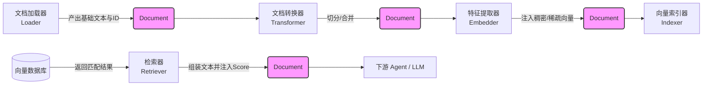

# Document 模块深度解析

在构建检索增强生成（RAG）、搜索引擎或任何复杂的文本处理流水线时，数据往往需要穿梭于各个独立的子系统之间。从文件加载、文本分块，到向量计算、建立索引，再到最终的检索召回，每一环不仅需要读取文本内容，还需要附加各种形态的上下文（如相关性得分、稠密向量、稀疏矩阵或自定义的业务标签）。如果强行将所有可能的字段都硬编码到基础的数据结构中，代码会变得极其臃肿、僵化且难以维护。`document` 模块（具体为 `schema.document.Document`）正是为了解决这个“跨系统状态传递”的痛点而诞生的。它提供了一个标准化且极具弹性的数据载体，允许流水线上的各个组件在不破坏核心数据契约的前提下，自由地给文本“贴标签”、“挂载私货”，从而实现了整个架构的高度解耦。

## 架构与心智模型

理解 `Document` 最好的比喻是**带有附加记录板的物流集装箱**。集装箱里装载的“核心货物”是文本内容（`Content`），在流转过程中通常是被只读消费的。集装箱外部印有“追踪单号”（`ID`），确保数据在不同组件间能够被唯一标识。而最巧妙的设计在于它配备了一块“开放的记录板”（`MetaData`）。流水线上的每一个检查站都可以查看这块记录板，也可以往上面贴新的信息，而完全不需要重新打包货物。

以下是 `Document` 在核心组件之间流转的架构图：



在上述链路中，`Document` 扮演了**统一的数据总线**角色。
1. **数据接入**：`Loader`（如 PDF 或网页解析器）初始化 `Document` 实例，填入基础文本和唯一 ID。
2. **加工转换**：`Transformer` 接收长篇 `Document`，将其切分为多个小的 `Document` 块，并在这个过程中决定如何继承或拆分原有的元数据。
3. **特征工程**：`Embedder` 消费文本内容，计算出向量特征，并通过调用特定的注入方法（如 `WithDenseVector()`）将高维数组记录在元数据的记录板上。
4. **存储与检索**：`Indexer` 将挂载了向量的 `Document` 写入底层数据库。而在另一条查询链路中，`Retriever` 从数据库中查出结果，将其重新组装为 `Document` 列表，并通过 `WithScore()` 附加底层数据库返回的相关性得分，最终交付给大语言模型或业务逻辑节点。

## 组件深度剖析

`schema.document` 模块的核心非常精简，仅包含一个核心结构体 `Document` 及其一系列辅助方法。

```go
type Document struct {
        ID       string         `json:"id"`
        Content  string         `json:"content"`
        MetaData map[string]any `json:"meta_data"`
}
```

### 核心机制：链式特征注入与安全解包

为了方便框架层面对具有共识的特征数据（如得分、向量）进行读写，模块提供了一系列**链式调用 (Fluent API)** 方法，例如 `WithScore`、`Score`、`WithDenseVector`、`DenseVector` 等。这些方法在底层统一操作 `MetaData` 字典，并以模块内部定义的常量键（如 `docMetaDataKeyScore = "_score"`）作为标准命名空间。

**惰性初始化 (Lazy Initialization)**
当你调用诸如 `WithScore(0.95)` 的方法时，内部实现会首先检查 `MetaData` 是否为 `nil`。如果是，它会自动执行 `make(map[string]any)`。这种设计将开发者从繁琐的初始化样板代码中解放出来，使得无论从哪里获取到的空壳 `Document` 都可以直接安全地挂载数据。

**宽容的类型解包 (Safe Getters)**
在读取元数据时（例如 `Score()` 方法），内部严格使用了 Go 的“comma-ok”类型断言语法：
```go
score, ok := d.MetaData[docMetaDataKeyScore].(float64)
if ok {
    return score
}
return 0
```
这种防御性编程意味着，即使外部（例如某个反序列化组件）错误地塞入了类型不匹配的值，程序也不会因为 Panic 而崩溃，而是优雅地返回该类型的零值。

## 依赖链路与数据契约

`Document` 处于整个系统的地基位置，被众多上层组件所依赖（Depended By）：
- **[components.document](../components/document.md)**：`Loader` 接口的契约是输出 `[]*Document`，`Transformer` 接口的契约是接收 `[]*Document` 并返回修改后的 `[]*Document`。
- **[components.embedding](../components/embedding.md)**：`Embedder` 期望接收 `[]*Document`，虽然它主要读取 `Content` 进行特征提取，但它的输出契约是必须将计算好的向量通过 `WithDenseVector()` 或 `WithSparseVector()` 写回传入的 `Document` 中。
- **[components.retriever](../components/retriever.md)**：`Retriever` 的核心职责是将非结构化的查询转化为结构化的 `[]*Document` 返回。它隐含的契约是，除了填充文本外，还应尽可能通过 `WithScore()` 提供相关性信息。
- **[components.indexer](../components/indexer.md)**：依赖 `Document` 作为入库的实体，它假设传入的 `Document` 已经由 `Embedder` 挂载了必需的向量数据。

`Document` 本身**没有任何外部依赖**（除了 Go 标准库），这种零依赖的设计确保了它作为核心领域模型的绝对纯粹性。

## 设计决策与权衡

### 1. 灵活性 vs 严格类型安全
**决策**：使用了 `map[string]any` 来存储附加信息，而不是为 `Score`、`Vector` 等属性创建严格类型的实体字段。
**原因**：在实际的 AI 系统中，不同的向量数据库对元数据的形态要求千差万别。有些支持复杂的 DSL 过滤条件，有些需要存储稀疏向量，甚至有的需要保留文档的目录树层级关系。如果将这些属性固化进结构体字段，`Document` 会迅速膨胀。使用 Map 配合预定义方法，在“保持实体轻量紧凑”和“提供框架级便利”之间找到了平衡。
**代价**：牺牲了编译期的强类型检查，将数据一致性的风险推迟到了运行时的类型断言。

### 2. 原地修改 vs 不可变性
**决策**：所有的 `WithXXX` 设值方法都会**原地修改**对象自身并返回指针。
**原因**：出于性能考量。在文档拆分或大规模批处理场景下，频繁拷贝包含大段文本内容的结构体将带来显著的内存分配和垃圾回收（GC）开销。原地修改能够有效降低系统负担，提升数据流水线的吞吐量。
**代价**：带来了隐式的并发读写安全隐患。由于底层的 `map` 非并发安全，这意味着 `Document` 在不同 goroutine 间流转时必须遵循严格的所有权转移，或者在并行处理前进行深拷贝。

## 使用模式与示例

**标准使用模式：创建、特征注入与安全消费**

```go
// 1. 初始化 Document (通常发生在 Loader 阶段)
doc := &schema.Document{
    ID:      "doc-1001",
    Content: "Go 语言的接口设计提倡鸭子类型...",
}

// 2. 链式特征注入 (通常发生在 Embedder 或 Retriever 阶段)
doc.WithDenseVector([]float64{0.1, 0.5, -0.3}).
    WithScore(0.85).
    WithExtraInfo("author: John Doe")

// 3. 安全获取与消费 (通常发生在下游业务层或 Router 节点)
score := doc.Score()       // 0.85
vec := doc.DenseVector()   // []float64{0.1, 0.5, -0.3}

// 4. 操作非标准的业务自定义元数据
if doc.MetaData == nil {
    doc.MetaData = make(map[string]any)
}
doc.MetaData["custom_tags"] = []string{"golang", "design-pattern"}
```

## 避坑指南与边缘情况

新加入的开发者在处理 `Document` 时，请务必留意以下几个陷阱：

1. **直接写入 `MetaData` 导致的空指针 Panic**
   虽然框架内置的 `WithXXX` 系列方法实现了 `MetaData` 的惰性初始化，但如果你**手动**向 `MetaData` 中写入业务自定义数据，必须先检查其是否为 `nil`。
   ```go
   // ❌ 错误做法：若上游没有初始化 MetaData，此处会直接引发 Panic
   doc.MetaData["tenant_id"] = "t-123"

   // ✅ 正确做法：
   if doc.MetaData == nil {
       doc.MetaData = make(map[string]any)
   }
   doc.MetaData["tenant_id"] = "t-123"
   ```

2. **类型断言的“静默失败”**
   Getter 方法（如 `Score()`）具有极高的宽容度。假设你（或某个第三方的反序列化逻辑）错误地用 `int` 类型存入了分数：
   ```go
   doc.MetaData["_score"] = 100 // 错误地存入了 int，而非期望的 float64
   ```
   随后调用 `doc.Score()` 时，因为底层期望的是 `float64`，类型断言会失败。此时方法将**静默返回 `0`** 而不会抛出任何警告。这种隐蔽的数据丢失在调试 RAG 检索召回率下降时极难排查。
   **建议**：始终使用内置的 `WithXXX` 方法进行存取，绝对不要直接使用魔术字符串（如 `"_score"`）去覆写底层 Map。

3. **并发写入是非安全的**
   `Document` 内部的 `MetaData` 是一个普通的 Go map，且没有任何锁保护（Mutex）。当 `Document` 被分发到并行流水线（例如使用 goroutine 并发抽取实体的场景）中时，绝不能对同一个实例并发调用 `WithXXX`，否则会触发致命的 `fatal error: concurrent map writes` 导致整个进程崩溃。
   **建议**：在执行多线程修改操作前，请务必在应用程序层面完成 `Document` 及其 Map 的深拷贝。