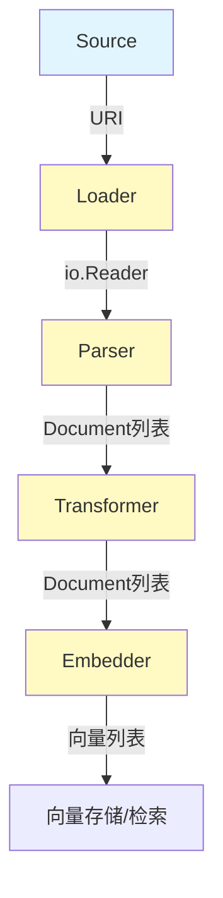

# document_interfaces 模块技术深度解析

## 1. 模块概述

`document_interfaces` 模块是整个文档处理子系统的**抽象层**，定义了文档加载、解析、转换和嵌入的核心接口。在实际应用中，开发者经常需要处理各种来源的文档（PDF、Word、网页等），这个模块通过统一的抽象，将不同格式、不同来源的文档处理流程标准化，让上层应用无需关心底层实现细节。

## 2. 核心问题与设计思路

### 问题空间：
在构建 RAG（检索增强生成）或文档分析系统时，你需要解决三个核心问题：
- **文档来源多样性**：文档可能来自本地文件、网络URL、数据库、对象存储等
- **格式差异性**：PDF、Word、Markdown、HTML 等格式需要不同的解析逻辑
- **处理流程可变性**：有些文档需要分割、过滤、清洗等预处理操作

如果没有统一抽象，每个应用会直接耦合到具体实现，导致：
1. 代码重复严重
2. 难以替换实现
3. 测试困难
4. 系统可维护性差

### 设计洞察：
这个模块采用了**接口优先**的设计哲学，将文档处理流程拆解为三个独立的抽象层次：
- **Loader：负责从各种来源读取原始数据
- **Parser：负责将原始数据解析为统一的 Document 结构
- **Transformer：负责对 Document 进行转换处理
- **Embedder：负责将文本转换为向量表示

每个层次都有明确的职责边界，通过组合这些接口，可以灵活地构建文档处理管道。

## 3. 架构与数据流



### 组件角色说明：

1. **Source** - 文档来源的统一标识，仅仅包含一个 URI 字段，用于定位文档资源
2. **Loader** - 文档加载器，负责从 Source 读取原始数据
3. **Parser** - 文档解析器，将原始数据流解析为结构化的 Document 对象
4. **Transformer** - 文档转换器，对 Document 集合进行转换操作
5. **Embedder** - 文本嵌入器，将文本内容转换为向量表示

### 典型数据流向：
```
Source.URI → Loader.Load() → io.Reader → Parser.Parse() → []*Document → Transformer.Transform() → []*Document → （可选）Embedder.EmbedStrings()
```

## 4. 核心组件深度解析

### Source 结构体

```go
type Source struct {
        URI string
}
```

**设计意图**：这是一个极简但关键的抽象，将所有文档来源统一表示为 URI。这种设计有几个重要考虑：
- **通用性**：URI 可以表示文件路径、URL、数据库连接等各种来源
- **可扩展性**：新的来源类型只需遵循 URI 规范即可
- **简单性**：避免了复杂的来源类型枚举

**使用场景**：
- 文件系统路径：`file:///path/to/document.pdf`
- 网络资源：`https://example.com/doc.html`
- 对象存储：`s3://bucket/key`

### Loader 接口

```go
type Loader interface {
        Load(ctx context.Context, src Source, opts ...LoaderOption) ([]*schema.Document, error)
}
```

**核心职责**：从 Source 指定的位置读取原始数据，并协调 Parser 完成解析。

**设计要点**：
- **上下文传递**：支持 context 用于超时控制和取消
- **选项模式**：使用可变参数选项，便于扩展配置
- **批量输出**：直接返回解析后的 Document 集合，隐藏内部协调逻辑

**实现者需要考虑**：
1. 验证 Source.URI 的格式
2. 建立到资源的连接
3. 获取 io.Reader
4. 调用 Parser 解析
5. 处理错误和资源清理

### Parser 接口

```go
type Parser interface {
        Parse(ctx context.Context, reader io.Reader, opts ...Option) ([]*schema.Document, error)
}
```

**核心职责**：将原始字节流解析为结构化的 Document 对象。

**设计要点**：
- **输入抽象**：使用 io.Reader 而非具体类型，最大化灵活性
- **上下文感知**：支持 context 用于中断和元数据传递
- **批量输出**：返回 Document 集合，一个文件可能解析为多个文档片段

**实现者关注点**：
1. 处理不同的编码问题
2. 提取元数据到 Document.MetaData
3. 处理分页、分节等结构
4. 错误恢复机制

### Transformer 接口

```go
type Transformer interface {
        Transform(ctx context.Context, src []*schema.Document, opts ...TransformerOption) ([]*schema.Document, error)
}
```

**核心职责**：对 Document 集合进行转换操作，如分割、过滤、清洗等。

**设计要点**：
- **纯函数风格**：输入输出都是 Document 集合，无副作用
- **可组合性**：多个 Transformer 可以链式调用
- **选项灵活**：使用 TransformerOption 采用 implSpecificOptFn，允许实现特定的配置

**常见转换场景**：
- 文档分割（Text Splitting）
- 元数据增强
- 内容过滤
- 格式标准化

### Embedder 接口

```go
type Embedder interface {
        EmbedStrings(ctx context.Context, texts []string, opts ...Option) ([][]float64, error)
}
```

**核心职责**：将文本内容转换为向量表示，用于语义检索的桥梁。

**设计要点**：
- **批量处理**：一次处理多个文本，优化性能
- **选项灵活**：Option 模式支持各种嵌入配置

**注意**：虽然 Embedder 接口在 `components/embedding` 包中，但它是文档处理流程的关键组成部分，与文档接口密切相关。

## 5. 与其他模块的关系

### 依赖关系：
- **依赖**：`schema.document.Document` 作为核心数据结构
- **被依赖**：[document 模块的实现会被检索器、索引器等组件使用

### 与 schema 模块的交互：
- Loader 和 Parser 的输出都是 `[]*schema.Document`，这是整个系统的文档统一表示

### 与其他组件接口的关系：
- Loader 可能使用 [tool_interfaces](tool_interfaces.md) 中的工具可能会调用 Loader 加载文档
- Embedder 与 [model_interfaces](model_interfaces.md) 中的模型可能在内部使用 Embedder

## 6. 设计决策与权衡

### 接口设计的关键权衡：

1. **Source 的极简设计 vs 丰富元数据
   - **选择**：极简设计，仅包含 URI
   - **理由**：保持接口简单，元数据可以通过 LoaderOption 传递
   - **代价**：某些复杂来源场景可能需要额外的配置

2. **Loader 直接返回 Document vs 返回 io.Reader**
   - **选择**：直接返回 Document
   - **理由**：简化使用，大多数场景不需要中间步骤
   - **代价**：灵活性降低，但可以通过组合 Parser 和自定义 Loader 来解决

3. **Transformer 接口的设计
   - **选择**：纯函数风格的接口
   - **理由**：便于测试和组合
   - **代价**：对于有状态的转换可能不够友好

4. **Embedder 接口的设计
   - **选择**：单独的 embedding 包
   - **理由**：解耦，embedder 可以独立使用
   - **代价**：需要在文档处理和嵌入之间进行协调

## 7. 使用示例与最佳实践

### 基本使用模式

```go
// 1. 定义文档来源
src := document.Source{URI: "https://example.com/doc.pdf"}

// 2. 创建加载器
loader := NewPDFLoader() // 假设的实现

// 3. 加载文档
docs, err := loader.Load(ctx, src)
if err != nil {
    // 处理错误
}

// 4. 转换文档
splitter := NewTextSplitter() // 假设的实现
chunks, err := splitter.Transform(ctx, docs)
if err != nil {
    // 处理错误
}

// 5. 嵌入文档
embedder := NewOpenAIEmbedder() // 假设的实现
embeddings, err := embedder.EmbedStrings(ctx, extractContents(chunks))
if err != nil {
    // 处理错误
}
```

### 组合多个 Transformer

```go
// 链式调用多个转换器
docs, err := loader.Load(ctx, src)
if err != nil { /* ... */ }

// 清洗 → 分割 → 元数据增强
docs, err = cleaner.Transform(ctx, docs)
docs, err = splitter.Transform(ctx, docs)
docs, err = enricher.Transform(ctx, docs)
```

### 自定义 Loader

实现自定义 Loader 时需要注意：
1. 验证 Source.URI 的格式
2. 正确处理 context 的超时和取消
3. 确保资源（文件句柄、网络连接等）被正确关闭
4. 合理使用 LoaderOption 传递配置
5. 处理部分失败的情况

## 8. 边缘情况与陷阱

### 常见问题与注意事项：

1. **大文档处理**
   - 问题：大文档可能导致内存溢出
   - 解决：使用流式处理或分块加载

2. **编码问题**
   - 问题：不同编码的文档可能解析错误
   - 解决：Parser 应该检测和处理编码

3. **并发安全**
   - 注意：接口没有明确要求实现是并发安全的
   - 建议：在文档中明确说明并发安全要求

4. **错误处理**
   - 陷阱：部分文档解析失败时应该返回部分成功结果还是全部失败？
   - 建议：根据具体场景决定，通常建议记录错误并继续处理其他文档

5. **元数据处理**
   - 注意：Document.MetaData 是 map[string]any，类型转换时要小心
   - 建议：在使用前进行类型断言和验证

## 9. 测试策略

由于这些接口是系统的核心抽象，测试时应重点关注：

1. **使用 mock 测试**：利用生成的 mock 实现进行单元测试
2. **集成测试**：测试真实实现的端到端流程
3. **错误场景测试**：测试各种错误情况的处理

## 10. 总结

`document_interfaces` 模块通过清晰的抽象层次，将复杂的文档处理流程标准化。它的设计体现了**接口优先**的哲学，每个组件都有明确的职责边界，通过组合这些接口可以灵活地构建文档处理管道。

这个模块是整个文档处理子系统的基础，为上层应用提供了统一的文档处理能力。
