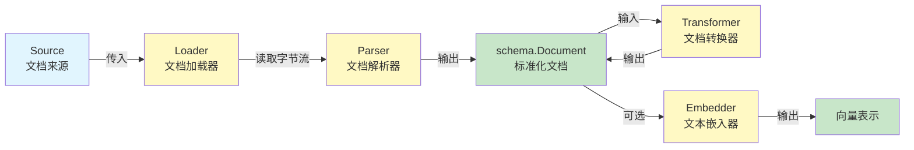

# Document Interfaces 模块技术深度解析

## 1. 模块概述

`document_interfaces` 模块是整个文档处理子系统的**抽象层**，定义了文档加载、解析、转换和嵌入的核心接口。如果你把文档处理想象成一条流水线，这个模块就是那条流水线的"轨道系统"——它不直接处理文档内容，而是规定了文档在系统中如何被识别、读取、解析和转换的标准接口。

**为什么需要这个模块？** 想象一下：如果没有统一的文档接口，每个文档加载器都有自己的 API，每个解析器都返回不同格式的数据，那么上层应用（如 RAG 系统、文档索引器）就会被这些细节搞得一团糟。这个模块通过定义清晰的抽象，让文档处理的每个环节都可以独立演进，同时保持系统的整体一致性。

## 2. 核心问题与设计思路

### 问题空间：
在构建 RAG（检索增强生成）或文档分析系统时，你需要解决三个核心问题：
- **文档来源多样性**：文档可能来自本地文件、网络URL、数据库、对象存储等
- **格式差异性**：PDF、Word、Markdown、HTML 等格式需要不同的解析逻辑
- **处理流程可变性**：有些文档需要分割、过滤、清洗等预处理操作

如果没有统一抽象，每个应用会直接耦合到具体实现，导致：
1. 代码重复严重
2. 难以替换实现
3. 测试困难
4. 系统可维护性差

### 设计洞察：
这个模块采用了**接口优先**的设计哲学，将文档处理流程拆解为三个独立的抽象层次：
- **Loader：负责从各种来源读取原始数据
- **Parser：负责将原始数据解析为统一的 Document 结构
- **Transformer：负责对 Document 进行转换处理
- **Embedder：负责将文本转换为向量表示

每个层次都有明确的职责边界，通过组合这些接口，可以灵活地构建文档处理管道。

## 3. 架构与数据流

### 3.1 核心概念

让我们用一个"文档供应链"的类比来理解这个模块的核心抽象：

- **Source**：文档的"来源地址"——就像快递单号，告诉你去哪里取件
- **Loader**：文档的"取件员"——根据地址去取件并运回仓库
- **Parser**：文档的"开箱员"——打开包裹（字节流）并整理出里面的内容
- **Transformer**：文档的"加工员"——对整理好的内容进行切割、过滤等处理
- **Embedder**：文档的"编码员"——将文本内容转换为向量表示

### 3.2 架构图



### 3.3 组件角色说明：

1. **Source** - 文档来源的统一标识，仅仅包含一个 URI 字段，用于定位文档资源
2. **Loader** - 文档加载器，负责从 Source 读取原始数据
3. **Parser** - 文档解析器，将原始数据流解析为结构化的 Document 对象
4. **Transformer** - 文档转换器，对 Document 集合进行转换操作
5. **Embedder** - 文本嵌入器，将文本内容转换为向量表示（注意：Embedder 在 `embedding` 包中定义，但与文档流程密切相关）

### 3.4 典型数据流向：
```
Source.URI → Loader.Load() → io.Reader → Parser.Parse() → []*Document → Transformer.Transform() → []*Document → （可选）Embedder.EmbedStrings()
```

## 4. 核心组件深度解析

### 4.1 Source 结构体

```go
type Source struct {
        URI string
}
```

**设计意图**：`Source` 是一个极其简单但至关重要的结构体，它只有一个字段：`URI`。它本质上是一个"强类型的字符串"。为什么不直接用 `string`？因为：

1. **类型安全**：避免把普通字符串和文档来源混淆
2. **可扩展性**：未来可以在不破坏 API 的情况下添加元数据字段
3. **自文档化**：函数签名 `Load(ctx, src Source)` 比 `Load(ctx, uri string)` 更清晰

**关键点**：URI 必须是服务可达的——它可以是 HTTP URL、文件路径、S3 地址或任何其他协议，只要对应的 Loader 能理解。

**使用场景**：
- 文件系统路径：`file:///path/to/document.pdf`
- 网络资源：`https://example.com/doc.html`
- 对象存储：`s3://bucket/key`

### 4.2 Loader 接口

```go
type Loader interface {
        Load(ctx context.Context, src Source, opts ...LoaderOption) ([]*schema.Document, error)
}
```

**核心职责**：从 Source 指定的位置读取原始数据，并协调 Parser 完成解析。

**设计理念**：Loader 只做一件事——"读取"。它不应该解析文档内容，那是 Parser 的工作。这种单一职责原则让系统更加灵活：你可以用同一个 Loader 加载 PDF，用不同的 Parser 解析；或者用不同的 Loader（HTTP、本地文件）加载同一份文档，用同一个 Parser 解析。

**设计要点**：
- **上下文传递**：支持 context 用于超时控制和取消
- **选项模式**：使用可变参数选项，便于扩展配置
- **批量输出**：直接返回解析后的 Document 集合，隐藏内部协调逻辑

**实现者需要考虑**：
1. 验证 Source.URI 的格式
2. 建立到资源的连接
3. 获取 io.Reader
4. 调用 Parser 解析
5. 处理错误和资源清理

### 4.3 Parser 接口

```go
type Parser interface {
        Parse(ctx context.Context, reader io.Reader, opts ...Option) ([]*schema.Document, error)
}
```

**核心职责**：将原始字节流解析为结构化的 Document 对象。

**为什么是 `io.Reader` 而不是 `[]byte`？** 这是一个关键的设计决策：
- **内存效率**：不需要把整个文件加载到内存
- **流式处理**：可以边读边解析，特别适合大文件
- **通用性**：任何能产生字节流的东西都可以解析（网络、文件、管道等）

**设计要点**：
- **输入抽象**：使用 io.Reader 而非具体类型，最大化灵活性
- **上下文感知**：支持 context 用于中断和元数据传递
- **批量输出**：返回 Document 集合，一个文件可能解析为多个文档片段

**实现者关注点**：
1. 处理不同的编码问题
2. 提取元数据到 Document.MetaData
3. 处理分页、分节等结构
4. 错误恢复机制

### 4.4 Transformer 接口

```go
type Transformer interface {
        Transform(ctx context.Context, src []*schema.Document, opts ...TransformerOption) ([]*schema.Document, error)
}
```

**核心职责**：对已解析的文档进行转换（分割、过滤、元数据增强等）。

**设计模式**：这是典型的"管道-过滤器"模式——多个 Transformer 可以链式调用，每个处理一个环节。

**设计要点**：
- **纯函数风格**：输入输出都是 Document 集合，无副作用
- **可组合性**：多个 Transformer 可以链式调用
- **选项灵活**：使用 TransformerOption 采用 implSpecificOptFn，允许实现特定的配置

**常见转换场景**：
- 文档分割（Text Splitting）
- 元数据增强
- 内容过滤
- 格式标准化

### 4.5 相关接口：Embedder

虽然 Embedder 接口不在 `document_interfaces` 模块中定义（它在 `components/embedding` 包中），但它通常是文档处理流程的最后一步。

```go
type Embedder interface {
        EmbedStrings(ctx context.Context, texts []string, opts ...Option) ([][]float64, error)
}
```

**核心职责**：将文本内容转换为向量表示，是文档处理与语义检索之间的桥梁。

## 5. 与其他模块的关系

### 依赖关系：
- **依赖**：这个模块依赖 [Schema Core Types](schema_core_types.md) 中的 `schema.Document`
- **被依赖**：
  - [Component Options and Extras](component_options_and_extras.md) 中定义了这些接口的选项类型
  - [Compose Graph Engine](compose_graph_engine.md) 可能会用这些接口构建文档处理图
  - [Flow Retrievers](flow_retrievers.md) 和 [Flow Indexers](flow_indexers.md) 是这些接口的主要消费者

### 与 schema 模块的交互：
- Loader 和 Parser 的输出都是 `[]*schema.Document`，这是整个系统的文档统一表示

### 与其他组件接口的关系：
- Loader 可能使用 [tool_interfaces](tool_interfaces.md) 中的工具可能会调用 Loader 加载文档
- Embedder 与 [model_interfaces](model_interfaces.md) 中的模型可能在内部使用 Embedder

## 6. 设计决策与权衡

### 接口设计的关键权衡：

1. **Source 的极简设计 vs 丰富元数据
   - **选择**：极简设计，仅包含 URI
   - **理由**：保持接口简单，元数据可以通过 LoaderOption 传递
   - **代价**：某些复杂来源场景可能需要额外的配置

2. **Loader 直接返回 Document vs 返回 io.Reader**
   - **选择**：直接返回 Document
   - **理由**：简化使用，大多数场景不需要中间步骤
   - **代价**：灵活性降低，但可以通过组合 Parser 和自定义 Loader 来解决

3. **Transformer 接口的设计
   - **选择**：纯函数风格的接口
   - **理由**：便于测试和组合
   - **代价**：对于有状态的转换可能不够友好

4. **Embedder 接口的设计
   - **选择**：单独的 embedding 包
   - **理由**：解耦，embedder 可以独立使用
   - **代价**：需要在文档处理和嵌入之间进行协调

## 7. 使用指南与注意事项

### 7.1 基本使用模式

```go
// 1. 定义文档来源
src := document.Source{URI: "https://example.com/doc.pdf"}

// 2. 创建加载器
loader := NewPDFLoader() // 假设的实现

// 3. 加载文档
docs, err := loader.Load(ctx, src)
if err != nil {
    // 处理错误
}

// 4. 转换文档
splitter := NewTextSplitter() // 假设的实现
chunks, err := splitter.Transform(ctx, docs)
if err != nil {
    // 处理错误
}

// 5. 嵌入文档（可选）
embedder := NewOpenAIEmbedder() // 假设的实现
embeddings, err := embedder.EmbedStrings(ctx, extractContents(chunks))
if err != nil {
    // 处理错误
}
```

### 7.2 组合多个 Transformer

```go
// 链式调用多个转换器
docs, err := loader.Load(ctx, src)
if err != nil { /* ... */ }

// 清洗 → 分割 → 元数据增强
docs, err = cleaner.Transform(ctx, docs)
docs, err = splitter.Transform(ctx, docs)
docs, err = enricher.Transform(ctx, docs)
```

### 7.3 实现 Loader 的最佳实践

1. **保持简单**：Loader 应该只负责读取，不负责解析
2. **支持 context**：务必尊重 `ctx.Done()`，支持取消和超时
3. **错误处理**：返回清晰的错误信息，区分"找不到"、"权限不足"等情况
4. **确保资源清理**：确保资源（文件句柄、网络连接等）被正确关闭
5. **合理使用选项**：合理使用 LoaderOption 传递配置

### 7.4 实现 Parser 的注意事项

1. **流式处理**：尽可能不要把整个 reader 读入内存
2. **资源清理**：如果创建了临时资源，确保在返回前清理
3. **元数据填充**：尽可能填充 `schema.Document` 的元数据字段
4. **处理编码**：处理不同的编码问题

### 7.5 常见陷阱

- **不要在 Loader 中解析**：这会破坏单一职责，让代码难以复用
- **不要假设 URI 格式**：Loader 应该明确文档它能处理什么样的 URI
- **注意并发安全**：这些接口的实现不一定是并发安全的，除非文档明确说明

## 8. 边缘情况与陷阱

### 常见问题与注意事项：

1. **大文档处理**
   - 问题：大文档可能导致内存溢出
   - 解决：使用流式处理或分块加载

2. **编码问题**
   - 问题：不同编码的文档可能解析错误
   - 解决：Parser 应该检测和处理编码

3. **并发安全**
   - 注意：接口没有明确要求实现是并发安全的
   - 建议：在文档中明确说明并发安全要求

4. **错误处理**
   - 陷阱：部分文档解析失败时应该返回部分成功结果还是全部失败？
   - 建议：根据具体场景决定，通常建议记录错误并继续处理其他文档

5. **元数据处理**
   - 注意：Document.MetaData 是 map[string]any，类型转换时要小心
   - 建议：在使用前进行类型断言和验证

## 9. 测试策略

由于这些接口是系统的核心抽象，测试时应重点关注：

1. **使用 mock 测试**：利用生成的 mock 实现进行单元测试
2. **集成测试**：测试真实实现的端到端流程
3. **错误场景测试**：测试各种错误情况的处理

## 10. 子模块

本模块目前不包含复杂的子模块，核心接口都在主模块中定义。相关的选项类型和实现可以在 [Component Options and Extras](component_options_and_extras.md) 中找到。

## 11. 总结

`document_interfaces` 模块通过清晰的抽象层次，将复杂的文档处理流程标准化。它的设计体现了**接口优先**的哲学，每个组件都有明确的职责边界，通过组合这些接口可以灵活地构建文档处理管道。

这个模块是整个文档处理子系统的基础，为上层应用提供了统一的文档处理能力。通过 Source、Loader、Parser 和 Transformer 这些核心抽象，它成功地解决了文档来源多样性、格式差异性和处理流程可变性的问题，让系统既保持了灵活性，又具有统一的标准。
