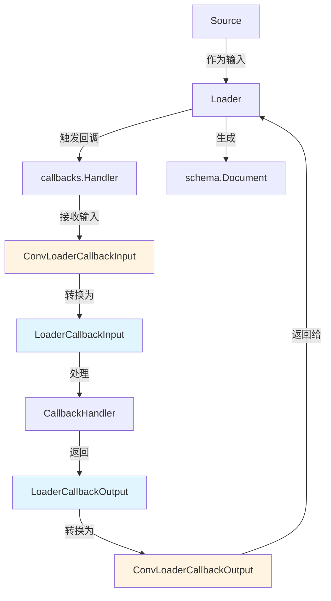

# document_load_callbacks 模块技术深度剖析

## 1. 模块定位与问题解决

### 1.1 核心问题

在文档处理管道中，文档加载器（Loader）负责从各种数据源（文件系统、数据库、网络等）读取原始内容并转换为统一的 `schema.Document` 结构。但在实际应用中，我们经常需要在加载过程中插入额外的逻辑：

- **监控与 observability**：记录加载时间、文档数量、源信息等
- **数据校验**：在加载前后验证数据完整性
- **元数据增强**：自动添加时间戳、源标识等元信息
- **条件过滤**：根据业务规则跳过某些文档
- **错误处理与重试**：在加载失败时执行补偿逻辑

一个朴素的解决方案是将这些逻辑直接硬编码在加载器实现中，但这会导致：
- 加载器职责过重，违反单一职责原则
- 不同加载器之间重复代码
- 难以独立测试和复用这些横切关注点
- 修改监控逻辑需要改动加载器代码

### 1.2 设计洞察

`document_load_callbacks` 模块的核心设计思想是**将加载器的核心逻辑与横切关注点分离**，通过定义标准的回调输入输出契约，让加载器在执行的关键节点触发回调，而具体的横切逻辑由回调处理器实现。

这类似于 Web 框架中的中间件模式——加载器是核心业务逻辑，回调是可插拔的中间件，它们通过标准化的请求/响应格式进行通信。

## 2. 核心抽象与心智模型

### 2.1 核心数据结构

该模块定义了两个关键结构体，构成了回调机制的契约：

#### LoaderCallbackInput

```go
type LoaderCallbackInput struct {
    // Source 是文档的来源，标识数据从哪里来
    Source Source
    
    // Extra 是额外的回调信息，用于传递自定义数据
    Extra map[string]any
}
```

#### LoaderCallbackOutput

```go
type LoaderCallbackOutput struct {
    // Source 是文档的来源
    Source Source
    
    // Docs 是要加载的文档列表
    Docs []*schema.Document
    
    // Extra 是额外的回调信息
    Extra map[string]any
}
```

### 2.2 心智模型

可以把这个模块想象成**文档加载流水线的"安检站"**：

1. **输入安检**：文档源（Source）进入加载器前，先经过回调处理器的"检查"，可以在这里记录日志、验证源信息等
2. **加载执行**：加载器从源读取数据并转换为文档
3. **输出安检**：生成的文档离开加载器前，再次经过回调处理器的"检查"，可以在这里修改文档、添加元数据、过滤内容等

`LoaderCallbackInput` 是进入安检站的包裹，`LoaderCallbackOutput` 是经过检查后的包裹。回调处理器就像安检员，可以查看包裹内容，甚至在必要时修改包裹。

### 2.3 类型转换机制

模块还提供了两个关键的转换函数，这是回调系统灵活性的关键：

```go
func ConvLoaderCallbackInput(src callbacks.CallbackInput) *LoaderCallbackInput
func ConvLoaderCallbackOutput(src callbacks.CallbackOutput) *LoaderCallbackOutput
```

这些函数实现了**自适应类型转换**：
- 如果输入已经是目标类型，直接返回
- 如果是简化类型（如 `Source` 或 `[]*schema.Document`），自动包装成完整的回调结构
- 其他情况返回 `nil`

这种设计让加载器在使用回调时更加灵活——既可以传递完整的回调结构，也可以只传递核心数据，转换函数会处理剩下的事情。

## 3. 架构与数据流

### 3.1 组件关系图



### 3.2 数据流详解

让我们追踪一次完整的文档加载流程：

1. **加载器初始化回调**：加载器接收 `Source` 作为输入，准备开始加载
2. **创建回调输入**：加载器将 `Source` 包装（或直接传递）给回调系统
3. **类型转换**：`ConvLoaderCallbackInput` 将输入统一转换为 `LoaderCallbackInput` 结构
4. **回调处理**：`LoaderCallbackHandler` 接收输入，执行自定义逻辑（如记录源信息）
5. **加载执行**：加载器从源读取数据，转换为 `[]*schema.Document`
6. **创建回调输出**：加载器将文档列表包装（或直接传递）给回调系统
7. **类型转换**：`ConvLoaderCallbackOutput` 将输出统一转换为 `LoaderCallbackOutput` 结构
8. **回调后处理**：回调处理器再次执行，可能修改文档、添加元数据等
9. **结果返回**：处理后的文档返回给调用者

## 4. 依赖分析

### 4.1 被依赖模块

该模块依赖两个核心模块：

1. **[callbacks](callbacks.md)**：提供了回调系统的基础接口
   - `callbacks.CallbackInput`：回调输入的通用接口
   - `callbacks.CallbackOutput`：回调输出的通用接口
   - 这是整个回调框架的基础，`document_load_callbacks` 是它在文档加载场景的具体实现

2. **[schema](schema_core_types.md)**：提供了文档的标准结构
   - `schema.Document`：文档的核心数据结构
   - 所有加载器最终都生成这种格式的文档，回调系统也围绕它设计

3. **[document_interfaces](component_interfaces.md)**：提供了数据源接口
   - `Source` 接口（来自 `components.document.interface`）：定义了文档源的标准
   - 这是加载器处理的输入类型

### 4.2 依赖该模块的组件

- **[LoaderCallbackHandler](callbacks_template.md)**：回调处理器模板，使用这些类型定义回调签名
- **文档加载器实现**：各种具体的加载器（如文件加载器、数据库加载器等）在实现时会使用这些回调类型
- **[LoaderOptions](document_options.md)**：加载器选项，可能包含回调配置

## 5. 设计权衡与决策

### 5.1 灵活性 vs 类型安全

**决策**：采用 `interface{}` 基础的回调系统，配合类型转换函数

**权衡分析**：
- ✅ **灵活性**：加载器可以传递多种类型（`Source`、`[]*schema.Document` 或完整的回调结构）
- ✅ **易用性**：简单场景下不需要构建完整的回调结构
- ⚠️ **类型安全**：编译时无法保证类型正确性，运行时转换可能失败
- ⚠️ **性能**：有运行时类型断言的开销

**为什么这样选择**：在这个场景下，灵活性和易用性比严格的类型安全更重要。文档加载是相对高频但不是性能瓶颈的操作，类型转换的开销可以接受。同时，通过提供明确的转换函数，将类型不安全的点集中管理，降低了出错概率。

### 5.2 单一结构 vs 细分结构

**决策**：使用 `LoaderCallbackInput` 和 `LoaderCallbackOutput` 两个结构，而不是为不同场景创建更多细分结构

**权衡分析**：
- ✅ **简单性**：只需要理解两个核心结构
- ✅ **一致性**：所有加载场景使用相同的结构
- ⚠️ **字段冗余**：某些场景下部分字段可能为空（如 `Extra` 经常是 `nil`）
- ⚠️ **扩展性限制**：如果未来需要截然不同的回调数据，可能需要修改现有结构

**为什么这样选择**：文档加载的回调场景相对统一，主要就是"源信息"和"文档列表"两个核心数据。当前的结构已经能覆盖绝大多数场景，过度设计会增加复杂度。如果未来需要扩展，可以通过 `Extra` 字段传递自定义数据，或者创建新的结构而不破坏现有代码。

### 5.3 可变性设计

**决策**：`LoaderCallbackOutput` 中的 `Docs` 是可变的切片，允许回调处理器修改文档内容

**权衡分析**：
- ✅ **功能强大**：回调可以直接修改文档内容（添加元数据、清理内容等）
- ✅ **符合 Go 惯例**：Go 中切片本身就是引用类型，修改是自然的
- ⚠️ **副作用风险**：一个回调的修改会影响后续所有处理
- ⚠️ **并发安全**：如果多个回调并发处理，需要额外的同步机制

**为什么这样选择**：文档处理管道通常是线性的，一个接一个地处理，并发场景较少。同时，允许修改文档是回调系统的核心价值之一——如果不能修改，回调就只剩下观察能力，价值大打折扣。通过设计约定（回调按注册顺序执行，文档在回调链中传递），可以管理副作用的风险。

## 6. 使用指南与最佳实践

### 6.1 基本使用模式

#### 在加载器中触发回调

```go
func (l *MyLoader) Load(ctx context.Context, source Source) ([]*schema.Document, error) {
    // 1. 触发加载前回调
    cbInput := &LoaderCallbackInput{
        Source: source,
        Extra: map[string]any{"start_time": time.Now()},
    }
    
    // 假设有一个回调管理器
    cbOutput, err := callbackManager.TriggerOnStart(ctx, cbInput)
    if err != nil {
        return nil, err
    }
    
    // 2. 执行实际加载逻辑
    docs, err := l.doLoad(ctx, source)
    if err != nil {
        return nil, err
    }
    
    // 3. 准备加载后回调输入
    finalInput := &LoaderCallbackOutput{
        Source: source,
        Docs: docs,
        Extra: map[string]any{"end_time": time.Now()},
    }
    
    // 4. 触发加载后回调
    finalOutput, err := callbackManager.TriggerOnEnd(ctx, finalInput)
    if err != nil {
        return nil, err
    }
    
    // 5. 返回处理后的文档
    return finalOutput.Docs, nil
}
```

#### 实现回调处理器

```go
type MetadataEnhancer struct{}

func (h *MetadataEnhancer) OnEnd(ctx context.Context, input callbacks.CallbackOutput) (callbacks.CallbackOutput, error) {
    // 转换为具体类型
    loaderOutput := ConvLoaderCallbackOutput(input)
    if loaderOutput == nil {
        return input, nil // 不是我们关心的类型，原样返回
    }
    
    // 为每个文档添加元数据
    for _, doc := range loaderOutput.Docs {
        if doc.Meta == nil {
            doc.Meta = make(map[string]any)
        }
        doc.Meta["loaded_at"] = time.Now()
        doc.Meta["source_type"] = loaderOutput.Source.Type()
    }
    
    return loaderOutput, nil
}
```

### 6.2 常见使用场景

#### 场景 1：日志记录

```go
type LoadingLogger struct{}

func (h *LoadingLogger) OnStart(ctx context.Context, input callbacks.CallbackInput) (callbacks.CallbackInput, error) {
    loaderInput := ConvLoaderCallbackInput(input)
    if loaderInput != nil {
        log.Printf("开始从 %s 加载文档", loaderInput.Source.URI())
    }
    return input, nil
}

func (h *LoadingLogger) OnEnd(ctx context.Context, input callbacks.CallbackOutput) (callbacks.CallbackOutput, error) {
    loaderOutput := ConvLoaderCallbackOutput(input)
    if loaderOutput != nil {
        log.Printf("从 %s 加载了 %d 个文档", loaderOutput.Source.URI(), len(loaderOutput.Docs))
    }
    return input, nil
}
```

#### 场景 2：文档过滤

```go
type EmptyDocFilter struct{}

func (h *EmptyDocFilter) OnEnd(ctx context.Context, input callbacks.CallbackOutput) (callbacks.CallbackOutput, error) {
    loaderOutput := ConvLoaderCallbackOutput(input)
    if loaderOutput == nil {
        return input, nil
    }
    
    // 过滤掉空文档
    filtered := make([]*schema.Document, 0, len(loaderOutput.Docs))
    for _, doc := range loaderOutput.Docs {
        if len(strings.TrimSpace(doc.Content)) > 0 {
            filtered = append(filtered, doc)
        }
    }
    
    loaderOutput.Docs = filtered
    return loaderOutput, nil
}
```

### 6.3 最佳实践

1. **总是检查类型转换结果**：`ConvLoaderCallbackInput` 和 `ConvLoaderCallbackOutput` 可能返回 `nil`，要妥善处理这种情况
2. **保持回调幂等**：如果可能，让回调可以安全地多次调用而不产生意外后果
3. **避免在回调中执行耗时操作**：回调是加载流程的一部分，耗时操作会影响整体性能
4. **使用 `Extra` 字段传递自定义数据**：而不是修改结构体，保持兼容性
5. **文档修改要谨慎**：如果修改文档，确保清楚地记录这种行为，避免意外影响

## 7. 边缘情况与注意事项

### 7.1 类型转换失败

**问题**：`ConvLoaderCallbackInput` 或 `ConvLoaderCallbackOutput` 返回 `nil`

**原因**：传入的类型不是预期的类型

**处理方式**：
- 回调处理器应该优雅地处理 `nil` 情况，通常是原样返回输入
- 不要假设转换一定会成功，始终进行检查
- 如果转换失败是关键错误，可以记录日志但尽量不要中断流程

### 7.2 空文档列表

**问题**：`LoaderCallbackOutput.Docs` 是空切片或 `nil`

**注意事项**：
- 回调处理器应该同时处理这两种情况
- 不要假设 `Docs` 一定非空，在迭代前检查长度
- 如果是 `nil`，考虑是否需要初始化为空切片

### 7.3 回调链中的副作用

**问题**：一个回调修改了文档，后续回调看到的是修改后的版本

**影响**：
- 回调的顺序很重要
- 调试可能变得困难，因为文档状态在不断变化

**建议**：
- 让回调按逻辑顺序注册（先日志，再过滤，最后增强）
- 考虑在关键节点保存文档快照以便调试
- 如果回调之间有依赖，明确记录这种依赖关系

### 7.4 并发安全

**问题**：如果多个 goroutine 同时处理文档并触发回调，可能出现竞态条件

**注意事项**：
- 默认情况下，回调系统不保证并发安全
- 如果回调会修改共享状态，需要自己实现同步
- 如果不确定，假设回调可能被并发调用

## 8. 扩展与演进

### 8.1 扩展点

该模块设计了几个明确的扩展点：

1. **`Extra` 字段**：用于传递自定义数据，无需修改核心结构
2. **新的转换规则**：可以扩展 `ConvLoaderCallbackInput` 和 `ConvLoaderCallbackOutput` 以支持更多输入类型
3. **包装器模式**：可以创建包装器结构，在不修改现有代码的情况下添加功能

### 8.2 未来可能的演进方向

虽然当前设计已经很稳定，但未来可能的改进包括：

1. **增加更多上下文信息**：如加载器类型、配置信息等
2. **错误处理增强**：允许回调在特定条件下终止加载流程
3. **流式回调支持**：为流式加载场景提供专门的回调结构

## 9. 相关模块参考

- **[callbacks](callbacks.md)**：回调系统的核心框架
- **[schema](schema_core_types.md)**：文档数据结构定义
- **[document_transform_callbacks](document_transform_callbacks.md)**：文档转换器的回调定义（类似模式）
- **[callbacks_template](callbacks_template.md)**：回调处理器的模板实现，包括 `LoaderCallbackHandler`
- **[document_options](document_options.md)**：加载器选项配置
