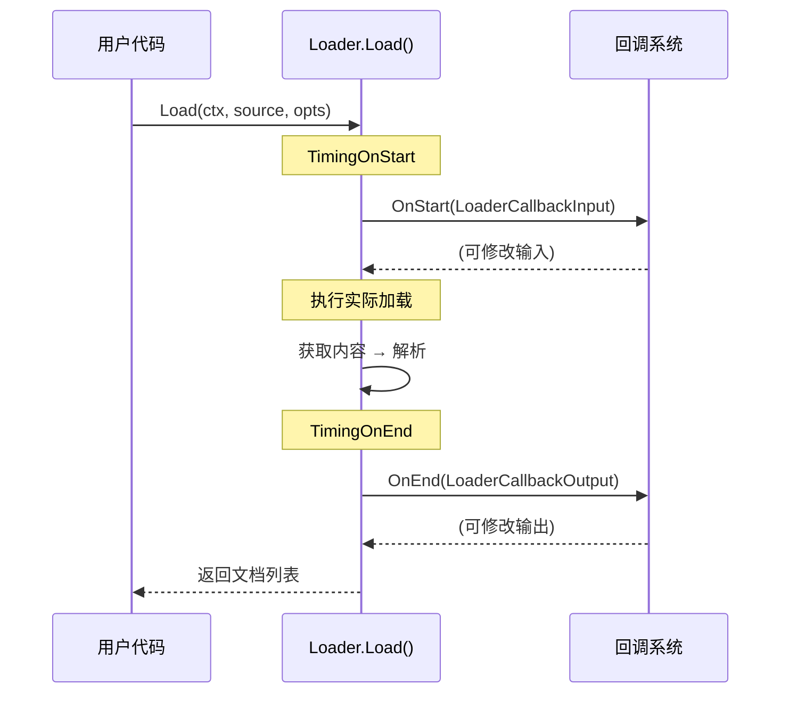

# document_loader_contracts_and_options-callback_extra_loader 子模块

## 概述

本子模块定义了文档加载器的**回调契约**。回调机制是 Eino 框架的可观测性（observability）基础设施的重要组成部分——它允许用户在整个加载过程的关键节点注入自定义逻辑，如日志记录、指标采集、请求修改等。

**核心职责**：
- 定义加载器回调的输入结构（`LoaderCallbackInput`）
- 定义加载器回调的输出结构（`LoaderCallbackOutput`）
- 提供与通用回调系统的类型转换函数

---

## 核心组件详解

### LoaderCallbackInput —— 加载开始时的回调数据

```go
type LoaderCallbackInput struct {
    Source Source
    Extra  map[string]any
}
```

**字段说明**：

| 字段 | 类型 | 作用 |
|------|------|------|
| `Source` | `Source` | 被加载的文档来源，包含 URI 等信息 |
| `Extra` | `map[string]any` | 额外的上下文信息，可用于传递自定义数据 |

**使用场景**：

当回调在 `TimingOnStart`（加载开始前）触发时，`LoaderCallbackInput` 包含了：
- 要加载的文档来源
- 任何通过 `Extra` 传递的额外信息

回调处理器可以：
- 修改 `Source`（例如，根据某些逻辑重定向到不同的 URI）
- 注入自定义数据到 `Extra`（例如，添加 trace ID）

### LoaderCallbackOutput —— 加载完成时的回调数据

```go
type LoaderCallbackOutput struct {
    Source Source
    Docs   []*schema.Document
    Extra  map[string]any
}
```

**字段说明**：

| 字段 | 类型 | 作用 |
|------|------|------|
| `Source` | `Source` | 原始的文档来源 |
| `Docs` | `[]*schema.Document` | 加载生成的文档列表 |
| `Extra` | `map[string]any` | 额外的上下文信息 |

**使用场景**：

当回调在 `TimingOnEnd`（加载完成后）触发时，`LoaderCallbackOutput` 包含了：
- 原始来源
- 加载出的所有文档
- 任何额外信息

回调处理器可以：
- 修改文档内容（例如，敏感信息脱敏）
- 添加元数据到文档
- 将文档发送到外部系统（如日志、监控）

---

## 类型转换函数

回调系统的核心挑战是**统一性**与**特异性**的矛盾：

- 框架使用统一的 `callbacks.CallbackInput` 和 `callbacks.CallbackOutput` 类型
- 各个组件需要自己的特异类型（如 `LoaderCallbackInput`）

解决方法是提供**双向转换函数**：

### ConvLoaderCallbackInput

```go
func ConvLoaderCallbackInput(src callbacks.CallbackInput) *LoaderCallbackInput
```

**转换逻辑**：

```go
func ConvLoaderCallbackInput(src callbacks.CallbackInput) *LoaderCallbackInput {
    switch t := src.(type) {
    case *LoaderCallbackInput:
        return t                    // 已经是正确类型，直接返回
    case Source:
        return &LoaderCallbackInput{  // 从 Source 隐式构造
            Source: t,
        }
    default:
        return nil                  // 不支持的类型，返回 nil
    }
}
```

**支持的三种输入**：

| 输入类型 | 行为 |
|----------|------|
| `*LoaderCallbackInput` | 直接返回（零拷贝） |
| `Source` | 从 Source 构造新的 `LoaderCallbackInput` |
| 其他类型 | 返回 `nil`（静默失败） |

### ConvLoaderCallbackOutput

```go
func ConvLoaderCallbackOutput(src callbacks.CallbackOutput) *LoaderCallbackOutput
```

**转换逻辑**：

```go
func ConvLoaderCallbackOutput(src callbacks.CallbackOutput) *LoaderCallbackOutput {
    switch t := src.(type) {
    case *LoaderCallbackOutput:
        return t
    case []*schema.Document:
        return &LoaderCallbackOutput{
            Docs: t,
        }
    default:
        return nil
    }
}
```

**支持的三种输入**：

| 输入类型 | 行为 |
|----------|------|
| `*LoaderCallbackOutput` | 直接返回 |
| `[]*schema.Document` | 从文档列表构造 |
| 其他类型 | 返回 `nil` |

---

## 设计决策分析

### 决策 1：静默失败而非 panic

```go
// 如果类型不匹配，返回 nil
default:
    return nil
```

**理由**：
- 回调错误不应该导致主业务逻辑失败
- 用户可能注册了通用处理器，不期望处理特定类型的输入
- 简化调用方逻辑：检查返回值是否为 nil 即可

**权衡**：
- 调试困难：类型不匹配时静默被忽略
- 但对于成熟的系统，可观测性错误不应该阻断业务

### 决策 2：支持从简单类型隐式构造

```go
case Source:
    return &LoaderCallbackInput{Source: t}
case []*schema.Document:
    return &LoaderCallbackOutput{Docs: t}
```

**理由**：
- 简化常见用例：用户可以直接传递 `Source` 或 `[]*schema.Document`
- 提供便利的快捷方式，而不需要总是构造完整的回调输入/输出

**示例用法**：

```go
// 简单场景
callbacks.Do(ctx, TimingOnStart, mySource)

// 等价于
callbacks.Do(ctx, TimingOnStart, &LoaderCallbackInput{Source: mySource})
```

---

## 与框架回调系统的集成

### 回调时机

根据 Eino 框架的回调机制，加载器的回调在以下时机触发：



### 注册回调处理器

```go
// 创建处理器
handler := callbacks.HandlerFunc(func(ctx context.Context, info callbacks.RunInfo, input callbacks.CallbackInput, output callbacks.CallbackOutput) {
    // 提取 loader 特定的输入
    loaderInput := ConvLoaderCallbackInput(input)
    if loaderInput == nil {
        return // 不是 loader 回调，跳过
    }
    
    // 处理...
    
    // 提取输出
    loaderOutput := ConvLoaderCallbackOutput(output)
    if loaderOutput != nil {
        // 可以修改 loaderOutput.Docs
    }
})

// 注册
callbacks.AppendGlobalHandlers(handler)
```

---

## 实际使用示例

### 示例 1：日志记录

```go
logger := log.New(os.Stdout, "[loader] ", 0)

handler := callbacks.HandlerFunc(func(ctx context.Context, info callbacks.RunInfo, input callbacks.CallbackInput, output callbacks.CallbackOutput) {
    if info.Timing == callbacks.TimingOnStart {
        if input := ConvLoaderCallbackInput(input); input != nil {
            logger.Printf("开始加载: %s", input.Source.URI)
        }
    } else if info.Timing == callbacks.TimingOnEnd {
        if output := ConvLoaderCallbackOutput(output); output != nil {
            logger.Printf("加载完成: %d 个文档", len(output.Docs))
        }
    }
})

callbacks.AppendGlobalHandlers(handler)
```

### 示例 2：指标采集

```go
var loaderLatency = prometheus.NewHistogramVec(prometheus.HistogramOpts{
    Name: "loader_duration_seconds",
}, []string{"uri_scheme"})

handler := callbacks.HandlerFunc(func(ctx context.Context, info callbacks.RunInfo, input callbacks.CallbackInput, output callbacks.CallbackOutput) {
    if info.Timing == callbacks.TimingOnEnd {
        if output := ConvLoaderCallbackOutput(output); output != nil {
            scheme := extractScheme(output.Source.URI)
            loaderLatency.WithLabelValues(scheme).Observe(info.Duration.Seconds())
        }
    }
})
```

### 示例 3：文档后处理

```go
handler := callbacks.HandlerFunc(func(ctx context.Context, info callbacks.RunInfo, input callbacks.CallbackInput, output callbacks.CallbackOutput) {
    if info.Timing == callbacks.TimingOnEnd {
        if output := ConvLoaderCallbackOutput(output); output != nil {
            // 为每个文档添加加载时间戳
            now := time.Now()
            for _, doc := range output.Docs {
                if doc.MetaData == nil {
                    doc.MetaData = map[string]any{}
                }
                doc.MetaData["loaded_at"] = now.Unix()
            }
        }
    }
})
```

---

## 注意事项

### 1. 始终检查 nil

```go
// ❌ 危险：input 可能为 nil
input := ConvLoaderCallbackInput(src)
fmt.Println(input.Source.URI)  // panic!

// ✅ 安全：先检查
input := ConvLoaderCallbackInput(src)
if input == nil {
    return // 或使用默认值
}
fmt.Println(input.Source.URI)
```

### 2. 回调中的错误处理

回调中抛出的 panic 会影响整个请求。确保：

```go
handler := callbacks.HandlerFunc(func(ctx context.Context, info callbacks.RunInfo, input callbacks.CallbackInput, output callbacks.CallbackOutput) {
    defer func() {
        if r := recover(); r != nil {
            // 记录错误，但不让它传播
            log.Printf("回调 panic: %v", r)
        }
    }()
    
    // 正常处理逻辑
})
```

### 3. 性能考量

回调在热路径上执行，需要注意：
- 避免在回调中执行耗时操作
- 如果不需要，不要注册回调
- 使用 `TimingChecker` 接口过滤不需要的时机

---

## 小结

这个子模块为文档加载器提供了**可观测性接入点**：

1. **LoaderCallbackInput** 携带加载开始时的信息
2. **LoaderCallbackOutput** 携带加载完成后的结果
3. **转换函数**实现了特异类型与通用回调系统的桥接

回调机制让框架在不破坏核心接口的前提下，为用户提供了：
- 日志和追踪能力
- 指标采集能力
- 运行时干预能力（修改输入/输出）

这是构建企业级 AI 应用不可或缺的基础设施。