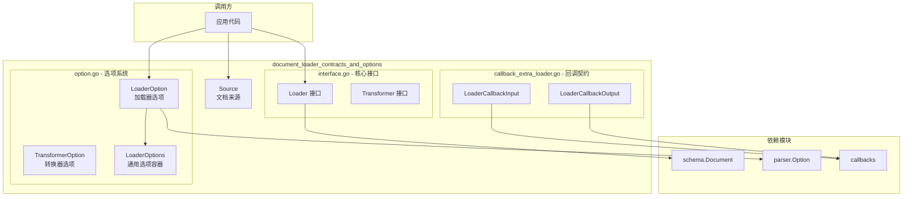

# document_loader_contracts_and_options 模块详解

## 概述

`document_loader_contracts_and_options` 模块是 Eino 框架中文档摄取与解析系统的**核心契约层**。如果你把整个文档处理流水线想象成一个食品加工工厂，这个模块就是定义"什么是原材料"、"什么是加工机器"以及"如何配置机器"的设计图纸。

**它解决的核心问题**是：在保持组件接口统一的前提下，让不同的文档加载器（PDF加载器、DOCX加载器、网页加载器等）能够各自拥有灵活的配置选项，同时还能与框架的回调系统、解析器系统无缝协作。

---

## 架构概览



### 核心组件职责

| 组件 | 职责 | 关键设计 |
|------|------|----------|
| **Source** | 携带文档的 URI，充当所有加载器的输入凭证 | 极简数据结构，仅包含 URI 字段 |
| **Loader 接口** | 定义从 Source 加载文档的统一契约 | 返回 `[]*schema.Document`，支持可变选项 |
| **Transformer 接口** | 定义文档转换（切分、过滤等）的统一契约 | 接收文档切片，返回处理后的文档切片 |
| **LoaderOption** | 统一的选项封装类型 | 双通道设计：通用选项 + 实现特定选项 |
| **LoaderOptions** | 承载所有加载器都需要的通用配置 | 目前主要包含 ParserOptions |
| **LoaderCallbackInput/Output** | 回调系统的事件载荷 | 支持与通用回调系统双向转换 |

---

## 设计理念：双通道选项模式

这是本模块最核心、也最需要理解的设计决策。

### 解决的问题

想象一下：你正在开发一个文档处理框架。你定义了一个 `Loader` 接口：

```go
type Loader interface {
    Load(ctx context.Context, src Source, opts ...LoaderOption) ([]*schema.Document, error)
}
```

现在有不同的实现：
- **PDFLoader** 需要配置：页码范围、是否提取图片、OCR语言
- **WebLoader** 需要配置：超时时间、请求头、是否保留HTML标签
- **DOCXLoader** 需要配置：是否提取表格、样式处理模式

**问题来了**：如果你让所有选项都放在同一个 `LoaderOptions` 结构体里，那么：
1. 这个结构体会无限膨胀，包含所有加载器的所有选项
2. 新增一个加载器就要修改公共接口
3. 不相关的选项会互相污染

### 传统方案的缺陷

| 方案 | 问题 |
|------|------|
| 继承/泛型 | Go 不支持；即使支持也会导致类型耦合 |
| 每个 loader 定义自己的 `LoadWithXXX` 方法 | 破坏接口统一性，无法通过接口编程 |
| 使用 `map[string]any` | 失去类型安全，编译时无法发现错误 |

### 本模块的解决方案：双通道函数式选项

```go
type LoaderOption struct {
    // 通道1：通用选项 - 所有加载器都需要的配置
    apply func(opts *LoaderOptions)
    
    // 通道2：实现特定选项 - 用类型擦除实现灵活扩展
    implSpecificOptFn any
}
```

**工作原理**：

1. **通用选项**（通过 `apply` 字段）：框架定义的标准选项，如 `WithParserOptions()`。这些选项会被应用到公共的 `LoaderOptions` 结构体。

2. **实现特定选项**（通过 `implSpecificOptFn` 字段）：每个加载器可以定义自己的选项函数，如 `WithPDFPageRange()`。这些选项通过**类型擦除**存储，在运行时被**安全地提取**回正确的类型。

```go
// 加载器作者定义自己的选项结构
type PDFLoaderOptions struct {
    PageRange string  // 如 "1-10"
    OCRLang   string
}

// 定义选项函数（这是加载器作者的工作）
func WithPageRange(pr string) LoaderOption {
    return WrapLoaderImplSpecificOptFn(func(o *PDFLoaderOptions) {
        o.PageRange = pr
    })
}

// 在 Load 方法中提取选项
func (p *PDFLoader) Load(ctx context.Context, src Source, opts ...LoaderOption) ([]*schema.Document, error) {
    // 提取实现特定的选项
    myOpts := GetLoaderImplSpecificOptions(&PDFLoaderOptions{
        OCRLang: "en",  // 默认值
    }, opts...)
    
    // 提取通用选项
    commonOpts := GetLoaderCommonOptions(&LoaderOptions{}, opts...)
    
    // 使用配置...
}
```

### 为什么选择这个设计？

| 考量 | 决策 | 理由 |
|------|------|------|
| **类型安全** | 使用泛型 `WrapLoaderImplSpecificOptFn[T]` | 编译时类型检查，避免 `map[string]any` 的运行时错误 |
| **接口统一** | 所有 loader 实现同一个 `Loader` 接口 | 框架可以统一调用，无需关心具体实现 |
| **可扩展性** | 新增加载器无需修改框架代码 | 加载器在自己的包里定义选项，框架无感知 |
| **向后兼容** | 通用选项用 `apply` 函数延迟应用 | 新增通用选项不影响现有实现 |

---

## 数据流分析

### 典型调用路径

```
用户代码
    │
    ▼
创建 Source (URI)
    │
    ▼
调用 Loader.Load(ctx, source, opts...)
    │
    ├─► 提取通用选项 (GetLoaderCommonOptions)
    │       │
    │       ▼
    │    传递给 Parser
    │
    └─► 提取实现特定选项 (GetLoaderImplSpecificOptions)
            │
            ▼
         使用自定义配置加载文档
            │
            ▼
    返回 []*schema.Document
```

### 回调机制的数据流

```
Loader.Load()
    │
    ├─► [TimingOnStart] 
    │         │
    │         ▼
    │    创建 LoaderCallbackInput
    │         │
    │         ▼
    │    回调处理器 (可修改输入)
    │
    ├─► 执行实际加载逻辑
    │
    └─► [TimingOnEnd]
              │
              ▼
         创建 LoaderCallbackInput + LoaderCallbackOutput
              │
              ▼
         回调处理器 (可修改输出)
```

回调输入/输出类型提供了转换函数 `ConvLoaderCallbackInput` 和 `ConvLoaderCallbackOutput`，可以与通用的 `callbacks.CallbackInput` 和 `callbacks.CallbackOutput` 进行双向转换。

---

## 与其他模块的关系

### 依赖关系（被依赖）

| 上游模块 | 关系说明 |
|----------|----------|
| **文档加载器实现** | 所有具体的加载器（PDF、DOCX、Web等）都实现本模块定义的 `Loader` 接口 |
| **文档转换器实现** | 所有转换器（切分器、过滤器等）都实现 `Transformer` 接口 |
| **parser 模块** | `LoaderOptions` 中包含 `ParserOptions`，加载器可将解析任务委托给解析器 |

### 依赖关系（依赖他人）

| 下游模块 | 关系说明 |
|----------|----------|
| **schema.Document** | 加载器返回的文档类型定义在此 |
| **callbacks** | 回调输入输出类型与框架回调系统对接 |
| **parser.Option** | 解析器选项类型，用于配置文档解析过程 |

---

## 子模块说明

本模块包含以下逻辑子模块，文档将分别展开：

1. **[document_loader_contracts_and_options-interface](document_loader_contracts_and_options-interface.md)** - 核心接口定义
   - `Source` 文档来源结构
   - `Loader` 加载器接口
   - `Transformer` 转换器接口

2. **[document_loader_contracts_and_options-option](document_loader_contracts_and_options-option.md)** - 选项系统
   - `LoaderOption` / `TransformerOption` 选项封装
   - `LoaderOptions` 通用选项容器
   - 选项提取函数：类型安全的双通道设计

3. **[document_loader_contracts_and_options-callback_extra_loader](document_loader_contracts_and_options-callback_extra_loader.md)** - 回调契约
   - `LoaderCallbackInput` 加载开始时的回调输入
   - `LoaderCallbackOutput` 加载完成时的回调输出
   - 类型转换函数

---

## 潜在陷阱与注意事项

### 1. 选项类型匹配陷阱

```go
// ❌ 错误：传递了错误类型的选项函数
opts := []LoaderOption{
    WrapLoaderImplSpecificOptFn(func(o *PDFLoaderOptions) { // 期望 PDFLoaderOptions
        o.PageRange = "1-10"
    }),
}
// 但加载器定义为 DOCXLoaderOptions！
```

`GetLoaderImplSpecificOptions` 使用类型断言 `func(*T)` 进行匹配，如果类型不匹配，选项会被静默忽略，不会报错。**这是静默失败的设计**——因为类型不匹配本身就是调用方的错误。

**建议**：为每种加载器创建独立的选项构造函数，放在对应的加载器包中，避免用户传错类型。

### 2. 通用选项与应用特定选项的优先级

当同一个选项既作为通用选项又作为实现特定选项传递时，它们是**独立的通道**，不会冲突。但需要注意的是：

```go
// 两者都会被应用，但作用于不同的结构体
opts := []LoaderOption{
    WithParserOptions(parser.WithURI("...")),  // 通用选项 -> LoaderOptions.ParserOptions
    WrapLoaderImplSpecificOptFn(myOpts...),    // 实现特定选项 -> MyLoaderOptions
}
```

### 3. nil 指针处理

```go
// GetLoaderImplSpecificOptions 如果传入 nil，会创建新的空结构体
opts := GetLoaderImplSpecificOptions(nil, opts...)
// 等价于：
opts := GetLoaderImplSpecificOptions(&MyOptions{}, opts...)
```

这个设计是合理的，因为它避免了 nil 指针解引用，但开发者需要意识到**默认值的提供方式**：如果需要默认值，应该在 `base` 参数中提供：

```go
// ✅ 正确：提供默认值
opts := GetLoaderImplSpecificOptions(&MyOptions{
    Timeout: 30 * time.Second,
}, opts...)

// ❌ 可能不符合预期：默认值丢失
opts := GetLoaderImplSpecificOptions(nil, opts...)
```

### 4. 回调转换的边界情况

```go
// ConvLoaderCallbackInput 对非预期类型返回 nil
input := ConvLoaderCallbackInput(someOtherType)
// input == nil，不会panic，但可能导致回调不执行
```

---

## 扩展点

### 为新加载器创建选项

```go
package myloader

// 1. 定义自己的选项结构
type MyLoaderOptions struct {
    Timeout time.Duration
    Retry   int
}

// 2. 创建选项函数
func WithTimeout(t time.Duration) document.LoaderOption {
    return document.WrapLoaderImplSpecificOptFn(func(o *MyLoaderOptions) {
        o.Timeout = t
    })
}

func WithRetry(r int) document.LoaderOption {
    return document.WrapLoaderImplSpecificOptFn(func(o *MyLoaderOptions) {
        o.Retry = r
    })
}

// 3. 在 Load 方法中使用
func (m *MyLoader) Load(ctx context.Context, src document.Source, opts ...document.LoaderOption) ([]*schema.Document, error) {
    myOpts := document.GetLoaderImplSpecificOptions(&MyLoaderOptions{
        Timeout: 10 * time.Second,  // 默认值
        Retry:   3,
    }, opts...)
    
    // 使用 myOpts.Timeout, myOpts.Retry...
}
```

---

## 总结

这个模块的**设计哲学**可以概括为：**在保持接口统一的同时拥抱实现多样性**。

- **对框架**：提供稳定的 `Loader` 和 `Transformer` 接口，无惧具体实现的变化
- **对加载器开发者**：提供完全的自由度来定义自己的配置选项，同时通过类型安全的泛型避免运行时错误
- **对最终用户**：通过统一的 API 调用不同的加载器，配置方式保持一致性

理解这个模块的关键在于理解"双通道选项模式"——它用类型擦除实现了 Go 中少见的高级类型系统特性，同时保持了 Go 的编译时检查和运行时效率。