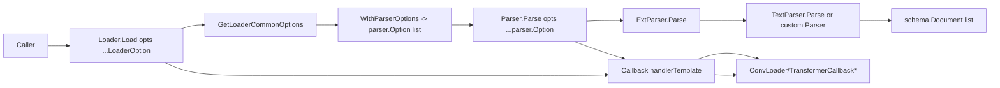

# document_loader_transformer_and_parser_options

`document_loader_transformer_and_parser_options` 这个模块本质上是在给文档处理链路提供“统一插座”。文档链路里通常有三段：`Loader` 负责把外部资源读进来，`Parser` 负责把字节流变成 `schema.Document`，`Transformer` 负责再加工（切分、清洗、增强等）。如果没有这个模块，不同实现会各自定义参数格式、回调载荷格式，调用侧就会陷入大量“参数转来转去、类型断言到处写”的胶水代码。这个模块的设计重点不是算法，而是**契约稳定性**：统一调用选项模型、统一回调载荷适配、提供一个可扩展但不强绑定的 parser 分发机制。

## 为什么需要这个模块：问题空间先行

在一个可插拔的文档处理系统里，真正难的不是“读取文本”本身，而是“多实现共存时的接口一致性”。举个典型场景：

调用方只想写一次 `Load(ctx, src, opts...)`，但不同 loader 想要不同私有参数；parser 既要支持公共参数（`URI`、额外 metadata），又希望允许实现自定义参数；回调系统是通用 `callbacks.CallbackInput/Output`，而 loader/transformer handler 希望拿到结构化 payload。

一个朴素方案是：所有参数都用 `map[string]any`，所有回调都在 handler 里手写 type switch。它短期快，但长期会变成“无类型协议”：

- 调用方没有编译期保护；
- 实现方容易与上游约定漂移；
- 回调链路里重复的转换逻辑难以维护。

这个模块的核心 insight 是：**把“统一入口”与“实现差异”分轨处理**。统一入口保证接口稳定，实现差异通过泛型包装函数延迟到具体实现中解码。

## 心智模型：三层适配器（像电源转换系统）

可以把它想成“国际旅行的电源转换系统”：

- 第一层是“墙上标准插座”：`LoaderOption` / `TransformerOption` / `parser.Option`，调用方始终用同一种接口形态传参。
- 第二层是“通用电压转换器”：`GetLoaderCommonOptions`、`GetCommonOptions`，把通用参数抽出来。
- 第三层是“国家特定转接头”：`WrapLoaderImplSpecificOptFn[T]`、`GetLoaderImplSpecificOptions[T]`（以及 parser / transformer 对应版本），只对匹配的实现类型 `T` 生效。

回调部分也是同样思路：`ConvLoaderCallbackInput` / `ConvTransformerCallbackOutput` 这些函数像“海关翻译柜台”，把通用 `callbacks.CallbackInput/Output` 翻译成文档域结构体。

## 架构与数据流



这条链路有两个关键“热路径”。第一是选项解析路径：每次调用都会线性遍历 `opts` 并应用闭包。第二是回调转换路径：在 `handlerTemplate.OnStart/OnEnd` 中，会根据 `ComponentOfLoader` 或 `ComponentOfTransformer` 调用 `document.ConvLoaderCallbackInput`、`document.ConvTransformerCallbackOutput` 等函数做桥接。

从调用关系看（基于已给代码）：

- `handlerTemplate.OnStart` 在 `components.ComponentOfLoader` 时调用 `document.ConvLoaderCallbackInput`，在 `components.ComponentOfTransformer` 时调用 `document.ConvTransformerCallbackInput`。
- `handlerTemplate.OnEnd` 对应调用 `document.ConvLoaderCallbackOutput` 与 `document.ConvTransformerCallbackOutput`。
- `ExtParser.Parse` 调用 `GetCommonOptions` 并把请求继续委托给匹配到的 `Parser.Parse`。
- `TextParser.Parse` 调用 `GetCommonOptions` 并构造单个 `schema.Document`。

## 组件深潜

### `LoaderOptions` / `LoaderOption`

`LoaderOptions` 目前只有一个公共字段：`ParserOptions []parser.Option`。这个设计非常克制，说明 loader 层公共语义只承认“把 parser 参数透传下去”这一件事。

`LoaderOption` 同时包含两条通道：

- `apply func(opts *LoaderOptions)`：写公共参数；
- `implSpecificOptFn any`：承载实现私有 option 函数。

这是一种“单参数列表 + 双语义通道”的模式。调用方仍然只传 `...LoaderOption`，实现方在内部各取所需。

`WithParserOptions(opts ...parser.Option)` 是桥接点，把 parser 的 option 直接挂到 loader 调用上。它让上游无需显式区分“这是 loader 参数还是 parser 参数”，降低调用心智负担。

### `WrapLoaderImplSpecificOptFn[T]` / `GetLoaderImplSpecificOptions[T]`

这组 API 的意图是：让每个 loader 实现拥有自己的强类型配置 struct，而不污染统一接口。

`GetLoaderImplSpecificOptions[T]` 的行为是“按类型断言匹配后执行，不匹配则静默忽略”。这带来两个后果：

- 优点：不同实现的 option 可以共存，不会互相报错；
- 代价：传错 option 时不会立即失败，需要实现方自己补充校验与测试。

这是一种偏“灵活优先”的设计选择。

### `TransformerOption` + 对应 wrap/get

`TransformerOption` 仅保留 `implSpecificOptFn any`，没有像 loader/parser 那样的公共字段。含义很明确：当前版本并不定义 transformer 的跨实现公共参数语义，避免过早抽象。你只能通过 `WrapTransformerImplSpecificOptFn[T]` 与 `GetTransformerImplSpecificOptions[T]` 走实现私有通道。

这是“先保证扩展能力，再等待共性浮现”的策略。

### `parser.Options` / `parser.Option`

`Options` 定义了 parser 侧两个公共语义：

- `URI`：来源地址；
- `ExtraMeta`：附加 metadata，会 merge 到 document。

`WithURI` 和 `WithExtraMeta` 对应写入这两个字段。`GetCommonOptions` 的合并策略是顺序应用，后写覆盖前写；`GetImplSpecificOptions[T]` 与 loader 同理，按类型断言匹配。

### `TextParser`

`TextParser.Parse` 逻辑非常直接：`io.ReadAll(reader)` -> 构建 `schema.Document` -> 返回单元素切片。非显性但关键的一点是 metadata 处理：

- 始终写入 `MetaKeySource`（`_source`）为 `opt.URI`；
- 再把 `opt.ExtraMeta` merge 进去。

因为 merge 在后，`ExtraMeta` 可以覆盖 `_source`。这是有意还是副作用，代码层面没有额外保护；贡献者需要意识到这个覆盖可能改变追踪语义。

### `ExtParserConfig` / `ExtParser`

`ExtParser` 是模块里最具“编排器”角色的组件：它不解析内容本身，而是根据 `filepath.Ext(opt.URI)` 选择具体 parser。

`NewExtParser` 的默认行为：

- `conf == nil` 时创建空配置；
- `FallbackParser` 缺省为 `TextParser{}`；
- `Parsers` 为空时初始化空 map。

`ExtParser.Parse` 的关键步骤：

1. 用 `GetCommonOptions` 取 `URI` 与 `ExtraMeta`；
2. `filepath.Ext(opt.URI)` 得到扩展名；
3. 在 `p.parsers` 查找对应 parser，找不到走 `fallbackParser`；
4. 若最终 parser 仍为 `nil`，返回错误；
5. 调用底层 `parser.Parse(ctx, reader, opts...)`；
6. 对返回的每个 `doc` merge `ExtraMeta`（自动补 `MetaData` map，跳过 `nil doc`）。

这里有个非显然设计：即使底层 parser 已经处理过 `ExtraMeta`，`ExtParser` 仍会再 merge 一次。这样做确保“通过 ExtParser 入口时，ExtraMeta 一定生效”，代价是重复写入（通常无害，值相同时幂等）。

`GetParsers` 返回的是 map 拷贝，不暴露内部引用，避免调用方误改内部注册表。这是一个典型的防御性复制决策。

### Loader/Transformer 回调 payload 与转换函数

`LoaderCallbackInput` / `LoaderCallbackOutput` 与 `TransformerCallbackInput` / `TransformerCallbackOutput` 是文档域回调数据模型。

转换函数的策略都是“兼容两类输入”：

- 如果本来就是目标结构体指针，直接返回；
- 如果是简化形态（例如 `Source`、`[]*schema.Document`），包装成目标结构体；
- 其他类型返回 `nil`。

这让调用侧可以在轻量场景只传核心数据，也让完整场景携带 `Extra map[string]any` 等上下文。

## 依赖关系与契约分析

这个模块依赖的下游能力很少，主要是：

- `schema.Document` 作为文档通用数据载体；
- `callbacks.CallbackInput/Output` 作为回调总线协议；
- `filepath.Ext` 用于扩展名分发。

它被上游依赖的方式主要有两类：

第一类是组件接口契约，见 [model_and_tool_interfaces](model_and_tool_interfaces.md) 中的 document interface：
`Loader.Load(ctx, src Source, opts ...LoaderOption)` 与 `Transformer.Transform(ctx, src []*schema.Document, opts ...TransformerOption)` 直接把这里定义的 option 类型纳入接口签名。

第二类是回调模板路由，见 [component_introspection_and_callback_switch](component_introspection_and_callback_switch.md)：`handlerTemplate.OnStart/OnEnd` 在 loader/transformer 分支显式调用本模块的转换函数。

这意味着一个隐含合同：

- 只要组件类型标记为 Loader/Transformer，回调输入输出应尽量符合转换函数支持的形态，否则 handler 可能收到 `nil`。

## 设计取舍

这个模块的核心取舍可以概括为“统一入口 + 弱约束扩展”。

在简洁性与灵活性之间，它选择了函数式 option + `any` 承载实现私有函数。相比强类型大而全配置结构，这让跨实现扩展非常轻；但静默忽略不匹配 option 也牺牲了显式错误。

在性能与正确性之间，它选择了“每次调用线性扫描 options + 小量 map merge”。这是典型控制面开销，成本低且可预测，换来接口一致性和实现解耦。

在耦合与自治之间，它保持 parser 侧少量公共语义（URI、ExtraMeta），transformer 侧几乎不设公共字段。这减少了错误抽象的风险，但也意味着 transformer 的跨实现标准化能力较弱。

## 使用方式与示例

### 1) 构建 ExtParser 并按扩展名分发

```go
p, err := parser.NewExtParser(ctx, &parser.ExtParserConfig{
    Parsers: map[string]parser.Parser{
        ".txt": parser.TextParser{},
    },
    // FallbackParser 不填时默认 TextParser{}
})
if err != nil {
    return err
}

docs, err := p.Parse(ctx, reader,
    parser.WithURI("/tmp/a.txt"),
    parser.WithExtraMeta(map[string]any{"tenant": "t1"}),
)
```

### 2) 在 Loader 调用中透传 parser options

```go
// 假设 loader 实现会读取 LoaderOptions.ParserOptions 并传给 parser.Parse
_, err := ld.Load(ctx, document.Source{URI: "/tmp/a.md"},
    document.WithParserOptions(
        parser.WithURI("/tmp/a.md"),
        parser.WithExtraMeta(map[string]any{"pipeline": "ingest"}),
    ),
)
```

### 3) 定义实现私有 LoaderOption

```go
type myLoaderOpts struct {
    Strict bool
}

func WithStrict(v bool) document.LoaderOption {
    return document.WrapLoaderImplSpecificOptFn(func(o *myLoaderOpts) {
        o.Strict = v
    })
}

// 在实现内部：
// impl := document.GetLoaderImplSpecificOptions(&myLoaderOpts{Strict: true}, opts...)
```

## 新贡献者最该注意的坑

第一，`ExtParser` 基于 `filepath.Ext(opt.URI)` 选 parser。若没传 `parser.WithURI(...)`，或 URI 解析不出预期扩展名，会落到 fallback。你以为“pdf parser 没生效”，实际可能是 URI 没带对。

第二，impl-specific option 的类型不匹配会被静默忽略，不报错。对生产稳定性敏感的实现建议在 `Get*ImplSpecificOptions` 之后做必填项校验。

第三，metadata merge 是覆盖语义（后写覆盖前写）。`TextParser` 中 `_source` 可能被 `ExtraMeta` 覆盖；`ExtParser` 也会再次 merge `ExtraMeta`。如果你把 `_source` 当审计字段，请避免在 `ExtraMeta` 里复用同名 key。

第四，回调转换函数可能返回 `nil`。如果你写自定义 callback handler，请为 `nil` 输入输出做防御处理。

## 参考

- 组件接口契约：[`model_and_tool_interfaces.md`](model_and_tool_interfaces.md)
- 回调模板分发与组件路由：[`component_introspection_and_callback_switch.md`](component_introspection_and_callback_switch.md)
- 文档数据结构：[`document_schema.md`](document_schema.md)
