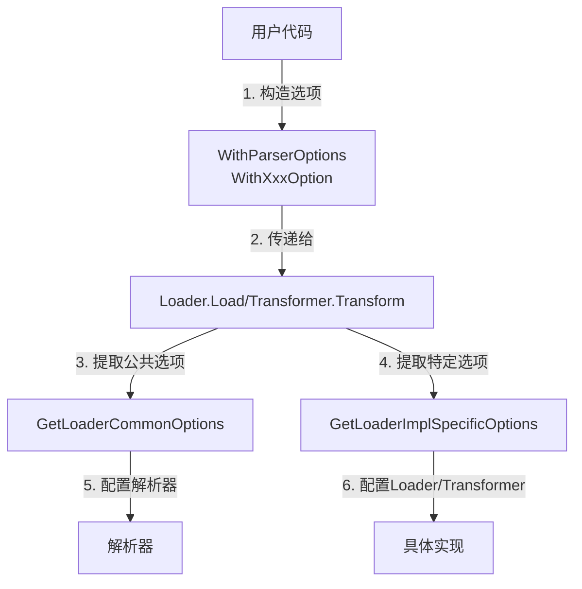

# document_options 模块技术深度解析

## 1. 什么是 document_options 模块

`document_options` 模块是 Eino 文档处理系统的核心配置基础设施。这个模块负责定义文档加载器（Loader）和文档转换器（Transformer）的配置选项类型，提供了统一的选项处理机制，使得各个组件的配置既保持统一接口又允许实现特定的配置灵活性。

### 问题背景
在构建文档处理系统中，我们面临一个经典的配置设计困境：一方面，我们希望所有的 Loader 和 Transformer 组件有统一的接口签名，以保持 API 的一致性；另一方面，不同的实现可能需要完全不同的配置参数。直接将特定实现的配置暴露在公共接口中会导致接口膨胀，而完全隐藏配置又会降低灵活性。

`document_options` 模块正是为了解决这个问题而设计的。

## 2. 核心抽象与心智模型

### 设计理念
这个模块的核心设计理念可以类比为"配置信封系统：

- **统一信封（Unified Envelope）：`LoaderOption` 和 `TransformerOption` 作为统一的"信封"，所有配置都封装在这个信封中传递
- **双层内容（Two-layer Content）：信封内包含两层内容：
  1. **公共选项层（Common Options）：所有实现共享的配置，如解析器选项
  2. **实现特定选项层（Impl-specific Options）：各实现私有的配置，完全由各实现自己定义和处理
- **类型安全的拆包（Type-safe Unwrapping）：提供类型安全的方法来提取各自的配置

这种设计使得组件接口保持一致，同时各实现可以自由扩展自己的配置而不影响接口。

### 核心组件的角色
1. **LoaderOptions：公共选项容器
2. **LoaderOption：统一选项类型
3. **TransformerOption：转换器统一选项类型
4. **辅助函数：配置的包装与提取工具

## 3. 架构与数据流



### 数据流向详解

1. **选项构造阶段：
   - 用户代码通过 `WithParserOptions` 构造公共选项
   - 各实现提供自己的 WithXxx 函数，通过 `WrapLoaderImplSpecificOptFn` 包装特定选项

2. **选项传递阶段：
   - 所有选项都以统一的 `LoaderOption` 或 `TransformerOption` 类型传递给组件方法

3. **选项提取阶段：
   - 组件内部使用 `GetLoaderCommonOptions` 提取公共选项
   - 组件内部使用 `GetLoaderImplSpecificOptions` 提取特定实现的配置

## 4. 核心组件深度解析

### 4.1 LoaderOptions 结构体

```go
// LoaderOptions 结构体是文档加载器的公共配置容器
type LoaderOptions struct {
    ParserOptions []parser.Option  // 解析器选项列表
}
```

**设计意图**：`LoaderOptions` 作为所有 Loader 实现共享的公共配置容器。目前它只包含解析器选项，但设计为结构体，为未来扩展留出空间。

**为什么这样设计**：
- 将公共选项集中管理，避免每个实现都可以访问
- 结构体形式便于未来添加新的公共选项而不破坏现有代码

### 4.2 LoaderOption 结构体

```go
type LoaderOption struct {
    apply func(opts *LoaderOptions)          // 公共选项应用函数
    implSpecificOptFn any                      // 实现特定选项函数
}
```

**设计意图**：这是一个统一的选项类型，是"配置信封"的核心。它包含两个部分：
1. `apply` 函数用于应用公共选项，
2. `implSpecificOptFn` 用于存储实现特定的选项函数。

**关键点**：
- `apply` 函数是类型安全的公共选项应用方法
- `implSpecificOptFn` 使用 `any` 类型存储，保证了灵活性
- 两个字段分离，公共选项和特定选项互不干扰

### 4.3 TransformerOption 结构体

```go
type TransformerOption struct {
    implSpecificOptFn any  // 实现特定选项函数
}
```

**设计意图**：Transformer 目前没有公共选项，所以只包含实现特定选项的存储。这是为了与 LoaderOption 保持一致的设计，为未来可能的公共选项预留空间。

### 4.4 核心辅助函数

#### WrapLoaderImplSpecificOptFn

```go
func WrapLoaderImplSpecificOptFn[T any](optFn func(*T)) LoaderOption
```

**作用**：将实现特定的选项函数包装成统一的 `LoaderOption` 类型。

**设计意图**：这是实现特定配置的"打包"函数，类型参数 `T` 是实现自己定义的配置结构体类型。

**使用示例**：
```go
// 实现自己的配置结构体
type S3LoaderOptions struct {
    Region string
    Bucket string
}

// 实现自己的选项函数
func WithS3Region(region string) LoaderOption {
    return WrapLoaderImplSpecificOptFn(func(opts *S3LoaderOptions) {
        opts.Region = region
    })
}
```

#### GetLoaderImplSpecificOptions

```go
func GetLoaderImplSpecificOptions[T any](base *T, opts ...LoaderOption) *T
```

**作用**：从统一的 `LoaderOption` 列表中提取实现特定的配置。

**设计意图**：这是实现特定配置的"拆包"函数，`base` 参数允许提供默认值，确保配置总是有合理的默认值。

**关键点**：
- 类型安全：只匹配对应类型 `T` 的选项函数
- 默认值支持：通过 `base` 参数提供默认值
- 容错处理：忽略类型不匹配的选项函数

#### GetLoaderCommonOptions

```go
func GetLoaderCommonOptions(base *LoaderOptions, opts ...LoaderOption) *LoaderOptions
```

**作用**：提取公共选项，类似地也支持默认值。

#### WithParserOptions

```go
func WithParserOptions(opts ...parser.Option) LoaderOption
```

**作用**：构造解析器选项的公共选项构造函数。

## 5. 依赖关系分析

### 模块依赖关系：
- **上游调用者：文档加载器实现，文档转换器实现
- **下游依赖：`components/document/parser` 模块（解析器选项）
- **相关模块**：[document_parser_options.md（解析器选项模块）
- **接口契约**：与 [document_interfaces.md](document_interfaces.md) 中定义的 Loader 和 Transformer 接口

### 数据契约：
- Loader 接口的 Load 方法签名必须接受 `...LoaderOption`
- Transformer 接口的 Transform 方法签名必须接受 `...TransformerOption`
- 解析器选项通过 `LoaderOptions.ParserOptions` 传递给解析器

## 6. 设计决策与权衡

### 6.1 统一选项类型 vs 泛型选项

**选择**：使用统一选项类型 + 类型安全提取函数，而不是泛型接口。

**为什么这样选择**：
- 优点：
  - 保持接口签名统一，所有 Loader 接口完全一致
  - 编译时类型安全（通过类型参数 T）
  - 灵活，各实现可以定义任意配置结构
  - 向后兼容，添加新选项不破坏接口

- 缺点：
  - 运行时类型断言（虽然被封装在库内部）
  - 稍微多一点的运行时开销

**替代方案考虑**：
1. **泛型接口 `Loader[T any]`：会导致接口不统一，不同 Loader 类型不兼容
2. **纯 interface{}**：完全类型不安全
3. **每个实现自己的 Option 类型**：接口不一致

### 6.2 公共选项与实现特定选项分离

**选择**：将选项分为公共层和实现特定层。

**为什么这样选择**：
- 解析器选项是所有 Loader 都需要的公共概念
- 保持公共选项集中管理，避免重复
- 实现特定选项完全隔离，互不干扰

### 6.3 默认值支持设计

**选择**：通过 base 参数提供默认值，而不是要求每个选项都有默认值。

**为什么这样选择**：
- 实现可以自己控制默认值
- 零值可用的选项结构体可以作为默认值
- 灵活，允许实现可以部分设置默认值

## 7. 使用指南与最佳实践

### 7.1 实现自定义 Loader 选项

```go
// 1. 定义自己的配置结构体
type MyLoaderOptions struct {
    MaxSize int64  // 默认 0 表示不限制
    Timeout time.Duration
}

// 2. 提供选项函数
func WithMaxSize(size int64) LoaderOption {
    return WrapLoaderImplSpecificOptFn(func(opts *MyLoaderOptions) {
        opts.MaxSize = size
    })
}

func WithTimeout(timeout time.Duration) LoaderOption {
    return WrapLoaderImplSpecificOptFn(func(opts *MyLoaderOptions) {
        opts.Timeout = timeout
    })
}

// 3. 在 Load 方法中提取选项
func (l *MyLoader) Load(ctx context.Context, source source.Source, opts ...LoaderOption) ([]*schema.Document, error) {
    // 提取公共选项
    commonOpts := GetLoaderCommonOptions(nil, opts...)
    
    // 提取实现特定选项（提供默认值）
    myOpts := GetLoaderImplSpecificOptions(&MyLoaderOptions{
        Timeout: 30 * time.Second,  // 默认超时 30 秒
    }, opts...)
    
    // 使用选项...
}
```

### 7.2 使用解析器选项

```go
// 用户代码中使用
loader := NewMyLoader()
docs, err := loader.Load(ctx, source,
    WithParserOptions(parser.WithMaxDepth(5)),
    WithMaxSize(1024*1024),
)
```

## 8. 陷阱与边缘情况

### 8.1 类型不匹配的选项函数

**问题**：如果一个 LoaderOption 是为另一种实现的选项函数，`GetLoaderImplSpecificOptions` 会忽略它。

**注意**：这是设计上的容错机制，不是错误。这样设计允许混合不同实现的选项在一起传递，每个实现只取自己需要的。

### 8.2 nil base 参数

**问题**：base 参数可以是 nil，此时会自动创建一个零值 T。

**建议**：始终提供 base 参数，明确设置默认值，避免零值带来的意外行为。

### 8.3 选项顺序

**注意**：选项按传递顺序应用，后面的选项会覆盖前面的选项。

### 8.4 TransformerOption 的未来扩展

**注意**：TransformerOption 目前没有公共选项，但结构设计为未来可能添加公共选项留出空间。实现者应该遵循类似的模式。

## 9. 总结

`document_options` 模块是一个精巧的配置基础设施，解决了组件接口一致性与实现配置灵活性之间的矛盾。它的核心思想是"统一信封+双层内容"的设计，通过类型安全的包装和提取函数，实现了既统一又灵活的配置系统。

这个模块的设计体现了 Eino 框架的核心设计哲学：接口一致，实现灵活，类型安全，向后兼容。

## 相关文档

- [document_interfaces.md](document_interfaces.md) - 文档组件接口定义
- [document_parser_options.md](document_parser_options.md) - 解析器选项模块
- [document_load_callbacks.md](document_load_callbacks.md) - 加载器回调模块

