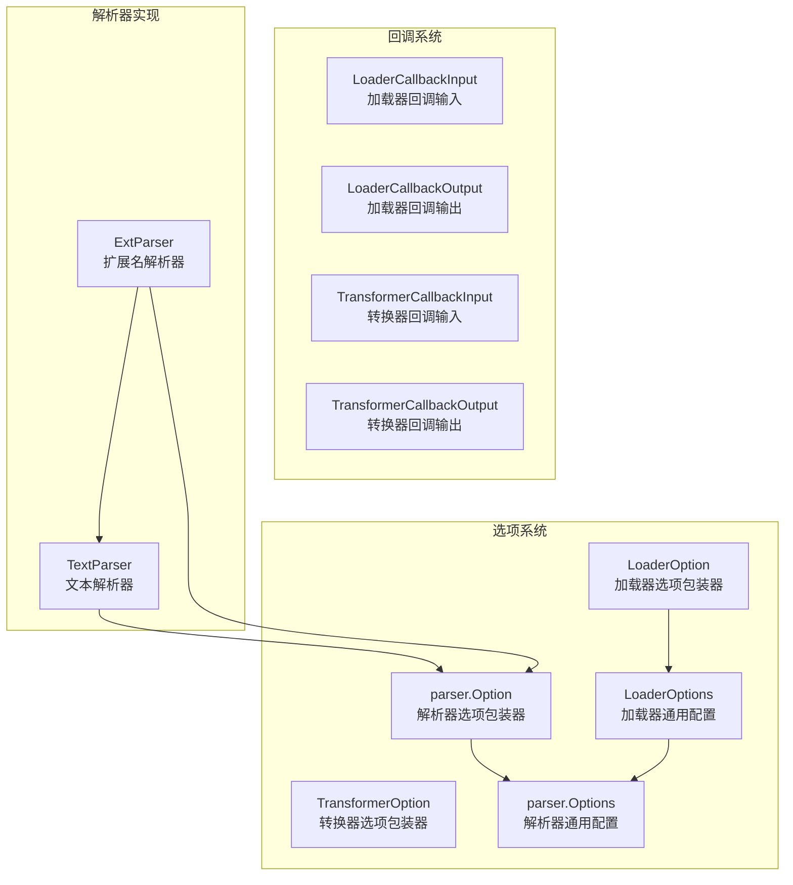

# Document Options & Callbacks (文档处理配置与回调)

## 模块概述

document_options_and_callbacks 模块是文档处理管道中的基础设施层，它为文档加载、解析和转换操作提供了统一的配置机制和回调系统。

想象一下，你正在构建一个文档处理系统，需要支持多种文档格式（PDF、Markdown、Word 等），并且需要在处理过程中记录日志、监控性能或修改数据。如果没有这个模块，每个文档加载器和转换器都需要自行实现配置传递和回调触发逻辑，导致代码重复且难以维护。

这个模块的核心价值在于：
- **统一配置接口**：让不同实现的文档组件可以使用相同的选项传递机制
- **灵活扩展**：支持实现特定的自定义选项，同时保持接口一致性
- **可观测性**：通过回调系统提供处理过程的洞察能力

## 架构与核心组件



### 核心组件职责

#### 1. 选项系统

**LoaderOption / TransformerOption / parser.Option**
这些是选项的包装器结构，采用了"类型擦除"模式。它们的作用是让不同实现可以传递自己特定的选项，同时保持统一的函数签名。

**设计意图**：这是一个经典的扩展性设计。如果直接使用具体类型，接口会被绑定到特定实现；通过这种包装器，我们实现了"统一接口 + 实现特定扩展"的平衡。

#### 2. 回调系统

**LoaderCallbackInput / LoaderCallbackOutput**
这些结构定义了文档加载过程中回调函数的输入和输出契约。它们包含了源信息、文档数据和扩展字段，让回调处理器可以观察甚至修改处理流程。

**TransformerCallbackInput / TransformerCallbackOutput**
类似地，这些结构为文档转换操作提供了回调契约。

#### 3. 解析器实现

**TextParser**
最简单的解析器实现，直接将输入流作为文本读取，返回单个文档。它是默认的回退解析器。

**ExtParser**
基于文件扩展名的路由解析器。它根据 URI 的扩展名选择对应的解析器，支持注册自定义解析器和设置回退解析器。

## 子模块深度解析

### [文档选项系统](document_options.md)
该子模块定义了 Loader 和 Transformer 组件的配置选项机制。它采用类型擦除模式，实现了统一接口与实现特定扩展的平衡。核心是 `LoaderOption` 和 `TransformerOption` 结构，以及配套的包装和提取函数，让组件实现者可以灵活定义自己的配置，同时保持 API 的一致性。

### [解析器选项系统](document_parser_options.md)
专注于文档解析器的配置系统。它扩展了通用选项模式，增加了 URI 和元数据等解析器特定的配置。这个子模块是连接 Loader 和 Parser 的桥梁，Loader 通过它传递解析上下文，Parser 从中提取所需信息。

### [加载器回调系统](document_load_callbacks.md)
定义了文档加载过程的回调契约。包含 `LoaderCallbackInput` 和 `LoaderCallbackOutput` 结构，以及智能转换函数。这个子模块让你可以观察甚至修改文档加载过程，是实现日志记录、性能监控、数据修改等横切关注点的关键。

### [转换器回调系统](document_transform_callbacks.md)
类似加载器回调系统，但专注于文档转换操作。它定义了 `TransformerCallbackInput` 和 `TransformerCallbackOutput`，为文档转换管道提供了可观测性和扩展点。

### [文档解析器实现](document_parsers.md)
包含具体的解析器实现，包括简单的 `TextParser` 和基于扩展名路由的 `ExtParser`。这个子模块展示了如何使用前面的选项和回调系统构建实际的组件，是理解整个模块如何协同工作的绝佳示例。

## 设计决策深度分析

### 1. 选项系统的"类型擦除"模式

**设计选择**：使用包含 `implSpecificOptFn any` 字段的包装器结构，而不是泛型接口。

**替代方案对比**：
- **方案 A（已选择）**：当前的包装器 + `WrapXxxImplSpecificOptFn` 函数
- **方案 B**：使用 `any` 直接传递选项
- **方案 C**：定义泛型接口 `Option[T any]`

**权衡分析**：
- 方案 B 过于宽松，失去了类型安全
- 方案 C 在 Go 1.18+ 可行，但会使接口签名变得复杂，且与回调系统的集成更困难
- 方案 A 在保持简洁 API 的同时，通过 `WrapXxx` 和 `GetXxxImplSpecificOptions` 提供了类型安全的扩展点

**适用场景**：这种设计特别适合框架级代码，需要支持多种实现但又要保持 API 稳定性的场景。

### 2. 回调系统的类型转换模式

**设计选择**：提供 `ConvLoaderCallbackInput` / `ConvLoaderCallbackOutput` 这样的转换函数，而不是要求所有地方都使用具体类型。

**原因**：
- 回调系统是跨组件的，需要处理多种输入类型
- 这种设计允许"简洁用法"（直接传递 `Source` 或 `[]*schema.Document`）和"完整用法"（传递包含 Extra 的完整结构）并存

**示例**：
```go
// 简洁用法
callbacks.Trigger(ctx, event, source, nil)

// 完整用法
callbacks.Trigger(ctx, event, &LoaderCallbackInput{
    Source: source,
    Extra: map[string]any{"key": "value"},
}, nil)
```

### 3. ExtParser 的 URI 依赖设计

**设计选择**：ExtParser 必须通过 `parser.WithURI` 传入 URI 才能工作。

**权衡**：
- 优点：基于扩展名的路由简单直观，符合用户直觉
- 缺点：增加了使用约束，忘记传 URI 会导致使用默认解析器

**为什么这样设计**：文件格式通常与扩展名强相关，这是最可靠的启发式方法。相比检查文件头（magic bytes），这种方法性能更好且实现更简单。

## 数据流与使用场景

### 典型文档加载流程

```
用户代码
    ↓
Loader.Load(ctx, source, WithParserOptions(parser.WithURI("file.md")))
    ↓
Loader 内部:
    1. GetLoaderCommonOptions 提取通用配置
    2. GetLoaderImplSpecificOptions 提取实现特定配置
    3. 打开源获取 io.Reader
    4. Parser.Parse(ctx, reader, parserOptions...)
    5. 触发 OnLoaderEnd 回调
    ↓
返回 []*schema.Document
```

### 关键数据契约

1. **Loader ↔ Parser 契约**：
   - Loader 负责传递 `ParserOptions`
   - Parser 负责从 `io.Reader` 解析出 `[]*schema.Document`

2. **回调契约**：
   - 输入可以是 `Source` 或 `LoaderCallbackInput`
   - 输出可以是 `[]*schema.Document` 或 `LoaderCallbackOutput`
   - 转换函数 `ConvLoaderCallbackInput` / `ConvLoaderCallbackOutput` 处理两种情况

## 新开发者注意事项

### 常见陷阱

1. **忘记传递 URI 给 ExtParser**
   ```go
   // 错误：ExtParser 无法确定使用哪个解析器
   docs, err := extParser.Parse(ctx, reader)
   
   // 正确
   docs, err := extParser.Parse(ctx, reader, parser.WithURI("file.pdf"))
   ```

2. **自定义选项类型不匹配**
   ```go
   // 错误：选项函数的类型与 Get 时的类型不一致
   func WithX(x string) LoaderOption {
       return WrapLoaderImplSpecificOptFn(func(o *OtherOptions) { ... })
   }
   // 然后在 Load 中用 &MyOptions{} 调用 GetLoaderImplSpecificOptions
   // 结果：选项不会被应用，也不会报错
   ```

3. **回调中修改文档**
   - 回调可以修改返回的文档，但这会创建隐式依赖
   - 建议：回调用于观测，转换用 Transformer 组件

### 扩展指南

**添加自定义 Loader 选项**：
```go
// 在你的 loader 包中
type myLoaderOptions struct {
    Timeout time.Duration
}

func WithTimeout(t time.Duration) document.LoaderOption {
    return document.WrapLoaderImplSpecificOptFn(func(o *myLoaderOptions) {
        o.Timeout = t
    })
}

// 在 Load 方法中
opts := document.GetLoaderImplSpecificOptions(&myLoaderOptions{
    Timeout: 30 * time.Second, // 默认值
}, options...)
```

**注册自定义解析器**：
```go
extParser, _ := parser.NewExtParser(ctx, &parser.ExtParserConfig{
    Parsers: map[string]parser.Parser{
        ".pdf": myPDFParser{},
        ".docx": myDocxParser{},
    },
})
```

## 与其他模块的关系

- **依赖**：
  - [Schema Core Types](schema_core_types.md)：提供 `schema.Document` 类型
  - [Callbacks System](callbacks_system.md)：提供回调基础设施
  - [Component Interfaces](component_interfaces.md)：定义 `Source` 等接口

- **被依赖**：
  - 文档处理组件实现
  - 索引器和检索器管道
  - 工作流中的文档处理节点

这个模块是文档处理子系统的"粘合剂"，它不直接处理业务逻辑，而是为其他组件提供配置和扩展机制。
