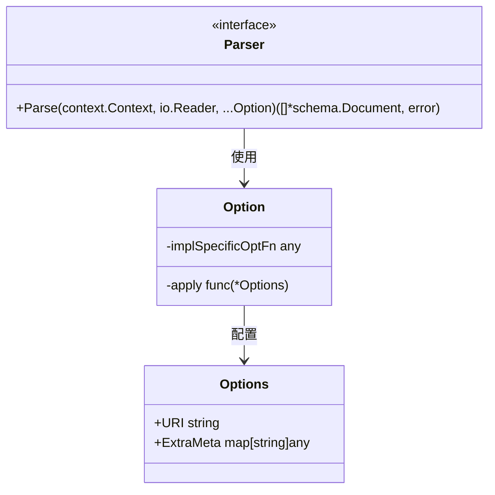

# 文档解析器选项系统 (document_parser_options)

## 概述

**document_parser_options** 模块定义了一个灵活且可扩展的配置系统，用于文档解析器组件的标准化配置。它解决了一个经典的软件设计问题：如何在保持统一接口的同时，让不同的解析器实现能够拥有自己特定的配置选项。

想象一下，你正在构建一个通用的文档处理管道，其中可能有针对 PDF、Markdown、Word 文档等不同类型的解析器。每个解析器都需要一些公共配置（如源 URI、元数据），但也可能有自己特定的配置（如 PDF 解析器的密码、Markdown 解析器的渲染选项）。这个模块就是为了优雅地解决这种共性与差异性之间的张力而设计的。

## 核心概念与架构

### 数据结构



### 核心组件

#### Options 结构体
`Options` 是所有解析器共享的公共配置容器，包含两个核心字段：
- **URI**：文档源的统一资源标识符，用于在 `ExtParser` 中选择合适的解析器
- **ExtraMeta**：将合并到每个解析后文档的额外元数据

#### Option 结构体
`Option` 是一个巧妙的设计，它同时支持两种配置方式：
1. **公共选项**：通过 `apply` 函数修改 `Options` 结构体
2. **实现特定选项**：通过 `implSpecificOptFn` 字段存储实现特定的配置函数

这种设计让同一个 `Option` 类型能够承载两种截然不同的配置逻辑，同时保持接口的统一性。

## 工作原理与数据流

### 1. 配置构建流程

当使用解析器时，配置构建遵循以下流程：

```
调用者 → WithURI()/WithExtraMeta() → Option 实例
         ↓
    实现特定选项 → WrapImplSpecificOptFn() → Option 实例
         ↓
    所有 Option 传递给 Parser.Parse()
```

### 2. 配置应用流程

在解析器内部，配置通过两个阶段应用：

1. **公共选项提取**：使用 `GetCommonOptions()` 提取共享配置
2. **特定选项提取**：使用 `GetImplSpecificOptions()` 提取实现特定配置

让我们看一个典型的使用流程：

```go
// 1. 创建解析器
parser := NewSomeParser()

// 2. 准备配置选项
opts := []Option{
    WithURI("file:///path/to/document.md"),
    WithExtraMeta(map[string]any{"source": "local"}),
    someParser.WithSpecificConfig("value"), // 实现特定选项
}

// 3. 解析文档
docs, err := parser.Parse(ctx, reader, opts...)
```

在解析器内部：

```go
func (p *SomeParser) Parse(ctx context.Context, reader io.Reader, opts ...Option) ([]*schema.Document, error) {
    // 提取公共选项
    commonOpts := GetCommonOptions(nil, opts...)
    
    // 提取特定选项
    type specificOpts struct {
        config string
    }
    base := &specificOpts{config: "default"}
    specificOpts := GetImplSpecificOptions(base, opts...)
    
    // 使用配置进行解析...
}
```

## 设计决策与权衡

### 1. 统一接口 vs 实现特定配置

**决策**：使用单个 `Option` 类型同时承载公共和特定配置

**替代方案**：
- 为每个解析器定义独立的选项类型
- 使用 `map[string]any` 作为配置容器

**权衡**：
- ✅ **优点**：保持了 `Parser` 接口的简洁性和一致性
- ✅ **优点**：允许解析器实现者自由定义自己的配置结构
- ⚠️ **缺点**：类型安全性在运行时检查（通过类型断言）
- ⚠️ **缺点**：需要解析器实现者正确使用 `WrapImplSpecificOptFn` 和 `GetImplSpecificOptions`

### 2. 函数式选项模式

**决策**：采用函数式选项模式（Functional Options Pattern）

**替代方案**：
- 配置结构体 + 构造函数
- Builder 模式

**权衡**：
- ✅ **优点**：提供了流畅的 API，可选参数直观
- ✅ **优点**：向后兼容性好，添加新选项不需要修改接口
- ✅ **优点**：支持选项的顺序无关性
- ⚠️ **缺点**：对于简单场景可能略显过度设计

### 3. 类型安全与灵活性的平衡

**决策**：使用 `any` 类型存储实现特定选项函数，在提取时进行类型断言

**替代方案**：
- 使用泛型在接口级别定义选项类型
- 使用反射进行更复杂的类型处理

**权衡**：
- ✅ **优点**：保持了接口的简单性，不引入复杂的泛型约束
- ✅ **优点**：给实现者最大的灵活性来定义自己的选项结构
- ⚠️ **缺点**：类型错误只能在运行时发现
- ⚠️ **缺点**：需要实现者仔细匹配类型参数

## 核心 API 详解

### 公共选项构造函数

#### WithURI(uri string) Option
创建一个设置源 URI 的选项。这个 URI 在 `ExtParser` 中用于根据文件扩展名或协议选择合适的解析器。

**参数**：
- `uri`：文档源的统一资源标识符

**使用场景**：
- 标识文档来源，用于解析器选择
- 在生成的文档元数据中保留源信息

#### WithExtraMeta(meta map[string]any) Option
创建一个设置额外元数据的选项。这些元数据将合并到每个解析生成的 `schema.Document` 中。

**参数**：
- `meta`：要附加到文档的额外元数据映射

**使用场景**：
- 添加文档来源信息（如爬虫名称、导入批次）
- 传递处理管道中的上下文信息
- 标记文档的分类或标签

### 选项提取函数

#### GetCommonOptions(base *Options, opts ...Option) *Options
从选项列表中提取公共配置选项。

**参数**：
- `base`：可选的基础配置，提供默认值
- `opts`：选项列表

**返回值**：合并后的 `Options` 结构体

**设计意图**：
- 允许解析器提供默认配置
- 安全地处理 `nil` 输入
- 按顺序应用选项，后面的选项覆盖前面的

#### GetImplSpecificOptions[T any](base *T, opts ...Option) *T
从选项列表中提取实现特定的配置选项。

**类型参数**：
- `T`：实现特定的选项结构体类型

**参数**：
- `base`：可选的基础配置，提供默认值
- `opts`：选项列表

**返回值**：合并后的特定选项结构体

**设计意图**：
- 类型安全地提取特定实现的配置
- 忽略不匹配类型的选项函数
- 支持默认值设置

### 实现特定选项包装器

#### WrapImplSpecificOptFn[T any](optFn func(*T)) Option
将实现特定的选项函数包装为统一的 `Option` 类型。

**类型参数**：
- `T`：实现特定的选项结构体类型

**参数**：
- `optFn`：修改特定选项结构体的函数

**返回值**：包装后的 `Option` 实例

**使用示例**：
```go
type pdfOptions struct {
    password string
}

func WithPassword(pwd string) Option {
    return WrapImplSpecificOptFn(func(o *pdfOptions) {
        o.password = pwd
    })
}
```

## 使用指南与最佳实践

### 1. 实现自定义解析器的选项系统

如果你正在实现一个新的解析器，以下是创建选项系统的标准模式：

```go
package myparser

import (
    "context"
    "io"
    
    "your/project/components/document/parser"
    "your/project/schema"
)

// 1. 定义你的特定选项结构体
type MyParserOptions struct {
    StrictMode bool
    MaxDepth   int
}

// 2. 提供默认选项
func defaultMyParserOptions() *MyParserOptions {
    return &MyParserOptions{
        StrictMode: false,
        MaxDepth:   10,
    }
}

// 3. 创建选项设置函数
func WithStrictMode(strict bool) parser.Option {
    return parser.WrapImplSpecificOptFn(func(o *MyParserOptions) {
        o.StrictMode = strict
    })
}

func WithMaxDepth(depth int) parser.Option {
    return parser.WrapImplSpecificOptFn(func(o *MyParserOptions) {
        o.MaxDepth = depth
    })
}

// 4. 在解析器中使用这些选项
type MyParser struct{}

func (p *MyParser) Parse(ctx context.Context, reader io.Reader, opts ...parser.Option) ([]*schema.Document, error) {
    // 提取公共选项
    commonOpts := parser.GetCommonOptions(nil, opts...)
    
    // 提取特定选项
    specificOpts := parser.GetImplSpecificOptions(defaultMyParserOptions(), opts...)
    
    // 使用配置进行解析...
    // specificOpts.StrictMode, specificOpts.MaxDepth 可用
    
    return nil, nil
}
```

### 2. 使用解析器选项

```go
// 创建解析器
parser := myparser.NewMyParser()

// 准备选项
opts := []parser.Option{
    parser.WithURI("file:///data/document.myext"),
    parser.WithExtraMeta(map[string]any{
        "imported_at": time.Now(),
        "source":      "user_upload",
    }),
    myparser.WithStrictMode(true),
    myparser.WithMaxDepth(20),
}

// 解析文档
docs, err := parser.Parse(ctx, reader, opts...)
```

### 3. 最佳实践

1. **始终提供默认值**：在 `GetImplSpecificOptions` 中提供有意义的默认值，避免零值导致的意外行为
2. **选项命名一致性**：使用 `WithXxx` 模式命名选项函数，保持 API 的一致性
3. **文档化选项**：为每个选项函数添加清晰的注释，说明其用途和默认值
4. **避免选项冲突**：确保不同解析器的特定选项结构体类型不同，防止类型混淆
5. **合理使用 ExtraMeta**：只在真正需要跨多个处理步骤共享数据时使用 `ExtraMeta`，避免过度使用

## 边缘情况与注意事项

### 1. 选项顺序

选项是按顺序应用的，后面的选项会覆盖前面的选项：

```go
opts := []parser.Option{
    parser.WithURI("first://uri"),
    parser.WithURI("second://uri"), // 这个会覆盖前面的
}
// 最终 URI 是 "second://uri"
```

### 2. 类型不匹配的选项

如果传入了不匹配类型的实现特定选项，`GetImplSpecificOptions` 会安全地忽略它们：

```go
// 假设我们混合使用了不同解析器的选项
opts := []parser.Option{
    pdfparser.WithPassword("secret"),
    mdparser.WithToc(true),
}

// 在 PDF 解析器中，mdparser 的选项会被安全忽略
pdfOpts := parser.GetImplSpecificOptions(defaultPdfOptions(), opts...)
```

这种设计允许在使用 `ExtParser` 等组合解析器时，传入所有可能需要的选项，每个具体解析器只会提取自己关心的配置。

### 3. nil 基础选项

`GetCommonOptions` 和 `GetImplSpecificOptions` 都能安全处理 `nil` 基础选项：

```go
// 安全，会创建一个空的 Options
commonOpts := parser.GetCommonOptions(nil, opts...)

// 安全，会创建一个零值初始化的 T
specificOpts := parser.GetImplSpecificOptions[*MyOptions](nil, opts...)
```

### 4. ExtraMeta 的可变性

`ExtraMeta` 是一个普通的 map，在多个文档或解析器之间共享时要注意可变性：

```go
meta := map[string]any{"key": "value"}
opts := []parser.Option{parser.WithExtraMeta(meta)}

// 后续对 meta 的修改会影响已经创建的选项
meta["newkey"] = "newvalue" // 这会反映到解析器看到的 ExtraMeta 中
```

建议在创建选项后不再修改原始 map，或者创建 map 的副本。

## 与其他模块的关系

### 依赖关系

- **被依赖**：[document_interfaces](document_interfaces.md) 中的 `Parser` 接口使用本模块的 `Option` 类型
- **依赖**：不直接依赖其他模块，是一个相对独立的配置定义模块

### 协同工作模块

1. **[document_parsers](document_parsers.md)**：实际的解析器实现，如 `TextParser` 和 `ExtParser`
2. **[document_options](document_options.md)**：文档加载器和转换器的选项系统，设计模式类似
3. **[schema_document](schema_document.md)**：定义了 `schema.Document` 类型，解析器的输出类型

特别是 `ExtParser`，它使用 `Options.URI` 字段来根据文件扩展名或协议选择合适的解析器，这是 URI 选项的一个主要用途。

## 总结

**document_parser_options** 模块展示了一个精心设计的配置系统，它在保持接口统一性的同时，为不同实现提供了充分的灵活性。通过函数式选项模式和类型安全的提取机制，它解决了通用接口与特定实现需求之间的经典矛盾。

这个模块的设计思想可以总结为：
1. **统一接口，分离实现**：所有解析器使用相同的 `Option` 类型，但内部处理方式不同
2. **约定优于强制**：通过提供辅助函数和标准模式，引导正确使用，而不是通过复杂的类型约束
3. **安全的灵活性**：在提供灵活性的同时，通过类型断言和安全的默认处理，避免常见错误

对于新加入团队的开发者，理解这个模块的关键在于认识到它是一个"配置中间层"——它不直接执行任何解析逻辑，而是为解析逻辑提供了一个标准化的配置传递机制。
