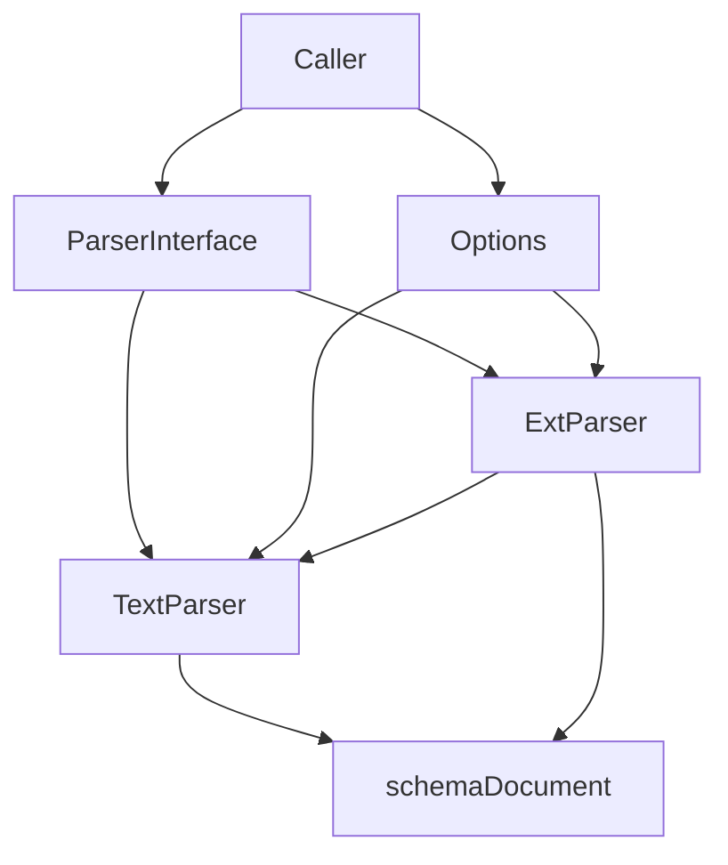

# document_parsers 模块技术深度解析

## 1. 问题空间与解决方案

### 1.1 核心问题

在文档处理系统中，面临两个根本问题：
1. **多样化的文档格式**：系统需要处理文本文件、PDF、Markdown、Word 等多种不同格式的文档
2. **统一的输出接口**：不管输入格式如何，下游系统（如索引、检索、模型）需要一致的数据结构

一个直接的解决方案是为每种文档格式编写独立的解析器，但这样会导致：
- 调用方需要知道并管理所有解析器类型
- 缺少统一的错误处理和元数据注入
- 无法灵活切换或组合解析策略

### 1.2 设计洞察

`document_parsers` 模块的核心设计思想是：**统一接口 + 策略模式 + 元数据增强**。通过定义统一的 `Parser` 接口，实现解析策略的可插拔，并在解析流程中提供一致的元数据处理。

---

## 2. 核心架构与数据流程

### 2.1 架构图



**节点说明**：
- **A (Caller)**：调用方，如 Loader 或 Transformer
- **B (ParserInterface)**：`Parser` 统一接口定义
- **C (TextParser)**：简单文本解析器实现
- **D (ExtParser)**：基于文件扩展名的路由解析器
- **E (Options)**：解析选项（URI + 额外元数据）
- **F (schemaDocument)**：输出的 `schema.Document` 结构

### 2.2 数据流向

文档解析的典型数据流程如下：

1. **输入阶段**：
   - 调用方提供 `io.Reader` 作为原始数据来源
   - 通过 `opts ...Option` 传入 URI 和额外元数据

2. **路由阶段**（仅 `ExtParser`）：
   - 从 `Options` 中提取 URI
   - 使用 `filepath.Ext()` 获取文件扩展名
   - 查找对应的解析器或使用 fallback

3. **解析阶段**：
   - 具体解析器读取 `io.Reader` 内容
   - 将内容转换为 `schema.Document` 结构
   - 注入源 URI 和额外元数据

4. **输出阶段**：
   - 返回统一格式的 `[]*schema.Document`
   - 元数据已合并完成，下游可直接使用

---

## 3. 核心组件深度分析

### 3.1 Parser 接口

**定义位置**：`components.document.parser.interface.Parser`

这是整个模块的基石。该接口设计非常简洁：

```go
type Parser interface {
    Parse(ctx context.Context, reader io.Reader, opts ...Option) ([]*schema.Document, error)
}
```

**设计意图**：
- **接受 `io.Reader`**：不绑定具体数据源（文件、内存、网络流等）
- **返回 `[]*schema.Document`**：支持一个输入源生成多个文档的场景
- **`opts ...Option`**：提供灵活的配置方式而不破坏接口签名
- **`context.Context`**：支持超时、取消和跨组件上下文传递

### 3.2 TextParser

**定义位置**：`components.document.parser.text_parser.TextParser`

这是最简单但最常用的解析器。它的设计体现了"做一件事并做好"的 Unix 哲学。

#### 工作原理：

```go
func (dp TextParser) Parse(ctx context.Context, reader io.Reader, opts ...Option) ([]*schema.Document, error) {
    // 1. 读取全部数据
    data, err := io.ReadAll(reader)
    if err != nil {
        return nil, err
    }

    // 2. 解析配置选项
    opt := GetCommonOptions(&Options{}, opts...)

    // 3. 构建元数据
    meta := make(map[string]any)
    meta[MetaKeySource] = opt.URI  // 注入源 URI
    
    // 4. 合并额外元数据
    for k, v := range opt.ExtraMeta {
        meta[k] = v
    }

    // 5. 创建文档
    doc := &schema.Document{
        Content:  string(data),
        MetaData: meta,
    }

    return []*schema.Document{doc}, nil
}
```

**关键点**：
- **总是创建单个文档**：即使输入为空，也会返回一个内容为空的文档
- **元数据注入**：将 URI 标准化为 `_source` 字段，这是后续处理的重要约定
- **元数据合并策略**：调用方的 `ExtraMeta` 可以覆盖默认值（虽然这里 `_source` 先设置后不会被覆盖）

### 3.3 ExtParser

**定义位置**：`components.document.parser.ext_parser.ExtParser`

这是模块的"策略路由器"。它本身不解析文档，而是根据文件扩展名将工作委托给合适的解析器。

#### ExtParserConfig 配置：

```go
type ExtParserConfig struct {
    // ext -> parser 的映射
    Parsers map[string]Parser
    
    // 回退解析器，默认为 TextParser
    FallbackParser Parser
}
```

#### 工作原理：

1. **初始化阶段**：
   - 确保 `parsers` map 不为 nil
   - 设置默认的 fallback 为 `TextParser`

2. **解析阶段**：
   ```go
   // 提取文件扩展名
   ext := filepath.Ext(opt.URI)
   
   // 查找解析器
   parser, ok := p.parsers[ext]
   if !ok {
       parser = p.fallbackParser
   }
   
   // 委托解析
   docs, err := parser.Parse(ctx, reader, opts...)
   ```

3. **元数据后处理**：
   - 确保每个文档都有 `MetaData` map
   - 将 `ExtraMeta` 合并到每个文档中

**设计亮点**：
- **防御式编程**：检查 `doc == nil` 和 `doc.MetaData == nil`
- **元数据二次注入**：即使委托的解析器没有处理元数据，这里也会补充
- **GetParsers() 返回副本**：防止外部修改内部状态

---

## 4. 依赖关系与交互

### 4.1 依赖分析

**被 `document_parsers` 依赖的模块**：
- [schema](schema.md)：提供 `schema.Document` 数据结构
- [document_parser_options](document_parser_options.md)：提供 `Options` 和选项函数

**依赖 `document_parsers` 的模块**：
- [document_loaders](document_loaders.md)：加载器使用解析器将原始数据转换为文档
- [document_transformers](document_transformers.md)：某些转换器可能内部使用解析器

### 4.2 与外部的契约

**输入契约**：
- `io.Reader`：可以是任何可读流，但解析器可能会假设某些特性（如可寻址性）
- `Options.URI`：对 `ExtParser` 是**必需的**，必须能被 `filepath.Ext()` 解析
- `Options.ExtraMeta`：会合并到文档元数据中，可能覆盖已有字段

**输出契约**：
- `[]*schema.Document`：顺序可能有意义（如按文档出现顺序）
- `schema.Document.Content`：通常包含完整解析的文本
- `schema.Document.MetaData`：总是包含 `_source` 字段（由 `TextParser` 保证）

---

## 5. 设计决策与权衡

### 5.1 设计模式选择

**策略模式**：
- **选择**：通过 `Parser` 接口和 `ExtParser` 的委托机制实现策略模式
- **理由**：使解析算法可以独立于使用它的客户端而变化
- **替代方案**：使用函数类型而非接口，但接口提供了更好的组合性和可测试性

### 5.2 URI 处理策略

**设计**：`ExtParser` 通过 `filepath.Ext(opt.URI)` 获取扩展名
- **优点**：简单、直接、符合 Go 标准库习惯
- **缺点**：
  - 必须传入 URI（即使数据来自内存）
  - URI 需要有扩展名
  - 对无扩展名文件或非标准扩展名不友好
- **权衡**：在简单性和灵活性之间选择了简单性，通过 fallback 机制缓解缺点

### 5.3 元数据处理

**设计**：`TextParser` 设置元数据，`ExtParser` 补充元数据
- **优点**：
  - 双重保证，元数据不会丢失
  - `ExtParser` 可以增强委托解析器的输出
- **潜在问题**：
  - 性能：遍历所有文档再次设置元数据
  - 覆盖风险：`ExtraMeta` 可能覆盖解析器设置的字段
- **权衡**：选择了"正确性优先"，确保元数据始终存在

### 5.4 错误处理策略

**设计**：错误立即返回，不尝试恢复
- **`TextParser`**：读取失败直接返回错误
- **`ExtParser`**：解析失败直接返回错误，不尝试 fallback 到其他解析器
- **理由**：让调用方决定如何处理错误，而不是猜测恢复策略
- **替代方案**：可以设计一个尝试多种解析器的 `TryParsersParser`

---

## 6. 使用指南与最佳实践

### 6.1 基本用法

#### 使用 TextParser：

```go
parser := &parser.TextParser{}
docs, err := parser.Parse(ctx, strings.NewReader("hello world"),
    parser.WithURI("memory://hello.txt"),
    parser.WithExtraMeta(map[string]any{
        "author": "john",
        "category": "greeting"
    }))
```

#### 使用 ExtParser：

```go
// 创建配置
config := &parser.ExtParserConfig{
    Parsers: map[string]parser.Parser{
        ".md":  &MarkdownParser{},
        ".pdf": &PDFParser{},
    },
    FallbackParser: &parser.TextParser{},
}

// 创建解析器
extParser, err := parser.NewExtParser(ctx, config)

// 使用 - 必须传入 URI！
file, _ := os.Open("document.md")
docs, err := extParser.Parse(ctx, file, parser.WithURI("document.md"))
```

### 6.2 扩展点

#### 自定义解析器：

只需实现 `Parser` 接口：

```go
type MyParser struct{}

func (p *MyParser) Parse(ctx context.Context, reader io.Reader, opts ...parser.Option) ([]*schema.Document, error) {
    // 你的解析逻辑
    opt := parser.GetCommonOptions(&parser.Options{}, opts...)
    
    doc := &schema.Document{
        Content:  "parsed content",
        MetaData: map[string]any{"_source": opt.URI},
    }
    
    return []*schema.Document{doc}, nil
}
```

#### 组合解析器：

可以创建装饰器模式的解析器：

```go
type LoggingParser struct {
    Underlying parser.Parser
}

func (p *LoggingParser) Parse(ctx context.Context, reader io.Reader, opts ...parser.Option) ([]*schema.Document, error) {
    log.Println("starting parse")
    docs, err := p.Underlying.Parse(ctx, reader, opts...)
    log.Printf("parse complete, got %d docs, err=%v", len(docs), err)
    return docs, err
}
```

### 6.3 最佳实践

1. **始终设置 URI**：
   - 即使对 `TextParser` 也应该设置，这有助于后续的追踪和调试
   - 对于内存数据，可以使用 `memory://` 或 `in-memory://` 等虚拟 URI

2. **谨慎使用 ExtraMeta**：
   - 避免使用以下划线开头的键，这些是系统保留的
   - 确保值可以被 JSON 序列化（如果文档需要持久化）

3. **ExtParser 的 URI 要求**：
   - URI 必须有扩展名
   - 扩展名应该小写（`.md` 而不是 `.MD`）
   - 考虑注册扩展名的大小写变体

4. **错误处理**：
   - 检查 `io.EOF` 不是错误（`io.ReadAll` 不会返回它作为错误）
   - 考虑提供有意义的错误信息，包含 URI

---

## 7. 边缘情况与陷阱

### 7.1 ExtParser 常见陷阱

**陷阱 1：忘记传入 URI**
```go
// 错误示例 - ExtParser 将无法确定扩展名！
docs, err := extParser.Parse(ctx, reader)  // ❌

// 正确示例
docs, err := extParser.Parse(ctx, reader, parser.WithURI("file.txt"))  // ✅
```

**陷阱 2：URI 没有扩展名**
```go
// URI 没有扩展名 - 将使用 fallback
docs, err := extParser.Parse(ctx, reader, parser.WithURI("README"))  // 将使用 fallback
```

**陷阱 3：扩展名大小写不匹配**
```go
config := &parser.ExtParserConfig{
    Parsers: map[string]parser.Parser{".md": markdownParser},
}

// 这将使用 fallback，因为 ".MD" != ".md"
docs, err := extParser.Parse(ctx, reader, parser.WithURI("README.MD"))  // ⚠️
```

### 7.2 元数据相关问题

**问题 1：ExtraMeta 覆盖系统字段**
```go
// 虽然当前实现不会让这种情况发生，但应该避免
docs, err := parser.Parse(ctx, reader, 
    parser.WithURI("source.txt"),
    parser.WithExtraMeta(map[string]any{"_source": "fake-source"}))  // 不要这样做！
```

**问题 2：nil MetaData**
- 自定义解析器应该确保 `MetaData` 不为 nil
- `ExtParser` 会修复这个问题，但最好不要依赖它

### 7.3 性能考虑

**大文件处理**：
- `TextParser` 使用 `io.ReadAll()`，会将整个文件加载到内存
- 对于超大文件，考虑实现流式解析器
- 对于大文件集合，考虑并发解析

**重复元数据注入**：
- `ExtParser` 会遍历所有文档再次设置元数据
- 对于大量文档，这种二次处理有轻微的性能开销

---

## 8. 总结

`document_parsers` 模块是一个看似简单但设计精良的组件。它的核心价值在于：

1. **统一的接口**：`Parser` 接口抽象了所有文档解析的复杂性
2. **策略路由**：`ExtParser` 提供了灵活的解析器选择机制
3. **元数据契约**：确保每个文档都有一致的元数据结构
4. **防御式设计**：多重检查和 fallback 机制增加了健壮性

这个模块展示了如何通过简单的设计解决复杂问题——没有过度工程，只有恰到好处的抽象和组合。

## 参考链接

- [schema 模块](schema.md) - `schema.Document` 定义
- [document_parser_options 模块](document_parser_options.md) - 解析器选项定义
- [document_loaders 模块](document_loaders.md) - 如何使用解析器加载文档
