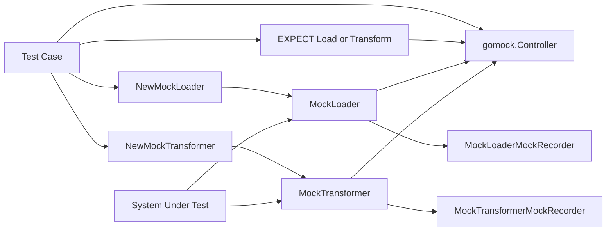

# document_pipeline_mocks 深度解析

`document_pipeline_mocks` 模块（`internal/mock/components/document/document_mock.go`）是文档处理链路在测试环境里的“替身工厂”。它不做真正的文档加载或转换，而是把 `Loader` / `Transformer` 这两个关键接口变成可编排、可断言的 mock 对象。直白一点说：真实链路像一条会访问外部资源、执行解析与清洗的生产线；这个模块提供的是一条“可控仿真线”，让你在单测里验证“有没有按约定调用、参数是否正确、错误分支是否被触发”，而不必真的去读文件或跑复杂转换。

## 这个模块解决了什么问题（Why）

文档管道测试的难点通常不在算法，而在边界。`Loader.Load` 需要 `context.Context`、`Source` 和变参 `LoaderOption`；`Transformer.Transform` 接收文档数组和变参 `TransformerOption`。如果你在测试里直接用真实实现，测试会被外部 I/O、parser 行为、配置细节牵着走，最后很难回答一个核心问题：**被测对象是否正确地“调用了依赖”**。

朴素方案是手写 fake（例如写一个 `fakeLoader` 结构体，手工记录参数）。这种方式初期可行，但很快会遇到三个痛点：第一，变参方法的匹配和调用次数校验很容易写散；第二，不同测试文件会复制相似的“记录/断言”逻辑；第三，接口一旦变化，所有 fake 都要人工修。`document_pipeline_mocks` 的设计洞察是：对于这种“交互契约型”测试，自动生成的 gomock 代码比手写 fake 更稳定、更一致。

## 心智模型：交通警察 + 行车记录仪

理解这个模块可以用一个简单类比：

- `MockLoader` / `MockTransformer` 像路口里的“交通警察”，拦截所有调用；
- `MockLoaderMockRecorder` / `MockTransformerMockRecorder` 像“规则录入台”，提前登记允许通过的车辆与条件；
- `gomock.Controller` 像“行车记录仪 + 执法系统”，在运行时比对实际调用与预期规则。

因此，这个模块的本质不是业务执行器，而是**测试交互验证层**。它的所有方法都围绕两件事：记录期望（`RecordCallWithMethodType`）和回放校验（`Call`）。

## 架构与数据流



从端到端看，一次典型调用流程是这样的：测试先通过 `NewMockLoader(ctrl)` 或 `NewMockTransformer(ctrl)` 创建 mock，再通过 `EXPECT()` 拿到 recorder，声明 `Load(...)` 或 `Transform(...)` 的期望。随后被测代码调用 mock 方法；mock 方法把参数转发给 `m.ctrl.Call(...)`，由 gomock 完成匹配并返回预设值（`[]*schema.Document` 和 `error`）。测试结束时由 controller 统一校验是否满足期望。

这个流里最“热”的路径是两个方法体：`MockLoader.Load` 与 `MockTransformer.Transform`。它们每次都会执行变参拼接和 controller 调用，是所有断言链路的入口。

## 组件深潜

### `MockLoader`

`MockLoader` 是 `Loader` 接口的 mock，实现方法为：

- `Load(ctx context.Context, src document.Source, opts ...document.LoaderOption) ([]*schema.Document, error)`

方法内部机制非常标准化：先调用 `m.ctrl.T.Helper()` 标记辅助函数栈帧，再把 `ctx`、`src` 与变参 `opts` 展开到 `[]interface{}`，最后调用 `m.ctrl.Call(m, "Load", varargs...)` 获取返回值并做类型断言。

关键设计点在“变参展开”：这里不是把 `opts` 作为一个切片参数传下去，而是逐项 append。这保证 gomock 看到的调用形态与真实调用一致，避免匹配歧义。

### `MockLoaderMockRecorder`

`MockLoaderMockRecorder` 负责注册 `MockLoader` 的期望调用。核心方法：

- `Load(ctx, src interface{}, opts ...interface{}) *gomock.Call`

它通过 `RecordCallWithMethodType` 记录期望，并显式传入 `reflect.TypeOf((*MockLoader)(nil).Load)`。这个 `reflect.TypeOf` 用法是一个重要细节：它给 gomock 一个稳定的方法签名锚点，确保参数匹配按正确方法类型执行。

### `MockTransformer`

`MockTransformer` 是 `Transformer` 接口的 mock，实现方法为：

- `Transform(ctx context.Context, src []*schema.Document, opts ...document.TransformerOption) ([]*schema.Document, error)`

内部机制与 `MockLoader.Load` 完全同构：Helper 标记、变参展开、`m.ctrl.Call`、类型断言返回。这种“同构实现”不是重复，而是有意保持测试行为一致性，让贡献者不需要记忆两套语义。

### `MockTransformerMockRecorder`

其职责与 loader recorder 对称，对外暴露：

- `Transform(ctx, src interface{}, opts ...interface{}) *gomock.Call`

同样通过 `RecordCallWithMethodType` 绑定 `reflect.TypeOf((*MockTransformer)(nil).Transform)`。

## 依赖关系与契约边界

从代码可见，这个模块的直接依赖只有四类：`context`、`reflect`、`go.uber.org/mock/gomock`、以及领域契约包 `github.com/cloudwego/eino/components/document` 与 `github.com/cloudwego/eino/schema`。它并不依赖任何具体 loader/transformer 实现，这使它成为纯粹的测试适配层。

在上游关系上，模块树明确它属于 `Mock Utilities -> document_pipeline_mocks`，并且 `components/document/interface.go` 中存在 `//go:generate mockgen ... -source interface.go`。这说明它的“生产者”是接口定义文件，主要“消费者”是测试代码，而非运行时主链路。

数据契约方面，`Load` 依赖 `document.Source`（当前是 `URI string`），`Load` 与 `Transform` 共同依赖 `[]*schema.Document` 作为输入/输出形态，并接受各自的 option 变参（`document.LoaderOption` / `document.TransformerOption`）。如果这些接口签名变化，mock 会随重新生成而变化，相关测试也会同步暴露编译或断言错误。

相关背景建议阅读：

- [knowledge_and_prompt_interfaces](knowledge_and_prompt_interfaces.md)
- [document_loader_transformer_and_parser_options](document_loader_transformer_and_parser_options.md)
- [document_schema](document_schema.md)

## 设计取舍与原因

这个模块最核心的取舍是“生成代码优先于手写可读性”。选择 `mockgen` 带来的收益是契约同步成本极低，接口一变即可重生成并在编译期暴露影响；代价是文件可读性一般，且不适合手工维护。

第二个取舍是“严格签名耦合”。mock 方法完整复制了接口方法签名，包括变参 option。这使测试能精准验证调用契约，但也意味着接口层每次演进都会传导到大量测试。

第三个取舍是“运行时类型断言而非显式错误包装”。生成代码采用 `ret0, _ := ret[0].([]*schema.Document)` 这种模式，类型不匹配时会落零值。它简化了模板复杂度，但对测试作者提出要求：`Return(...)` 必须提供与签名一致的类型。

## 如何使用（示例）

```go
import (
    "context"
    "testing"

    mockdoc "github.com/cloudwego/eino/internal/mock/components/document"
    "github.com/cloudwego/eino/components/document"
    "github.com/cloudwego/eino/schema"
    "go.uber.org/mock/gomock"
)

func TestPipeline(t *testing.T) {
    ctrl := gomock.NewController(t)
    defer ctrl.Finish()

    loader := mockdoc.NewMockLoader(ctrl)
    transformer := mockdoc.NewMockTransformer(ctrl)

    loader.EXPECT().
        Load(gomock.Any(), document.Source{URI: "s3://bucket/a.txt"}, gomock.Any()).
        Return([]*schema.Document{{ID: "1", Content: "raw"}}, nil)

    transformer.EXPECT().
        Transform(gomock.Any(), gomock.Any(), gomock.Any()).
        Return([]*schema.Document{{ID: "1", Content: "chunk"}}, nil)

    // 把 loader / transformer 注入你的被测对象，然后触发执行。
    _ = context.Background()
}
```

这个例子体现了常见模式：先录制期望，再执行 SUT，最后由 `ctrl.Finish()` 自动完成调用验证。

## 新贡献者需要特别注意的点

第一，不要手改这个文件。文件头已经声明 `Code generated by MockGen. DO NOT EDIT.`，任何手工修改都会在下次生成时被覆盖。

第二，变参匹配是最常见坑。`Load` 和 `Transform` 的 recorder 都把变参展开为独立参数；如果你在 `EXPECT()` 里把 option 当作一个整体切片匹配，容易出现“看起来调用了但匹配不上”的问题。

第三，`Return` 类型必须精确对应签名。尤其是第一个返回值必须是 `[]*schema.Document`，否则会因为类型断言失败得到零值，导致测试行为迷惑。

第四，`context.Context` 在这里是契约的一部分。很多测试用 `gomock.Any()` 匹配 context 没问题，但如果你的逻辑依赖 context 传播（如 deadline/cancel），应写更明确的 matcher，而不是完全放开。

第五，这个模块只保证“交互可验证”，不保证“语义正确”。例如它不会替你验证 `LoaderOption` / `TransformerOption` 是否被实现层正确解释；这属于被测实现本身的职责。
