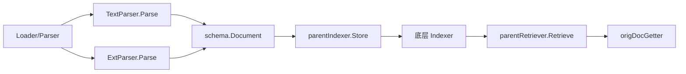

# document_schema 模块深度解析

`document_schema` 的核心只有一个 `schema.Document`，但它在系统里的角色非常关键：它是“文档数据在不同子系统之间流动时的最小公共载体”。你可以把它想象成物流系统里的标准周转箱——无论货物来自网页抓取、文件解析、向量化、检索召回，最终都要装进同一种箱子，运输链路才能稳定协作。这个模块存在的意义，不是提供复杂能力，而是把“文档内容 + 业务附加信息”统一成一个轻量、可扩展、跨组件可传递的数据契约。

---

## 1. 这个模块解决了什么问题？

在一个包含 Loader、Parser、Transformer、Indexer、Retriever 的 RAG/知识处理系统里，最容易失控的不是算法，而是数据形态。如果每一层都定义自己的文档结构，很快会出现这些问题：

- 上游输出字段名和下游输入字段名不一致；
- 某些链路需要评分、向量、检索 DSL，而另一些链路不需要，导致结构分裂；
- 调试时无法快速看懂“这条文档在链路中的状态”。

`schema.Document` 通过非常克制的设计解决了这个问题：

- 固定三个主字段：`ID`、`Content`、`MetaData`；
- 把可选信息全部下沉到 `MetaData map[string]any`；
- 对常见元数据（score、向量、子索引等）提供显式 helper 方法，避免字符串 key 到处散落。

它不是一个“强约束领域模型”，而是一个“跨模块边界的兼容容器”。这也是为什么它很小，却是高频核心类型。

---

## 2. 心智模型：把 `Document` 当成“正文 + 行李舱”

理解这个模块最有效的方式是这个二层模型：

- `Content` 是乘客本人（主语义文本）；
- `MetaData` 是行李舱（检索、索引、溯源、向量等附加负载）；
- `ID` 是行李牌（跨阶段追踪与回溯的锚点）。

而 `WithScore`/`Score`、`WithDenseVector`/`DenseVector` 这类方法，本质上是“给常用行李项发标准标签”，防止每个调用方自己发明 key。

这种模型的优势是：主干语义稳定、扩展信息自由；代价是：类型安全部分转移到运行时（`any` + type assertion）。

---

## 3. 架构位置与数据流



从当前提供的组件代码可以看到，`schema.Document` 在文档链路里是一个典型的 **数据契约层（data contract layer）**，不是 orchestrator，也不是 gateway。它几乎不主动“做流程”，而是被上下游共同依赖：

- 在 `components.document.parser.text_parser.TextParser.Parse` 中，解析器读取 `io.Reader` 后构造 `*schema.Document`，写入 `Content` 和 `MetaData`（如 `MetaKeySource`、`ExtraMeta`）。
- 在 `components.document.parser.ext_parser.ExtParser.Parse` 中，扩展解析器将任务委托给具体 parser，再补充 `ExtraMeta` 到每个 `Document.MetaData`。
- 在 `flow.indexer.parent.parent.parentIndexer.Store` 中，`Transformer` 产出的 `[]*schema.Document` 被重新写入子文档 ID，同时在 `MetaData[parentIDKey]` 保留父文档 ID，最后交给底层 indexer。
- 在 `flow.retriever.parent.parent.parentRetriever.Retrieve` 中，先拿到子文档，再从每个 `subDoc.MetaData[parentIDKey]` 抽取父 ID 去重，然后通过 `origDocGetter` 取回父文档。

这里有个重要设计意图：**父子文档关联不靠单独结构，而靠 `MetaData` 约定键实现跨阶段回传**。这样让 index/retrieve 组件可以松耦合协作。

> 说明：基于当前提供代码，`document_schema` 本身没有显式调用其他模块的方法；它主要通过类型被其他模块使用。

---

## 4. 核心组件深潜：`schema.Document`

## 4.1 结构体本身

```go
type Document struct {
    ID       string         `json:"id"`
    Content  string         `json:"content"`
    MetaData map[string]any `json:"meta_data"`
}
```

`ID` 用于唯一标识和链路追踪。`Content` 是检索、嵌入、生成等任务的主输入。`MetaData` 是开放扩展区，允许不同阶段附加上下文。JSON tag 说明它是可序列化边界对象，不只在内存里用。

### `String() string`

返回 `Content`。这是一种“把文档默认视图定义为正文”的选择：在日志、模板拼接或字符串上下文中，`Document` 默认退化成纯文本。

设计含义是：多数场景关心文本本体，不希望默认输出冗余元数据。

### `WithSubIndexes(indexes []string) *Document` / `SubIndexes() []string`

把 `_sub_indexes` 写入/读出 `MetaData`。注释已明确其目标：给 search engine 提供可用于检索的子索引。

- 参数：`indexes []string`
- 返回：setter 返回 `*Document`（支持链式调用）；getter 返回 `[]string` 或 `nil`
- 副作用：可能初始化 `MetaData`；修改内部 map

### `WithScore(score float64) *Document` / `Score() float64`

用于携带检索相关评分（`_score`）。

- 参数：`score float64`
- getter 默认值：`0`
- 典型用途：召回阶段写入，排序/后处理阶段读取

注意这里默认值是 0，不区分“未设置”和“确实为 0 分”。这是简化接口的代价。

### `WithExtraInfo(extraInfo string) *Document` / `ExtraInfo() string`

将 `_extra_info` 作为字符串附加信息保存。适合存轻量注释、解释说明、补充上下文。

- 参数：`extraInfo string`
- getter 默认值：空字符串 `""`

### `WithDSLInfo(dslInfo map[string]any) *Document` / `DSLInfo() map[string]any`

将 `_dsl` 信息写入元数据，通常用于保存查询表达式或检索策略相关结构。

- 参数：`dslInfo map[string]any`
- getter 默认值：`nil`

### `WithDenseVector(vector []float64) *Document` / `DenseVector() []float64`

存取 `_dense_vector`。用于密集向量（embedding）场景。

- 参数：`vector []float64`
- getter 默认值：`nil`

### `WithSparseVector(sparse map[int]float64) *Document` / `SparseVector() map[int]float64`

存取 `_sparse_vector`，格式为 `map[int]float64`（索引 -> 权重）。用于稀疏表示。

- 参数：`sparse map[int]float64`
- getter 默认值：`nil`

---

## 5. 依赖分析：它调用谁、谁调用它、契约是什么

`document_schema` 模块本身几乎不依赖外部逻辑（除 Go 内建类型），这是刻意保持“基础类型层”纯净的做法。

反过来，多个模块把它当标准输入输出：

- `components.document.parser.interface.Parser` 的 `Parse(...)` 返回 `[]*schema.Document`，这说明解析层与后续链路以 `Document` 为标准契约。
- `components.document.parser.text_parser.TextParser.Parse` 直接构造 `schema.Document`，将来源信息写到 `MetaData`。
- `components.document.parser.ext_parser.ExtParser.Parse` 在 parser 之后统一补齐 `ExtraMeta`，并确保 `MetaData` 非空。
- `flow.indexer.parent.parent.parentIndexer.Store` 读写 `Document.ID` 和 `MetaData[parentIDKey]`，建立 parent/sub 文档关系。
- `flow.retriever.parent.parent.parentRetriever.Retrieve` 依赖上述 `parentIDKey` 约定从子文档回溯父文档。
- 回调输出结构 `components.document.callback_extra_loader.LoaderCallbackOutput` 与 `components.document.callback_extra_transformer.TransformerCallbackOutput` 都把 `[]*schema.Document` 暴露给回调系统。

这条链路体现了一个隐式但关键的契约：**`MetaData` 里的键名与值类型需要跨组件保持一致**。例如 `parentIDKey` 必须对应 `string`，否则 `parentRetriever` 的类型断言会失败并静默跳过该条。

---

## 6. 设计决策与权衡

### 6.1 选择 `map[string]any`：灵活性优先于编译期类型安全

为什么不是给每种 metadata 建字段？因为文档流水线扩展点太多，强 schema 会导致频繁 breaking change。`map[string]any` 把扩展成本降到最低，尤其适合插件式 parser/indexer/retriever 生态。

代价是：

- 类型错误在运行时暴露（getter type assertion 失败后返回默认值）；
- 键名冲突风险需要团队约定治理。

### 6.2 提供 typed helper，而不是仅暴露 map

模块没有停留在“裸 map”，而是为常见键提供 `WithXxx/Xxx`。这在工程上是折中：

- 保留自由扩展；
- 同时给高频字段一层半强约束，减少魔法字符串与重复样板代码。

### 6.3 默认值策略：简洁优先于可观测性

诸如 `Score()` 返回 0、`ExtraInfo()` 返回空字符串、vector getter 返回 `nil`。这样调用方代码更短，但会丢失“缺失 vs 零值”的区分能力。这个选择更偏向易用 API，而不是严格语义表达。

### 6.4 可变对象 + 链式写法：易用优先于并发安全

所有 `WithXxx` 都会原地修改 `MetaData` 并返回同一个 `*Document`，链式调用非常顺手；但这也意味着对象不是不可变结构，在并发共享时需要调用方自行保护。

---

## 7. 使用方式与示例

### 7.1 构建与链式设置

```go
doc := (&schema.Document{
    ID:      "doc-1",
    Content: "CloudWeGo Eino document",
}).
    WithScore(0.91).
    WithExtraInfo("from hybrid retriever").
    WithDenseVector([]float64{0.1, 0.2, 0.3}).
    WithSubIndexes([]string{"knowledge", "faq"})
```

### 7.2 读取时做存在性意识

```go
score := doc.Score() // 可能是未设置时的默认 0
if vec := doc.DenseVector(); vec != nil {
    // 使用 dense vector
}
```

### 7.3 与 parser/indexer 协作时的元数据约定

```go
// 约定 parent_id 为父文档回溯键
if doc.MetaData == nil {
    doc.MetaData = map[string]any{}
}
doc.MetaData["parent_id"] = "orig_doc_123"
```

当你接入 `parentIndexer` / `parentRetriever` 这类组件时，务必保证键名一致且值类型是 `string`。

---

## 8. 新贡献者最容易踩的坑

第一类坑是“类型断言静默失败”。例如把 `_score` 误写成 `int`，`Score()` 会返回 `0`，不会报错；把 `parentIDKey` 对应值写成非字符串，`parentRetriever` 会拿不到父 ID。这类问题症状往往是“结果变少/排序异常”，而不是显式 panic。

第二类坑是“默认值掩盖缺失态”。`0` 分不一定表示低分，可能只是没设置；空字符串不一定是空描述，可能是 metadata 键不存在。若业务必须区分，建议直接检查 `MetaData` 中键是否存在。

第三类坑是“并发修改 map”。`MetaData` 是普通 map，`WithXxx` 会就地写入；如果同一 `*Document` 在多个 goroutine 同时修改，存在数据竞争风险。

第四类坑是“键名治理缺失”。虽然内置常见 key 常量（如 `_score`、`_dense_vector`），但自定义键没有命名空间保护。团队应建立统一命名规范，避免不同模块写入同名异义字段。

---

## 9. 扩展建议

如果你要在这个模块上扩展，优先考虑“新增 helper 方法 + 保持 map 后向兼容”而不是改 `Document` 结构字段。因为它已经是跨模块稳定契约，结构体字段变更会放大耦合影响。

此外，若新增 metadata 项是高频且跨团队共享的，建议仿照现有模式增加：

1. 私有 key 常量；
2. `WithXxx(...) *Document` setter；
3. `Xxx() ...` getter；
4. 明确 getter 默认值语义。

---

## 10. 参考文档

- [message_schema_and_stream_concat](message_schema_and_stream_concat.md)（同属 schema 层的数据契约思路）
- [tool_schema_definition](tool_schema_definition.md)（schema 层如何表达工具调用契约）
- [model_and_tool_interfaces](model_and_tool_interfaces.md)（组件接口层契约）
- [model_options_and_callback_extras](model_options_and_callback_extras.md)（回调 extra 里如何传递 `[]*schema.Document`）
- [Schema Stream](Schema Stream.md)（流式 schema 与数据承载方式）
