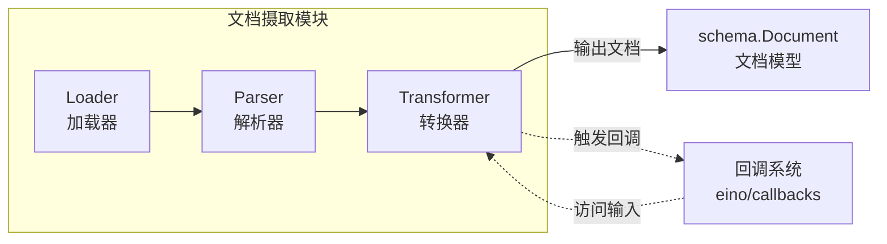

# document_transformer_options_and_callbacks 模块详解

> 目标读者：刚加入团队的高级工程师 — 你能读懂代码，但我需要解释设计意图、架构角色，以及那些非显而易见的选择背后的"为什么"。

## 1. 这个模块解决什么问题？

### 问题背景：文档处理流水线的配置困境

在 Eino 框架中，文档处理是一个**多阶段流水线**：

```
┌─────────────┐     ┌─────────────┐     ┌─────────────┐     ┌─────────────┐
│   Loader    │ ──▶ │   Parser    │ ──▶ │ Transformer │ ──▶ │   Indexer   │
│  (加载器)   │     │  (解析器)   │     │  (转换器)   │     │  (索引器)   │
└─────────────┘     └─────────────┘     └─────────────┘     └─────────────┘
```

每个阶段都有**特定的配置需求**：

- **Loader** 需要知道从哪里加载文档（URI）、使用什么解析器
- **Parser** 需要知道文档类型、元数据等
- **Transformer** 需要知道如何分割、过滤或增强文档

### 核心问题：如何设计一个灵活的选项系统？

想象你在设计一个「通用文档转换器」的 API。问题来了：

1. **所有 Transformer 都需要一些通用配置**（比如并发数、是否保留元数据）
2. **每个具体的 Transformer 实现有自己的特殊配置**（比如 Markdown 转文本可能需要「标题级别映射」，PDF 分割可能需要「每页最大字符数」）
3. **用户调用时应该用统一的方式传递这些选项**

如果没有好的设计，可能会变成这样：

```go
// ❌ 糟糕的设计：所有选项混在一起
type TransformOptions struct {
    // 通用选项
    Concurrency int
    
    // 具体实现选项混在其中
    MaxCharsPerPage int     // PDF 分割用
    HeadingLevels []int     // Markdown 用
    FilterKeywords []string // 过滤用
}
```

这违反了**开闭原则** — 每添加一个新的 Transformer 实现，都要修改这个通用结构。

### 本模块的解决方案：双层选项模式

本模块采用了**「双层选项模式」**，核心思想是：

> **每个 Option 都是一个「可以执行的小函数」，它知道自己要应用到哪里。**

```go
type TransformerOption struct {
    // 通用应用函数：修改公共 Options 结构
    apply func(opts *TransformerOptions)
    
    // 实现专用函数：修改实现方自定义的结构
    implSpecificOptFn any
}
```

这样做到了：
- **通用选项**（如 `WithParserOptions`）通过 `apply` 字段修改公共结构
- **实现专用选项**通过 `implSpecificOptFn` 闭包保存，运行时「按需提取」

这就是 `TransformerOption` 存在的意义。

---

## 2. 核心抽象与心智模型

### 心智模型：选项即「可执行的配置意图」

把这个模式想象成**餐厅服务员记录点餐**：

```go
// 传统方式：服务员拿着一张固定表单
type OrderForm struct {
    MainDish string
    Drink string
    Dessert string
    // 如果有新菜品，就要改表单结构！
}

// 选项模式：服务员接受「任何」操作指令
type OrderOption struct {
    apply func(order *Order)  // 「来一份宫保鸡丁」
}

// 顾客可以自由组合：
opt1 := WithMainDish("宫保鸡丁")
opt2 := WithDrink("可乐")
opt3 := WithSpecialRequest("不要香菜")  // 新需求不需要改表单结构！
```

每个 `TransformerOption` 就是一条**配置意图**，它知道要把自己应用到哪个结构上去。

### 回调的心智模型：生命周期钩子

`TransformerCallbackInput` 和 `TransformerCallbackOutput` 是**生命周期钩子的payload**：

```
┌─────────────────────────────────────────────────────────────┐
│                    Transformer 执行流程                      │
├─────────────────────────────────────────────────────────────┤
│                                                              │
│  1. OnStart (开始)                                          │
│     └── 传入 TransformerCallbackInput                      │
│         - Input: 待处理的文档列表                             │
│         - Extra: 额外上下文信息                              │
│                                                              │
│  2. Transform (核心处理)                                     │
│     └── 业务逻辑：分割/过滤/增强...                          │
│                                                              │
│  3. OnEnd (结束)                                            │
│     └── 传入 TransformerCallbackOutput                     │
│         - Output: 处理后的文档列表                           │
│         - Extra: 额外上下文信息                              │
│                                                              │
└─────────────────────────────────────────────────────────────┘
```

这类似于 Web 框架的「中间件」— 你可以在 Transform 前后插入自定义逻辑，比如：
- 记录日志
- 统计处理耗时
- 做数据脱敏
- 触发下游通知

---

## 3. 数据流与依赖关系

### 模块在文档流水线中的位置



### 关键依赖链

1. **TransformerOption** 被 [document_loader_contracts_and_options](document_loader_contracts_and_options.md) 中的 Loader 使用（通过 `LoaderOptions.ParserOptions`）
2. **TransformerCallbackInput/Output** 集成到 [callback_extra_transformer](callback_extra_transformer.md)（callback system）系统中
3. 两者都依赖于 [schema.Document](schema_document.md) 作为核心数据类型

### 核心组件的协作方式

```go
// 用户调用 Transformer.Transform 时：
func (t *MyTransformer) Transform(ctx context.Context, docs []*schema.Document, opts ...TransformerOption) ([]*schema.Document, error) {
    
    // 1. 提取公共选项（如 ParserOptions）
    commonOpts := GetLoaderCommonOptions(&LoaderOptions{}, opts...)
    
    // 2. 提取实现专用选项
    myOpts := GetTransformerImplSpecificOptions(&MyTransformerOptions{
        MaxLength: 1000,  // 默认值
    }, opts...)
    
    // 3. 使用提取的选项进行转换
    return t.doTransform(ctx, docs, commonOpts, myOpts)
}
```

---

## 4. 设计决策与权衡分析

### 决策一：为什么用 `any` 而不是泛型接口？

```go
type TransformerOption struct {
    implSpecificOptFn any  // 为什么不用 interface{}?
}
```

**选择的理由**：
- 使用 `any`（Go 1.18+ 的 `interface{}` 别名）可以支持**任意类型的闭包函数**
- 避免了泛型接口的编译时复杂性

**权衡**：
- 运行时需要类型断言：(`opt.implSpecificOptFn.(func(*T))`)
- 如果类型不匹配，会静默跳过（这是设计意图 — 允许未知选项被忽略）

### 决策二：为什么回调支持两种输入格式？

```go
// 支持两种格式：
// 1. 结构化类型
case *TransformerCallbackInput:
    return t
// 2. 简单文档列表
case []*schema.Document:
    return &TransformerCallbackInput{Input: t}
```

**选择的理由**：
- **向后兼容**：旧的回调处理程序可能直接接收 `[]*schema.Document`
- **简化简单场景**：有些场景不需要 Extra 信息，直接传文档列表更直观
- **灵活性**：调用方可以根据场景选择合适的格式

**权衡**：
- 类型分支增加了代码复杂度
- 传入错误类型时返回 `nil`，静默失败

### 决策三：为什么 `Extra` 字段设计成 `map[string]any`？

```go
type TransformerCallbackInput struct {
    Input []*schema.Document
    Extra map[string]any  // 为什么不用强类型结构体？
}
```

**选择的理由**：
- **解耦**：避免回调系统与具体业务逻辑强耦合
- **扩展性**：允许在任何阶段注入自定义数据（比如 trace_id、user_id）
- **跨组件通信**：下游回调可以读取上游传递的上下文

**权衡**：
- 失去了编译时类型检查
- 需要约定常见的 key 避免冲突

### 决策四：为什么不使用依赖注入而是闭包？

**替代方案考虑过**：
```go
// 方案 B：依赖注入
type TransformerOptions struct {
    Config *MyConfig
    Dependencies *Deps
}

// 方案 A（当前）：闭包
func WithMyConfig(v string) TransformerOption {
    return WrapTransformerImplSpecificOptFn(func(o *MyConfig) {
        o.value = v
    })
}
```

**选择闭包的理由**：
1. **无副作用构造**：选项可以在任何地方创建，不依赖外部服务的初始化
2. **延迟求值**：配置只在 Transform 时才被应用
3. **组合自由**：可以自由混合不同实现提供的选项函数

---

## 5. 新贡献者需要注意的事项

### 5.1 隐式契约：选项的顺序与覆盖

**注意事项**：
- `GetTransformerImplSpecificOptions` 按**顺序**遍历选项列表
- 后面的选项会**覆盖**前面的同名字段

```go
// 假设有两个 WithMaxLength 选项：
opt1 := WithMaxLength(100)
opt2 := WithMaxLength(200)

opts := GetTransformerImplSpecificOptions(&MyOptions{}, opt1, opt2)
// 结果：MaxLength = 200（opt2 覆盖了 opt1）
```

### 5.2 类型断言的静默失败

**陷阱代码**：
```go
// ❌ 如果传入错误类型的选项，不会报错，会静默跳过
type WrongOptions struct {
    Foo string
}
opt := WrapTransformerImplSpecificOptFn(func(o *WrongOptions) {
    o.Foo = "bar"
})

// 提取时会因为类型不匹配而跳过
result := GetTransformerImplSpecificOptions(&MyOptions{}, opt)
// result 不会包含 Foo 的值，但也不会报错！
```

**正确做法**：
- 单元测试覆盖选项提取逻辑
- 使用代码生成确保类型安全（当前通过 `//go:generate` 生成 mock）

### 5.3 回调转换函数的边界情况

**边界情况 1：nil 输入**
```go
ConvTransformerCallbackInput(nil)  // 返回 nil
```

**边界情况 2：未知类型**
```go
ConvTransformerCallbackInput("unknown")  // 返回 nil
```

**建议**：在回调处理中始终检查返回值是否为 nil：
```go
func handleTransformerCallback(input callbacks.CallbackInput) {
    ti := ConvTransformerCallbackInput(input)
    if ti == nil {
        return // 忽略未知类型的回调
    }
    // 处理 ti.Input...
}
```

### 5.4 与其他模块的一致性模式

本模块采用的模式与以下模块**完全一致**：

| 模块 | Option 类型 | GetCommonOptions | GetImplSpecificOptions |
|------|-------------|------------------|------------------------|
| document (Loader) | `LoaderOption` | ✅ | ✅ |
| document (Transformer) | `TransformerOption` | ❌ (无公共结构) | ✅ |
| document (Parser) | `parser.Option` | ✅ | ✅ |
| retriever | `retriever.Option` | ✅ | ✅ |

**如果你是新贡献者**，要实现一个新的组件，请参考这个模式。

---

## 6. API 参考

### TransformerOption 相关

#### `WrapTransformerImplSpecificOptFn[T any](optFn func(*T)) TransformerOption`

将实现方自定义的选项函数包装成统一的 `TransformerOption` 类型。

**示例**：
```go
type MyTransformerOptions struct {
    MaxLength int
    PreserveMeta bool
}

func WithMaxLength(n int) TransformerOption {
    return WrapTransformerImplSpecificOptFn(func(o *MyTransformerOptions) {
        o.MaxLength = n
    })
}
```

#### `GetTransformerImplSpecificOptions[T any](base *T, opts ...TransformerOption) *T`

从选项列表中提取实现方自定义的选项结构。

**参数**：
- `base`: 基础选项，提供默认值；允许为 nil（会创建新的零值）
- `opts`: 可变数量的 TransformerOption

**返回值**：
- 填充后的选项结构指针

---

### 回调相关

#### `TransformerCallbackInput`

| 字段 | 类型 | 说明 |
|------|------|------|
| `Input` | `[]*schema.Document` | 待处理的文档列表 |
| `Extra` | `map[string]any` | 额外上下文信息 |

#### `TransformerCallbackOutput`

| 字段 | 类型 | 说明 |
|------|------|------|
| `Output` | `[]*schema.Document` | 处理后的文档列表 |
| `Extra` | `map[string]any` | 额外上下文信息 |

#### `ConvTransformerCallbackInput(src callbacks.CallbackInput) *TransformerCallbackInput`

将通用回调输入转换为 Transformer 专用的回调输入。

**支持的源类型**：
- `*TransformerCallbackInput` — 直接返回
- `[]*schema.Document` — 包装成 Input 字段
- 其他 — 返回 nil

---

## 7. 相关文档

- [document_loader_contracts_and_options](document_loader_contracts_and_options.md) — Loader 选项系统
- [parser_contracts_and_option_types](parser_contracts_and_option_types.md) — Parser 选项系统
- [schema_document](schema_document.md) — Document 数据模型
- [callbacks_handler_builder](callbacks_handler_builder.md) — 回调处理构建器