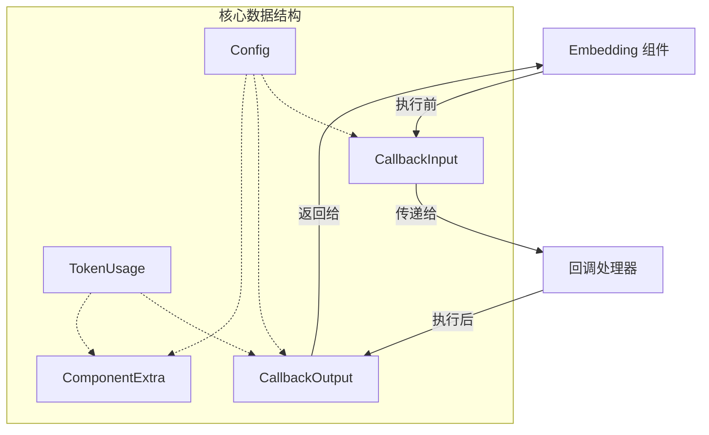

# Embedding Callback Extra 模块深度解析
==============================

## 1. 问题背景与模块存在意义

在 AI 应用开发中，Embedding（嵌入）是连接文本与向量空间的桥梁，但 Embedding 组件的执行过程往往是一个"黑盒"。开发者需要知道：**哪些文本被嵌入了？用了什么模型？消耗了多少 token？** 这些信息对于调试、监控、成本核算至关重要。

`embedding_callback_extra` 模块就是为了解决这个问题而存在的。它定义了一套标准化的数据结构，用于在 Embedding 组件执行前后传递上下文信息，让 Embedding 组件的执行过程变得透明可观测。

想象一下，如果你在寄快递时，快递单上会记录：寄件人、收件人、物品信息、运费等。这个模块就像是 Embedding 组件的"快递单"系统，它记录了 Embedding 执行的完整上下文。

## 2. 架构设计与核心概念

### 2.1 核心架构



### 2.2 核心概念

1. **CallbackInput**：Embedding 执行前的输入上下文
   - 包含要嵌入的文本
   - 配置信息
   - 额外的自定义数据

2. **CallbackOutput**：Embedding 执行后的输出上下文
   - 生成的嵌入向量
   - 配置信息
   - Token 使用情况
   - 额外的自定义数据

3. **Config**：Embedding 组件的配置信息
   - 模型名称
   - 编码格式

4. **TokenUsage**：Token 使用统计
   - PromptTokens：输入文本的 Token 数
   - CompletionTokens：输出的 Token 数（通常为 0，因为 Embedding 是单向的）
   - TotalTokens：总 Token 数

5. **ComponentExtra**：组件的额外信息，组合了 Config 和 TokenUsage

## 3. 数据结构详解

### 3.1 TokenUsage

```go
type TokenUsage struct {
    PromptTokens     int
    CompletionTokens int
    TotalTokens      int
}
```

**设计意图**：
- 这是 Embedding 组件的"计费器"。虽然 Embedding 不像 ChatModel 那样有明确的输入输出对话，但 Token 使用量仍然是成本核算和性能监控的关键指标。

**注意点**：
- `CompletionTokens` 字段在这里可能会让人困惑，因为 Embedding 通常只有输入，没有"完成"输出。这个字段的存在是为了与系统中其他组件（如 ChatModel）的 TokenUsage 结构保持一致，便于统一处理。

### 3.2 Config

```go
type Config struct {
    Model          string
    EncodingFormat string
}
```

**设计意图**：
- 记录 Embedding 组件的配置信息，让开发者知道是用什么模型和什么格式生成的嵌入向量。

**设计权衡**：
- 只保留了最核心的配置项，而不是所有可能的配置。这样既保证了通用性，又避免了结构过于复杂。

### 3.3 ComponentExtra

```go
type ComponentExtra struct {
    Config     *Config
    TokenUsage *TokenUsage
}
```

**设计意图**：
- 将 Config 和 TokenUsage 组合在一起，作为 Embedding 组件的"元数据"。这是一个便捷的组合，方便在需要同时传递这两个信息的场景。

### 3.4 CallbackInput

```go
type CallbackInput struct {
    Texts  []string
    Config *Config
    Extra  map[string]any
}
```

**设计意图**：
- 这是 Embedding 执行前的"快照"。它记录了：
  - `Texts`：要嵌入的文本列表
  - `Config`：使用的配置
  - `Extra`：自定义的额外信息，提供了扩展性

### 3.5 CallbackOutput

```go
type CallbackOutput struct {
    Embeddings  [][]float64
    Config      *Config
    TokenUsage  *TokenUsage
    Extra       map[string]any
}
```

**设计意图**：
- 这是 Embedding 执行后的"结果包"。它记录了：
  - `Embeddings`：生成的嵌入向量
  - `Config`：实际使用的配置（可能与输入的 Config 可能不同）
  - `TokenUsage`：Token 使用情况
  - `Extra`：自定义的额外信息

## 4. 类型转换函数

### 4.1 ConvCallbackInput

```go
func ConvCallbackInput(src callbacks.CallbackInput) *CallbackInput {
    switch t := src.(type) {
    case *CallbackInput:
        return t
    case []string:
        return &CallbackInput{
            Texts: t,
        }
    default:
        return nil
    }
}
```

**设计意图**：
- 这是一个"适配器"函数，将通用的 `callbacks.CallbackInput` 类型转换为 Embedding 专用的 `CallbackInput` 类型。

**设计权衡**：
- 支持直接从 `[]string` 类型的转换，这是为了兼容简单的使用场景，让回调系统更加灵活。

### 4.2 ConvCallbackOutput

```go
func ConvCallbackOutput(src callbacks.CallbackOutput) *CallbackOutput {
    switch t := src.(type) {
    case *CallbackOutput:
        return t
    case [][]float64:
        return &CallbackOutput{
            Embeddings: t,
        }
    default:
        return nil
    }
}
```

**设计意图**：
- 类似地，将通用的 `callbacks.CallbackOutput` 类型转换为 Embedding 专用的 `CallbackOutput` 类型。

**设计权衡**：
- 支持直接从 `[][]float64` 类型的转换，这同样是为了兼容简单的使用场景。

## 5. 数据流程与依赖关系

### 5.1 数据流程

```
Embedding 组件执行流程：
1. 准备输入文本
2. 创建 CallbackInput，包含 Texts、Config、Extra
3. 触发回调前，传递 CallbackInput
4. 执行 Embedding 计算
5. 创建 CallbackOutput，包含 Embeddings、Config、TokenUsage、Extra
6. 触发回调后，传递 CallbackOutput
7. 返回结果
```

### 5.2 依赖关系

- **被谁调用**：
  - [EmbeddingCallbackHandler](callbacks_system.md#embeddingcallbackhandler
  - [Embedder](component_interfaces.md#embedder)

- **调用谁**：
  - [callbacks](callbacks_system.md)

## 6. 设计权衡与决策

### 6.1 通用性与特殊性的平衡

这个模块的设计体现了**在通用性和特殊性之间的平衡：

- **通用性**：使用 `Extra` 字段是一个 `map[string]any` 类型，允许传递任何自定义信息
- **特殊性**：定义了明确的核心字段，保证了基本信息的标准化

这种设计让模块既可以满足基本使用，又可以灵活扩展。

### 6.2 指针字段的使用

所有的复杂字段（Config、TokenUsage）都使用了指针类型：

- **优点**：可以表示"不存在"的状态（nil），节省内存
- **缺点**：需要注意 nil 检查，否则可能会 panic

### 6.3 与其他模块的一致性

这个模块的设计与 [model_callback_extra](model_callback_extra.md) 保持了一致：

- 都有 TokenUsage 结构
- 都有 Config 结构
- 都有 CallbackInput 和 CallbackOutput
- 都有类型转换函数

这种一致性让开发者在使用不同组件的回调时，有类似的体验，降低了学习成本。

## 7. 使用指南与示例

### 7.1 基本使用

```go
// 创建 CallbackInput
input := &embedding.CallbackInput{
    Texts: []string{"hello", "world"},
    Config: &embedding.Config{
        Model: "text-embedding-ada-002",
    },
    Extra: map[string]any{
        "user_id": "123",
    },
}

// 创建 CallbackOutput
output := &embedding.CallbackOutput{
    Embeddings: [][]float64{{0.1, 0.2}, {0.3, 0.4}},
    Config: &embedding.Config{
        Model: "text-embedding-ada-002",
    },
    TokenUsage: &embedding.TokenUsage{
        PromptTokens: 2,
        TotalTokens: 2,
    },
}
```

### 7.2 在回调处理器中使用

```go
func MyEmbeddingCallbackHandler(ctx context.Context, input *embedding.CallbackInput, output *embedding.CallbackOutput, err error) {
    if err != nil {
        log.Printf("Embedding error: %v", err)
        return
    }
    
    log.Printf("Embedding done: model=%s, tokens=%d", output.Config.Model, output.TokenUsage.TotalTokens)
}
```

## 8. 注意事项与陷阱

### 8.1 nil 指针检查

由于 Config 和 TokenUsage 字段都是指针类型，使用时需要注意 nil 检查：

```go
// 错误示例
model := output.Config.Model // 如果 Config 是 nil，会 panic

// 正确示例
if output.Config != nil {
    model := output.Config.Model
}
```

### 8.2 类型转换的注意事项

`ConvCallbackInput` 和 `ConvCallbackOutput` 函数可能返回 nil，使用时需要检查：

```go
input := embedding.ConvCallbackInput(src)
if input == nil {
    // 处理转换失败的情况
}
```

### 8.3 Extra 字段的使用

Extra 字段是一个 `map[string]any` 类型，使用时需要注意类型安全：

```go
// 错误示例
userID := input.Extra["user_id"].(string) // 如果类型不对，会 panic

// 正确示例
userID, ok := input.Extra["user_id"].(string)
if !ok {
    // 处理类型不对的情况
}
```

## 9. 总结

`embedding_callback_extra` 模块是 Embedding 组件的"快递单系统，它让 Embedding 组件的执行过程变得透明可观测。它定义了一套标准化的数据结构，用于在 Embedding 执行前后传递上下文信息。

这个模块的设计体现了通用性与特殊性的平衡，既保证了基本信息的标准化，又提供了足够的灵活性。它与系统中其他组件的回调模块保持了一致的设计风格，降低了学习成本。

使用这个模块时，需要注意 nil 指针检查、类型转换的注意事项和 Extra 字段的使用。
