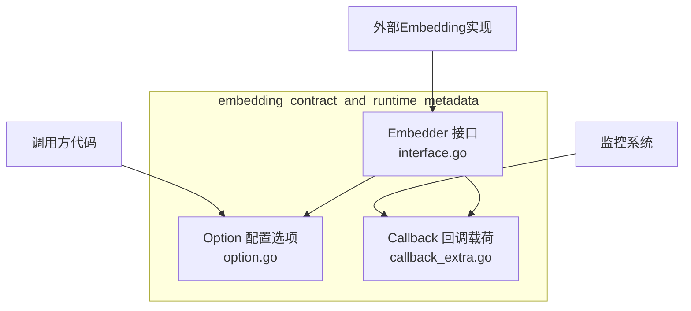
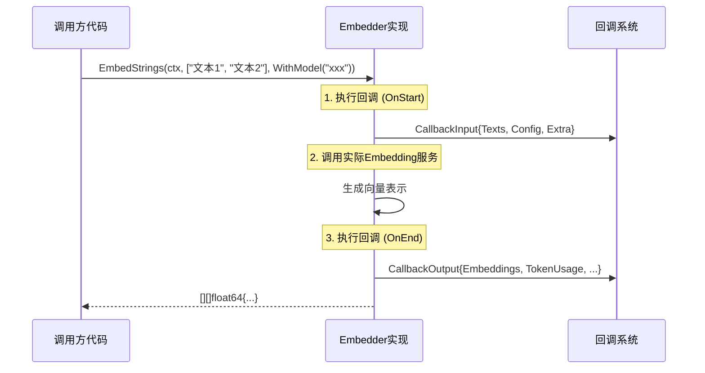

# embedding_contract_and_runtime_metadata

## 模块概述

`embedding_contract_and_runtime_metadata` 模块是 Eino 框架中定义 Embedding（嵌入）组件契约的核心模块。它为所有Embedding实现提供了统一的接口规范、配置选项模式以及回调监控数据结构。

**为什么需要这个模块？** 在 RAG（检索增强生成）系统中，文本需要被转换为向量表示才能进行语义检索。这个模块定义了"什么是Embedding组件"——就像定义了"什么是发动机"一样，使得不同的Embedding provider（如 OpenAI、Azure OpenAI、本地模型等）可以遵循同一套契约，实现可插拔。

## 架构概览



**核心组件职责：**

| 组件 | 文件 | 职责 |
|------|------|------|
| `Embedder` | `interface.go` | 定义Embedding组件的核心契约——将字符串列表转换为向量列表 |
| `Option/Options` | `option.go` | 函数式选项模式，封装Embedding调用的配置参数 |
| Callback 数据结构 | `callback_extra.go` | 定义回调监控的输入输出载荷，支持观测性集成 |

## 核心设计决策

### 1. 统一的组件接口模式

Embedding模块遵循 Eino 框架的**统一组件接口模式**。与 `model`、`retriever`、`indexer` 等模块一样，Embedding定义了清晰的 `Embedder` 接口：

```go
type Embedder interface {
    EmbedStrings(ctx context.Context, texts []string, opts ...Option) ([][]float64, error)
}
```

**为什么这样设计？**
- **可替换性**：只要实现了这个接口，任何Embedding provider都可以无缝切换
- **组合性**：框架的其他部分（如 retriever、indexer）只需要依赖这个接口，不需要知道具体实现
- **对标业界**：这与 LangChain 的 [Embeddings](https://python.langchain.com/docs/modules/data_connection/text_embedding/) 接口设计理念一致，降低学习成本

### 2. 函数式选项模式（Functional Options）

模块采用 Go 社区常见的函数式选项模式来配置Embedding调用：

```go
// 客户端代码
embeddings, err := embedder.EmbedStrings(ctx, texts, embedding.WithModel("text-embedding-ada-002"))
```

**为什么不用传统的构造函数参数？**
- **向后兼容**：新增配置选项无需修改现有函数签名，不会破坏已有代码
- **可选参数**：并非所有调用都需要指定模型，选项模式允许全部省略
- **实现灵活性**：`implSpecificOptFn` 字段允许各实现添加自己的特定选项，而不影响公共接口

### 3. 回调监控的数据契约

模块定义了完整的回调载荷结构，使得监控系统可以统一处理Embedding调用：

```go
// CallbackInput: 调用前捕获
type CallbackInput struct {
    Texts []string      // 待嵌入的文本
    Config *Config      // 配置信息
    Extra map[string]any // 扩展字段
}

// CallbackOutput: 调用后捕获
type CallbackOutput struct {
    Embeddings [][]float64  // 生成的向量
    Config *Config
    TokenUsage *TokenUsage  // Token消耗统计
    Extra map[string]any
}
```

**设计权衡**：
- **优点**：统一的数据格式使得构建通用的监控、追踪、日志系统成为可能
- **灵活性**：`Extra` 字段允许各实现添加自定义数据，避免频繁修改公共结构
- **类型安全**：`ConvCallbackInput` 和 `ConvCallbackOutput` 提供了类型转换辅助函数

### 4. 与其他组件的一致性

Embedding模块与框架中其他组件（model、retriever、indexer等）保持接口风格一致：

```go
// Model 组件
type ChatModel interface {
    Generate(ctx context.Context, messages []*schema.Message, opts ...Option) (*schema.Message, error)
}

// Retriever 组件  
type Retriever interface {
    Retrieve(ctx context.Context, query string, opts ...Option) ([]*schema.Document, error)
}

// Embedding 组件
type Embedder interface {
    EmbedStrings(ctx context.Context, texts []string, opts ...Option) ([][]float64, error)
}
```

**为什么保持一致？**
- 降低开发者学习成本——了解一个组件就会使用其他所有组件
- 统一的设计使得构建通用的图（Graph）执行引擎成为可能

## 数据流

### 典型调用路径



### 关键转换函数

模块提供了两个关键的类型转换函数，用于将通用回调类型转换为具体类型：

```go
// 在 callback_extra.go 中
func ConvCallbackInput(src callbacks.CallbackInput) *CallbackInput
func ConvCallbackOutput(src callbacks.CallbackOutput) *CallbackOutput
```

这使得回调处理器可以统一处理不同组件的回调：

```go
handler := func(ctx context.Context, info *callbacks.RunInfo, in, out any) {
    // 自动识别是否为 embedding 回调
    if emInput := embedding.ConvCallbackInput(in); emInput != nil {
        // 处理 embedding 输入
    }
}
```

## 模块依赖关系

### 上游依赖

| 模块 | 依赖关系 | 说明 |
|------|----------|------|
| `callbacks` | 接口依赖 | 提供回调机制的基础接口 `callbacks.CallbackInput` / `callbacks.CallbackOutput` |

### 下游使用者

| 使用场景 | 说明 |
|----------|------|
| `flow/retriever` | 检索时将查询文本转换为向量 |
| `flow/indexer` | 索引文档时将文本转换为向量存储 |
| `compose/graph` | 图执行时调用embedding组件 |
| 用户自定义实现 | 实现 `Embedder` 接口提供自定义embedding服务 |

## 使用指南

### 实现自定义 Embedder

```go
import "github.com/cloudwego/eino/components/embedding"

// 实现 Embedder 接口
type MyEmbedder struct {
    apiKey string
    model  string
}

func (e *MyEmbedder) EmbedStrings(ctx context.Context, texts []string, opts ...embedding.Option) ([][]float64, error) {
    // 获取配置
    conf := embedding.GetCommonOptions(nil, opts...)
    
    // 调用实际的embedding服务
    vectors := make([][]float64, len(texts))
    for i, text := range texts {
        vectors[i] = e.embed(ctx, text, conf.Model)
    }
    return vectors, nil
}
```

### 配置选项

```go
// 使用内置选项
opts := []embedding.Option{
    embedding.WithModel("text-embedding-3-small"),
}

// 提取配置
conf := embedding.GetCommonOptions(&embedding.Options{
    Model: func() *string { s := "default"; return &s }(),
}, opts...)
```

### 集成回调监控

```go
callbacks.AppendGlobalHandlers([]callbacks.Handler{
    callbacks.HandlerHelper.New(
        callbacks.WithOnStart(func(ctx context.Context, info *callbacks.RunInfo, in callbacks.CallbackInput) {
            if emIn := embedding.ConvCallbackInput(in); emIn != nil {
                log.Printf("embedding start: %d texts, model=%s", len(emIn.Texts), emIn.Config.Model)
            }
        }),
        callbacks.WithOnEnd(func(ctx context.Context, info *callbacks.RunInfo, out callbacks.CallbackOutput) {
            if emOut := embedding.ConvCallbackOutput(out); emOut != nil {
                log.Printf("embedding done: %d vectors, tokens=%d", 
                    len(emOut.Embeddings), emOut.TokenUsage.TotalTokens)
            }
        }),
    ),
})
```

## 注意事项与陷阱

### 1. 空指针风险

`Options` 结构体中的字段使用指针类型（`*string`），这允许区分"未设置"和"设置为空"：

```go
// 注意：直接访问 opts.Model 而不检查 nil 可能导致 panic
model := *opts.Model  // 如果 Model 为 nil，这里会 panic

// 正确做法
if opts.Model != nil {
    model = *opts.Model
}
```

### 2. 回调处理的类型安全

回调处理器需要使用 `ConvCallbackInput` / `ConvCallbackOutput` 进行类型转换，因为回调系统传递的是 `any` 类型：

```go
// 错误：直接类型断言会失败
in := callbacks.CallbackInput  // 这是基础类型
cbInput := in.(*embedding.CallbackInput)  // 编译错误或运行时 panic

// 正确：使用转换函数
cbInput := embedding.ConvCallbackInput(in)
if cbInput == nil {
    return // 不是 embedding 回调
}
```

### 3. TokenUsage 可能为 nil

并非所有Embedding provider都返回token使用统计，回调中需要处理这种情况：

```go
func handleEmbeddingOutput(out *embedding.CallbackOutput) {
    if out.TokenUsage != nil {
        fmt.Printf("Token usage: %d", out.TokenUsage.TotalTokens)
    } else {
        fmt.Println("Token usage not available")
    }
}
```

### 4. 实现特定的选项函数

`WrapImplSpecificOptFn` 允许Embedding实现添加自己的选项，但调用方需要注意：

```go
// 这是一个实现特定的选项，通用代码无法理解
implOpt := embedding.WrapImplSpecificOptFn[MyCustomOptions](func(o *MyCustomOptions) {
    o.CustomField = "value"
})
```

## 相关模块

- [components-core-document-ingestion-and-parsing-parser_implementations](components-core-document-ingestion-and-parsing-parser_implementations.md) - 文档解析组件（同一父模块的兄弟组件）
- [model_interfaces_and_options](model_interfaces_and_options.md) - 模型组件接口定义（参考组件模式）
- [chatmodel_retry_runtime](chatmodel_retry_runtime.md) - 运行时重试机制（参考组件运行时模式）