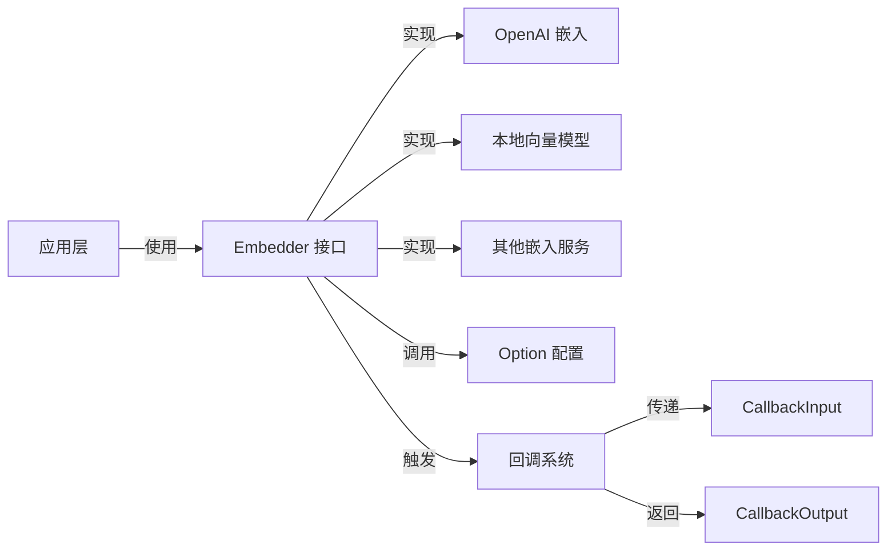

# Embedding Interfaces 模块技术深度分析

## 1. 概述

`embedding_interfaces` 模块是整个系统中负责将文本转换为向量表示的核心抽象层。在构建基于大语言模型和向量检索的应用时，文本向量嵌入是一个基础而关键的环节——它把非结构化的文本转换为计算机可以进行相似度计算的多维向量空间。这个模块解决的核心问题是：**如何为不同的嵌入服务提供商（如 OpenAI、Cohere、本地向量模型等）提供一个统一、可扩展的接口，同时保持足够的灵活性来支持不同实现的特定功能**。

想象一下，这个模块就像是一个通用插座——无论你家里使用的是哪个品牌的电器，只要插头符合标准，就能通电。这里的 "标准" 就是 `Embedder` 接口，而不同的 "电器" 则是各种具体的嵌入服务实现。

## 2. 核心抽象与架构

### 2.1 架构图



### 2.2 核心组件角色

这个模块的设计极其简洁但富有表现力，主要包含以下几个关键组件：

- **`Embedder` 接口**：整个模块的核心，定义了将文本转换为向量的契约。它只有一个方法 `EmbedStrings`，接收上下文、文本列表和可选配置，返回二维浮点数数组（向量列表）和可能的错误。
  
- **`Option` 和 `Options`**：提供了灵活的配置机制，允许调用者以函数式选项模式传递额外参数，例如指定要使用的模型。

- **回调相关类型**：包括 `CallbackInput`、`CallbackOutput`、`TokenUsage` 等，这些类型与系统的回调机制集成，用于在嵌入操作前后传递信息、记录使用情况等。

### 2.3 数据流程

当应用程序需要将文本转换为向量时，数据流程如下：

1. 应用层创建 `[]string` 文本数组
2. （可选）通过 `Option` 构造配置，例如指定模型
3. 调用 `Embedder.EmbedStrings(ctx, texts, opts...)`
4. 实现层执行实际的嵌入操作
5. 回调系统被触发，传递 `CallbackInput` 并接收 `CallbackOutput`
6. 返回 `[][]float64` 向量数组或错误

## 3. 组件深度解析

### 3.1 Embedder 接口

```go
type Embedder interface {
    EmbedStrings(ctx context.Context, texts []string, opts ...Option) ([][]float64, error)
}
```

这个接口是整个模块的灵魂。让我们深入分析它的设计：

**设计意图**：
- **极简主义**：只定义了一个方法，这体现了"接口应该小而专注"的设计原则
- **批量处理**：接收 `[]string` 而非单个字符串，允许实现进行批量优化，减少网络开销
- **上下文感知**：接收 `context.Context`，支持超时控制、取消和请求链路追踪
- **灵活配置**：使用可变参数 `opts ...Option`，在保持向后兼容性的同时支持扩展
- **明确返回值**：返回 `[][]float64`，每个输入字符串对应一个 `[]float64` 向量

**为什么这样设计？**
- 不返回单个向量而是批量返回：因为大多数嵌入服务都支持批量处理，这样设计可以避免多次网络往返，提高性能
- 不指定向量维度：不同模型生成的向量维度不同，让调用者根据使用的模型来处理维度问题
- 使用 `float64` 而非 `float32`：在 Go 中，`float64` 是更通用的浮点数类型，虽然会占用更多内存，但提供了更高的精度，且与大多数科学计算库兼容

### 3.2 Option 和 Options 配置

**Option**：
```go
type Option struct {
    apply func(opts *Options)
    implSpecificOptFn any
}
```

**Options**：
```go
type Options struct {
    // Model is the model name for the embedding.
    Model *string
}
```

这是函数式选项模式的实现。这种模式的优点是：
- **向后兼容**：添加新选项不会破坏现有代码
- **可读性好**：调用者可以清晰地看到正在设置哪些选项
- **可选性**：所有配置都是可选的，有合理的默认值

### 3.3 回调系统集成

回调相关的类型（`CallbackInput`、`CallbackOutput` 等）展示了这个模块如何与系统的其他部分协作：

- **CallbackInput**：包含要嵌入的文本、配置和额外信息，在嵌入操作前传递给回调
- **CallbackOutput**：包含生成的向量、配置、Token 使用情况和额外信息，在嵌入操作后返回
- **TokenUsage**：跟踪提示 Token、完成 Token 和总 Token 数，这对于成本计算和监控非常重要

这种设计使得系统可以在不修改 `Embedder` 接口的情况下，添加监控、日志记录、成本追踪等横切关注点。

## 4. 设计决策与权衡

### 4.1 简洁接口 vs 丰富功能

**决策**：选择了极其简洁的 `Embedder` 接口，只有一个方法。

**权衡**：
- ✅ **优点**：易于实现、测试和维护；降低了实现者的负担；接口稳定，不易变化
- ❌ **缺点**：某些高级功能（如异步嵌入、流式嵌入）无法直接通过接口表达

**为什么这样选择**：
团队认为，对于绝大多数使用场景，同步批量嵌入已经足够。高级功能可以通过特定实现的额外方法提供，或者在更高层次的抽象中处理。这种设计遵循了"最小可行接口"的原则。

### 4.2 二维浮点数数组作为返回值

**决策**：使用 `[][]float64` 作为向量的返回类型。

**权衡**：
- ✅ **优点**：标准、通用，与所有 Go 科学计算库兼容；清晰表达了"向量列表"的概念
- ❌ **缺点**：内存占用较大（特别是对于大批量和高维向量）；没有类型安全保证维度一致性

**为什么这样选择**：
通用性和与生态系统的兼容性被放在优先位置。内存问题可以通过调用者的批处理策略来缓解，而维度一致性可以在具体实现中通过文档和测试来保证。

### 4.3 函数式选项模式

**决策**：使用函数式选项模式而非配置结构体。

**权衡**：
- ✅ **优点**：向后兼容性好；API 优雅；可选参数清晰
- ❌ **缺点**：对于不熟悉该模式的开发者来说，可能会有学习曲线；选项的发现性不如结构体字段直观

**为什么这样选择**：
这是整个代码库的一致风格（其他组件如模型、工具等也使用相同模式），保持一致性比为这个模块单独选择不同模式更重要。

## 5. 使用指南与示例

### 5.1 基本使用

```go
// 创建一个 Embedder 实现（例如 OpenAIEmbedder）
var embedder Embedder = NewOpenAIEmbedder(apiKey)

// 要嵌入的文本
texts := []string{
    "Hello, world!",
    "The quick brown fox jumps over the lazy dog",
}

// 执行嵌入
embeddings, err := embedder.EmbedStrings(ctx, texts)
if err != nil {
    // 处理错误
}

// 使用 embeddings（每个文本对应一个向量）
for i, vec := range embeddings {
    fmt.Printf("Text %d: vector dimension = %d\n", i, len(vec))
}
```

### 5.2 带配置的使用

```go
// 指定模型
model := "text-embedding-3-large"
embeddings, err := embedder.EmbedStrings(
    ctx, 
    texts,
    WithModel(model),
)
```

## 6. 注意事项与潜在陷阱

### 6.1 隐式契约

虽然 `Embedder` 接口没有明确指定，但存在一些隐式契约：

1. **向量顺序**：返回的 `[][]float64` 中的第 i 个向量必须对应输入 `[]string` 中的第 i 个文本
2. **一致性**：相同的输入文本应该产生相同的输出向量（至少在同一模型和参数下）
3. **错误处理**：如果部分文本嵌入失败，应该返回错误而不是部分结果

### 6.2 性能考虑

- **批处理大小**：不是越大越好，需要根据具体实现和服务限制来调整
- **向量维度**：更高维度的向量通常更准确，但计算、存储和检索成本也更高
- **并发安全**：`Embedder` 实现应该是并发安全的，因为它可能会被多个 goroutine 同时调用

### 6.3 常见错误

- **忽略 context**：实现者应该尊重 `ctx.Done()`，及时清理资源并返回
- **内存泄漏**：对于大批量嵌入，要注意内存使用，考虑分批次处理
- **不处理选项**：实现者应该正确处理传递的 `Option`，至少应该安全地忽略未知选项

## 7. 相关模块

- [Model Interfaces](model_interfaces.md)：与嵌入接口类似，为聊天模型提供统一抽象
- [Tool Interfaces](tool_interfaces.md)：定义工具调用的接口
- [Callbacks System](callbacks_system.md)：了解回调机制的完整实现
- [Flow Retrievers](flow_retrievers.md)：使用嵌入向量进行检索的高层组件

## 8. 总结

`embedding_interfaces` 模块展示了一个优秀的接口设计应该是什么样的：它简洁而不简单，灵活而不混乱，专注于解决一个核心问题——将文本转换为向量。通过定义清晰的契约，它使得系统可以无缝地切换不同的嵌入服务实现，同时为回调、监控等横切关注点提供了集成点。

对于新加入团队的开发者来说，理解这个模块的关键是要意识到：**好的接口设计是关于定义"什么"而非"如何"**——`Embedder` 告诉我们它能将文本变成向量，但没有规定具体怎么变，这正是它的力量所在。
